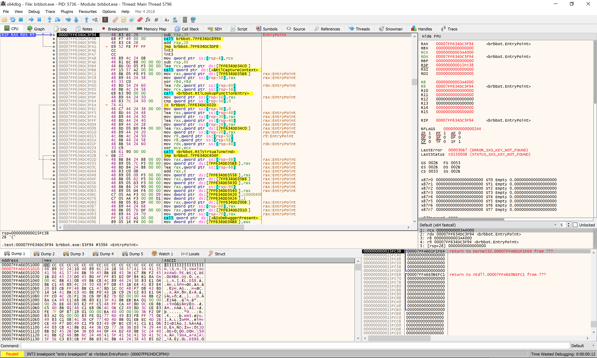
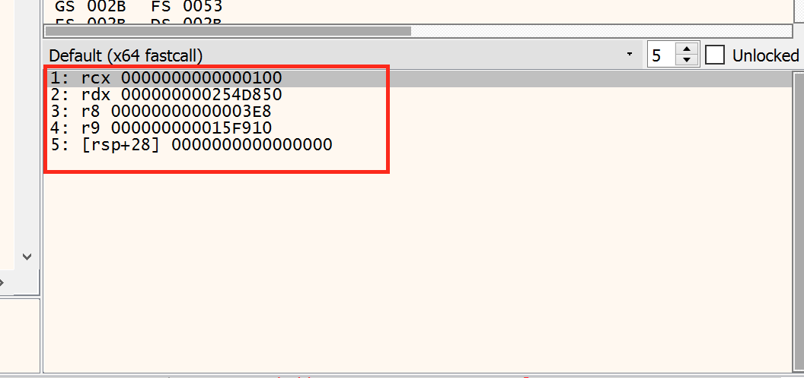
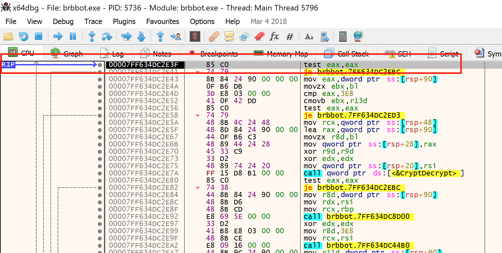
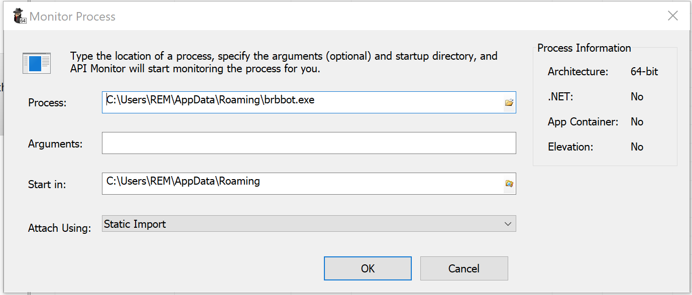
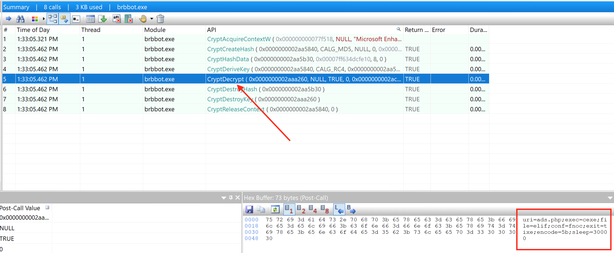

# Ex 1.4: Decrypting brbbot.exe's Configuration File

- [Ex 1.4: Decrypting brbbot.exe's Configuration File](#ex-14-decrypting-brbbotexes-configuration-file)
  - [Objectives](#objectives)
  - [Steps](#steps)
  - [1 - Load brbbot.exe on x64dgb and set breakpoint](#1---load-brbbotexe-on-x64dgb-and-set-breakpoint)
  - [2 - Confirm the specimen is using ReadFile to read brbconfig.tmp](#2---confirm-the-specimen-is-using-readfile-to-read-brbconfigtmp)
  - [3 - Decrypt brbconfig.tmp by setting and triggering a breakpoint after the call to CryptDecrypt](#3---decrypt-brbconfigtmp-by-setting-and-triggering-a-breakpoint-after-the-call-to-cryptdecrypt)
  - [3 (Alternative) - API Monitor](#3-alternative---api-monitor)
  - [4 - Decode the exfiltrated web session payload](#4---decode-the-exfiltrated-web-session-payload)
  - [Analysis update](#analysis-update)

---

## Objectives

- Understand essential aspects of examining malware at the code level using a debugger.
- Learn how to decode protected content by intercepting the specimen's use of relevant API calls.

<br/>

---

## Steps

1. Load `brbbot.exe` into **x64dbg** and set a breakpoint on `ReadFile`.
2. Confirm that the specimen is using `ReadFile` to read `brbconfig.tmp`.
3. Decrypt `brbconfig.tmp` by setting and triggering a breakpoint after the call to `CryptDecrypt`.
4. On **REMnux**, decode the exfiltrated web session payload, which was captured earlier.

<br/>

---

## 1 - Load brbbot.exe on x64dgb and set breakpoint

  

<br/>

To locate `ReadFile` api call, in the **Command** at the bottom, enter the following command and navigate to the **Breakpoint tab**:

```
SetBPX ReadFile
```

  

<br/>

---

## 2 - Confirm the specimen is using ReadFile to read brbconfig.tmp

Next, use **Debug > Run (F9)** and arrive at the `ReadFile` breakpoint:

  

- As shown, the **RIP** is pointing to the `ReadFile` API call.

<br/>

Now take a look at the MS document about this function:

- https://docs.microsoft.com/en-us/windows/win32/api/fileapi/nf-fileapi-readfile
- Here is the function syntax:

```
BOOL ReadFile(
  HANDLE       hFile,
  LPVOID       lpBuffer,
  DWORD        nNumberOfBytesToRead,
  LPDWORD      lpNumberOfBytesRead,
  LPOVERLAPPED lpOverlapped
);
```

<br/>

These 5 arguments are corresponding to the pane here:

  

- `RCX` = `hFile` - This is the file handle (a pointer to an object). In this case, the handle is `0x100`

<br/>

To see what is pointed by the pointer, navigate to **Handles tab**. Right click on the pane and `Refresh`:

  

<br/>

Now our handle is at `0x100` - scroll down to find it out:

  

- This confirms the `ReadFile` call reads the file `\Device\HarddiskVolume1\Users\REM\AppData\Roaming\brbconfig.tmp`

<br/>

---

## 3 - Decrypt brbconfig.tmp by setting and triggering a breakpoint after the call to CryptDecrypt

Go back to the **CPU tab**. Click **Debug > Run to user code (Alt+F9)**.

  

- The `RIP` is pointing to `test eax,eax` now.
- We can also see the API call `CryptoDecrypt` after several instructions
- Reference API doc: https://docs.microsoft.com/en-us/windows/win32/api/wincrypt/nf-wincrypt-cryptdecrypt

<br/>

Now click the instruction right after the `CryptoDecrypt` call, then click **Debug > Run until selection (F4)**:

  

  

- Now in the register, we can see ASCII strings in `RSP` and `RSI` and it is likely the decrypted content

```
uri=ads.php;exec=cexe;file=elif;conf=fnoc;exit=tixe;encode=5b;sleep=30000
```

<br/>

---

## 3 (Alternative) - API Monitor

Launch **API Monitor (x64)**. Click `Enable Monitoring`:

  

<br/>

Then run the sample. On the **API Filter**, filter out `Security and Identity > Cryptography > Data Encryption and Decryption`:

  

<br/>

Start `brbbot.exe` by clicking `Monitor New Process` on the right:

  

<br/>

Check the `CryptoDecrypt` API call and inspect the hex/ascii content:

  

- It shows the decrypted content in the **Hex Buffer**


<br/>

---

## 4 - Decode the exfiltrated web session payload

Analyze the payload:

```
uri=ads.php;exec=cexe;file=elif;conf=fnoc;exit=tixe;encode=5b;sleep=30000
```

- `uri`: The URI we see in Wireshark capture
- `exec=cexe;file=elif;conf=fnoc;exit=tixe`: These look like command set. The value is in reverse order - could be an evasion.
- `encode=5b`: Could be a key for encode / encryption
- `sleep`: The callback interval

<br/>

On **REMnux**, use `xxd` to convert our captured HEX (from Wireshark capture) to BIN:

```
xxd -r -p encoded.hex > encoded.bin
```

  

<br/>

Decode the binary by XOR'ing each of its bytes with the key `5b`:

```
translate.py encoded.bin decoded.txt 'byte ^ 0x5b'
cat decoded.txt
```

  

- The decoded content looks like the current running processes of the infected host.

<br/>

---

## Analysis update

1. The sample uses `brbconfig.tmp` as a configuration file
2. It obfuscates exfiltrated data using a simple XOR algorithm
3. The configuration file suggests possible C2 commands

<br/>

---