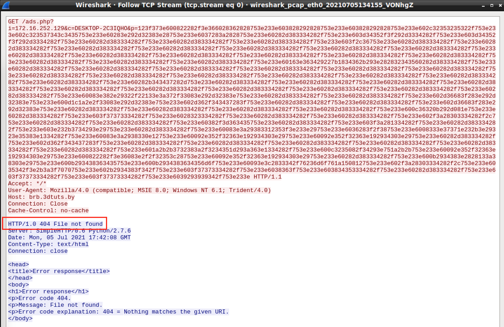
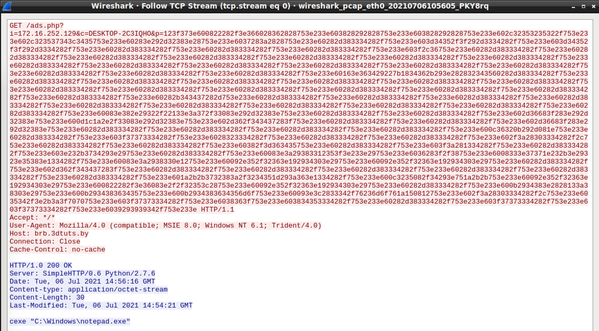
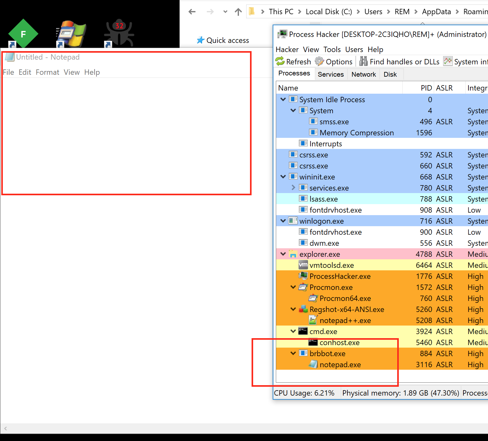
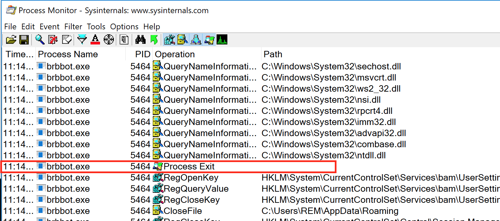

# Ex 1.5: Experimenting with C2 Functionality in brbbot.exe

- [Ex 1.5: Experimenting with C2 Functionality in brbbot.exe](#ex-15-experimenting-with-c2-functionality-in-brbbotexe)
  - [Objectives](#objectives)
  - [Steps](#steps)
  - [1,2 - Issue the cexe C2 command](#12---issue-the-cexe-c2-command)
  - [3 - Issue the tixe C2 command](#3---issue-the-tixe-c2-command)

---

## Objectives

- Learn how to examine C2 capabilities of malware through behavioral experiments.

<br/>

---

## Steps

1. Create the `ads.php` file on **REMnux** to issue the `cexe` C2 command to `brbbot.exe`.
2. Reinfect the system and examine the web server's C2 command on `brbbot.exe`.
3. Create the `ads.php` file on **REMnux** to issue the `tixe` C2 command to `brbbot.exe`.

<br/>

---

## 1,2 - Issue the cexe C2 command

Following up the previous logs on Wireshark, our web server on **REMnux** respond with `400` since we do not have `ads.php`.

  

<br/>

Also, when decrypting the `brbconfig.tmp` folder, we have some potential C2 commands:

```
uri=ads.php;exec=cexe;file=elif;conf=fnoc;exit=tixe;encode=5b;sleep=30000
```

- `exec=cexe; file=elif; conf=fnoc; exit=tixe`: These look like command set. The value is in reverse order - could be an evasion.


<br/>

Try to host a `ads.php` with a C2 command:

```
echo 'cexe "C:\Windows\notepad.exe"' > ads.php
sudo python -m SimpleHTTPServer 80
```

  

<br/>

On **REMnux**, restart **Wireshark** and start capturing.

Then on the Windows machine, try running `brbbot.exe` again:

  

  

- As shown on the **Wireshark** capture, our server respond the potential C2 command `cexe "C:\Windows\notepad.exe"`
- As shown on Windows machine, `notepad.exe` is executed as a child process of `brbbot.exe` (See **Process Hacker**)

<br/>

Terminate the `brbbot.exe` process on **Process Hacker** or it will keep spawning `notepad.exe` ...

<br/>

---

## 3 - Issue the tixe C2 command

The `tixe` command is suspected to be `exit` - it is expected that if the sample receives this respond, it will terminate itself.

<br/>

Prepare the `ads.php` with the following content in the **REMnux** webserver:

```
rm ads.php -f
echo "tixe" > ads.php
sudo python -m SimpleHTTPServer 80
```

  

<br/>

Then restart **Wireshark** and start a new capture session.

Reinfect the Windows machine:

  

  

- As a result, the `brbbot.exe` exits itself after making the HTTP request
- On **Procmon**, it shows the process exits.

<br/>

---