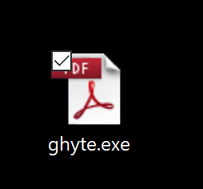
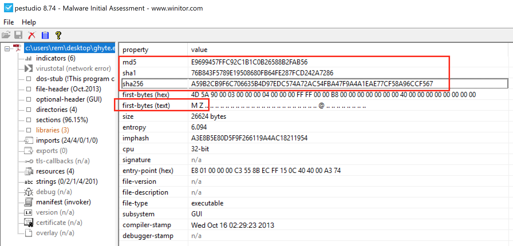
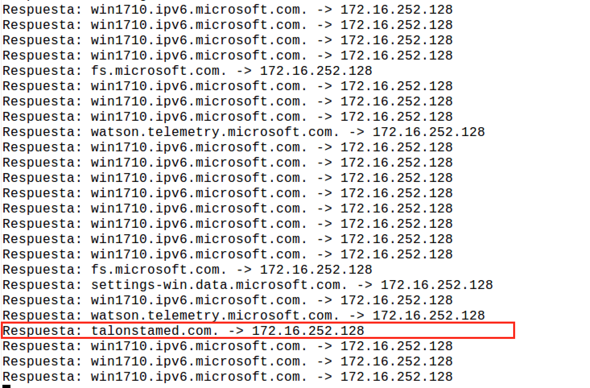
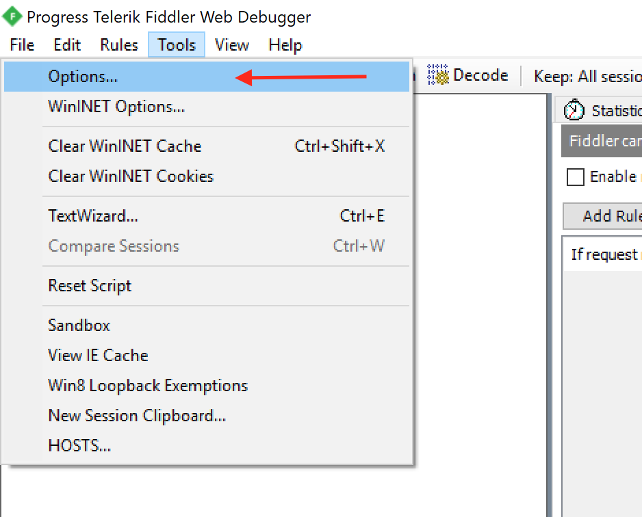
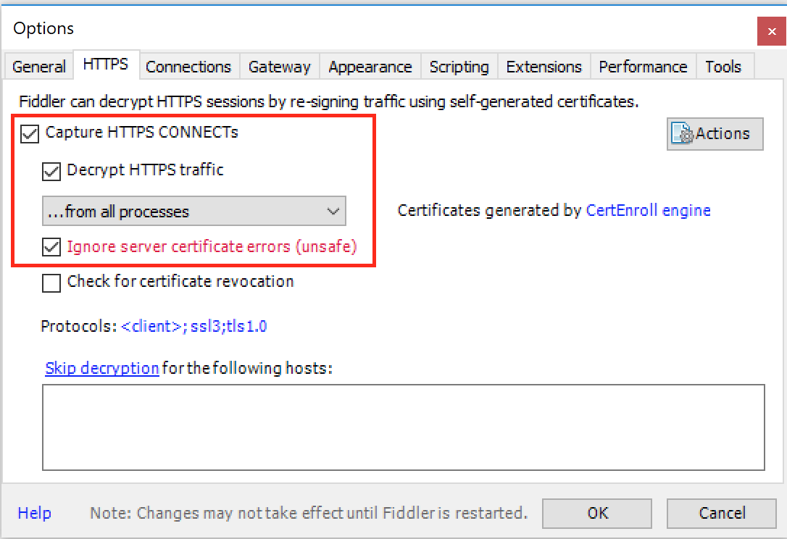
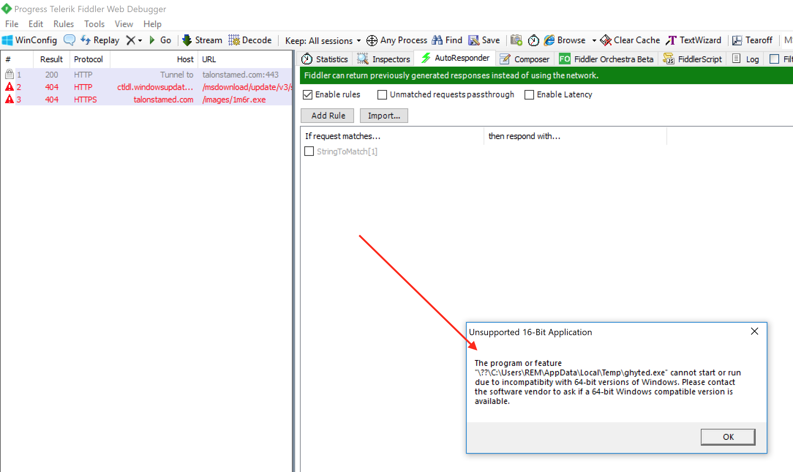
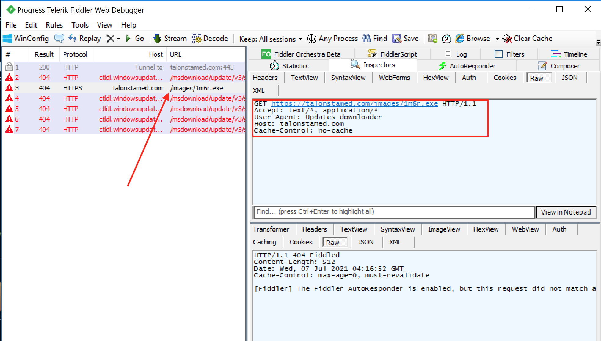

# Ex 1.6: Intercepting HTTPS Connections Initiated by ghyte.exe

- [Ex 1.6: Intercepting HTTPS Connections Initiated by ghyte.exe](#ex-16-intercepting-https-connections-initiated-by-ghyteexe)
  - [Objective](#objective)
  - [Steps](#steps)
  - [0 - Static Analysis](#0---static-analysis)
  - [1,2 - Observe DNS traffic of ghyte.exe](#12---observe-dns-traffic-of-ghyteexe)
  - [3 - Activate **INetSim** on **REMnux**, and then reinfect the Windows REM Workstation with ghyte.exe](#3---activate-inetsim-on-remnux-and-then-reinfect-the-windows-rem-workstation-with-ghyteexe)
  - [4 - Analyze INetSim logs](#4---analyze-inetsim-logs)
  - [5 - Use Fiddler to inspect the traffic](#5---use-fiddler-to-inspect-the-traffic)

---

## Objective

- Learn how to intercept and examine HTTPS connections initiated by malware in the lab.

<br/>

----

## Steps

1. Launch **Wireshark** and **fakedns** on **REMnux**, and then infect the **Windows REM Workstation** virtual machine with `ghyte.exe`, observing DNS traffic in the lab.
2. Terminate `ghyte.exe` on the **REM Workstation** and stop monitoring in **Wireshark**.
3. Activate **INetSim** on **REMnux**, and then reinfect the Windows REM Workstation with `ghyte.exe`.
4. Observe the malicious network traffic by looking at the **INetSim** log, and then terminate `ghyte.exe`.

<br/>

---

## 0 - Static Analysis

The executable itself uses PDF icon to mislead the user. By combining this with **double extensions** technique, normal users would fall into trap.

  

<br/>

Use **PEStudio** to open the executable:

  

- Hashes:

```
md5,E9699457FFC92C1B1C0B26588B2FAB56
sha1,76B843F5789E19508680FB64FE287FCD242A7286
sha256,A59B2CB9F6C706635B4D97EDC574A72AC54FBA47F9A4A1EAE77CF58A96CCF567
```

- First bytes = `MZ`, which is likely a PE

<br/>

No interesting string is found.

<br/>

---

## 1,2 - Observe DNS traffic of ghyte.exe

With **fakedns** and **Wireshark** capturing running on **REMnux**, run `ghyte.exe` on the Windows machine:

  

- It launches a child process but it exits quickly
- The sample itself disappears from the executed location

<br/>

On **fakedns**:

  

- A suspicious DNS request with the domain name `talonstamed.com` is observed

<br/>

On **Wireshark**:

  

- It requests to `tcp/443` - the server respond `RST,ACK` since it is not listening on `tcp/443`

<br/>

Terminate the `ghyte.exe` process on **Process Hacker** and stop **Wireshark** capturing on **REMnux**.

---

## 3 - Activate **INetSim** on **REMnux**, and then reinfect the Windows REM Workstation with ghyte.exe

On **Remnux**, run the following command to run **INetSim**:

```
inetsim
```

  

- Note: The configuration file is at `/etc/inetsim/inetsim.conf`

<br/>

Also restart **Wireshark** capturing. Then re-infect the Windows machine with `ghyte.exe`:

  

  

- A message box showing **INetSim** appears on the Windows box. In fact this is the signature when the client requests an EXE file to **INetSim** and the client executes it.
- On **Wireshark**, we see the full HTTPS connection this time

<br/>

---

## 4 - Analyze INetSim logs

To check the **INetSim** logs:

```
less /var/log/inetsim/service.log 
```

  

- The sample requests URL `https://talonstamed.com/images/1m6r.exe` upon successful TLS connection
- Note the `User-Agent` used by the sample is `Updates downloader` - which can be used as an IOC for threat hunting
- The **INetSim** server respond a DOS program we see on the Windows machine

<br/>

---

## 5 - Use Fiddler to inspect the traffic

Also, we may use **Fiddler** on the Windows machine to inspect the traffic.

With **fakedns** and **INetSim** running on **REMnux**, on the Windows machine, run **Fiddler**.

Click `Tools > Options ...`:

  

<br/>

Make sure the following configs are set:

- Decrypt HTTPS traffic
- Ignore server certificate errors (unsafe)

  

<br/>

Also check `Enable rule` under `AutoResponder`:

  

<br/>

Then run the sample `ghyte.exe`:

  

  

- We see the same HTTPS traffic as in **INetSim**
- Windows pops up an error of `Unsupported 16-but Application` since the response file generated by **Fiddler** is not a valid Windows executable, but the `ghyte.exe` tried to execute it.

<br/>

---