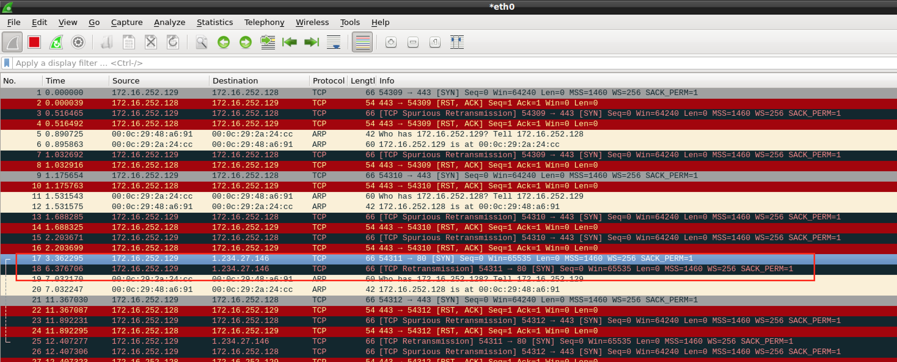
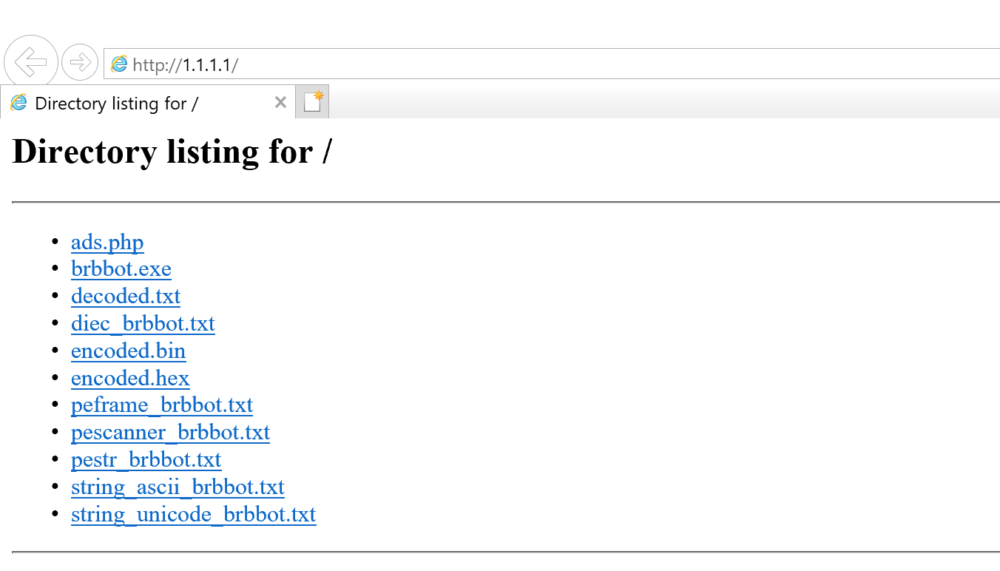

# Ex 1.7: Intercepting IP Address-Based Traffic Using iptables

- [Ex 1.7: Intercepting IP Address-Based Traffic Using iptables](#ex-17-intercepting-ip-address-based-traffic-using-iptables)
  - [Objective](#objective)
  - [Steps](#steps)
  - [1,2 - Use Wireshark to capture traffic of getdown.exe](#12---use-wireshark-to-capture-traffic-of-getdownexe)
  - [3,4 - Use iptables NAT with webserver](#34---use-iptables-nat-with-webserver)
  - [5 - Reinfect Windows with getdown.exe and analyze on Wireshark](#5---reinfect-windows-with-getdownexe-and-analyze-on-wireshark)

---

## Objective

- Learn how to intercept malicious traffic directed at systems using IP addresses, rather than hostnames.

<br/>

---

## Steps

1. Launch **Wireshark** on **REMnux**, activating its network-monitoring capabilities.
2. Infect the **Windows REM Workstation** virtual machine with `getdown.exe` and observe the malicious network traffic in Wireshark.
3. Terminate `getdown.exe`, stop monitoring in **Wireshark**, launch the web server, and then activate `iptables` redirection on **REMnux**.
4. Confirm that `iptables` is redirecting traffic by visiting a URL such as `http://1.1.1.1` using **Internet Explorer** on the **Windows REM Workstation**.
5. Activate monitoring in **Wireshark**, and then reinfect the **Windows REM Workstation** virtual machine with `getdown.exe`.
6. Observe the malicious network traffic in **Wireshark**, exit **Wireshark**, stop the web server, and then disable `iptables` redirection on **REMnux**. Terminate the getdown.exe process if it's still running.

<br/>

---

## 1,2 - Use Wireshark to capture traffic of getdown.exe

On **REMnux**, launch **Wireshark** using the command `wireshark &` and start capturing.

Then on the Windows machine, start `getdown.exe`.

  

- A traffic to `1.234.27.146` on `tcp/80` is observed.

<br/>

---

## 3,4 - Use iptables NAT with webserver 

On **REMnux**, first run Python HTTP Server:

```
sudo python -m SimpleHTTPServer 80
```

  


<br/>

In another tab, enable `iptables` NAT redirection:

```
accept-all-ips start
```

  

<br/>

Note that the `accept-all-ips` works based on `iptables` PREROUTING.

```
if [ "${2}" = "" ]; then
  INTERFACE="eth0"
else
  INTERFACE="${2}"
fi
if [ "${1}" = "start" ]; then
  echo "OK, iptables will accept and redirect connections to all IPs on $INTERFACE."
  echo "Remember to set the client system's default gateway to IP of this REMnux host."
  sudo iptables -t nat -A PREROUTING -i $INTERFACE -j REDIRECT
  sudo ip6tables -t nat -A PREROUTING -i $INTERFACE -j REDIRECT
elif [ "${1}" = "stop" ]; then
  echo "OK, iptables is set to stop redirecting connections to all IPs on $INTERFACE."
  sudo iptables -t nat -D PREROUTING -i $INTERFACE -j REDIRECT
  sudo ip6tables -t nat -D PREROUTING -i $INTERFACE -j REDIRECT
else 
  echo "Usage: accept-all-ips <start|stop> [interface]"

```

<br/>

Now on the **Windows machine**, try to browse http://1.1.1.1 on IE:

  

- This is our Python webserver current directory, which is to say the setting works

<br/>

---

## 5 - Reinfect Windows with getdown.exe and analyze on Wireshark

Restart **Wireshark** capturing on **REMnux** and re-infect Windows machine with `getdown.exe`:

  

  


- There is a HTTP request to the URL `http://1.234.27.146/pcfix.exe?affid=23456732-34459`
- A special HTTP header is observed: `UA-CPU: AMD64`
- Note the `User-Agent` used: `Mozilla/4.0 (compatible; MSIE 7.0; Windows NT 6.2; Win64; x64; Trident/7.0; .NET4.0C; .NET4.0E; Tablet PC 2.0)`

<br/>

---

