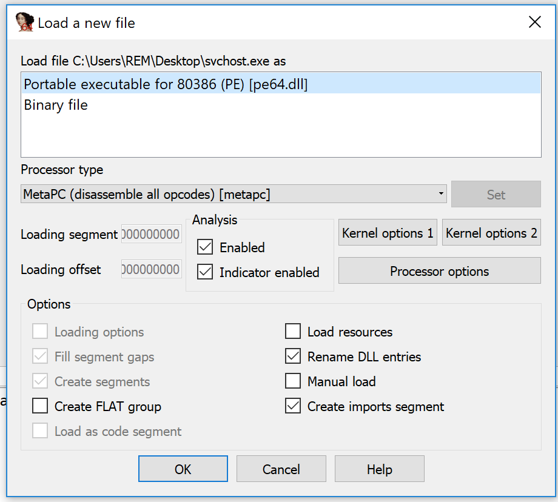
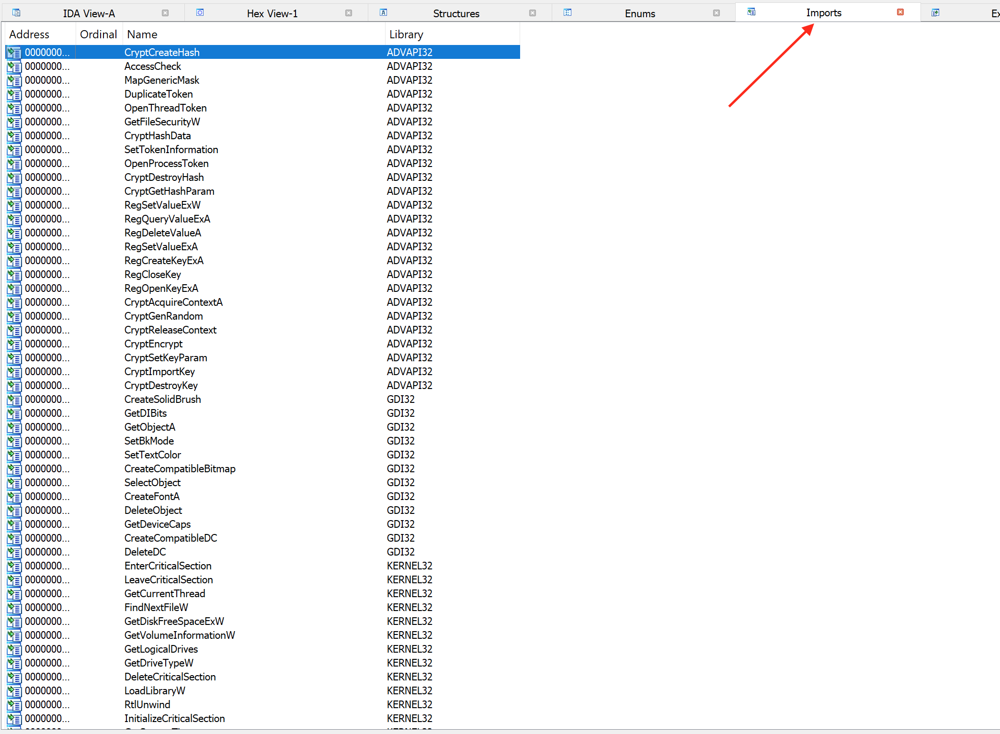
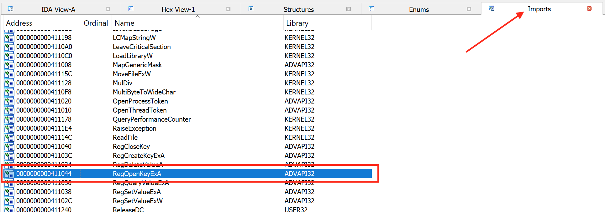
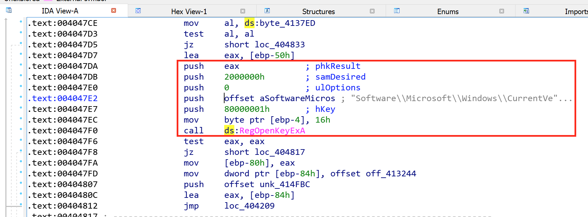
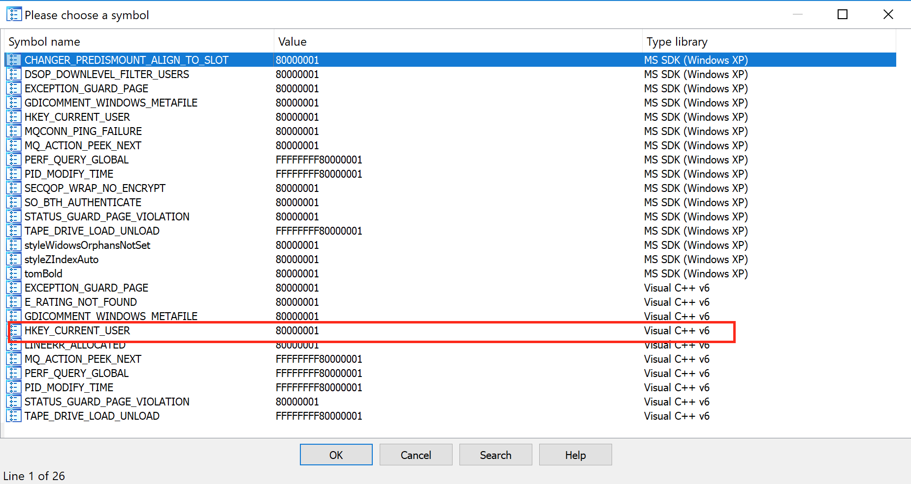
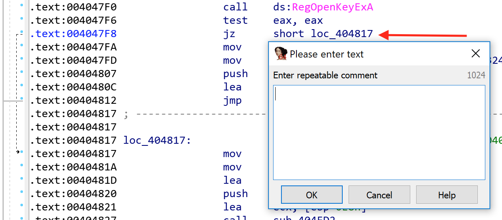

# Lab 2.1: Introduction to Assembly and IDA

- [Lab 2.1: Introduction to Assembly and IDA](#lab-21-introduction-to-assembly-and-ida)
  - [Objectives](#objectives)
  - [Steps](#steps)
  - [1,2,3,4 - Disassemble svchost.exe and examine the Graph view, exports and imports](#1234---disassemble-svchostexe-and-examine-the-graph-view-exports-and-imports)
  - [5,6 - Locate the second reference to the RegOpenKeyExA and check the arguments](#56---locate-the-second-reference-to-the-regopenkeyexa-and-check-the-arguments)
  - [7 - Use a standard symbolic constant for another RegOpenKeyExA argument](#7---use-a-standard-symbolic-constant-for-another-regopenkeyexa-argument)
  - [8 - Analyze the conditional jump at 4047F8 and describe it in a sentence. Research RegOpenKeyExA on Microsoft Document(msdn.microsoft.com) to assign meaning to the conditional jump.](#8---analyze-the-conditional-jump-at-4047f8-and-describe-it-in-a-sentence-research-regopenkeyexa-on-microsoft-documentmsdnmicrosoftcom-to-assign-meaning-to-the-conditional-jump)
  - [9 - Add a comment to the conditional jump to document your progress](#9---add-a-comment-to-the-conditional-jump-to-document-your-progress)

--- 

## Objectives

- Familiarize yourself with basic assembly concepts.
- Grasp the core features used in IDA (free edition).
- Learn to navigate the IDA interface.
- Familiarize yourself with `CALL` and `PUSH` instructions.
- Understand conditional jumps as they appear in assembly code.

<br/>

---

## Steps

1. Disassemble `svchost.exe` using IDA.
2. Examine IDA's Graph view.
3. Examine `svchost.exe`'s exports.
4. Examine `svchost.exe`'s imports.
5. Locate the second reference to the `RegOpenKeyExA` API.
6. Observe that one argument passed to `RegOpenKeyExA` is a pointer to a string.
7. Use a standard symbolic constant for another `RegOpenKeyExA` argument.
8. Analyze the conditional jump at `4047F8` and describe it in a sentence. Research `RegOpenKeyExA` on [Microsoft Document](msdn.microsoft.com) to assign meaning to the conditional jump.
9. Add a comment to the conditional jump to document your progress.

<br/>

---

## 1,2,3,4 - Disassemble svchost.exe and examine the Graph view, exports and imports

First launch **IDA Freeware** and drag `svchost.exe` in it:

  

- Leave these as default and click `OK`

<br/>

To view the **Graph View**, press `<SPACE>` bar:

  

<br/>

To view the **Exports**, click on the `Exports` tab:

  

- This shows the entry point of the program, which is labelled by IDA as `start` function

<br/>

To view the **Imports**, click on the `Imports` tab:

  

- This tab contains the APIs (functions) used by the program hat is contained in external libraries

<br/>

---

## 5,6 - Locate the second reference to the RegOpenKeyExA and check the arguments

To locate the API `RegOpenKeyExA`, sort the table by **Name** type `RegOpen` and you will be brought to the related entry:

  

<br/>

Double click the API:

  

<br/>

Then right click the `RegOpenKeyExA` function and choose **Jump to xref to operand ...**:

  

<br/>

Choose the 2nd one and click `OK` to analyze further:

  

  

<br/>

To understand more about the API `RegOpenKeyExA`, we have to search for it in Microsoft Document:

- https://docs.microsoft.com/en-us/windows/win32/api/winreg/nf-winreg-regopenkeyexa

```
LSTATUS RegOpenKeyExA(
  HKEY   hKey,
  LPCSTR lpSubKey,
  DWORD  ulOptions,
  REGSAM samDesired,
  PHKEY  phkResult
);
```

- Parameters
  - `hKey` - A handle to an open registry key. 
  - `lpSubKey` - The name of the registry subkey to be opened.
  - `ulOptions` - Specifies the option to apply when opening the key. Set this parameter to zero or the following:
    - `REG_OPTION_OPEN_LINK` - The key is a symbolic link. Registry symbolic links should only be used when absolutely necessary.
  - `samDesired` - A mask that specifies the desired access rights to the key to be opened. 
  - `phkResult` - A pointer to a variable that receives a handle to the opened key.

- Return value
  - If the function **succeeds**, the return value is `ERROR_SUCCESS`.
  - If the function fails, the return value is a **nonzero** error code defined in `Winerror.h`.

<br/>

Now take a look at the a few lines before the actual function call `call ds:RegOpenKeyExA`:

  

- The line with memory location `004047E2` has a comment `Software\\Microsoft\\Windows\\CurrentVe...`

<br/>

Double click `aSoftwareMicros`:

  

- This brings us to the actual value at `00413C70` in the `.rdata` section
- Therefore, the value we find in `004047E2` is a pointer to the memory location `00413C70`, which contains a string of `Software\Microsoft\Windows\CurrentVersion\Run` - which is a registry key commonly used for persistence
- Note there is another interesting string `vssadmin.exe Delete Shadows /All /Quiet` - which is a command for deleting Shadow Copy in Windows and is commonly used by Ransomwares

<br/>

---

## 7 - Use a standard symbolic constant for another RegOpenKeyExA argument

Compilers convert symbolic constants into HEX representations of that value:

  

<br/>

Right click the value and click `Use standard symbolic constant`:

  

<br/>

Now we see a list of possible constants that match the HEX value:

  

- Choose the one matches the context of the code
- Since we are dealing with a Registry function, `HKEY_CURRENT_USER` makes the most sense to us

<br/>

Choose `HKEY_CURRENT_USER` and click `OK`, the HEX value will be replaced by the symbolic constant `HKEY_CURRENT_USER`:

  

<br/>

---

## 8 - Analyze the conditional jump at 4047F8 and describe it in a sentence. Research RegOpenKeyExA on Microsoft Document(msdn.microsoft.com) to assign meaning to the conditional jump.

  

- `test eax eax` compares `eax` and `eax`, which will be `TRUE` if the value in `eax` is not `0`.
- `jz` means "Jump if zero"

<br/>

As mentioned in the MS document, if the function call `RegOpenKeyExA` fails, the return value is a **nonzero** error code defined in `Winerror.h`.

- `eax` will be `0` if the function call is successful
- `jz` will mean "Jump if the function call is successful"


<br/>

In summary, `jz short loc_404817` means:

> Jump to loc_404817 if the function call `RegOpenKeyExA` succeeds

<br/>

---

## 9 - Add a comment to the conditional jump to document your progress

Click on the end of the line `004047F8` and type `;`:

  

- Type our summary in step 8

<br/>

  

<br/>

---