# Lab 2.10: Keylogger Analysis (Appendix)

- [Lab 2.10: Keylogger Analysis (Appendix)](#lab-210-keylogger-analysis-appendix)
  - [Objectives](#objectives)
  - [Sample](#sample)
  - [Steps](#steps)
  - [1 - Inspect common APIs for keyloggers](#1---inspect-common-apis-for-keyloggers)
  - [2 - Identify the addresses of all references to SetWindowsHookEx & Analysis the idHook difference](#2---identify-the-addresses-of-all-references-to-setwindowshookex--analysis-the-idhook-difference)
  - [3,4 - Go to the hook procedure at `4024D0` and view the Graph view in IDA to observe the overall structure of the function](#34---go-to-the-hook-procedure-at-4024d0-and-view-the-graph-view-in-ida-to-observe-the-overall-structure-of-the-function)
  - [5 - Use the Function calls subview to view all functions called from within the hook procedure. What functions associated with keystroke logging do you see?](#5---use-the-function-calls-subview-to-view-all-functions-called-from-within-the-hook-procedure-what-functions-associated-with-keystroke-logging-do-you-see)
  - [6 - Use the g key to jump to 40259F, the address of a CALL to GetAsyncKeyState. Evaluate the compound expression that occurs shortly before the CALL (addresses 40258B-402597). What condition is being evaluated?](#6---use-the-g-key-to-jump-to-40259f-the-address-of-a-call-to-getasynckeystate-evaluate-the-compound-expression-that-occurs-shortly-before-the-call-addresses-40258b-402597-what-condition-is-being-evaluated)
  - [7 - Evaluate the CALL to GetAsyncKeyState at 40259F. What key is it checking?](#7---evaluate-the-call-to-getasynckeystate-at-40259f-what-key-is-it-checking)
  - [8 - How would you describe the condition evaluated after the CALL to GetAsyncKeyState?](#8---how-would-you-describe-the-condition-evaluated-after-the-call-to-getasynckeystate)
  - [9 - View the JMP instruction at 4025BC, which references a jump table. What is the base address of the jump table?](#9---view-the-jmp-instruction-at-4025bc-which-references-a-jump-table-what-is-the-base-address-of-the-jump-table)
  - [10 - What is the max entry number (i.e., the max value for EAX) for the jump table?](#10---what-is-the-max-entry-number-ie-the-max-value-for-eax-for-the-jump-table)
  - [11 - What is the target address jumped to if EAX is 1?](#11---what-is-the-target-address-jumped-to-if-eax-is-1)
  - [12 - To the best of your ability, describe what the code at that target address does](#12---to-the-best-of-your-ability-describe-what-the-code-at-that-target-address-does)


---

## Objectives

- Become familiar with examining a keylogger.
- Learn standard APIs used to perform keylogging.
- Gain exposure to Windows hooking.

<br/>

---

## Sample

- `msdsrv.exe`
  - MD5: 75d15d4ccbe37019283c452012345074
  - SHA1: bf72ec64682f7dbd9fa8aa629971d28be1fc23f6	
  - SHA256: ef2d290a0b2ca89c9a70011414afca3cfa7605a07912753b8b109283b4110c98	

<br/>

---

## Steps

1. Go to the Imports view and observe APIs commonly used for logging keystrokes, including `GetKeyState`, `GetAsyncKeyState`, and `SetWindowsHookExA`.
2. Identify the addresses of all references to `SetWindowsHookEx`. Research the API on [](https://msdn.microsoft.com) and note the difference between the `idHook` parameter for each `SetWindowsHookEx` reference. What does the difference represent?
3. Go to the hook procedure at `4024D0`, because that is the function installed for keyboard events.
4. View the Graph view in IDA to observe the overall structure of the function.
5. Use the Function calls subview to view all functions called from within the hook procedure. What functions associated with keystroke logging do you see?
6. Use the `g` key to jump to `40259F`, the address of a CALL to `GetAsyncKeyState`. Evaluate the compound expression that occurs shortly before the CALL (addresses `40258B- 402597`). What condition is being evaluated?
7. Now evaluate the CALL to `GetAsyncKeyState` at `40259F`. What key is it checking?
8. How would you describe the condition evaluated after the CALL to `GetAsyncKeyState`?
9. View the `JMP` instruction at `4025BC`, which references a jump table. What is the base address of the jump table?
10. What is the max entry number (i.e., the max value for `EAX`) for the jump table?
11. What is the target address jumped to if `EAX` is 1?
12. To the best of your ability, describe what the code at that target address does (this one is tough).

<br/>

---

## 1 - Inspect common APIs for keyloggers

Load the sample `msdsrv.exe` into IDA and navigate to the **Imports tab**:

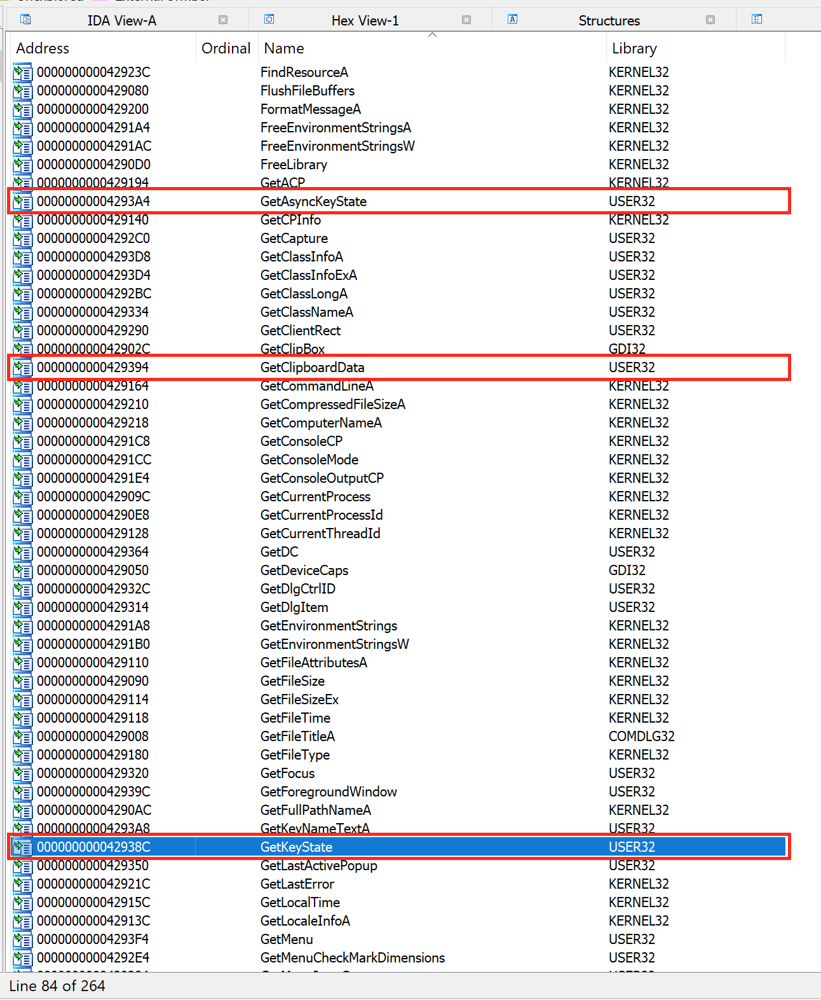  

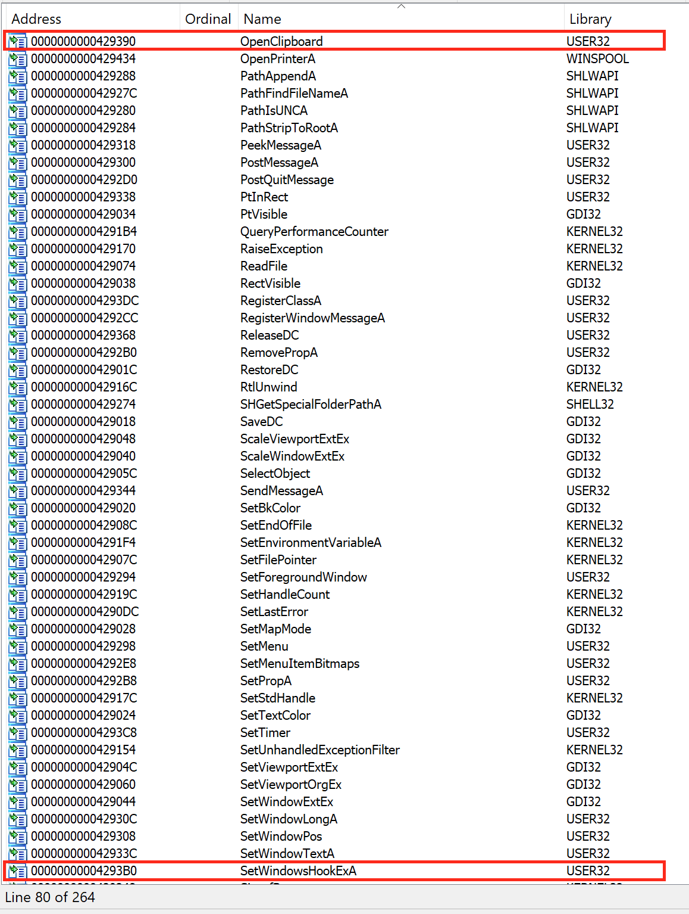  

- `GetKeyState`
- `GetAsyncKeyState`
- `SetWindowsHookExA`
- `OpenClipboard`
- `GetClipboardData`

<br/>

---

## 2 - Identify the addresses of all references to SetWindowsHookEx & Analysis the idHook difference

In **Imports tab**, type `SetWindowsHookEx` and double click. Click `SetWindowsHookExA` and hit `X`:

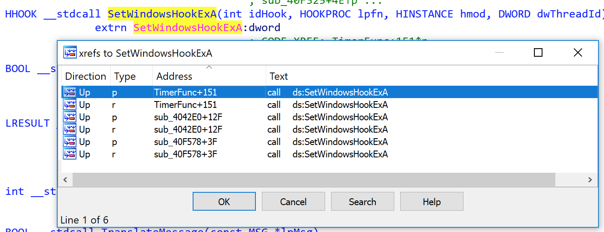  

- `TimerFunc+151h` = `403FD1`
- `sub_4042E0+12F` = `40440F`
- `sub_40F578+3F` = `40F5B7`

<br/>

Then look `SetWindowsHookExA` up on MSDN:

- https://docs.microsoft.com/en-us/windows/win32/api/winuser/nf-winuser-setwindowshookexa

<br/>

- Syntax:

```
HHOOK SetWindowsHookExA(
  int       idHook,
  HOOKPROC  lpfn,
  HINSTANCE hmod,
  DWORD     dwThreadId
);
```

<br/>

- Parameters:
  - `idHook`: The type of hook procedure to be installed.
  - `lpfn`: A pointer to the hook procedure. If the dwThreadId parameter is zero or specifies the identifier of a thread created by a different process, the lpfn parameter must point to a hook procedure in a DLL. Otherwise, lpfn can point to a hook procedure in the code associated with the current process.
  - `hmod`: A handle to the DLL containing the hook procedure pointed to by the lpfn parameter. The hMod parameter must be set to NULL if the dwThreadId parameter specifies a thread created by the current process and if the hook procedure is within the code associated with the current process.
  - `dwThreadId`: The identifier of the thread with which the hook procedure is to be associated. For desktop apps, if this parameter is zero, the hook procedure is associated with all existing threads running in the same desktop as the calling thread. For Windows Store apps, see the Remarks section.

<br/>

- Return value:
  - If the function succeeds, the return value is the handle to the hook procedure.
  - If the function fails, the return value is NULL. 

<br/>

Next, check the function call one by one.

<br/>

At `403FD1`:

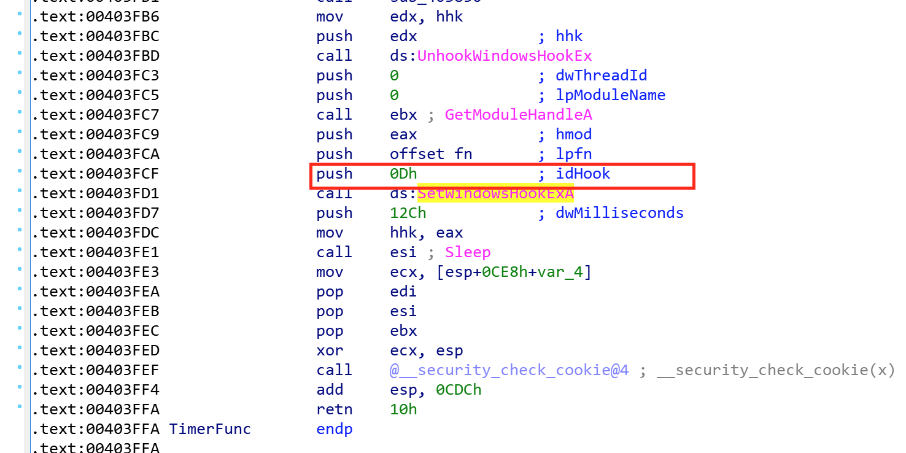  

- `idHook` = `0Dh` = `13` in decimal
  - Refer to MSDN, `13` refers to `WH_KEYBOARD_LL`
    - Installs a hook procedure that monitors low-level keyboard input events. For more information, see the LowLevelKeyboardProc hook procedure.

<br/>

At `40440F`:

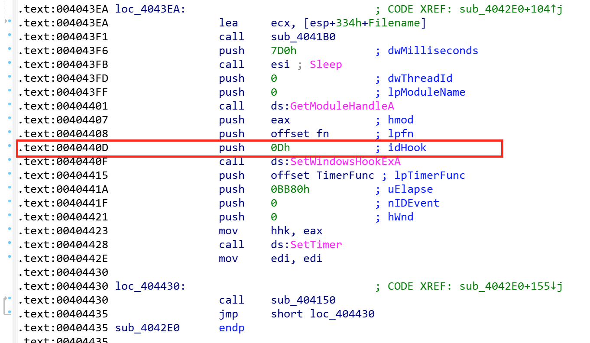  

- `idHook` = `0Dh` = `13` in decimal
  - Refer to MSDN, `13` refers to `WH_KEYBOARD_LL`
    - Installs a hook procedure that monitors low-level keyboard input events. For more information, see the LowLevelKeyboardProc hook procedure.

<br/>

At `40F5B7`:

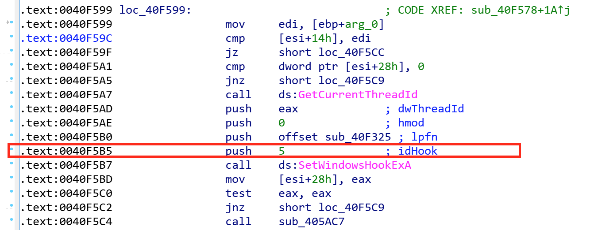  

- `idHook` = `5`
  - Refer to MSDN, `5` refers to `WH_CBT`
    - Installs a hook procedure that receives notifications useful to a CBT application. For more information, see the CBTProc hook procedure.
    - This involves change to the user interface window
    - For potential keylogger, this should not be the case

<br/>

Therefore, we should focus more on `403FD1` and `40440F`.

<br/>

---

## 3,4 - Go to the hook procedure at `4024D0` and view the Graph view in IDA to observe the overall structure of the function

Hit `g` key and type in `4024D0`:

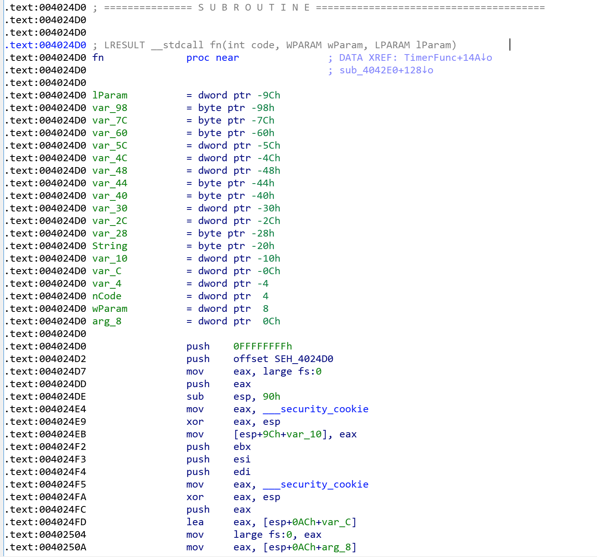  

<br/>

Hit `<SPACE>` to toggle the Graph view.

<br/>

---

## 5 - Use the Function calls subview to view all functions called from within the hook procedure. What functions associated with keystroke logging do you see?

Jump back to `4024D0` and navigate to `View > Open Subview > Function calls`:

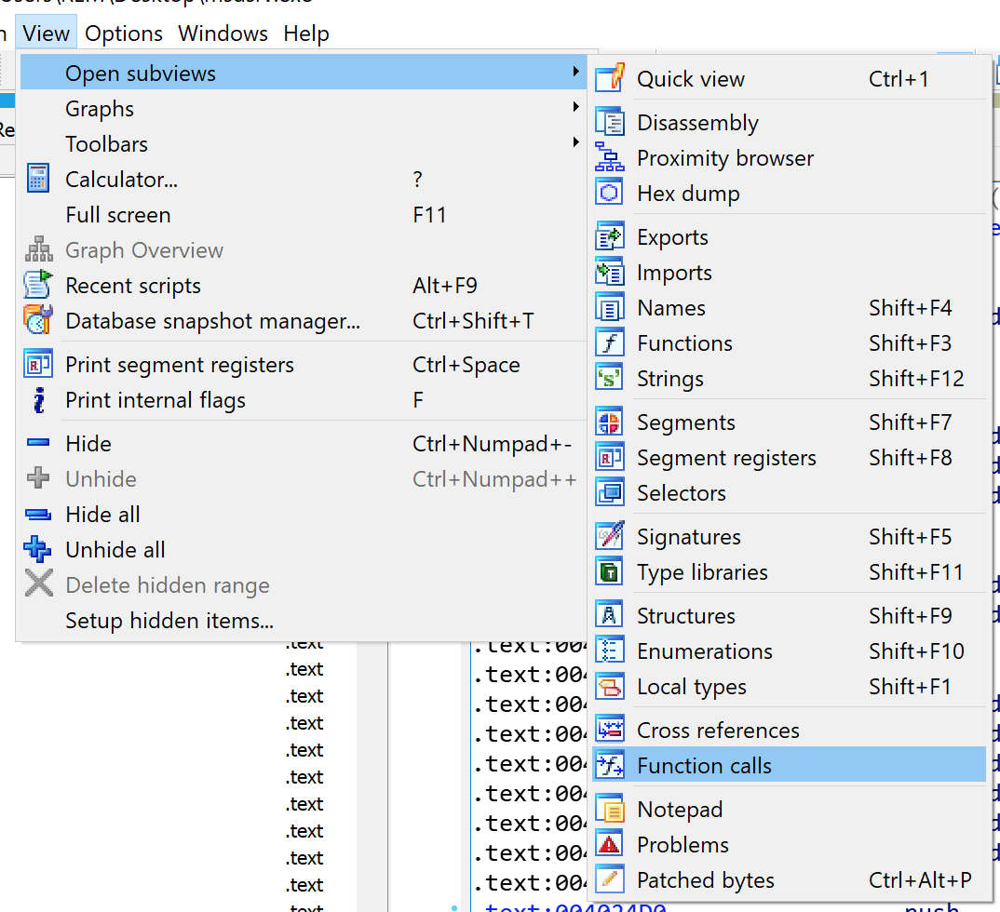  

  

- Many keylogger related function calls like `GetAsyncKeyState` / `GetKeyState`

<br/>

Also note the function pattern:

  

- When searching for `LRESULT` `keyword` on Google, we can see a similar function from MSDN:
- https://docs.microsoft.com/en-us/windows/win32/winmsg/lowlevelkeyboardproc

<br/>

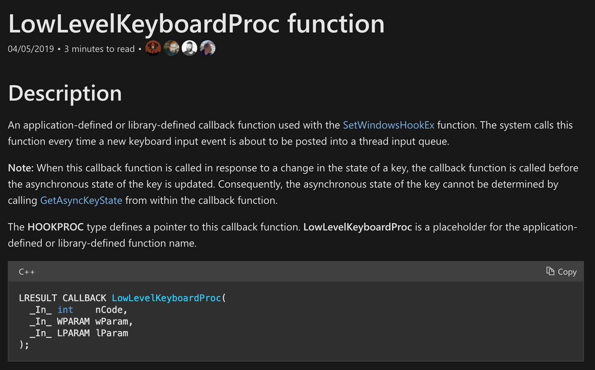  

- LowLevelKeyboardProc function
- An application-defined or library-defined callback function used with the SetWindowsHookEx function. The system calls this function every time a new keyboard input event is about to be posted into a thread input queue.
- Parameters:
  - `nCode` - A code the hook procedure uses to determine how to process the message.
  - `wParam` - The identifier of the keyboard message. This parameter can be one of the following messages: WM_KEYDOWN, WM_KEYUP, WM_SYSKEYDOWN, or WM_SYSKEYUP.
  - `lParam` - A pointer to a KBDLLHOOKSTRUCT structure.
    - https://docs.microsoft.com/en-us/windows/win32/api/winuser/ns-winuser-kbdllhookstruct

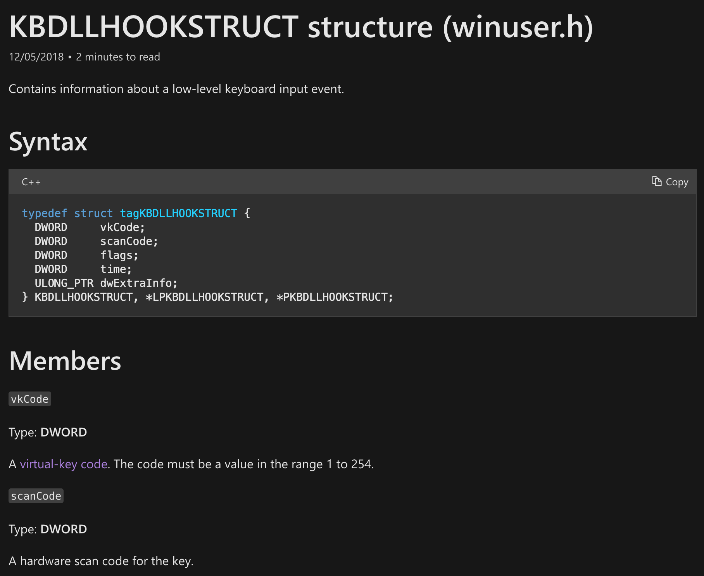  


<br/>

---

## 6 - Use the g key to jump to 40259F, the address of a CALL to GetAsyncKeyState. Evaluate the compound expression that occurs shortly before the CALL (addresses 40258B-402597). What condition is being evaluated?

First take a look at MSDN documentation:

- https://docs.microsoft.com/en-us/windows/win32/api/winuser/nf-winuser-getasynckeystate

<br/>

- Syntax:

```
SHORT GetAsyncKeyState(
  int vKey
);
```

<br/>

- Parameter:
  - `vKey`: (int) The virtual-key code.

<br/>

- Return value:
  - If the function succeeds, the return value specifies whether the key was pressed since the last call to GetAsyncKeyState, and whether the key is currently up or down. 
    - If the most significant bit is set, the key is down, and if the least significant bit is set, the key was pressed after the previous call to GetAsyncKeyState. 
    - However, you should not rely on this last behavior.
  - The return value is zero for the following cases:
    - The current desktop is not the active desktop
    - The foreground thread belongs to another process and the desktop does not allow the hook or the journal record.

<br/>

  

- `40258B - 40258E` - `cmp eax, 30h; jb loc_40273B` - Jump if `eax` < 30h
  - At `402585` we can see `mov eax, [esp+0ACh+lParam]`
    - `lParam` is a pointer to the `KBDLLHOOKSTRUCT` that contains information about the key pressed
  - At `402589` we can see `mov eax, [eax]`, which is a dereference
    - 0th offset of `KBDLLHOOKSTRUCT` specifies the key pressed (`vkCode`)
    - The virtual key code is placed in `eax`
- `402594 - 402597` - `cmp eax, 39h; jb loc_40273B` - Jump if `eax` > 39h

<br/>

In short, `40258B - 402597` is checking if the virtual key code is between `30h-39h` (48-57). If not, jump to `loc_40273B`.

- vkCode reference: https://docs.microsoft.com/en-us/windows/win32/inputdev/virtual-key-codes
  - `30h-39h` refers to `0-9 key`

<br/>

---

## 7 - Evaluate the CALL to GetAsyncKeyState at 40259F. What key is it checking?

  

- `10h`, with reference to the vkCode reference, equals `SHIFT` key.
- The `GetAsyncKeyState` function is checking if `SHIFT` key is currently pressed or if it was pressed since a previous call to `GetAsyncKeyState`

<br/>

---

## 8 - How would you describe the condition evaluated after the CALL to GetAsyncKeyState?

  

- For `GetAsyncKeyState`:
  - If a key is pressed currently, the most significant bit is set
  - If a key was pressed after the previous `GetAsyncKeyState` call, the least significant bit is set

<br/>

- Now at `004025A1 - 004025A4` - `test ax, ax; jz loc_40270D`
  - It is testing if `AX` (last 16 bit of the register) is `0`
  - If `SHIFT` was pressed after the previous `GetAsyncKeyState` call, skip this jump

<br/>

---

## 9 - View the JMP instruction at 4025BC, which references a jump table. What is the base address of the jump table?

Double click the offset:

  


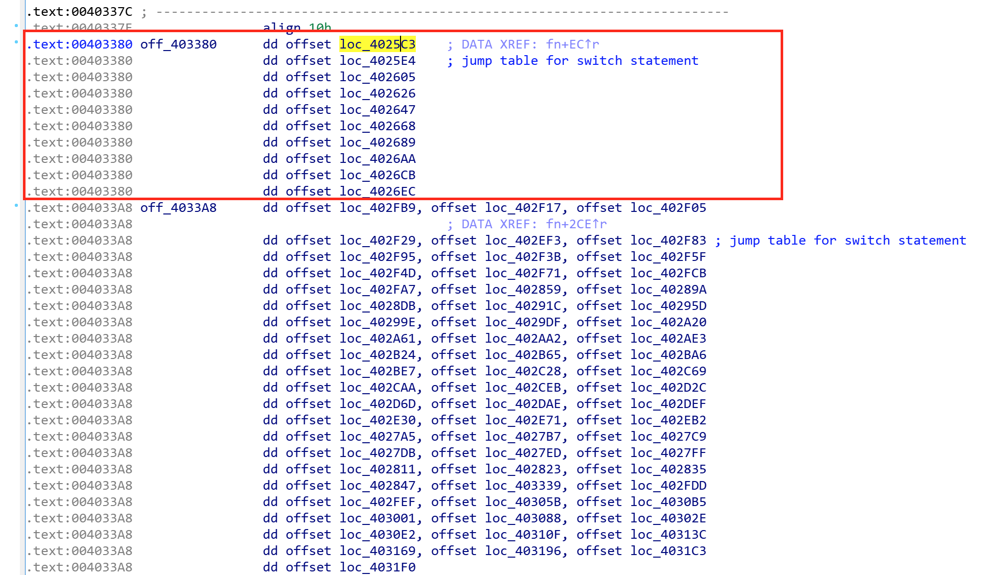  

- The base address is `403380`

<br/>

---

## 10 - What is the max entry number (i.e., the max value for EAX) for the jump table?

- Per `40258B-402597`, the value should be between `0x30` to `0x39`.
  - The key pressed is `0-9`
- Per `004025A1 - 004025A4`:
  - `SHIFT` is pressed

<br/>

- Per `4025AA-4025AE`, `EAX` will carry the value of the virtual key code of the key pressed

<br/>

At `4025B0`, `add eax, 0FFFFFFD0h`, the value of `eax` is changed:

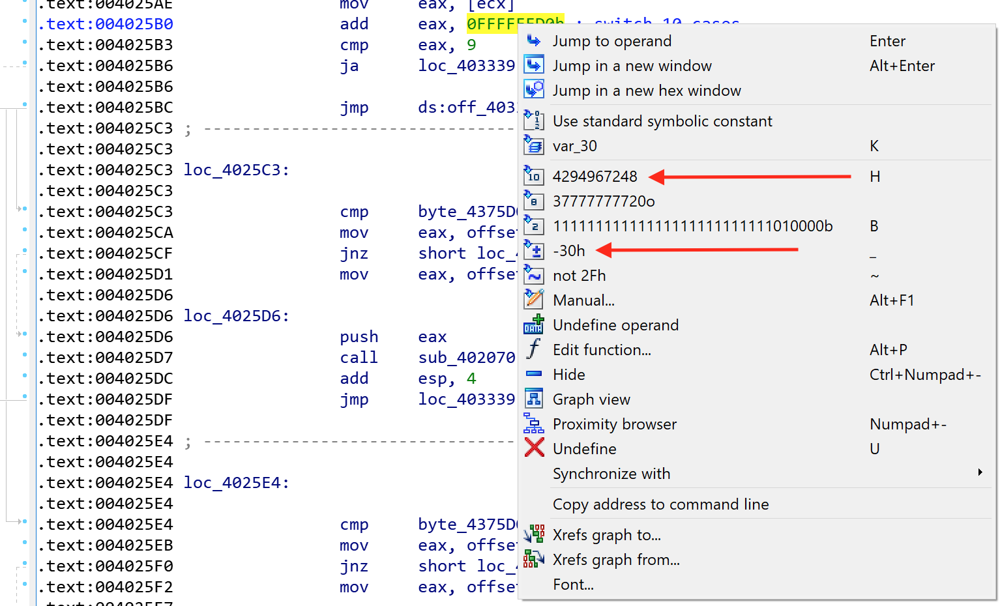  

- If the value is unsigned, `eax` will be very big, which is not relevant to the vKey
- If the value is signed, this is actually a subtraction (`-30h`)

<br/>

Assume it is a signed number, the possible range of `eax` will be `0x0` to `0x9`.

<br/>

- At `4025B3-4025B6` - `cmp eax, 9; ja loc_403339`, it means:
  - Jump to `403339` if `eax` is above `9`
  - But we analyzed that `eax` will be `0x0` to `0x9` so this condition will never meet

<br/>

Therefore the maximum entry number at `4025BC` is `0x9`.

<br/>

---

## 11 - What is the target address jumped to if EAX is 1?

If `EAX` is `1`, referring to `4025BC` - the jump becomes `ds:off_403380[4]`.

- 4 bytes offset to in the jump table

  

- It will be `loc_4025E4`

<br/>

---

## 12 - To the best of your ability, describe what the code at that target address does

First double click `loc_4025E4`:

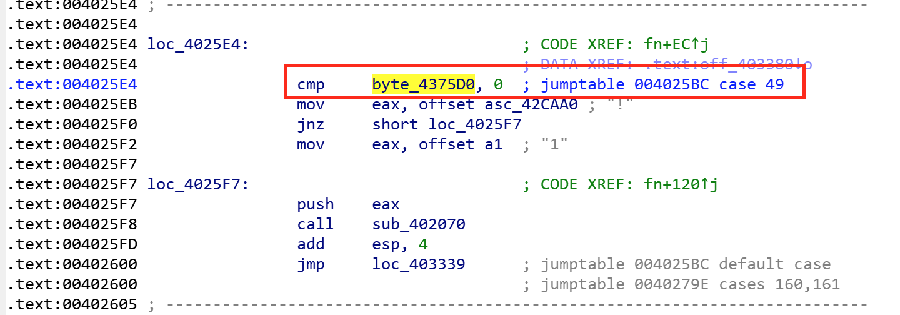  

- An instruction `cmp byte_4375D0, 0`

<br/>

To see what `byte_4375D0` is, click on it and hit `X`:

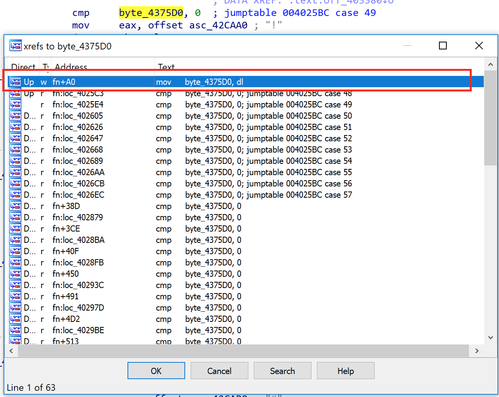  

- Note only the first one is a `mov` instruction so let's drill down

<br/>

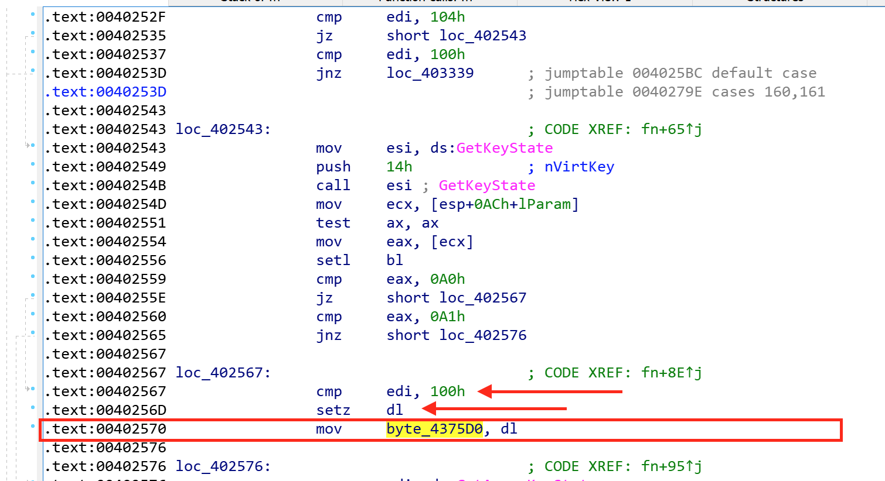  

- `40256D` - `setz` - Set `dl` to `1` if `ZF` flag is set 
- `402567` - `cmp edi, 100h`
  - If `EDI` != `100h`  --> `dl` is `0`
  - If `EDI` == `100h`  --> `dl` is `1`

<br/>

So we have to dig into what `EDI` is at this point.

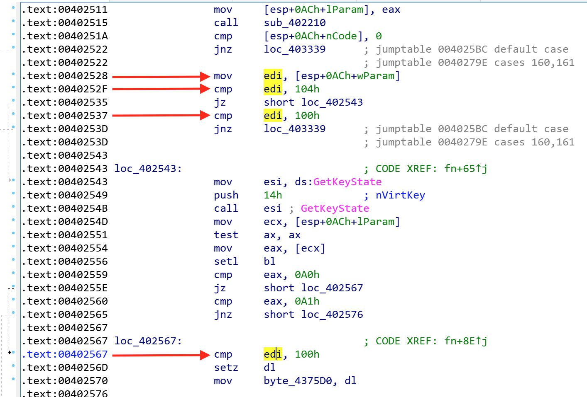  

- At `402528` - `mov edi, [esp+0ACh+wParam]`
  - `wParam` = The identifier of the keyboard message. (https://docs.microsoft.com/en-us/windows/win32/winmsg/lowlevelkeyboardproc)
    - `WM_KEYDOWN` = `0x100`
    - `WM_KEYUP` = `0x101`
    - `WM_SYSKEYDOWN` = `0x104`
    - `WMSYSKEYUP` = `0x0105`

<br/>

From `40252F - 40253D`, we have a compound expression:

- `40252F - 402535` - `cmp edi, 104h; jz short loc_402543`
  - Jump to `402543` if `edi` == `104h`
  - Note `104h` = `WM_SYSKEYDOWN`
- `402537 - 40253D` - `cmp edi, 100h; jnz loc_403339`
  - Jump to `403339` if `edi` is not `100h`
  - Note `100h` = `WM_KEYDOWN`

<br/>

Recall the statement:

- `40256D` - `setz` - Set `dl` to `1` if `ZF` flag is set 
- `402567` - `cmp edi, 100h`
  - If `EDI` != `100h`  --> `dl` is `0`
    - `WM_KEYDOWN` (`ALT`) is not pressed
  - If `EDI` == `100h`  --> `dl` is `1`
    - `WM_KEYDOWN` (`ALT`) is pressed

<br/>

The significance of `ALT` key is that it is usually used for accessing GUI Menu Bar.

<br/>

Continue checking `loc_4025E4`:

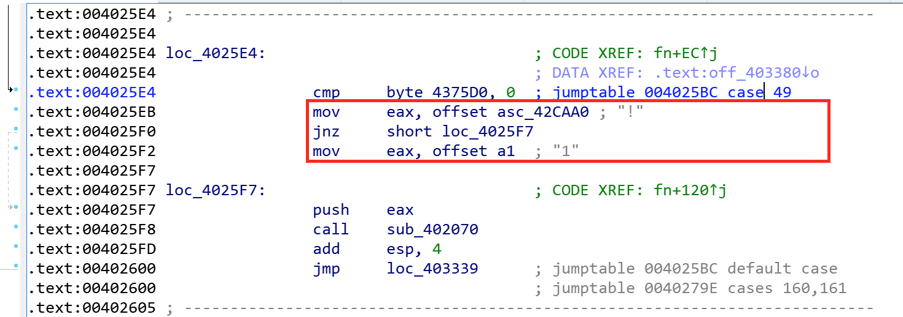  

- `4025EB` - `mov eax, offset asc_42CAA0` - it is a `!` as shown by IDA
  - Number `1` + `SHIFT` = `!`
- `4025F0` - `jnz short loc_4025F7`
  - Jump if `byte_4375D0` is not `0` = Jump if `ALT` is not pressed
  - If `ALT` is pressed, as in `4025F2`, `eax` is assigned with `1` instead of special character `!`

<br/>

The remaining code blocks are similar for dealing with whether it is a special character or number.

<br/>

- At `4025FD` - `add esp, 4` - stack clean up
- At `402600` - `jmp loc_403339`

  

- We can see the call to `CallNextHookEx`
  - This passes the message to the next hook procedure in the hook chain

<br/>

---