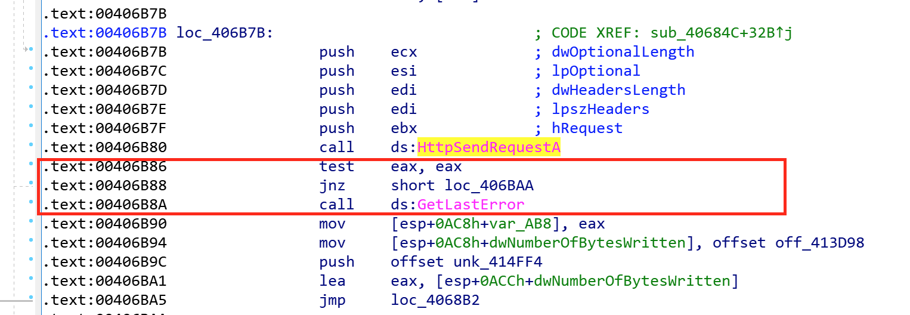
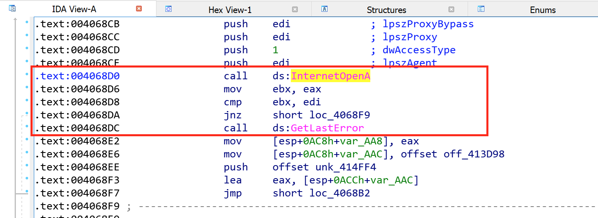
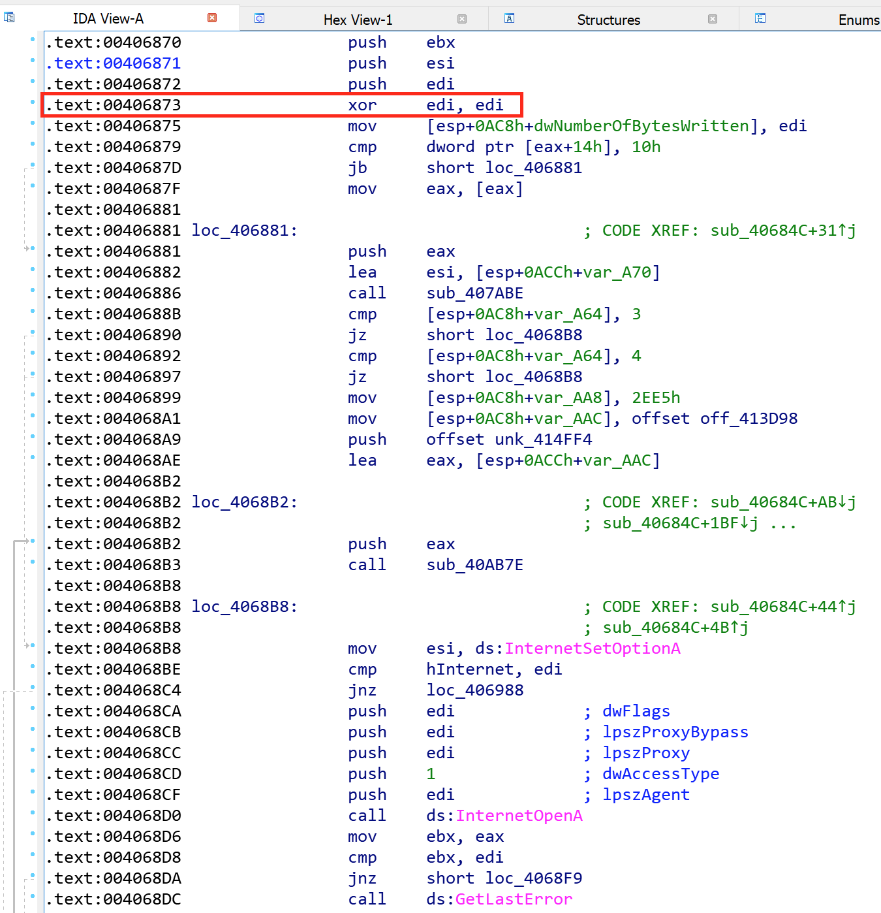
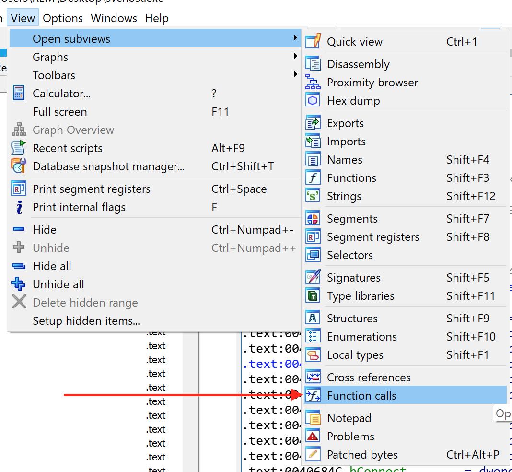
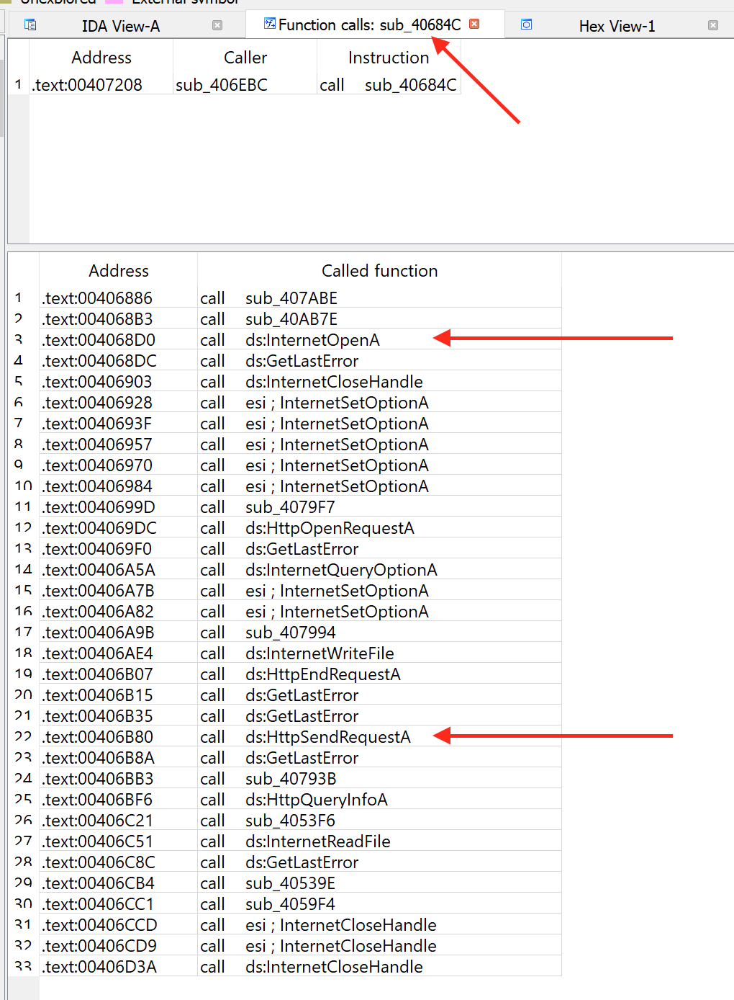
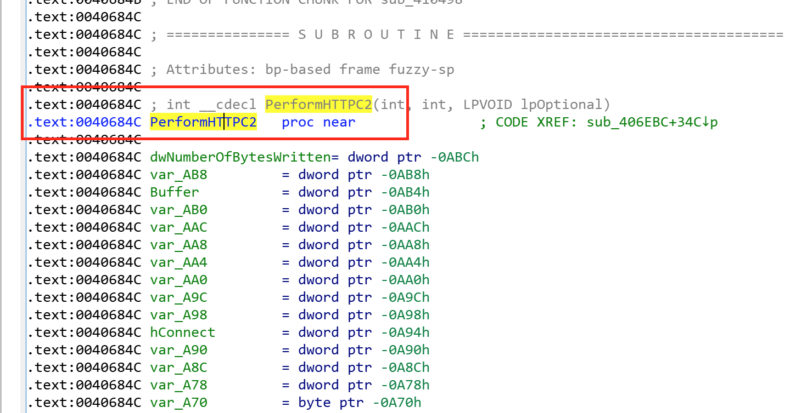

# Lab 2.2: HTTP C2 Analysis

- [Lab 2.2: HTTP C2 Analysis](#lab-22-http-c2-analysis)
  - [Objectives](#objectives)
  - [Steps](#steps)
  - [1 - Check APIs associated with HTTP C2 in Imports tab](#1---check-apis-associated-with-http-c2-in-imports-tab)
  - [2 - Identify the address of the CALL to HttpSendRequestA](#2---identify-the-address-of-the-call-to-httpsendrequesta)
  - [3 - Describe the condition that occurs immediately after the CALL to HttpSendRequestA](#3---describe-the-condition-that-occurs-immediately-after-the-call-to-httpsendrequesta)
  - [4 - Identify the address of the CALL to InternetOpenA](#4---identify-the-address-of-the-call-to-internetopena)
  - [5 - Describe the condition that occurs immediately after the CALL to InternetOpenA](#5---describe-the-condition-that-occurs-immediately-after-the-call-to-internetopena)
  - [6 - In what subroutine do the above two CALLs occur](#6---in-what-subroutine-do-the-above-two-calls-occur)
  - [7 - How would you characterize that function's purpose?](#7---how-would-you-characterize-that-functions-purpose)
  - [8 - Rename the function to reflect the function's purpose](#8---rename-the-function-to-reflect-the-functions-purpose)

---

## Objectives

- Learn standard APIs used to perform HTTP command and control (C2).
- Continue immersion in assembly language.

<br/>

---

## Steps

1. Go to the **Imports tab** and observe APIs commonly used to perform HTTP C2, including `InternetOpenA`, `InternetConnectA`, `HttpOpenRequestA`, `HttpSendRequestA`, and `InternetReadFile`.
2. Identify the address of the `CALL` to `HttpSendRequestA`.
3. How would you describe the condition that occurs immediately after the `CALL` to `HttpSendRequestA`? Describe it in a sentence and assign as much meaning as possible.
4. Identify the address of the `CALL` to `InternetOpenA`.
5. How would you describe the condition that occurs immediately after the `CALL` to `InternetOpenA`? Describe it in a sentence and assign as much meaning as possible.
6. In what subroutine do the above two `CALL`s occur?
7. How would you characterize that function's purpose?
8. Rename the function to reflect the function's purpose.

<br/>

---

## 1 - Check APIs associated with HTTP C2 in Imports tab

Navigate to the **Imports tab** and sort by the API names. 

  

- These APIs starting with `Internet` and `Http` are commonly used in HTTP C2

<br/>

---

## 2 - Identify the address of the CALL to HttpSendRequestA

Continuing **Step 1**, double click the function `HttpSendRequestA`. Click on the function and type `X`:

  

- Note both of them has the same address `sub_40684C+334`

<br/>

---

## 3 - Describe the condition that occurs immediately after the CALL to HttpSendRequestA

  

To understand more about the `HttpSendRequestA` function, check out the Microsoft Documentation:

- https://docs.microsoft.com/en-us/windows/win32/api/wininet/nf-wininet-httpsendrequesta

<br/>

```
BOOLAPI HttpSendRequestA(
  HINTERNET hRequest,
  LPCSTR    lpszHeaders,
  DWORD     dwHeadersLength,
  LPVOID    lpOptional,
  DWORD     dwOptionalLength
);
```

<br/>

- Parameters:
  - `hRequest` - A handle returned by a call to the `HttpOpenRequest` function.
  - `lpszHeaders` - A pointer to a null-terminated string that contains the additional headers to be appended to the request. This parameter can be `NULL` if there are no additional headers to be appended.
  - `dwHeadersLength` - The size of the additional headers, in TCHARs. If this parameter is `-1L` and `lpszHeaders` is not `NULL`, the function assumes that `lpszHeaders` is zero-terminated (ASCIIZ), and the length is calculated. See Remarks for specifics.
  - `lpOptional` - A pointer to a buffer containing any optional data to be sent immediately after the request headers. This parameter is generally used for POST and PUT operations. The optional data can be the resource or information being posted to the server. This parameter can be NULL if there is no optional data to send.
  - `dwOptionalLength` - The size of the optional data, in bytes. This parameter can be zero if there is no optional data to send.

<br/>

- Return value:
  - Returns `TRUE` if successful, or `FALSE` otherwise. To get extended error information, call `GetLastError`.

<br/>

After the function call, the program does `test eax, eax`

- Almost equal to `AND eax, eax`, which returns `0` if `eax` is `0`
- If the function call returns `0`, it means the function `HttpSendRequestA` fails

<br/>

Then we can see `jnz short loc_406BAA`

- `jnz` means "Jump if not zero"
- As analyzed, "not zero" means `HttpSendRequestA` succeeds in this case

<br/>

In summary, we can describe this conditional execution:

> Jump to location loc_406BAA if the call HttpSendRequestA is successful

<br/>

---

## 4 - Identify the address of the CALL to InternetOpenA

Locate `InternetOpenA` in the **Imports tab** and double click it. Click on the function and type `X`:

  

- Choose the first one and click `OK`
- Note the address is `004068D0`

<br/>

---

## 5 - Describe the condition that occurs immediately after the CALL to InternetOpenA

  

<br/>

To understand more about the function `InternetOpenA`, check out the MS doc:

- https://docs.microsoft.com/en-us/windows/win32/api/wininet/nf-wininet-internetopena

<br/>

- Syntax:

```
void InternetOpenA(
  LPCSTR lpszAgent,
  DWORD  dwAccessType,
  LPCSTR lpszProxy,
  LPCSTR lpszProxyBypass,
  DWORD  dwFlags
);
```

<br/>

- Parameters
  - `lpszAgentlpszAgent` - Pointer to a null-terminated string that specifies the name of the application or entity calling the WinINet functions. This name is used as the `user agent` in the HTTP protocol.
  - `dwAccessType` - Type of access required
  - `lpszProxy` - Pointer to a null-terminated string that specifies the name of the proxy server(s) to use when proxy access is specified by setting `dwAccessType` to `INTERNET_OPEN_TYPE_PROXY`. Do not use an empty string, because `InternetOpen` will use it as the proxy name.
  - `lpszProxyBypass` - Pointer to a null-terminated string that specifies an optional list of host names or IP addresses, or both, that should not be routed through the proxy when `dwAccessType` is set to `INTERNET_OPEN_TYPE_PROXY`. The list can contain wildcards. Do not use an empty string, because `InternetOpen` will use it as the proxy bypass list. By default, WinINet will bypass the proxy for requests that use the host names "`localhost`", "`loopback`", "`127.0.0.1`", or "`[::1]`".
  - `dwFlags` - Optional flags

<br/>

- Return value
  - Returns a valid handle that the application passes to subsequent WinINet functions. 
  - If `InternetOpen` fails, it returns `NULL`. 
  - To retrieve a specific error message, call `GetLastError`.

<br/>

Before the conditional jump instruction `jnz short loc_4068F9`, we can see `cmp ebx, edi`.

Before the compare instruction, we can see `mov ebx, eax`

- This means assign `ebx` with `eax`
- `eax` is the return value of the `InternetOpenA` function call
- It will be non-zero if the function call fails

<br/>

To understand what `edi` is, scroll up and find the assignment related to `edi`:

  

- Found `xor edi edi`
- This always returns `0` since `xor` returns non-zero only if the values compared are different

<br/>

So `cmp ebx, edi` is translated to:

- Compare `eax` and `0`
- `CMP` is similar to `SUB` but it won't affect the value stored in the variables
- If `ebx` != `0`, the operation will return non-zero, and the **Zero Flag (ZF)** will not be set
- If `ebx` == `0`, the **Zero Flag (ZF)** will be set

<br/>

If the result comparison is `0`, it means the function call fails. Now look at the jump condition `jnz short loc_4068F9`:

- `jnz` = Jump if not zero
- If the comparison is not zero, jump to location `loc_4068F9`
- If the comparison is zero, call `GetLastError` function

<br/>

In summary:

> Jump to `loc_4068F9` if the function call InternetOpenA succeeds

<br/>

---

## 6 - In what subroutine do the above two CALLs occur

Go to **View > Open subviews > Function calls**:

  

  

- The subroutine calling both `InternetOpenA` and `HttpSendRequestA` is `sub_40684C`

<br/>

---

## 7 - How would you characterize that function's purpose?

From Step 6, all of these API calls are from the same subroutine `sub_40684C`, along with all APIs associated with HTTP connectivity, it is likely that this function performs all HTTP C2 traffic.

<br/>

---

## 8 - Rename the function to reflect the function's purpose

Right click the subroutine name `sub_40684C` and click `Rename` (or click on the subroutine and type `N`):

  

<br/>

Rename the function as `PerformHTTPC2`:

  

  


<br/>

---