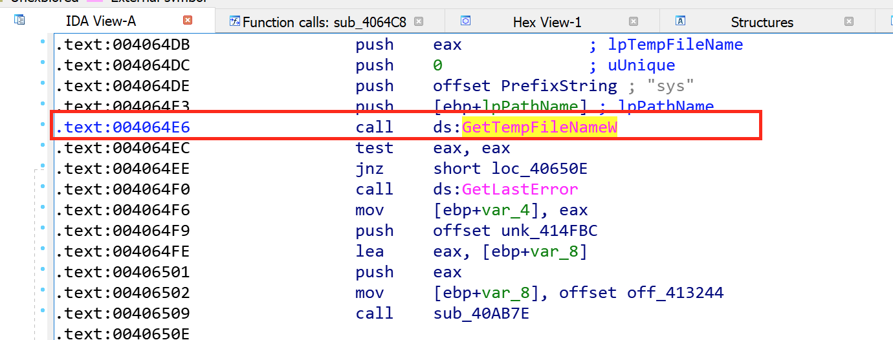
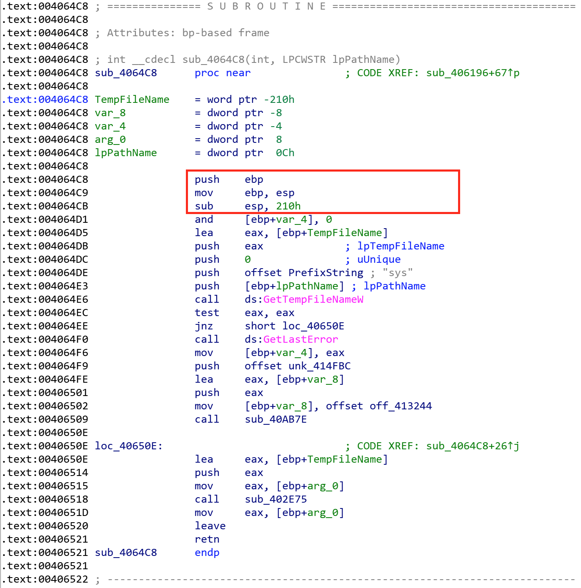

# Lab 2.3: Function Components, Part 1

- [Lab 2.3: Function Components, Part 1](#lab-23-function-components-part-1)
  - [Objectives](#objectives)
  - [Steps](#steps)
  - [1 - Address of CALL to GetTempFileNameW](#1---address-of-call-to-gettempfilenamew)
  - [2 - Function includes the GetTempFileNameW call](#2---function-includes-the-gettempfilenamew-call)
  - [3 - From how many locations is the function in #2 called](#3---from-how-many-locations-is-the-function-in-2-called)
  - [4,5 - How many arguments does the function take and how many local variables it use?](#45---how-many-arguments-does-the-function-take-and-how-many-local-variables-it-use)
  - [6 - Which instructions comprise the prologue?](#6---which-instructions-comprise-the-prologue)
  - [7 - Which instructions comprise the epilogue?](#7---which-instructions-comprise-the-epilogue)
  - [8 - What calling convention does it use?](#8---what-calling-convention-does-it-use)

---

## Objectives

- Continue immersion in assembly language.
- Understand key function components.

 

---

## Steps

1. At what address is the CALL to `GetTempFileNameW`?
2. In what function does the CALL to `GetTempFileNameW` reside?
3. From how many locations is that function called (not `GetTempFileNameW`, but the function where it is located)?
4. How many **arguments** does the function take?
5. How many **local variables** does it use?
6. Which instructions comprise the **prologue**?
7. Which instructions comprise the **epilogue**?
8. What **calling convention** does it use?

 

---

## 1 - Address of CALL to GetTempFileNameW

To find out the address of `GetTempFileNameW` API call, navigate to the `Imports` tab and type `GetTempFileNameW`:

  

 

Double click on `GetTempFileNameW`. Once in the disassembled code, again click on `GetTempFileNameW` and hit `X`:

  

- We can see the API call is at `sub_4064C8+1E`

 

Click `OK` and we will be brought to the calling location:

  

- The address of the call is `004064E6`

 

---

## 2 - Function includes the GetTempFileNameW call

Scroll up a little bit:

  

- We can see the function is `sub_4064C8`

 

---

## 3 - From how many locations is the function in #2 called

Click on `sub_4064C8` and hit `X` to bring up the xref window:

  

- This function call is only called by another subroutine `sub_406196` at address `004061FD`

 

---

## 4,5 - How many arguments does the function take and how many local variables it use?

Take a look at the metadata of the subroutine `sub_4064C8`:

  

- Remember `EBP - ` refers to local variables and `EBP + ` refers to `parameters`
- In this case, 
  - `3` local variables (`var_4`, `var_8`, `TempFileName`)
  - `2` parameters (`lpPathName`, `arg_0`)

 

---

## 6 - Which instructions comprise the prologue?

Prologue saves registers that will be used in the function body and allocates space for variables.

  

- Prologue includes addresses `4064C8-4064CB`
  - `4064C8`: `push ebp` - Save the existing `EBP` so that a new `EBP` value can be used as unchanging reference to access vairables and arguments
  - `4064C9`: `mov ebp, esp` - Place the value in `ESP` to `EBP`, creating a new stack frame for this function
  - `4064CB`: `sub esp, 210h` - Subtract from `ESP`, creating room on the stack for variables

 

---

## 7 - Which instructions comprise the epilogue?

Epilogue includes clean up activities - clean up local variables and arguments.

  

- Epilogue incides addresses `406520-406521`
  - `406520`: `leave` - Place `EBP` into `ESP` (which clean up local variables) and do `pop ebp` (which restores the previous value of `EBP`, the saved frame pointer)
  - `406521`: `retn` - It pops the top value on the stack (the return pointer) into `EIP`. This allows execution to continue with the next instruction after the CALL that transferred execution to this function.

 

---

## 8 - What calling convention does it use?

  

- IDA indicates the convention is **cdecl**

 

  

- Inspecting the `RETN` instruction again, there is not any operands

 

  

- When checking the calling function, there are `2` `pop` instructions, which are likely related to clean up activities

 

Therefore it is in fact using **cdecl** convention.

 

---