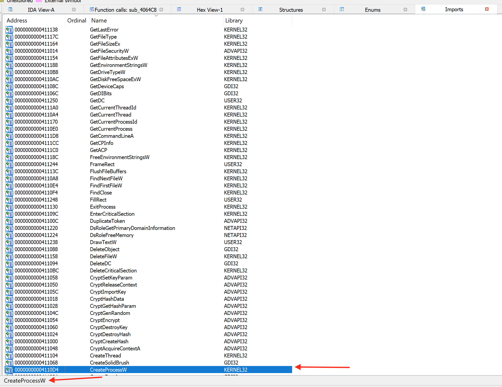
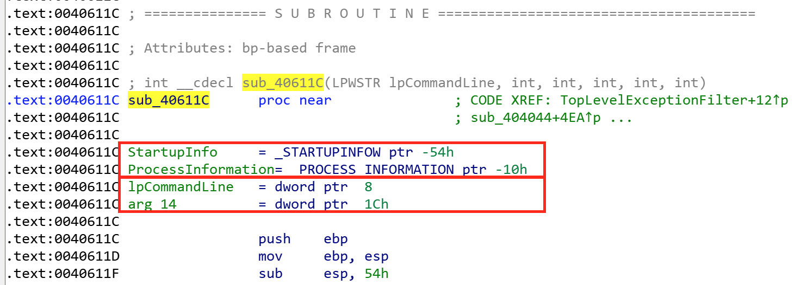

# Lab 2.4: Function Components, Part 2

- [Lab 2.4: Function Components, Part 2](#lab-24-function-components-part-2)
  - [Objectives](#objectives)
  - [Steps](#steps)
  - [1,2 - Calling address and function of CreateProcessW](#12---calling-address-and-function-of-createprocessw)
  - [3 - From how many locations is that function called](#3---from-how-many-locations-is-that-function-called)
  - [4,5 - Number of arguments and local variables](#45---number-of-arguments-and-local-variables)
  - [6,7 - Which instructions comprise the prologue & epilogue?](#67---which-instructions-comprise-the-prologue--epilogue)
  - [8 - What calling convention does it use?](#8---what-calling-convention-does-it-use)

---

## Objectives

- Continue immersion in assembly language.
- Understand key function components.

 

---

## Steps

1. At what address is the `CALL` to `CreateProcessW`?
2. In what function does the `CALL` to `CreateProcessW` reside?
3. From how many locations is that function called (not CreateProcessW, but the function where it is located)?
4. How many arguments does the function take?
5. How many local variables does it use?
6. Which instructions comprise the prologue?
7. Which instructions comprise the epilogue?
8. What calling convention does it use?

 

---

## 1,2 - Calling address and function of CreateProcessW 

Naviagate to the **Imports tab** and type `CreateProcessW`:

  

 

Double click to navigate to the assembly view and hit `X`:

  

- Only 1 reference call at `sub_40611C+4A` (`406166`)
- The function including the call to `CreateProcessW` is `sub_40611C`

 

---

## 3 - From how many locations is that function called

Click the function `sub_40611C` and hit `X`:

  

- There are 4 locations calling `sub_40611C`

 

---

## 4,5 - Number of arguments and local variables

  

- Number of local variables (`EBP - `): 2
  - `ProcessInformation`
  - `StartupInfo`
- Number of arguments: 2
  - `lpCommandLine`
  - `arg_14`

 

---

## 6,7 - Which instructions comprise the prologue & epilogue?

  

- Prologue is at `40611C - 406124`

 

  

- Epilogue is at `40617B - 406181`

 

---

## 8 - What calling convention does it use?

  

- IDA indicates this calling convention is **cdecl**

 

  

- Another way is to check the `RETN` instruction - the end of function does not have any operands

 

---