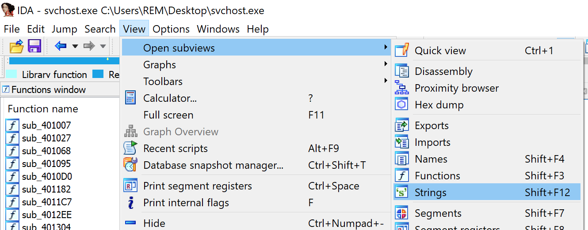
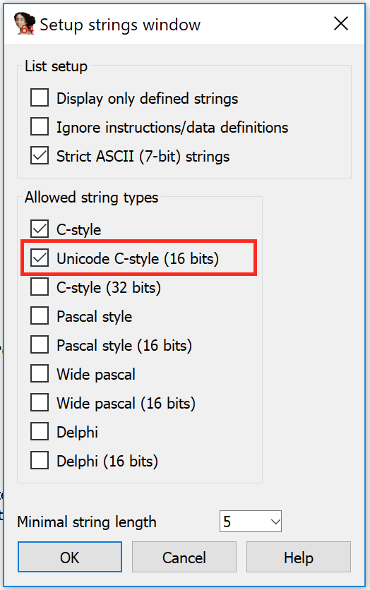
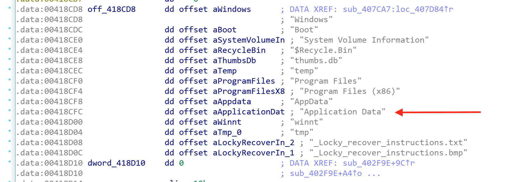
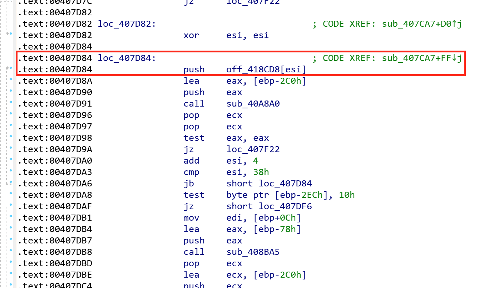
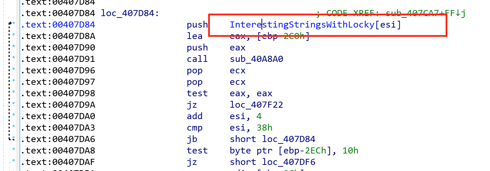
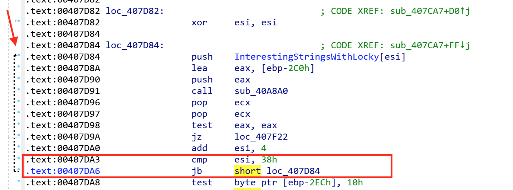
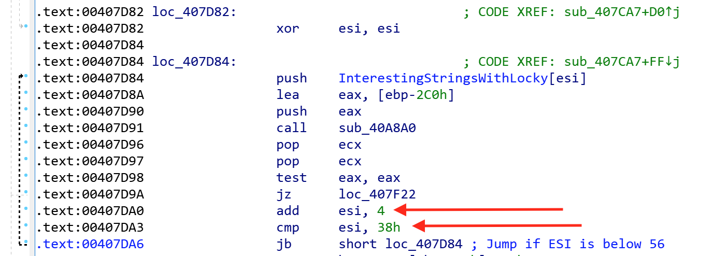

# Lab 2.5: Loop Components

- [Lab 2.5: Loop Components](#lab-25-loop-components)
  - [Objectives](#objectives)
  - [Steps](#steps)
  - [1 - Modify the IDA strings configuration to show Unicode strings](#1---modify-the-ida-strings-configuration-to-show-unicode-strings)
  - [2 - Identify the address where the Application Data string is referenced](#2---identify-the-address-where-the-application-data-string-is-referenced)
  - [3 - A group of strings is located at 418CD8. Identify the address where this group of strings is referenced.](#3---a-group-of-strings-is-located-at-418cd8-identify-the-address-where-this-group-of-strings-is-referenced)
  - [4 - Investigate the loop that references off_418CD8. First, identify the addresses and instructions of the stopping condition](#4---investigate-the-loop-that-references-off_418cd8-first-identify-the-addresses-and-instructions-of-the-stopping-condition)
  - [5 - Identify the address and instruction that update the control variable](#5---identify-the-address-and-instruction-that-update-the-control-variable)
  - [6 - Identify the address and instruction of the loop initialization](#6---identify-the-address-and-instruction-of-the-loop-initialization)
  - [7 - Identify the address range for the loop body](#7---identify-the-address-range-for-the-loop-body)
  - [8 - Investigate the purpose of the loop. Also, explore another loop at 407E28](#8---investigate-the-purpose-of-the-loop-also-explore-another-loop-at-407e28)

---

## Objectives

- Use string references to find code of interest.
- Familiarize yourself with loop components as they appear in assembly code.
- Continue immersion in assembly language.

 

---

## Steps

1. Modify the IDA strings configuration to show Unicode strings.
2. Identify the address where the Application Data string is referenced (to clarify, we are looking for where the string is referenced and not stored).
3. A group of strings is located at `418CD8`. Identify the address where this group of strings is referenced.
4. Investigate the loop that references `off_418CD8`. First, identify the addresses and instructions of the stopping condition.
5. Next, identify the address and instruction that update the control variable.
6. Identify the address and instruction of the loop initialization.
7. Lastly, identify the address range for the loop body.
8. Do you have more time? Investigate the purpose of the loop. Also, consider exploring another loop at `407E28`.

 

---

## 1 - Modify the IDA strings configuration to show Unicode strings

To show Unicode strings, navigate to `View > Open subviews > Strings`:

  

 

Then right click anywhere on the **Strings window** and click `Setup`:

  

 

Check `Unicode C-style (16 bits)`:

  

 

---

## 2 - Identify the address where the Application Data string is referenced

Locate the strings `Application Data` in the **Strings window** - you can type it out and it brings you to the location:

  

 

Double click this entry and we will be brought to the assembly view. Click on the string and hit `X` to get the xref:

  

- Reference address is `418CFC`

 

Click `OK` and we will be brought to a strings table:

  

- Note the interesting strings surrounding as well like:
  - `418D08` - `_Locky_recover_instructions.txt`
  - `418D0C` - `_Locky_recover_instructions.bmp`

 

---

## 3 - A group of strings is located at 418CD8. Identify the address where this group of strings is referenced.

Click on `418CD8` and hit `X` to see the xref:

  

- Referenced at `loc_407D84` in subroutine `sub_407CA7`
- Therefore the address in concern is `407D84`

 

Click `OK` to navigate to the referenced code:

  

 

To make it easy to read, change the name of `off_418CD8` and hit `N` to rename it as `InterestingStringsWithLocky`:

  

 

---

## 4 - Investigate the loop that references off_418CD8. First, identify the addresses and instructions of the stopping condition

Take a look at the following code block:

  

- (`407DA3 - 407dA6`) Conditional jump to `loc_407D84`. It compares `esi` with `38h` (`56` in decimal).
  - If `esi` is below `56`, jump to `loc_407D84`

 

---

## 5 - Identify the address and instruction that update the control variable

In the `cmp esi, 38h` instruction, the register `esi` is being compared. Right before this instruction, there is an update instruction at `407DA0`:

  

- `add esi, 4` - This is the update instruction on the control vairable `esi`
- Therefore `0x407DA0` is the control variable updating insturction address

 

---

## 6 - Identify the address and instruction of the loop initialization

We analyzed that `esi` is being used as the control variable. Look backward to find the related instructions:

  

- (`407D82`) - `xor esi, esi` - This set `esi` to be `0`
- Therefore the loop initialization address is `407D82`

 

---

## 7 - Identify the address range for the loop body

To identify the range of loop body, we can rely on IDA notation below:

  

- The loop body range is `407D84 - 407DA6`

 

---

## 8 - Investigate the purpose of the loop. Also, explore another loop at 407E28

