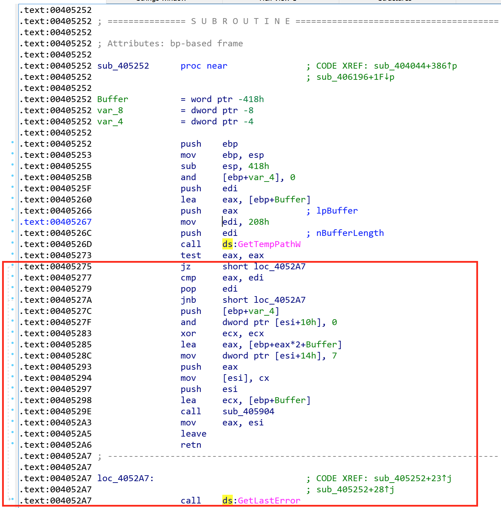
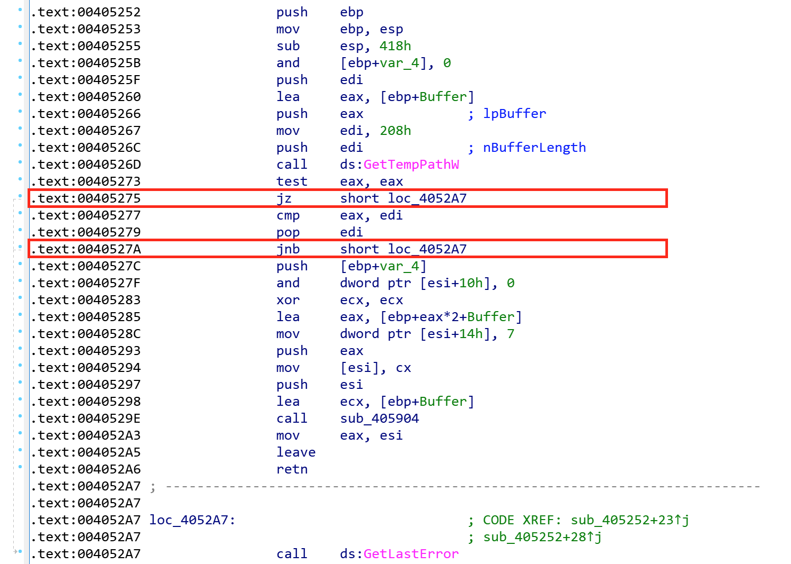

# Lab 2.6: Compound Expressions

- [Lab 2.6: Compound Expressions](#lab-26-compound-expressions)
  - [Objectives](#objectives)
  - [Steps](#steps)
  - [1 - Conditions for the complex conditional after the CALL to GetTempPathW and its meaning](#1---conditions-for-the-complex-conditional-after-the-call-to-gettemppathw-and-its-meaning)

---

## Objectives

- Familiarize yourself with compound expressions as they appear in assembly code.
- Continue immersion in assembly language.

<br/>

---

## Steps

1. What are the conditions for the complex conditional after the CALL to `GetTempPathW`? Furthermore, what is the meaning of these decision points?

<br/>

---

## 1 - Conditions for the complex conditional after the CALL to GetTempPathW and its meaning

Microsoft Documentation on `GetTempPathW`:

- https://docs.microsoft.com/en-us/windows/win32/api/fileapi/nf-fileapi-gettemppathw

<br/>

- Syntax:

```
DWORD GetTempPathW(
  DWORD  nBufferLength,
  LPWSTR lpBuffer
);
```

- Parameters:
  - `nBufferLength` - Size of the string buffer identified by lpBuffer in `TCHARs`
  - `lpBuffer` - A pointer to a string buffer that receives the null-terminated string specifying the temporary file path. 

- Return value:
  - If the function succeeds, the return value is the **length**, in `TCHARs`
  - If the function fails, the return value is zero. 

<br/>

Here is the dissemabled section of `GetTempPathW` call:

  

<br/>

Let's focus on the following 2 jumps:

  

- `405275` - `jz short loc_4052A7` - Jump if the function call `GetTempPathW` fails
- `40527A` - `jnb short loc_4052A7`
  - Above this, we can see a compare instruction `cmp eax, edi`, which makes the condition like:
    - Jump to `4052A7` if `eax` is not below `edi`

<br/>

The value of `edi` is defined here:

  

<br/>

In short, this compound expression checks if `GetTempPathW` returns correctly and if the buffer has sufficient space for the temporary path.

<br/>

---