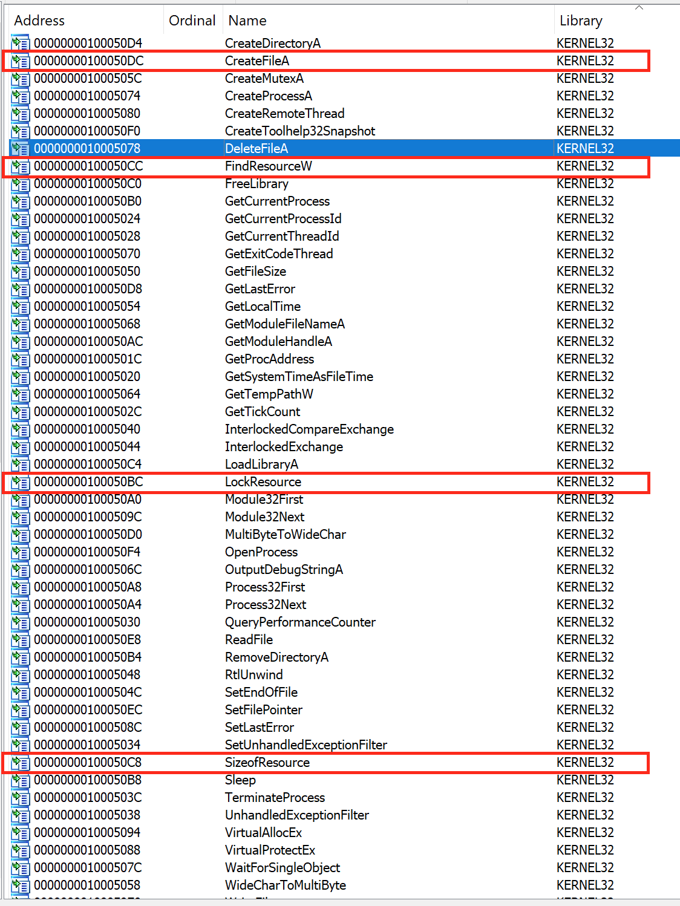
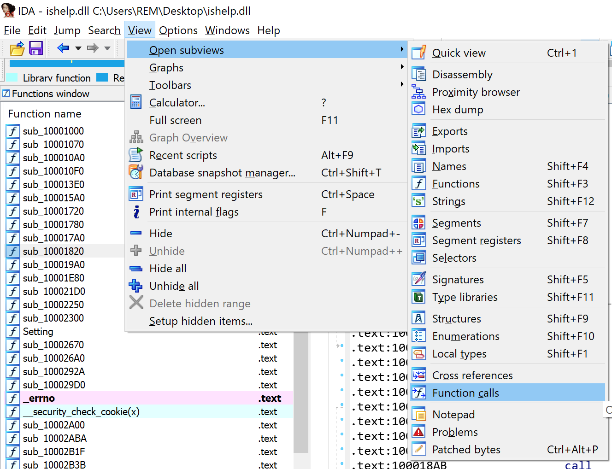
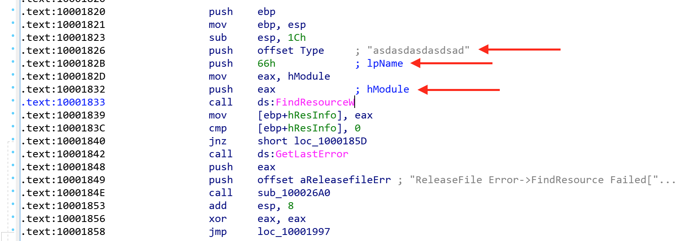
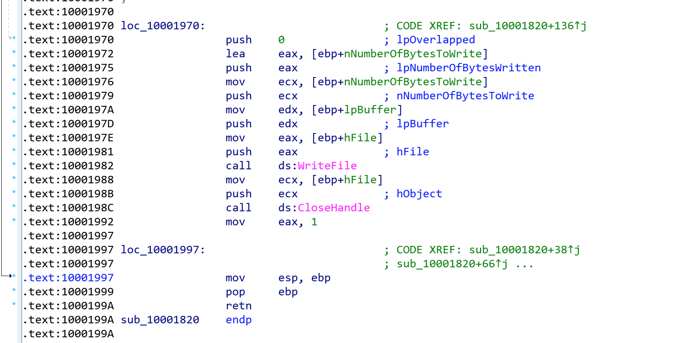
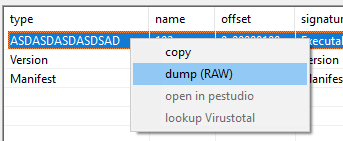

# Lab 2.7: Dropper Analysis

- [Lab 2.7: Dropper Analysis](#lab-27-dropper-analysis)
  - [Objectives](#objectives)
  - [Steps](#steps)
  - [1 - Explore Exports tab](#1---explore-exports-tab)
  - [2 - Imports tab and observe APIs commonly used to access and write resources to disk & Function with these calls](#2---imports-tab-and-observe-apis-commonly-used-to-access-and-write-resources-to-disk--function-with-these-calls)
  - [3 - Articulate the relationship between LockResource, CreateFileA, and WriteFile by tracking the relevant inputs and outputs to each function.](#3---articulate-the-relationship-between-lockresource-createfilea-and-writefile-by-tracking-the-relevant-inputs-and-outputs-to-each-function)
  - [4 - Use PeStudio to dump the relevant resource to disk](#4---use-pestudio-to-dump-the-relevant-resource-to-disk)

---

## Objectives

- Become familiar with examining a **DLL**.
- Become familiar with examining a **dropper**.
- Learn standard APIs used by droppers that store files in the PE resource section.

 

---

## Steps

1. Go to the Exports tab and note any function listed.
2. Go to the Imports tab and observe APIs commonly used to access and write resources to disk including `FindResourceW`, `SizeofResource`, `LockResource`, `CreateFileA`, and `WriteFile`. What function contains the calls to those first three APIs?
3. Articulate the relationship between `LockResource`, `CreateFileA`, and `WriteFile` by tracking the relevant inputs and outputs to each function.
4. Use **PeStudio** to dump the relevant resource to disk (the one that contains executable code).

 

---

## 1 - Explore Exports tab

Load `ishelp.dll` into IDA.

 

Navigate to the **Exports tab**:

  

- 2 exports:
  - `Setting` (`10002660`) - Ordinal `1`
  - `DllEntryPoint` (`10003477`)

 

---

## 2 - Imports tab and observe APIs commonly used to access and write resources to disk & Function with these calls

Navigate to the **Imports tab**:

  

- Note all `FindResourceW`, `SizeofResource`, `LockResource`, `CreateFileA`, and `WriteFile` are found in the **Import tabs**

 

Double click any one of them (e.g. `SizeofResource`), click on `SizeofResource` and hit `X`:

  

- The xref shows `sub_1001820+48` references this API call
- Click `OK`

 

Getting in the disassembled code view, navigate to `View > Open subviews > Function calls`:

  

  

- Note all the above API calls are in the function
- The function contains all these calls is `sub_10001820`

 

---

## 3 - Articulate the relationship between LockResource, CreateFileA, and WriteFile by tracking the relevant inputs and outputs to each function.

First look into the API call `FindResourceW`:

  

 

- https://docs.microsoft.com/en-us/windows/win32/api/winbase/nf-winbase-findresourcea

 

- Parameters:
  - `hModule` - A handle to the module whose portable executable file or an accompanying MUI file contains the resource.
  - `lpName` - The name of the resource. Alternately, rather than a pointer, this parameter can be `MAKEINTRESOURCE(ID)`, where ID is the **integer identifier of the resource**.
  - `lpType` - The resource type.

- Return:
  - If the function succeeds, the return value is a handle to the specified resource's information block.
  - If the function fails, the return value is NULL.

 

- From the screenshot, we can see the `lpType` is named `asdasdasdasdasd`, which is abnormal.
- The `lpName` is set to be `0x66`, `102` in decimal - which is the resource ID

 

Then look into the API call `SizeofResource`:

  

 

- https://docs.microsoft.com/en-us/windows/win32/api/libloaderapi/nf-libloaderapi-sizeofresource

 

- Parameters:
  - `hModule` - A handle to the module whose executable file contains the resource.
  - `hResInfo` - A handle to the resource. This handle must be created by using the `FindResource` or `FindResourceEx` function.

- Return:
  - If the function succeeds, the return value is the **number of bytes** in the resource.
  - If the function fails, the return value is **zero**.

 

The return value of `FindResourceW` - the handle to the resource - will be used in the API call `SizeofResource` to retrieve the size of the resource.

 

Look into the API call `LockResource`:

  

 

- https://docs.microsoft.com/en-us/windows/win32/api/libloaderapi/nf-libloaderapi-lockresource

 

- Parameters:
  - `hResData` - A handle to the resource to be accessed. The `LoadResource` function returns this handle. Note that this parameter is listed as an HGLOBAL variable only for backward compatibility. Do not pass any value as a parameter other than a successful return value from the `LoadResource` function.

- Return:
  - If the loaded resource is available, the return value is a pointer to the first byte of the resource; 
  - otherwise, it is NULL.

 

The return value of `FindResourceW` - the handle to the resource. It returns a pointer to the resource in memory.

 

Then `CreateFileA` call:

  

- Return a handle to the newly created file.

 

`WriteFile` call:

  

- Arguments include the previous handle to a new file and the pointer to the resource in memory
- The result is a file written to disk

 

---

## 4 - Use PeStudio to dump the relevant resource to disk

Open the DLL on **PeStudio**, and navigate to the **Resources** section:

  

- Identified the resource `ASDASDASDASD` is an executable (magic bytes `4D 5A`)
- Note the name `102`, which is the `lpName` we found for the `FindResourceW` API call

 

Right click this row and choose `dump (RAW)`:

  

 

---

