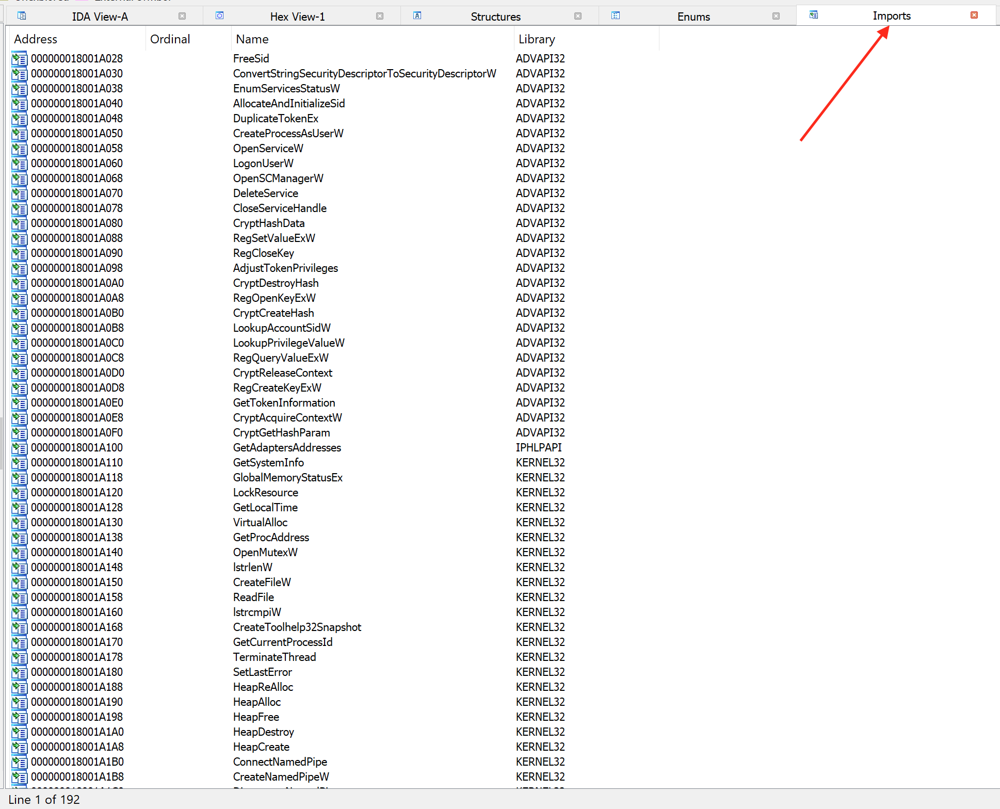
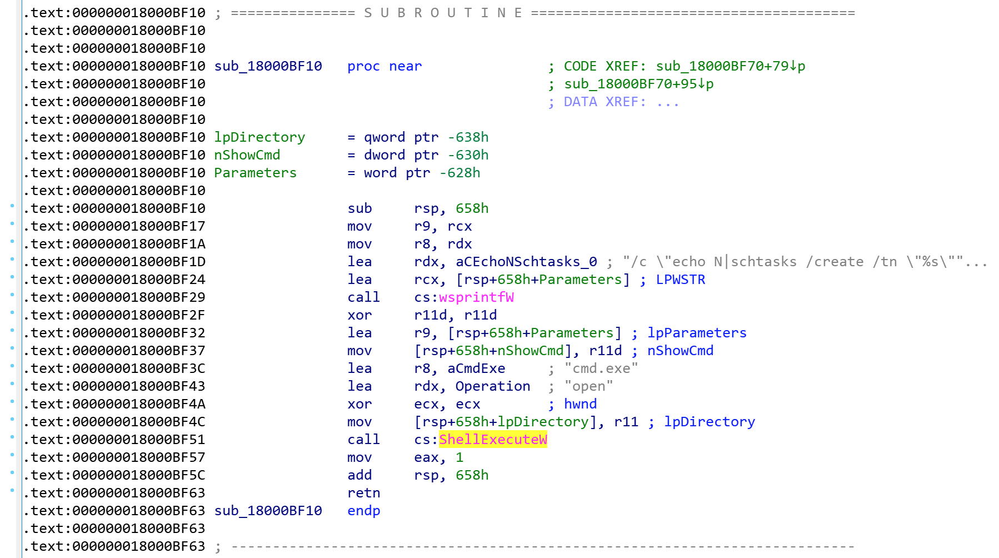
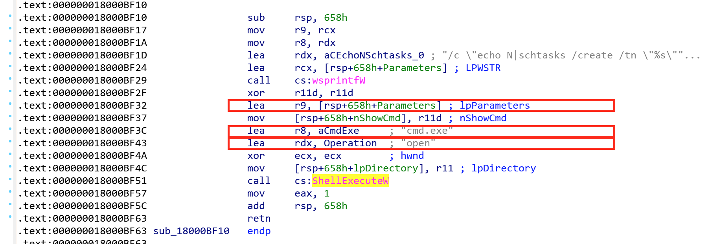

# Lab 2.8: Intro to 64-bit Code Analysis

- [Lab 2.8: Intro to 64-bit Code Analysis](#lab-28-intro-to-64-bit-code-analysis)
  - [Objectives](#objectives)
  - [Steps](#steps)
  - [1 - View win32k.dll imports](#1---view-win32kdll-imports)
  - [2 - How many locations reference ShellExecuteW](#2---how-many-locations-reference-shellexecutew)
  - [3,4 - Investigate the reference at 18000BF51](#34---investigate-the-reference-at-18000bf51)

---

## Objectives

- Gain initial exposure to 64-bit assembly code.
- Continue familiarization with IDA for reverse engineering.

<br/>

---

## Steps

1. View win32k.dll imports.
2. How many locations reference `ShellExecuteW`?
3. Choose the reference at `18000BF51` for further investigation. Based on an MSDN query of `ShellExecute`, which parameters are of greatest value to explain what command is executed as a result of the CALL?
4. What command is executed when the CALL to `ShellExecuteW` at `18000BF51` occurs?

<br/>

---

## 1 - View win32k.dll imports

First load `win32k.dll` into IDA. Navigate to the **Imports tab**:

  

<br/>

---

## 2 - How many locations reference ShellExecuteW

In the **Imports tab**, type `ShellExecuteW`:

  

<br/>

Double click the highlighted row, which brings us to the disassembled pane. Click on `ShellExecuteW` and hit `X`:

  

- 6 locations where `ShellExecuteW` is referenced

<br/>

---

## 3,4 - Investigate the reference at 18000BF51

  

<br/>

First take a look at the MS document:

- https://docs.microsoft.com/en-us/windows/win32/api/shellapi/nf-shellapi-shellexecutew

<br/>

- Purpose:
  - Performs an operation on a specified file.

<br/>

- Syntax:

```
HINSTANCE ShellExecuteW(
  HWND    hwnd,
  LPCWSTR lpOperation,
  LPCWSTR lpFile,
  LPCWSTR lpParameters,
  LPCWSTR lpDirectory,
  INT     nShowCmd
);
```

<br/>

- Parameters:
  - `hwnd` - A handle to the parent window used for displaying a UI or error messages. This value can be NULL if the operation is not associated with a window.
  - `lpOperations` - A pointer to a null-terminated string, referred to in this case as a verb, that specifies the action to be performed. The set of available verbs depends on the particular file or folder. Generally, the actions available from an object's shortcut menu are available verbs. 
  - `lpFile` - A pointer to a null-terminated string that specifies the file or object on which to execute the specified verb. To specify a Shell namespace object, pass the fully qualified parse name. Note that not all verbs are supported on all objects. For example, not all document types support the "print" verb. If a relative path is used for the lpDirectory parameter do not use a relative path for lpFile.
  - `lpParameters` - If lpFile specifies an executable file, this parameter is a pointer to a null-terminated string that specifies the parameters to be passed to the application. The format of this string is determined by the verb that is to be invoked. If lpFile specifies a document file, lpParameters should be NULL.
  - `lpDirectory` - A pointer to a null-terminated string that specifies the default (working) directory for the action. If this value is NULL, the current working directory is used. If a relative path is provided at lpFile, do not use a relative path for lpDirectory.
  - `nShowCmd` - The flags that specify how an application is to be displayed when it is opened. If lpFile specifies a document file, the flag is simply passed to the associated application. It is up to the application to decide how to handle it. It can be any of the values that can be specified in the nCmdShow parameter for the ShowWindow function.

<br/>

- Return:
  - If the function succeeds, it returns a value greater than 32. 
  - If the function fails, it returns an error value that indicates the cause of the failure.

<br/>

Recall that in 64-bit program, the first 4 parameters are passed via `RCX`, `RDX`, `R8`, `R9`.

<br/>

Let's start looking into the parameter:

  

- `hwnd` - Determined by the register `RCX`.
  - We can see `xor ecx, ecx` above. Note the `last 32 bits of RCX` = `ECX`
  - This means `hwnd` = `ecx` = `0`
  - The operation is not associated with a window.

<br/>

Next look into the next 3 parameters:

  

- `lpOperations` - Determined by the register `RDX`
  - A pointer pointing to a string `open`

<br/>

- `lpFile` - Determined by the register `R8`
  - A pointer pointing to a string `cmd.exe`

<br/>

- `lpParameters` - Determined by the register `R9`
  - Pointer reference `[rsp+658h+Parameters]`
  - No idea about what was pointed at the moment

<br/>

Still for the API call `ShellExecuteW`, we have 2 more arguments `lpDirectory` and `nShowCmd`, which are expected to be passed by Stack elements.

<br/>

Look into the upper part of the code as well:

  

- There is a `wsprintfW` API call
  - https://docs.microsoft.com/en-us/windows/win32/api/winuser/nf-winuser-wsprintfw

<br/>

- Syntax

```
int WINAPIV wsprintfW(
  LPWSTR  ,
  LPCWSTR ,
  ...     
);
```

<br/>

- Parameters
  - `LPWSTR` - The buffer that is to receive the formatted output. The maximum size of the buffer is 1,024 bytes.
  - `LPCWSTR` - The format-control specifications. In addition to ordinary ASCII characters, a format specification for each LPCWSTR appears in this string.

<br/>

- `LPWSTR` is determined by `RCX`, which a pointer `[rsp+658h+Parameters]` is assigned
  - Note `[rsp+658h+Parameters]` == `lpParameters` for the API call `ShellExecuteW`
- `LPCWSTR` is determined by `RDX`, which is assigned with a pointer, which points to a string at `18001AED0`:
  - `/c "echo N|schtasks /create /tn "%s" /tr "%s" /sc minute /mo 1 /ru "System""`
  - This specifies the **format** of the string

<br/>

Since in `RDX` we need 2 more parameters for the placeholders `%s`, it is expected to have two more arguments:

  

- Following x64 convention, the arguments will be in `R8` and `R9`
- `mov r8, rdx` - value in `rdx` will be in `R8`
- `mov r9, rcx` - value in `rcx` will be in `R9`

<br/>

Although we do not know the actual value for the placeholders, from the string `/c "echo N|schtasks /create /tn "%s" /tr "%s" /sc minute /mo 1 /ru "System""`, it is expected that a scheduled task will be created by `cmd.exe`, in order to run a program as SYSTEM.

<br/>

---