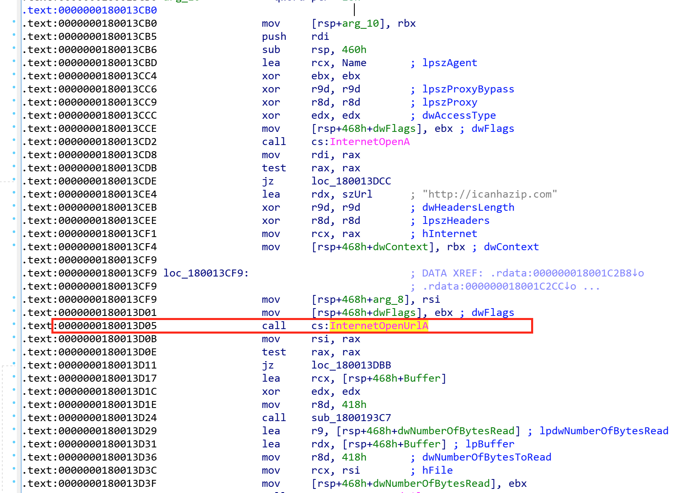
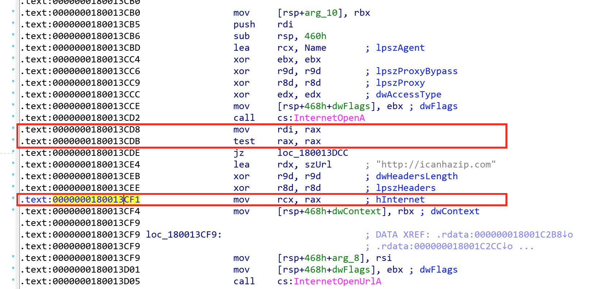
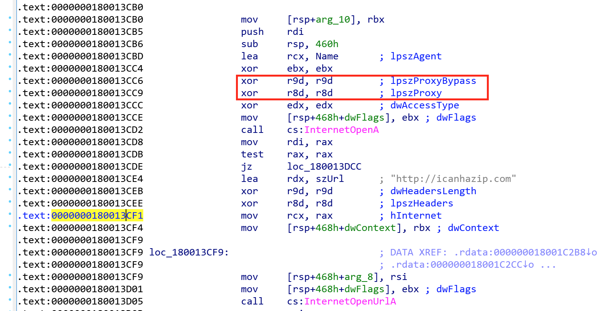
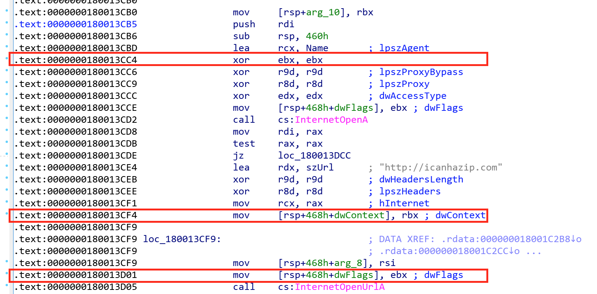

# Lab 2.9: Additional 64-bit Analysis (Appendix)

- [Lab 2.9: Additional 64-bit Analysis (Appendix)](#lab-29-additional-64-bit-analysis-appendix)
  - [Objectives](#objectives)
  - [Steps](#steps)
  - [1 - Identify the address of the CALL to InternetOpenUrlA](#1---identify-the-address-of-the-call-to-internetopenurla)
  - [2 - How many arguments does the function take?](#2---how-many-arguments-does-the-function-take)
  - [3 - Where is each argument stored? What does each argument represent?](#3---where-is-each-argument-stored-what-does-each-argument-represent)

---

## Objectives

- Practice analyzing 64-bit assembly code.
- Continue familiarization with IDA for reverse engineering.

<br/>

---

## Steps

1. Open `win32k.dll`. Identify the address of the CALL to `InternetOpenUrlA`.
2. How many arguments does the function take?
3. Where is each argument stored? What does each argument represent?

<br/>

---

## 1 - Identify the address of the CALL to InternetOpenUrlA

Load `win32k.dll` into IDA, and then navigate to `Imports tab`. Type `InternetOpenUrlA`:

  

<br/>

Double click the highlighted row. Click on `InternetOpenUrlA` and hit `X`:

  

- Click on `OK`

<br/>

  

- The address referencing `InternetOpenUrlA` is `180013D05`

<br/>

---

## 2 - How many arguments does the function take?

Look up the function on MSDN:

- https://docs.microsoft.com/en-us/windows/win32/api/wininet/nf-wininet-internetopenurla

<br/>

- Syntax:

```
void InternetOpenUrlA(
  HINTERNET hInternet,
  LPCSTR    lpszUrl,
  LPCSTR    lpszHeaders,
  DWORD     dwHeadersLength,
  DWORD     dwFlags,
  DWORD_PTR dwContext
);
```

<br/>

- Arguments:
  - `hInternet` - The handle to the current Internet session. The handle must have been returned by a previous call to InternetOpen.
  - `lpszUrl` - A pointer to a null-terminated string variable that specifies the URL to begin reading. Only URLs beginning with ftp:, http:, or https: are supported.
  - `lpszHeaders` - A pointer to a null-terminated string that specifies the headers to be sent to the HTTP server. For more information, see the description of the lpszHeaders parameter in the HttpSendRequest function.
  - `dwHeadersLength` - The size of the additional headers, in TCHARs. If this parameter is -1L and lpszHeaders is not NULL, lpszHeaders is assumed to be zero-terminated (ASCIIZ) and the length is calculated.
  - `dwFlags` - <SKIP>
  - `dwContext` - A pointer to a variable that specifies the application-defined value that is passed, along with the returned handle, to any callback functions.

<br/>

- Return value:
  - Returns a valid handle to the URL if the connection is successfully established;
  - NULL if the connection fails. 

<br/>

Therefore the function takes `6` arguments.

<br/>

---

## 3 - Where is each argument stored? What does each argument represent?

Note in 64-bit function call (fastcall), the first 4 arguments will be represented by `RCX`, `RDX`, `R8`, `R9`.

<br/>

  

- `hInternet` = `RCX` = `RAX` = Handle to the Internet session
  - `RAX` is the return value of `InternetOpenA` function call

<br/>

  

- `lpszUrl` = `RDX` = `szUrl`
  - It is a pointer to the string `http://icanhazip.com`
  - This is the URL to be accessed

<br/>

  

- `lpszHeaders` = `R8`
  - `xor r8d, r8d` implies `R8` = 0
  - No customized header
- `dwHeadersLength` = `R9`
  - `xor r9d, r9d` implies `R9` = 0
  - No customized header --> length = 0

<br/>

Then there are 2 parameters remain unknown: `dwFlags` and `dwContext`.

  

- `dwFlags` and `dwContext` are determined by `ebx` and `rbx` respectively
- Note at `180013CC4` that `xor ebx, ebx`
  - `ebx` = `rbx` = `0`
  - Therefore both `dwFlags` and `dwContext` are `0`
    - No Flag
    - No specific value

<br/>

---