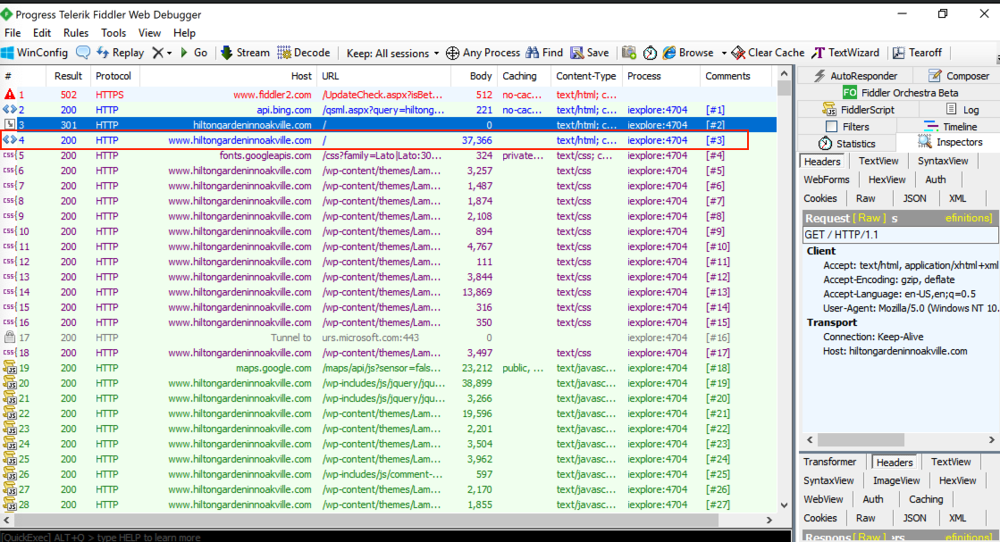
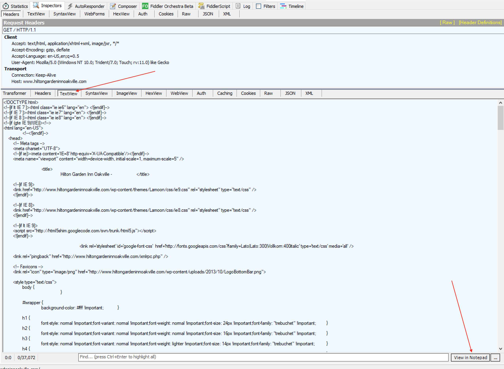
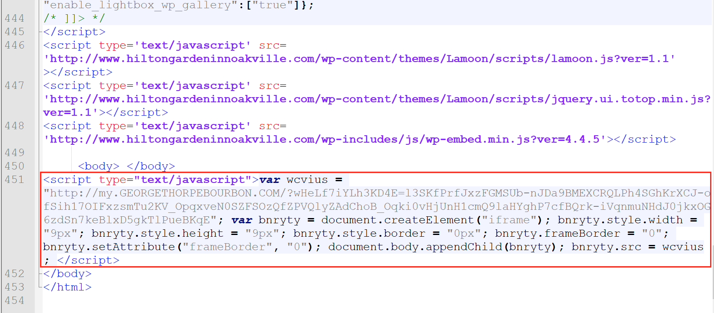
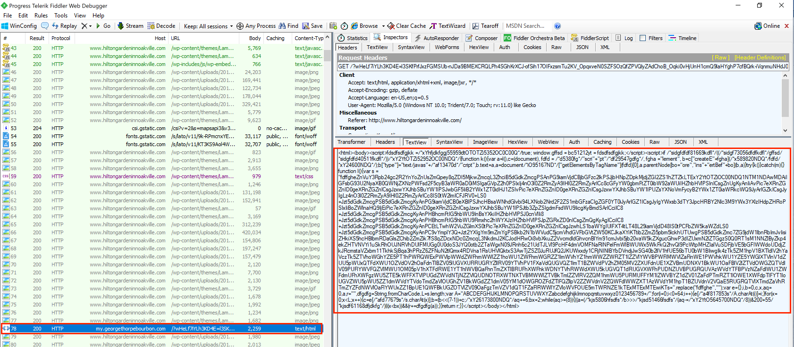
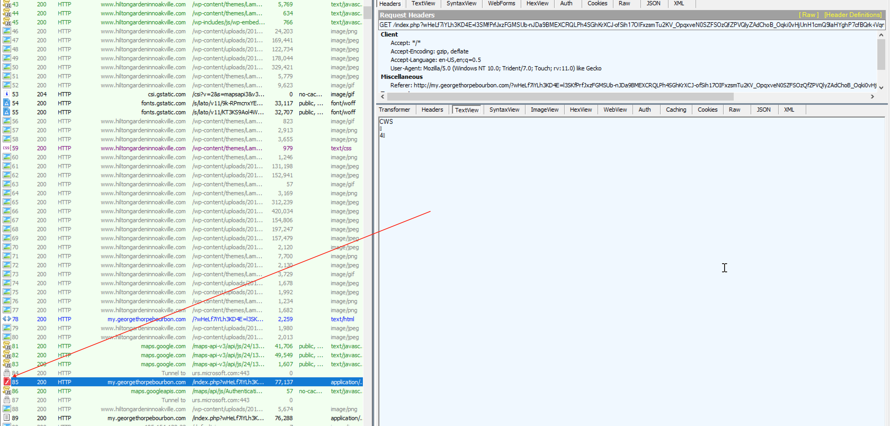
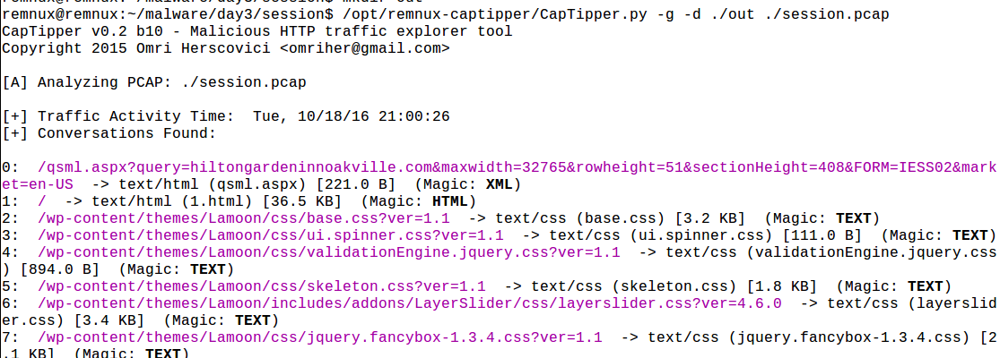

# Lab 3.1: Examining Network Traffic to Understand Web Infection Components

- [Lab 3.1: Examining Network Traffic to Understand Web Infection Components](#lab-31-examining-network-traffic-to-understand-web-infection-components)
  - [Objectives](#objectives)
  - [Steps](#steps)
  - [1,2 - Use Fiddler to locate the malicious code served](#12---use-fiddler-to-locate-the-malicious-code-served)
  - [3 - Locate obfuscated JavaScript in response to the first requested that the victim's browser made](#3---locate-obfuscated-javascript-in-response-to-the-first-requested-that-the-victims-browser-made)
  - [4 - Locate the response that serves a Flash file](#4---locate-the-response-that-serves-a-flash-file)
  - [5 - Locate the requests for a JPEG image that received a non-image response](#5---locate-the-requests-for-a-jpeg-image-that-received-a-non-image-response)
  - [6,7 - Load session.pcap in Wireshark on the Windows REM Workstation and find suspicious traffic associated with 195.154.122.33](#67---load-sessionpcap-in-wireshark-on-the-windows-rem-workstation-and-find-suspicious-traffic-associated-with-19515412233)
  - [8 - Use CapTipper to extract files from session.pcap, and locate the suspicious Flash program](#8---use-captipper-to-extract-files-from-sessionpcap-and-locate-the-suspicious-flash-program)

---

## Objectives

- Learn how to gain visibility into the nature of a web‐based attack by examining network traffic artifacts associated with an exploit kit.
-  Become familiar with web traffic analysis capabilities of Fiddler and CapTipper.

<br/>

---

## Steps

1. Load `session‐fiddler.saz` in **Fiddler** on the Windows REM Workstation.
2. Using **Fiddler**, locate the malicious code served by `www.hiltongardeninnoakville.com`.
3. Locate obfuscated JavaScript in response to the first request that the victim's browser made to `my.georgethorpebourbon.com`.
4. Locate the response that serves a Flash file to the victim's browser.
5. Locate the requests for a JPEG image that received a non‐image response.
6. Load `session.pcap` in **Wireshark** on the **Windows REM Workstation**.
7. Using **Wireshark**, examine suspicious traffic associated with `195.154.122.33`.
8. Use **CapTipper** on **REMnux** to extract files from `session.pcap`, and then locate the
suspicious Flash program.

<br/>

---

## 1,2 - Use Fiddler to locate the malicious code served

Double click on `session-fiddler.saz` to load the session file:

  

- Traffic #3 is a 301 (redirect)
- Traffic #4 show the root page of the website

<br/>

Click on traffic #4 and go to the **Textview**:

  

- Click `View in Notepad`

<br/>

There is a suspicious `<script>` block located at the end of the document:

  

<br/>

---

## 3 - Locate obfuscated JavaScript in response to the first requested that the victim's browser made

Scroll down the traffic entries, the 1st traffic to `my.georgethorpebourbon.com` is located in #78:

  

- As shown the content is an obfuscated javascript file.

<br/>

---

## 4 - Locate the response that serves a Flash file

Note in the leftmost of the traffic entries, the icon shows the response content type:

  

- The flash file is found in #85

<br/>

Note that we can export the response file and save it locally:

  

<br/>

---

## 5 - Locate the requests for a JPEG image that received a non-image response

Note there are requests to `195.154.122.33/default.jpg` - however, the response is simply `default` in plaintext:

  

<br/>

---

## 6,7 - Load session.pcap in Wireshark on the Windows REM Workstation and find suspicious traffic associated with 195.154.122.33

Double click the PCAP to launch **Wireshark**. Use the filter `ip.addr == 195.154.122.33 and http` to filter out the related traffic:

  
 
- In addition to `/default.jpg` found in **Fiddler**, we find `POST /setting/get_setting.php` as well

<br/>

Follow HTTP Stream to inspect the traffic:

  

  

- The POST traffic contains 2 parameters:
  - `idn`: look like an identifier
  - `key`: could be related to ransomware / encryption key

<br/>

---

## 8 - Use CapTipper to extract files from session.pcap, and locate the suspicious Flash program

On **REMnux**, execute the following commands:

```
cd ~/malware/day3
unzip session.zip -d session
cd session
mkdir out
/opt/remnux-captipper/CapTipper.py -g -d ./out ./session.pcap
```

  

<br/>

To check the output file type and filter out Flash file, we can do:

```
file ./out/* | grep Flash
```

  

<br/>

We can also run the following command to generate a report:

```
cd /opt/remnux-captipper; mkdir /tmp/out; ./CapTipper.py -g -r /tmp/out ~/malware/day3/session/session.pcap
```

  


<br/>

View the report:

```
firefox /tmp/out/session.html
```

  


  

<br/>

---