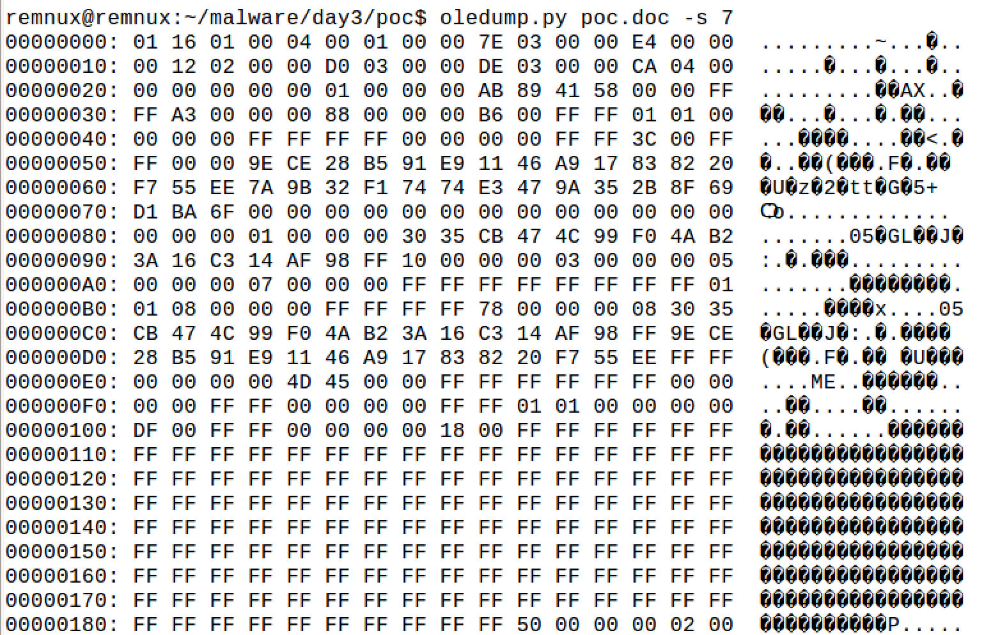
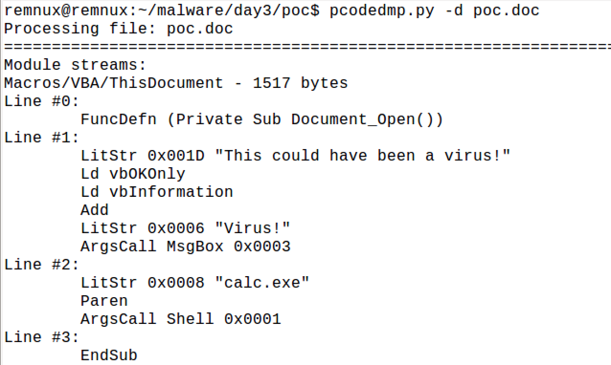

# Lab 3.11: Examining poc.doc using olevba.py, oledump.py and pcodedmp.py

- [Lab 3.11: Examining poc.doc using olevba.py, oledump.py and pcodedmp.py](#lab-311-examining-pocdoc-using-olevbapy-oledumppy-and-pcodedmppy)
  - [Objectives](#objectives)
  - [Steps](#steps)
  - [1 - Use olevba.py on poc.doc](#1---use-olevbapy-on-pocdoc)
  - [2 - Use oledump.py to check poc.doc](#2---use-oledumppy-to-check-pocdoc)
  - [3 - Use pcodedmp.py to extract and disassemble macro p-code](#3---use-pcodedmppy-to-extract-and-disassemble-macro-p-code)

---

## Objectives

- Gain familiarity with Microsoft Office documents that store macros as p‐code, rather than traditional source code.
- Learn how to use `pcodedmp.py` to extract and decompile macro p-code.

<br/>

---

## Steps

1. Use `olevba.py` to confirm that the tool finds no macros in poc.doc.
2. Use `oledump.py` to locate the potential presence of macro p‐code in `poc.doc`.
3. Use `pcodedmp.py` to extract and disassemble macro p‐code located in `poc.doc`.

<br/>

---

## 1 - Use olevba.py on poc.doc

First unzip the ZIP file:

```
unzip poc.zip -d poc; cd poc; ls
```

  

<br/>

Use `olevba.py` to check if `poc.doc` has any macro:

```
olevba.py poc.doc
```

  

- Nothing found in poc.doc

<br/>

---

## 2 - Use oledump.py to check poc.doc

Use `oledump.py` again `poc.doc`:

  

- The doc doesn't look like having any macro in the output of `oledump.py`

<br/>

Try to use `-s` to inspect the stream 1 by 1:

```
oledump.py poc.doc -s <stream_number>
```

  


<br/>

  

  

- Stream 7 looks suspicious since `calc.exe` is shown

<br/>

---

## 3 - Use pcodedmp.py to extract and disassemble macro p-code

Use `pcodedmp.py` to extract the macro p-code:

```
pcodedmp.py -d poc.doc
```

  

```
Module streams:
Macros/VBA/ThisDocument - 1517 bytes
Line #0:
	FuncDefn (Private Sub Document_Open())
Line #1:
	LitStr 0x001D "This could have been a virus!"
	Ld vbOKOnly 
	Ld vbInformation 
	Add 
	LitStr 0x0006 "Virus!"
	ArgsCall MsgBox 0x0003 
Line #2:
	LitStr 0x0008 "calc.exe"
	Paren 
	ArgsCall Shell 0x0001 
Line #3:
	EndSub
```

- `ArgsCall MsgBox 0x0003 ` -> Show a message box of `This could have been a virus!`
- `ArgsCall Shell 0x0001` -> Use `Shell` to run `calc.exe`

<br/>

---