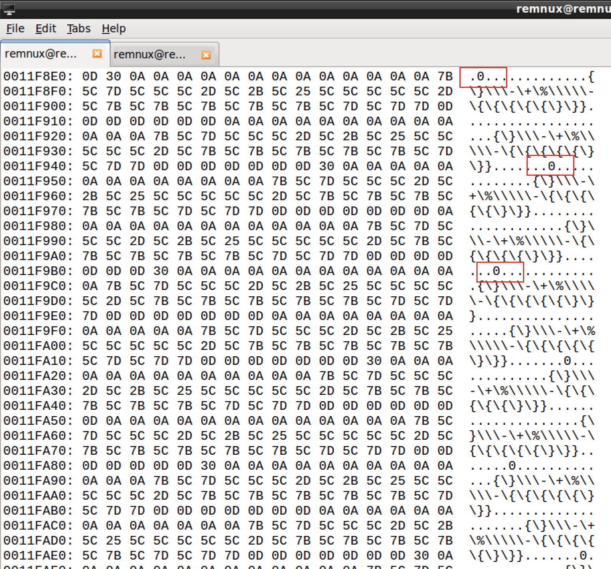
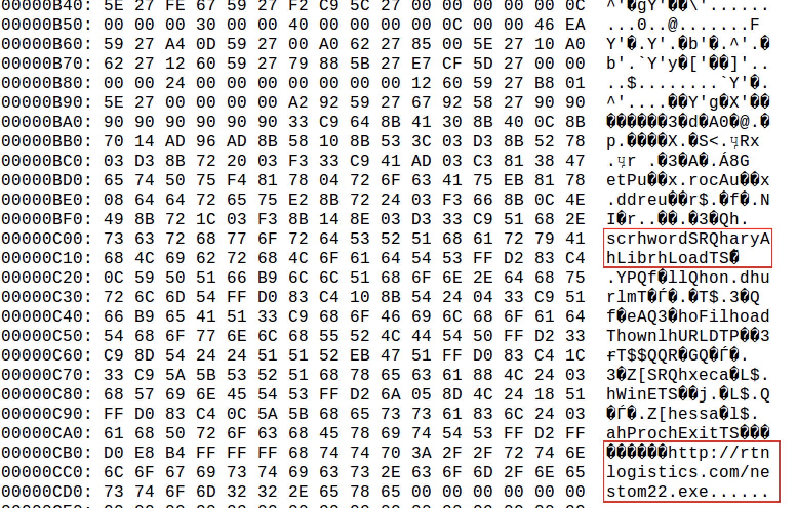
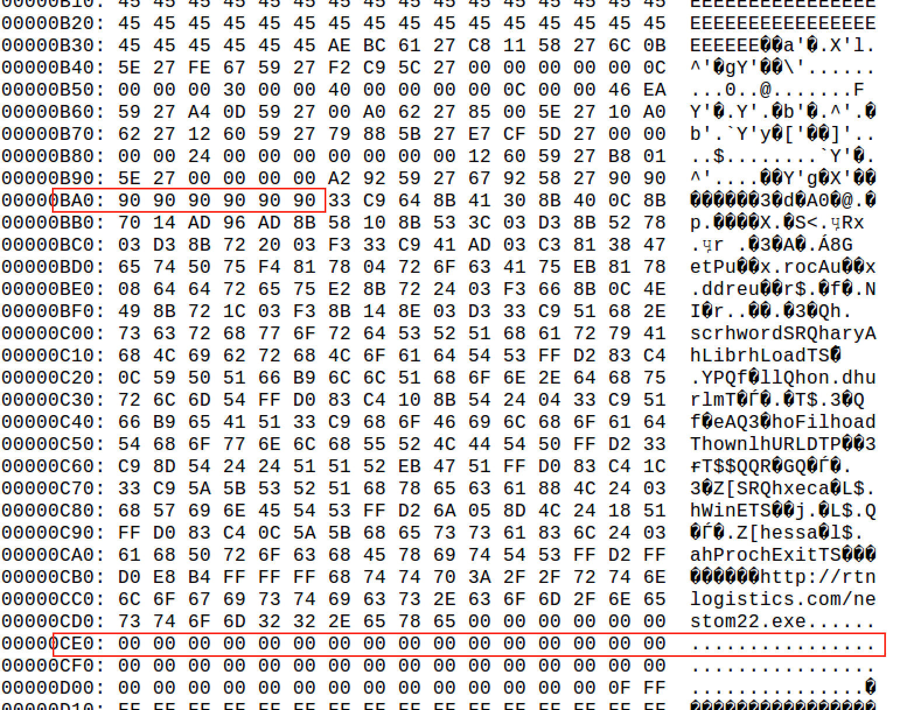
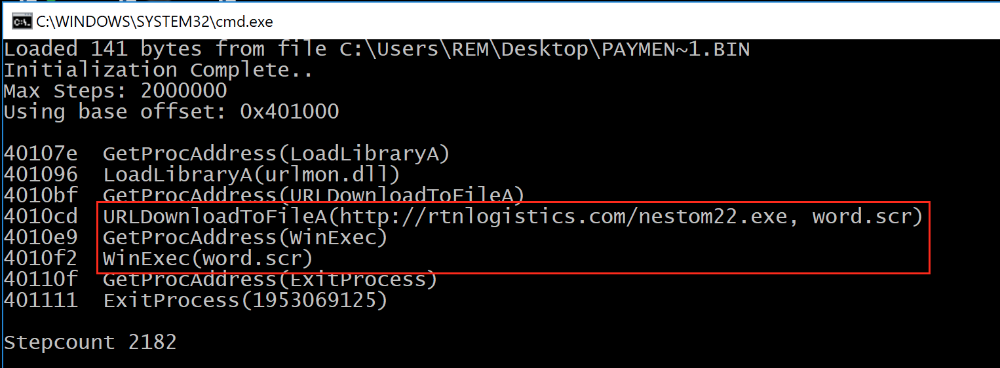
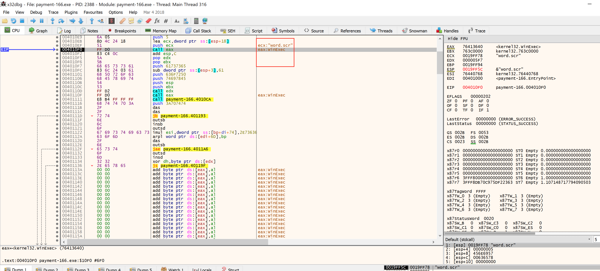

# Lab 3.12: Examining payment.doc using rtfdump.py

- [Lab 3.12: Examining payment.doc using rtfdump.py](#lab-312-examining-paymentdoc-using-rtfdumppy)
  - [Objectives](#objectives)
  - [Steps](#steps)
  - [1,2,3,4 - Scan payment.doc with rtfdump, list the "{ }", and locate the group ID with the greatest number of Hex](#1234---scan-paymentdoc-with-rtfdump-list-the---and-locate-the-group-id-with-the-greatest-number-of-hex)
  - [5 - Specify option c and d to cave out the shellcode](#5---specify-option-c-and-d-to-cave-out-the-shellcode)
  - [6 - Emulate the BIN using scdbg](#6---emulate-the-bin-using-scdbg)
  - [7 - Then use shellcode2exe.py to generate a Win EXE and debug it using x32dbg](#7---then-use-shellcode2exepy-to-generate-a-win-exe-and-debug-it-using-x32dbg)

---

## Objectives

- Gain familiarity with the structure and malicious capabilities of RTF files.
- Learn how to use `rtfdump.py` to examine suspicious RTF documents

<br/>

---

## Steps

1. Scan `payment.doc` using `rtfdump.py` and use `wc` to count the number of `{ }` groups to confirm that this RTF document is probably malicious.
2. Use `rtfdump.py` to list the `{ }` groups in payment.doc that enclose an object.
3. Examine the output from the previous step to locate the ID of the group that's at the highest nesting level that has the largest number of hex characters.
4. Use `rtfdump.py` to examine the contents of group number 166 to locate the possible boundary of the embedded shellcode.
5. Specify `‐c` and `‐d` parameters to `rtfdump.py` to carve out the shellcode embedded in
group 166 of `payment.doc` starting at `BA0` and ending at `CE0`, saving the result as the file `payment‐out.bin`.
6. Use SFTP to transfer `payment‐out.bin` to the Windows REM Workstation and emulate its execution in **scdbg**.
7. Optionally, use `shellcode2exe.py` on REMnux to generate a Windows executable file out of `payment‐out.bin`, transfer it to the Windows REM Workstation, and debug it in **x32dbg**.

<br/>

---

## 1,2,3,4 - Scan payment.doc with rtfdump, list the "{ }", and locate the group ID with the greatest number of Hex

Unzip the ZIP:

```
unzip payment.zip -d payment; cd payment; ls
```

  

<br/>

Use `rtfdump.py` to inspect the objects in `payment.rtf`:

```
rtfdump.py payment.doc > payment_rtfdump.txt
```

<br/>

Inspect `payment_rtfdump.txt`:

  

- Group 166 and 167 have a high number of characters

<br/>

Note:
We can also use `rtfdump.py payment.rtf -f O` to list only groups with objects

<br/>

Inspect group 166:

```
rtdump.py payment.doc -s 166
```

  

- Can only see `0` for ASCII character

<br/>

Try to use `-H` option to direct the tool to convert the HEX characters contained in the group to bytes:

```
rtfdump.py -s 166 -H > payment_166.txt
```

  

- A URL is revealed: `http://rtnlogistics.com/nestom22.exe`
- A command `AhLibrhLoad` is revealed - Similar to `LoadLibraryA`

<br/>

---

## 5 - Specify option c and d to cave out the shellcode

Note the `NOP` (`0x90`) in the line `0xBA0`, and the `NULL` at `0xCE0`:

  

<br/>

Dump these content:

```
rtfdump.py payment.doc -s 166 -H -c 0xBA0:0xCE0 -d > payment-166.bin &
```

  
 

<br/>

---

## 6 - Emulate the BIN using scdbg

Use a Python SimpleHTTPServer to serve the bin:

```
sudo python -m SimpleHTTPServer 80
```

  


<br/>

On Windows, download the bin file:

```
cd C:\Users\REM\Desktop && certutil -urlcache -f http://172.16.252.128/payment-166.bin .\payment-166.bin
```

  


<br/>

Open `payment-166.bin` on **scdbg**:

  

- As shown, it leverages `URLDownlaodToFileA` from `urlmon.dll` to download an executable from `http://rtnlogistics.com/nestom22.exe` and save it as `word.scr`
- `word.scr` is then executed

<br/>s

---

## 7 - Then use shellcode2exe.py to generate a Win EXE and debug it using x32dbg

```
shellcode2exe.py payment-166.bin payment-166.exe
```

<br/>

Then use Python SimpleHTTPServer to serve it.

```
sudo python -m SimpleHTTPServer 80

```

<br/>

Download it from the Windows machine:

```
cd C:\Users\REM\Desktop && certutil -urlcache -f http://172.16.252.128/payment-166.exe .\payment-166.exe
```

  

<br/>

Use **x32dbg** to debug it:

  

<br/>

---