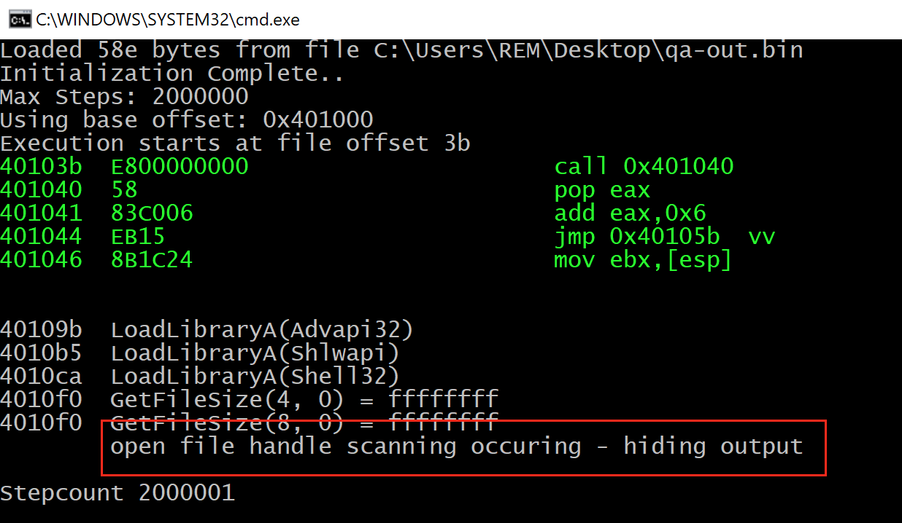
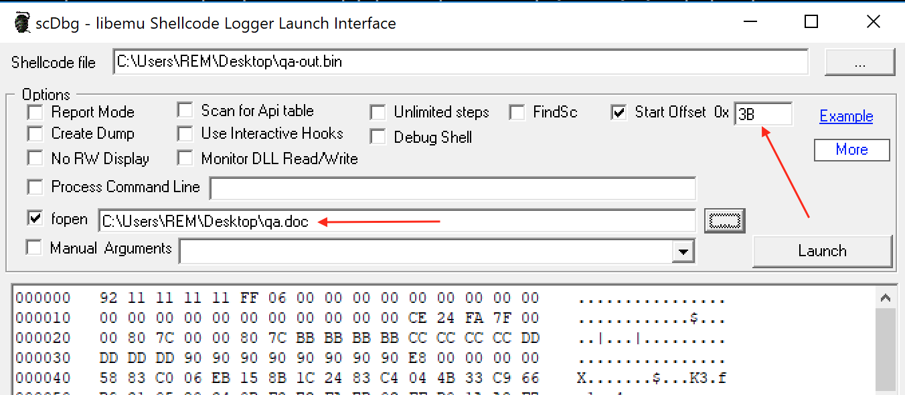
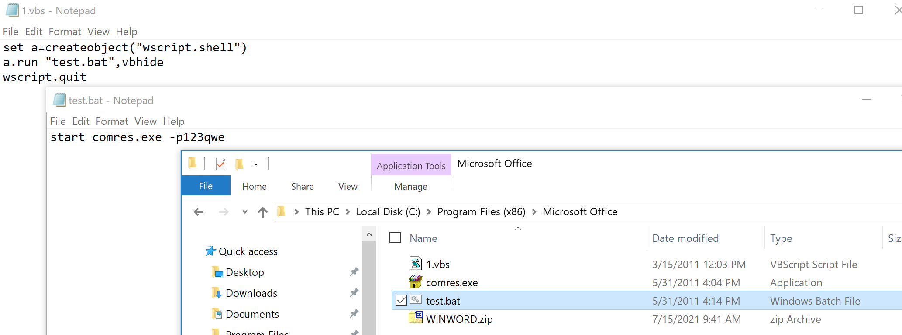
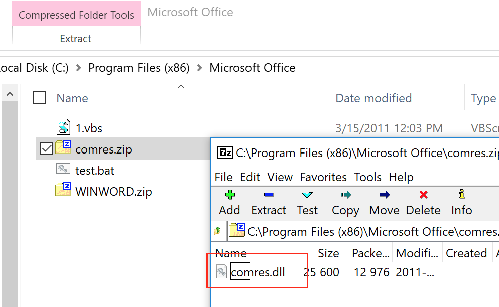

# Lab 3.13: Examing qa.doc using rtfdump.py, XORSearch, scdbg and jmp2it

- [Lab 3.13: Examing qa.doc using rtfdump.py, XORSearch, scdbg and jmp2it](#lab-313-examing-qadoc-using-rtfdumppy-xorsearch-scdbg-and-jmp2it)
  - [Objectives](#objectives)
  - [Steps](#steps)
  - [1 - Scan qa.doc using rtfdump.py](#1---scan-qadoc-using-rtfdumppy)
  - [2 - Examine group 5 and extract, converting to HEX and save as qa-out.bin](#2---examine-group-5-and-extract-converting-to-hex-and-save-as-qa-outbin)
  - [3 - Use XORSearch to lcoate shellcode patterns in qa-out.bin](#3---use-xorsearch-to-lcoate-shellcode-patterns-in-qa-outbin)
  - [4 - Use scdbg to emulate the execution](#4---use-scdbg-to-emulate-the-execution)
  - [5,6 - Use jmp2it on Windows to execute the shellcode at 0x3B, directing the tool to add a handle to qa.doc](#56---use-jmp2it-on-windows-to-execute-the-shellcode-at-0x3b-directing-the-tool-to-add-a-handle-to-qadoc)

---

## Objectives

- Reinforce the use of `rtfdump.py` as a starting point for RTF file examinations.
- Experiment with using `XORSearch` to locate shellcode in binary files.
- Learn how to use `jmp2it` to perform dynamic analysis of shellcode.

<br/>

---

## Steps

1. On REMnux, scan `qa.doc` using `rtfdump.py` to locate the group with a large size and a high nesting level.
2. Use `rtfdump.py` to examine group 5 in `qa.doc`, and then direct the tool to extract these contents, converting them from hexadecimal and saving them as a binary file `qa‐out.bin`.
3. Use `XORSearch` to locate shellcode patterns in `qa‐out.bin`.
4. Use SFTP to transfer `qa‐out.bin` to the Windows REM Workstation and emulate its execution in **scdbg**.
5. Use `jmp2it` on the Windows REM Workstation to execute the shellcode located at `0x3B` in `qa‐out.bin`, directing the tool to add a handle to `qa.doc`.
6. Examine the artifacts in `C:\Program Files (x86)\Microsoft Office` that shellcode generated when it was executed by `jmp2it`.

<br/>

---

## 1 - Scan qa.doc using rtfdump.py

Unzip the ZIP:

```
unzip qa.zip -d qa; cd qa; ls
```

  

<br/>

Use `rtfdump.py` to scan `qa.doc`:

```
rtfdump.py qa.doc
```

  

- Level 0 stands at the bottom, which is content that exists after the expected end point of the file as an overlay
- Level 5 has the deepest nesting level

<br/>

---

## 2 - Examine group 5 and extract, converting to HEX and save as qa-out.bin

Check group 5 and try to see if there exists any `NOP`:

```
rtfdump.py qa.doc -s 5 | grep 9090
```

  

- True!

<br/>

Then extract the content of group 5 and dump into a raw format (`-H` directs to tool to convert its content from HEX form, `-d` means dump):

```
rtfdump.py qa.doc -s 5 -H -d > qa-out.bin
```

<br/>

---

## 3 - Use XORSearch to lcoate shellcode patterns in qa-out.bin

We can use `xorsearch` to find common shellcode patterns. Common parameters:

- `-W -d 3`: Examine for commonly seen shellcode pattern; avoid applying the ROT transformation

<br/>

```
xorsearch qa-out.bin -W -d 3 qa-out.bin
```

  

- The first `GetEIP` is at `0x3B` in cleartext (as indicated by `XOR 00`)
- `XOR F3` means the content is XORed with the key `F3`

<br/>

---

## 4 - Use scdbg to emulate the execution

On REMnux, serve the BIN using Python SimpleHTTPServer:

```
sudo python -m SimpleHTTPServer 80
```

<br/>

Download the BIN on Windows:

```
cd C:\Users\REM\Desktop && certutil -urlcache -f http://172.16.252.128/qa-out.bin .\qa-out.bin
```

<br/>

Open `qa-out.bin` using **scdbg**, setting the start offset to `0x3B`:

  

  

- Shellcode in document file often stores portions of its code or data within the doucument where it resides
- The shellcode iterates through all possible file handle values until it finds the one that points to its content
- It call `GetFileSize` and compare the size of the file where the handle is pointing to the expected file size

<br/>

Therefore we need to actually have the `qa.doc` and point it on **scdbg**:

```
cd C:\Users\REM\Desktop && certutil -urlcache -f http://172.16.252.128/qa.doc .\qa.doc
```

  

<br/>

  

- As shown, it starts generating the file `C:\Program Files (x86)\Microsoft Office\WINWORD.exe`

<br/>

---

## 5,6 - Use jmp2it on Windows to execute the shellcode at 0x3B, directing the tool to add a handle to qa.doc


  

<br/>

Then use `jmp2it` to execute the shellcode:

```
jmp2it C:\Users\REM\Desktop\qa-out.bin 0x3B addhandle C:\Users\REM\Desktop\qa.doc
```

  

<br/>

  

- As shown, `WINWORD.EXE` has been generated

<br/>

Since the icon is like a archive, change the file extension to `.zip` and try to open:

  

- It contains a `VBS` file, an executable and a `BAT` file

<br/>

Inspect the content:

  

- The VBS triggers running the BAT with command `start comres.exe -p123qwe`

<br/>

Again the executable `comres.exe` looks like a ZIP. Change the extension and extract it:

  

- It contains a DLL called `comres.dll`

<br/>

---