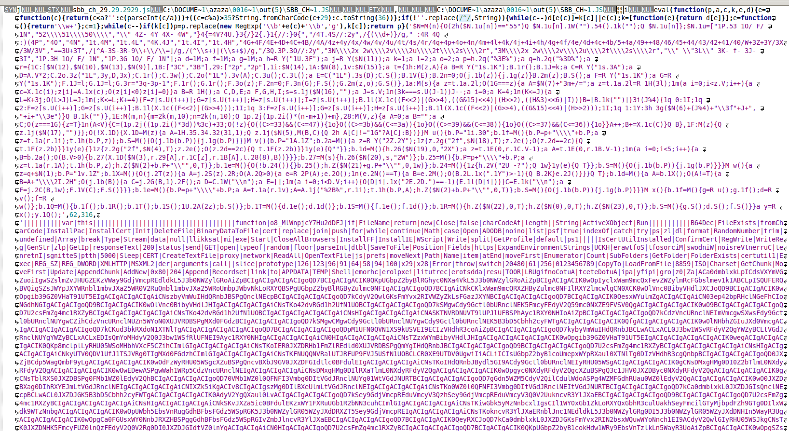
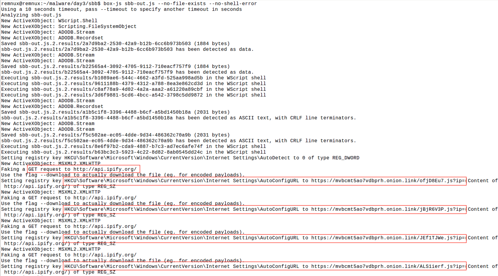
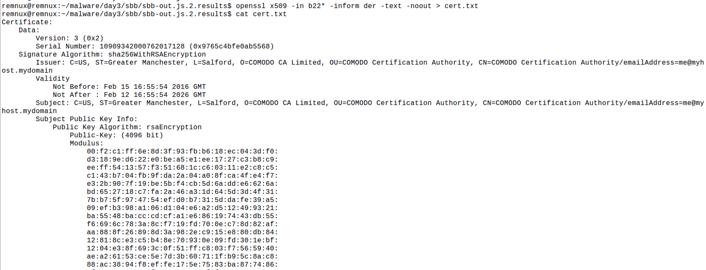

# Lab 3.14: Examing sbb.xlsx using oledump.py, zipdump.py and other tools

- [Lab 3.14: Examing sbb.xlsx using oledump.py, zipdump.py and other tools](#lab-314-examing-sbbxlsx-using-oledumppy-zipdumppy-and-other-tools)
  - [Objectives](#objectives)
  - [Steps](#steps)
  - [1 - Examine the streams in sbb.xlsx using oledump](#1---examine-the-streams-in-sbbxlsx-using-oledump)
  - [2 - Use oledump.py the extract the content of stream A3](#2---use-oledumppy-the-extract-the-content-of-stream-a3)
  - [3 - Edit sbb-out.js and remove non-JavaScript text](#3---edit-sbb-outjs-and-remove-non-javascript-text)
  - [4 - Use oledump and zipdump to confirm other aspects of sbb.xlsx do not contain anomalies](#4---use-oledump-and-zipdump-to-confirm-other-aspects-of-sbbxlsx-do-not-contain-anomalies)
  - [5 - Use SpiderMonkey and rev to deobfuscate sbb-out.js](#5---use-spidermonkey-and-rev-to-deobfuscate-sbb-outjs)
  - [6 - Use box-js to deobfuscate sbb-out.js](#6---use-box-js-to-deobfuscate-sbb-outjs)

---

## Objectives

- Learn how to analyze Microsoft Office documents that contain embedded JavaScript.
- Learn how to use `zipdump.py` for examining XML‐based Microsoft Office files.
- Reinforce the use of `oledump.py`, `box‐js`, and **SpiderMonkey** for the analysis of documents.

<br/>

---

## Steps
1. Examine the streams in `sbb.xlsx` using `oledump.py` to locate suspicious contents.
2. Use `oledump.py` to extract the contents of stream `A3` from `sbb.xlsx` to `sbb‐out.js`.
3. Edit `sbb‐out.js` using **SciTE** to delete non‐JavaScript text and save the modified file.
4. Optionally, use `oledump.py` and `zipdump.py` to confirm that other aspects of `sbb.xlsx` don't appear to contain anomalies.
5. Use **SpiderMonkey** and rev to deobfuscate `sbb‐out.js` and examine the results for malicious components.
6. If there is time, use `box‐js` to deobfuscate `sbb‐out.js` and examine the results to locate malicious components.

<br/>

---

## 1 - Examine the streams in sbb.xlsx using oledump

```
unzip sbb.zip -d sbb; cd sbb; ls
```

  

<br/>

Use `oledump.py` to examine the file `sbb.xlsx`:

```
oledump.py sbb.xlsx
```

  

- `A3` has the largest size

<br/>

---

## 2 - Use oledump.py the extract the content of stream A3

```
oledump.py sbb.xlsx -s A3 -i
```

- `-i` shows the general information about the stream like `MD5` and header

  

- The text `eval(function(p` reveals codes related to JavaScript

<br/>

Dump stream A3 out:

```
oledump.py sbb.xlsx -s A3 -d > sbb-out.js
```

<br/>

---

## 3 - Edit sbb-out.js and remove non-JavaScript text

```
scite sbb-out.js
```

  

- The content is obfuscated

<br/>

Remove the non-JavaScript components:

  

  

<br/>

---

## 4 - Use oledump and zipdump to confirm other aspects of sbb.xlsx do not contain anomalies

-- Skipped

<br/>

---

## 5 - Use SpiderMonkey and rev to deobfuscate sbb-out.js

Use `js` to run the script in SpiderMonkey with the standard object:

```
js -f /usr/share/remnux/objects.js -f sbb-out.js > sbb-out2.js
```

  

- It complains there is no `ActiveXObject`

<br/>

Inspect the output file using `scite`:

  

- It looks like there are some reversed words

<br/>

Try to use `rev` to reverse the content and inspect again:

```
rev sbb-out2.js > sbb-out3.js; scite sbb-out3.js
```

  

  

  

- Some interesting strings are revealed
- It tries to view/set the browser proxy settings
  - `"HKCU\\Software\\Microsoft\\Windows\\CurrentVersion\\Internet Settings\\AutoConfigURL"`
  - `"HKCU\\Software\\Microsoft\\Windows\\CurrentVersion\\Internet Settings\\AutoDetect"`
- `certutil -addstore -f -user "\ROOT` - Add SSL certificate
- `powershell -ExecutionPolicy Unrestricted` - Powershell execution

<br/>

---

## 6 - Use box-js to deobfuscate sbb-out.js

```
box-js sbb-out.js
```

  

<br/>

```
box-js sbb-out.js --no-file-exists --no-shell-error
```

  

- Configure the victim system so the internet traffic is sent to the attacker's server in TOR network

<br/>

Also check the produced file `.\sbb-out.js.2.results/resources.json`:

  

- It generates some cert and ps files

<br/>

Try to convert the `der` file into text:

```
openssl x509 -in 2a7d9* -inform der -text -noout > cert.txt
```

  

- Fake cert claiming to correspond to COMODO

<br/>

---