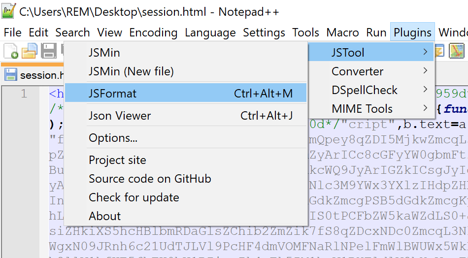
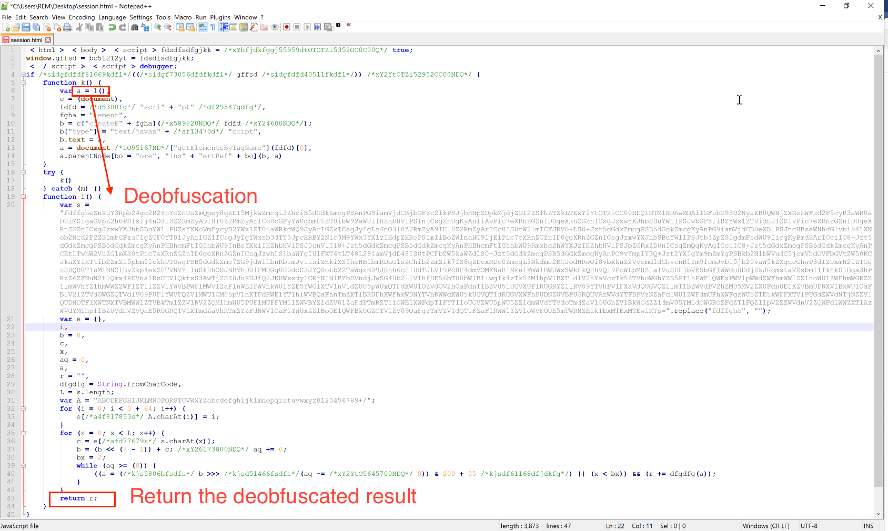
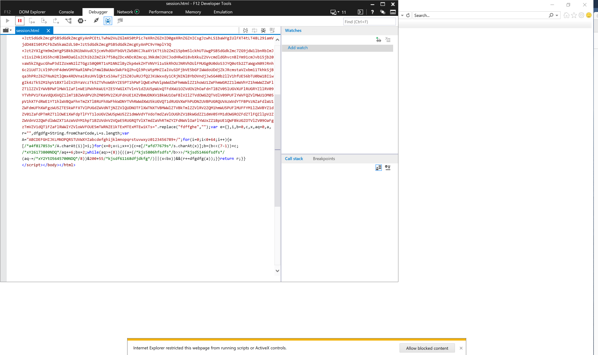
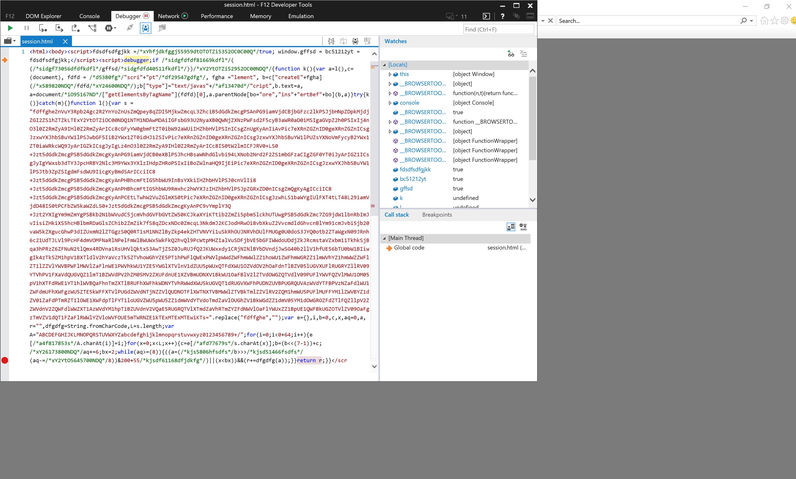
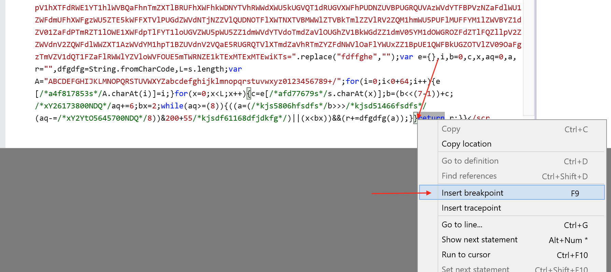
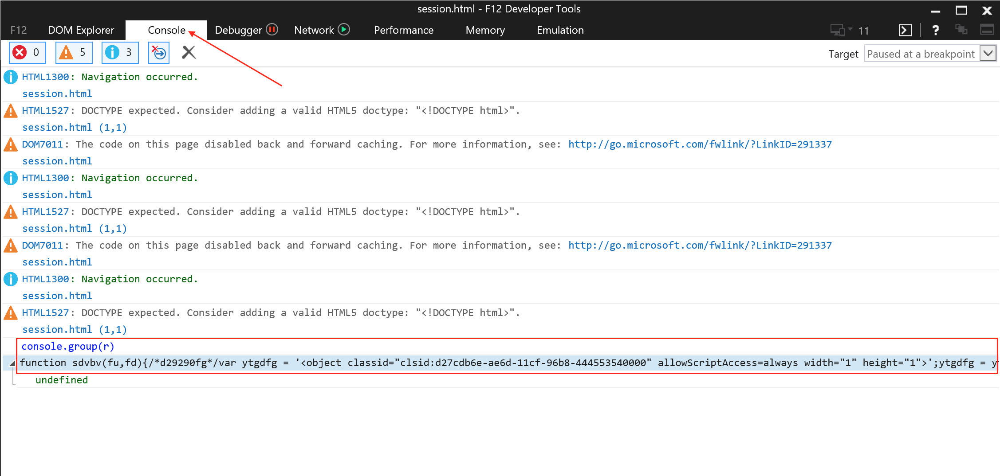

# Lab 3.2: Deobfuscating session.html using the Internet Explorer Debugger

- [Lab 3.2: Deobfuscating session.html using the Internet Explorer Debugger](#lab-32-deobfuscating-sessionhtml-using-the-internet-explorer-debugger)
  - [Objectives](#objectives)
  - [Steps](#steps)
  - [1,2 - Examine session.html on Notepad++](#12---examine-sessionhtml-on-notepad)
  - [3 - Revert the script on Notepad++](#3---revert-the-script-on-notepad)
  - [4,5 - Add the debugger statement and save](#45---add-the-debugger-statement-and-save)
  - [6 - Load session.html and bring up Developer Tools](#6---load-sessionhtml-and-bring-up-developer-tools)
  - [7 - Reload session.html and allow blocked content](#7---reload-sessionhtml-and-allow-blocked-content)
  - [8 - Insert a breakpoint in front of the `return r` statement](#8---insert-a-breakpoint-in-front-of-the-return-r-statement)
  - [9,10 - Execute the script and examine the content of variable r](#910---execute-the-script-and-examine-the-content-of-variable-r)
  - [11 - Beautify the script](#11---beautify-the-script)

---

## Objectives

- Understand the essential aspects of JavaScript deobfuscation.
- Learn how to use the Internet Explorer debugger to deobfuscate JavaScript.

<br/>

---

## Steps

1. Load `session.html` in **Notepad++** on the Windows REM Workstation and beautify the script.
2. Examine the script to locate the statement where you might want to set a breakpoint.
3. Revert the script to eliminate the errors introduced by the beautification process.
4. Add the debugger; statement in the beginning of the second set of script tags.
5. Save the modified `session.html` file and minimize Notepad++.
6. Load `session.html` in Internet Explorer and bring up Developer Tools.
7. Reload `session.html` in Internet Explorer and click `Allow blocked content`.
8. Insert a breakpoint in front of the return `r` statement.
9. Execute the script, allowing it to reach the breakpoint.
10. Examine the contents of variable `r`.
11. Paste the deobfuscated script to a new **Notepad++** tab and beautify it.

<br/>

--

## 1,2 - Examine session.html on Notepad++

First open `session.html` on **Notepad++**, and use `Plugins > JSTool > JSFormat`:

  

<br/>

  

- Set a breakpoint at the `return r` statement for inspecting the deobfuscated result

<br/>

---

## 3 - Revert the script on Notepad++

To revert, click `File > Reload from Disk`:

  

<br/>

  

- The file has been reverted

<br/>

---

## 4,5 - Add the debugger statement and save

  

<br/>

---

## 6 - Load session.html and bring up Developer Tools

Double click the `session.html` file. You will see a prompt of `Blocked Content`. Before proceeding, hit `F12` to load the **Developer Tools**:

  

<br/>

---

## 7 - Reload session.html and allow blocked content

Click the `Refresh` button and Allowed the content:

  

<br/>

---

## 8 - Insert a breakpoint in front of the `return r` statement

Click the space between the `}` and the `r`. Right click and `Insert breakpoint`:

  

<br/>

---

## 9,10 - Execute the script and examine the content of variable r

Click the start button:

  

<br/>

  

- The program stops at the breakpoint set

<br/>

Copy the value of `r`:

  

<br/>

Paste it on **Notepad++** for further investigation:

  

- However, the double quote `"` are all escaped to be `\"`.

<br/>

Instead, we can use the browser console to get the value.

Select the **Console tab** and use the following command:

```
console.group(r)
```

  

<br/>

Then, right click on the line and choose `Copy item`:

  

<br/>

Paste it on **Notepad++**:

  

<br/>

---

## 11 - Beautify the script

`Plugins > JSTools > JSFormat`:

  

<br/>

