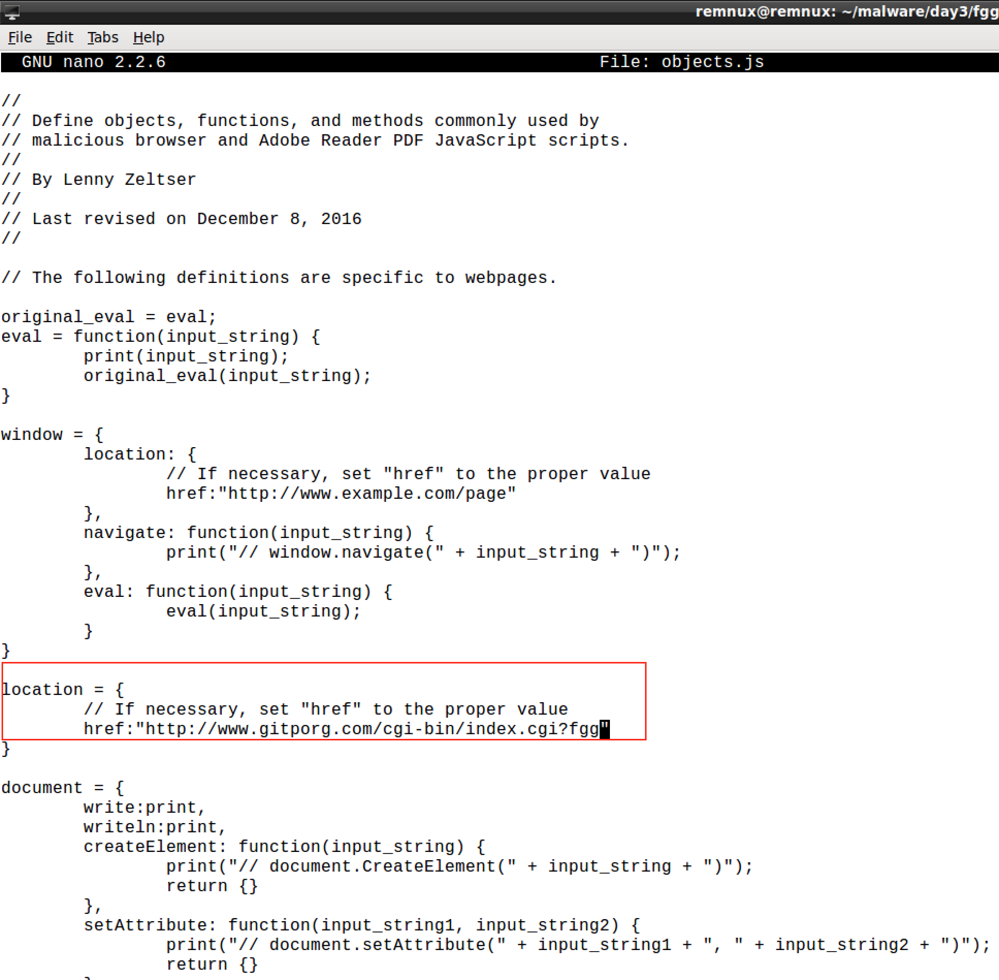
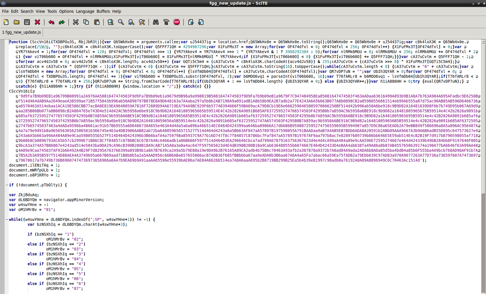

# Lab 3.3: Deobfuscating fgg.js using SpiderMonkey

- [Lab 3.3: Deobfuscating fgg.js using SpiderMonkey](#lab-33-deobfuscating-fggjs-using-spidermonkey)
  - [Objectives](#objectives)
  - [Steps](#steps)
  - [1 - View fgg.js and locate the object & method to define](#1---view-fggjs-and-locate-the-object--method-to-define)
  - [2 - Define location.href to contain the URL where the script resided](#2---define-locationhref-to-contain-the-url-where-the-script-resided)

---

## Objectives

- Learn how to deobfuscate JavaScript using script interpreters such as **SpiderMonkey**.

<br/>

---

## Steps

1. View `fgg.js` in **SciTE** to locate the object and method that we might need to define.
2. Define `location.href` to contain the URL where the script resided, which was http://www.gitporg.com/cgi‐bin/index.cgi?fgg.

<br/>

---

## 1 - View fgg.js and locate the object & method to define

First on **REMnux**, unzip `fgg.zip`:

```
unzip fgg.zip -d fgg
cd fgg
```

  

<br/>

View `fgg.js` using **Scite**:

```
scite fgg.js
```

  

<br/>

Note the variable referencing `location.href`:

  

<br/>

When we try to use **SpiderMonkey** on `fgg.js`:

```
js -f fgg.js
```

  

- It shows `ReferenceError: location is not defined`

<br/>

In this case, include the **REMnux** common object:

```
js -f /usr/share/remnux/objects.js -f fgg.js > fgg_new.js
scite fgg_new.js &
```

  

  

- However, the output is unreadable
- A possibility will be it needs a correct href location to allow the script to properly decode itself
- When doing investigation, always save details and metadata related to the malicious page

<br/>

---

## 2 - Define location.href to contain the URL where the script resided

Copy the common object to the current directory:

```
cp /usr/share/remnux/objects.js ./
nano objects.js
```

  

- Modify this section

<br/>

Save it and regenerate:

```
js -f objects.js -f fgg.js > fgg_new_update.js
scite fgg_new_update.js &
```

  

  

- A suspicious URL is discovered

<br/>

---