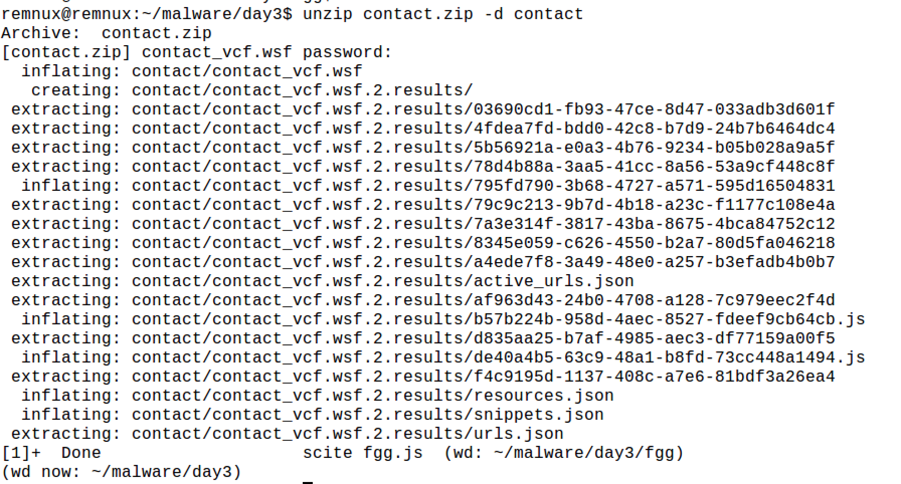
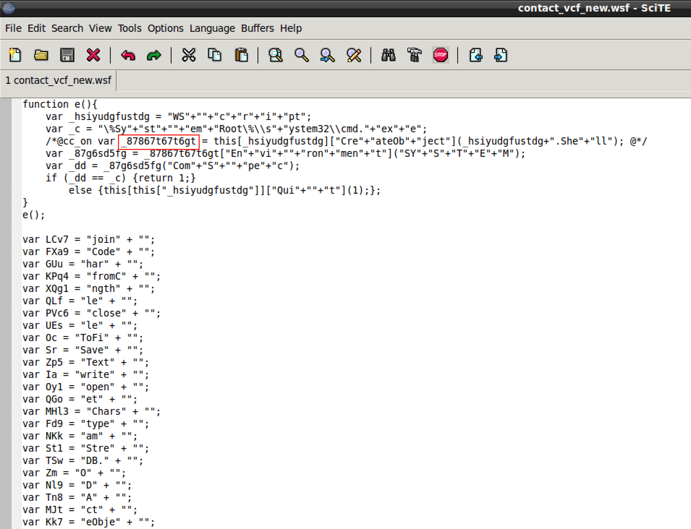
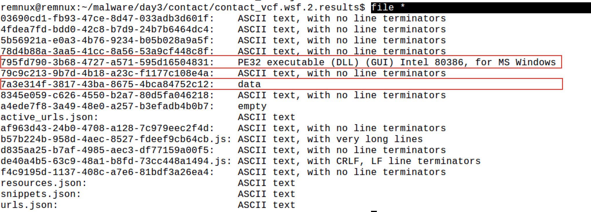

# Lab 3.4: Deobfuscating contact_vcf.wsf using box-js

- [Lab 3.4: Deobfuscating contact_vcf.wsf using box-js](#lab-34-deobfuscating-contact_vcfwsf-using-box-js)
  - [Objectives](#objectives)
  - [Steps](#steps)
  - [1 - Use SpiderMonkey to deobfuscate contact_vcf.wsf](#1---use-spidermonkey-to-deobfuscate-contact_vcfwsf)
  - [2 - Use box-js to deobfuscate the script](#2---use-box-js-to-deobfuscate-the-script)
  - [3 - Examine the content of the contact_vcf.wsf.2.results directory](#3---examine-the-content-of-the-contact_vcfwsf2results-directory)

---

## Objectives

Learn how to use JavaScript environment emulators such as `box‐js` to deobfuscate scripts.

<br/>

---

## Steps

1. Use **SpiderMonkey** to deobfuscate the `contact_vcf.wsf` script.
2. Use **box‐js** to deobfuscate the `contact_vcf.wsf` script and examine the results.
3. Examine the contents of the `contact_vcf.wsf.2.results` directory.

<br/>

---

## 1 - Use SpiderMonkey to deobfuscate contact_vcf.wsf

First unzip the file:

```
unzip contact.zip -d contact
cd contact
```

  

<br/>

Inspect the file `contact_vcf.wsf`:

```
scite contact_vcf.wsf
```

  

- As shown, it is obfuscated

<br/>

Try to deobfuscate it using **SpiderMonkey**:

  

- Reference error occurs

<br/>

Try to apply the common object and try again:

```
js -f /usr/share/remnux/objects.js -f contact_vcf.wsf > contact_vcf_new.wsf
scite contact_vcf_new.wsf &
```

  

  

- The said undefined variable is highlighted

<br/>

---

## 2 - Use box-js to deobfuscate the script

Instead use `box-js` to deobfuscate - which emulates common runtime components:

```
box-js contact_vcf.wsf
```

  

- It makes request to `http://sapanboon.com/ne7ptotr`

<br/>

We can inspect all of the URL captured in the result directory:

```
more contact_vcf.wsf.results/urls.json
```

  

- URLs found:

```
http://sapanboon.com/ne7ptotr
http://raiaepeuhl.net/7d5c8q
http://kf-design.com/nea9o
http://kikitikor.com/8pyd413
```

<br/>

---

## 3 - Examine the content of the contact_vcf.wsf.2.results directory

First we can check the file type:

```
cd contact_vcf.wsf.2.results/
file *
```

  

<br/>

Obtain the hashes of the PE file:

```
md5sum 795fd790-3b68-4727-a571-595d16504831; sha256sum 795fd790-3b68-4727-a571-595d16504831
```

- Result:

```
861ee719ced3e7054db60864c669619d  795fd790-3b68-4727-a571-595d16504831
67fb85ceb25ec29723c962e58f273b85b5e834814bf0c24dc99f55a26aa0fe2e  795fd790-3b68-4727-a571-595d16504831
```

<br/>

Examine it using `peframe`:

```
peframe 795fd790-3b68-4727-a571-595d16504831
```

  

  

- Suspicious API function imported

<br/>

---