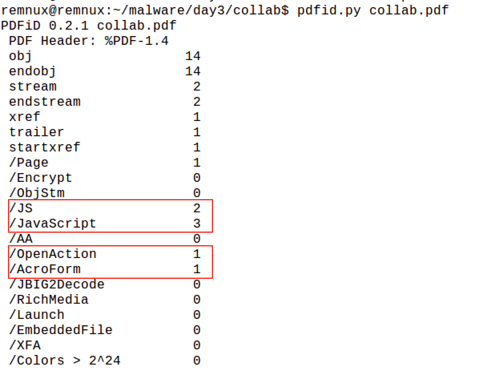
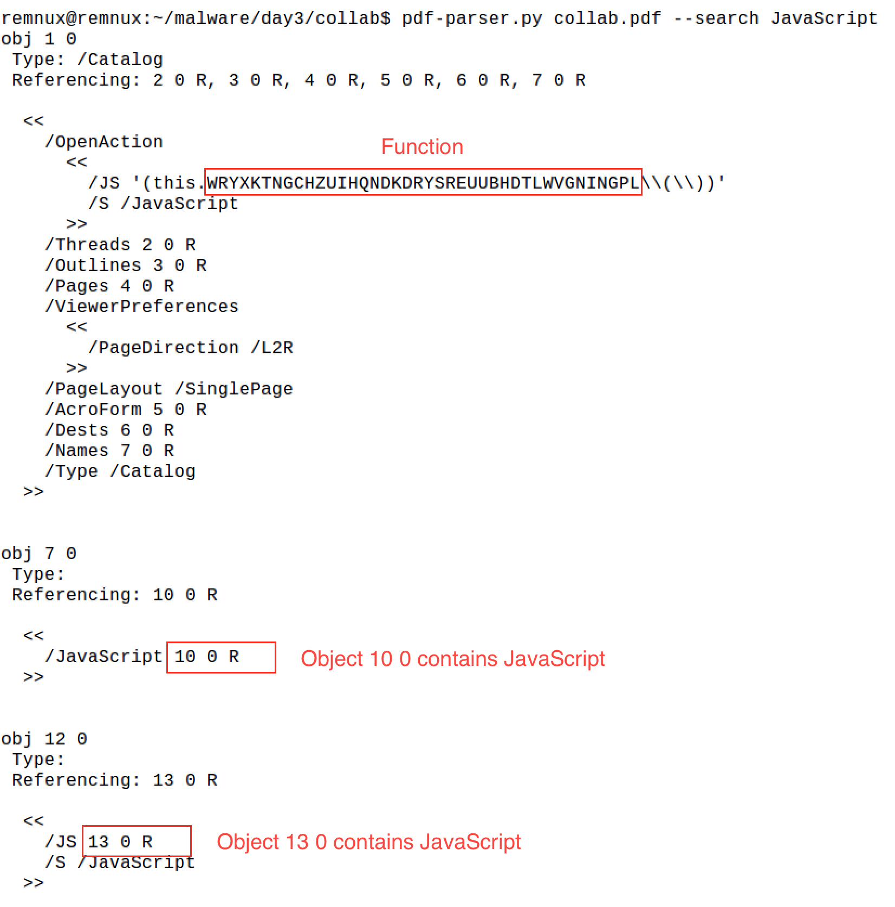
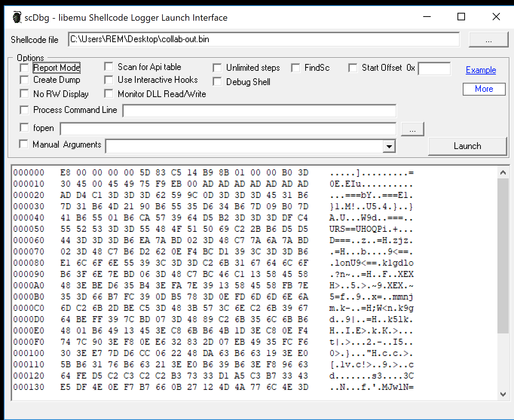

# Lab 3.6: Examining collab.pdf using pdfid.py, pdf-parser.py and scbdb

- [Lab 3.6: Examining collab.pdf using pdfid.py, pdf-parser.py and scbdb](#lab-36-examining-collabpdf-using-pdfidpy-pdf-parserpy-and-scbdb)
  - [Objectives](#objectives)
  - [Steps](#steps)
  - [1 - Use pdfid.py on collab.pdf](#1---use-pdfidpy-on-collabpdf)
  - [2 - Use pdf-parser.py to locate JavaScript objects](#2---use-pdf-parserpy-to-locate-javascript-objects)
  - [3 - Use pdf-parser.py to examine the objects 10 and 13, and save the stream from object 13 to collab.txt](#3---use-pdf-parserpy-to-examine-the-objects-10-and-13-and-save-the-stream-from-object-13-to-collabtxt)
  - [4 - Modify collab.txt so tbat it can be executed in SpiderMonkey, and deobfuscated the content, saving it as collab2.txt](#4---modify-collabtxt-so-tbat-it-can-be-executed-in-spidermonkey-and-deobfuscated-the-content-saving-it-as-collab2txt)
  - [5 - Use base64dump.py to extract the long-encoded shellcode from collab2.txt and output as collab-out.bin](#5---use-base64dumppy-to-extract-the-long-encoded-shellcode-from-collab2txt-and-output-as-collab-outbin)
  - [6,7 - Transfer collab-out.bin to Windows and use scdbg to emulate the execution of the shellcode](#67---transfer-collab-outbin-to-windows-and-use-scdbg-to-emulate-the-execution-of-the-shellcode)

---

## Objectives

- Understand the role that JavaScript can play in malicious PDF files.
- Learn how to use **SpiderMonkey** to deobfuscate JavaScript embedded in PDF files.
- Gain experience using `pdfid.py` and `pdf‐parser.py` for analyzing PDF files.
- Learn how to use `scdbg` to emulate the execution of shellcode.

<br/>

---

## Steps

1. Use `pdfid.py` to perform an initial assessment of `collab.pdf` and formulate theories regarding the risk that this document may pose.
2. Use `pdf‐parser.py` to locate objects in `collab.pdf` that include JavaScript.
3. Use `pdf‐parser.py` to examine the contents of objects 10 and 13, saving the stream from
object 13 to `collab.txt`.
4. Modify `collab.txt` so that it can be executed in **SpiderMonkey**, and then use **SpiderMonkey** to deobfuscate the file's contents, saving the results in `collab2.txt`.
5. Use `base64dump.py` to extract the long‐encoded shellcode string from `collab2.txt`, saving the results in the `collab‐out.bin` file.
6. Enable SSH daemon on REMnux and use WinSCP to transfer `collab‐out.bin` to the Windows REM Workstation.
7. Use `scdbg` on the Windows REM Workstation to emulate the execution of shellcode in the `collab‐out.bin` file.

<br/>

---

## 1 - Use pdfid.py on collab.pdf

First unzip the sample:

```
unzip collab.zip -d collab
cd collab
```

  

<br/>

Use `pdfid.py` to perform an initial assessment:

```
pdfid.py collab.pdf
```

  

- JavaScript exists
  - Should look further what is this embedded JavaScript
- OpenAction exists


<br/>

---

## 2 - Use pdf-parser.py to locate JavaScript objects

Use `pdf-parser.py` to locate JavaScript objects:

```
pdf-parser.py collab.pdf --search JavaScript
```

  

- This leads us to check further on `10 0` and `13 0 `

<br/>

---

## 3 - Use pdf-parser.py to examine the objects 10 and 13, and save the stream from object 13 to collab.txt

First check object 10:

```
pdf-parser.py collab.pdf --object 10
```

  

- This is similar to the object found previous

<br/>

Then check object 13:

```
pdf-parser.py collab.pdf --object 13
```

  

- A stream is in this object

<br/>

Use `pdf-parser.py` filter to extract the stream and decode it:

```
pdf-parser.py collab.pdf --object 13 --filter --raw -d collab.txt
more collab.txt
```

  

- Large amount of data found

<br/>

---

## 4 - Modify collab.txt so tbat it can be executed in SpiderMonkey, and deobfuscated the content, saving it as collab2.txt

First try to use **SpiderMonkey** again `collab.txt` directly:

```
js -f collab.txt
```

  

- Got an error - TypeError - `hyltlzyr is not a function`

<br/>

Inspect the content of `collab.txt`:

  

- For tuple in JS, we only care about the last item
- In this case, for the variable `hyltlzyr`:

```
hyltlzyr = lktc.eval
```

<br/>

However, `lktc` is not defined, which is why we get that error.

Try to fix by reassigning `hyltlzyr` as `eval`:

```
hyltlzyr=eval
```

  

<br/>

Try to apply common objects file and deobfuscate:

```
js -f /usr/share/remnux/objects.js -f collab.txt > collab2.txt
less collab2.txt
```

  

- `brIW1yTY` contains unicode content
- Loops are found
- Interesting function call `Collab.collectEmailInfo`

<br/>

---

## 5 - Use base64dump.py to extract the long-encoded shellcode from collab2.txt and output as collab-out.bin

From the output in #4, the unicode is in "Percent-Unicode" format. Try to use `base64dump.py` to extract:

```
base64dump.py collab2.txt -e pu
```

  

- Relatively long content in **Item 1**

<br/>

Extract:

```
base64dump.py collab2.txt -e pu -s 1 -d > collab-out.bin
md5sum collab-out.bin; sha256sum collab-out.bin
```

- Output:

```
889060967c0b481fa97ba2fb3447963c  collab-out.bin
034fb9ca69c6d23d2ca5a652caac478ae2219c1c3ac2775ffa139c55592dbdec  collab-out.bin
```

  

<br/>

---

## 6,7 - Transfer collab-out.bin to Windows and use scdbg to emulate the execution of the shellcode

Host the file `collab-out.bin` using Python HTTP server:

```
sudo python -m SimpleHTTPServer 80
```

<br/>

Then use IE to download it on Windows:

  

<br/>

Open it on scdbg:

  

<br/>

Click `Launch`:

  

- It tries to retrieve an executable from `94.247.2.157`
- Save it to `%AppData%\Temp\wJQs.exe`
- Then execute it

<br/>

---