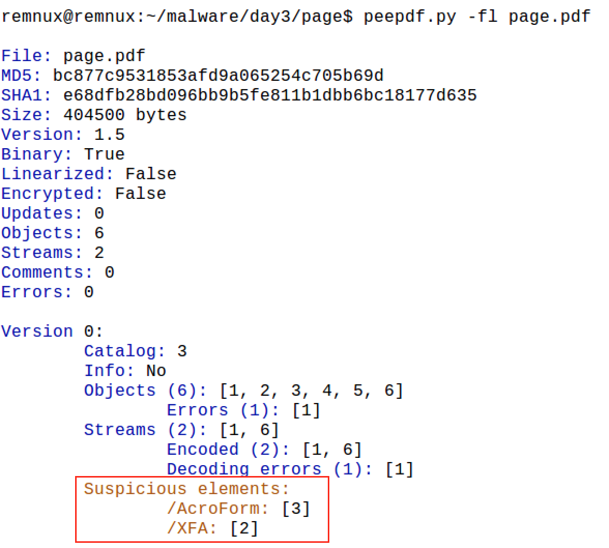
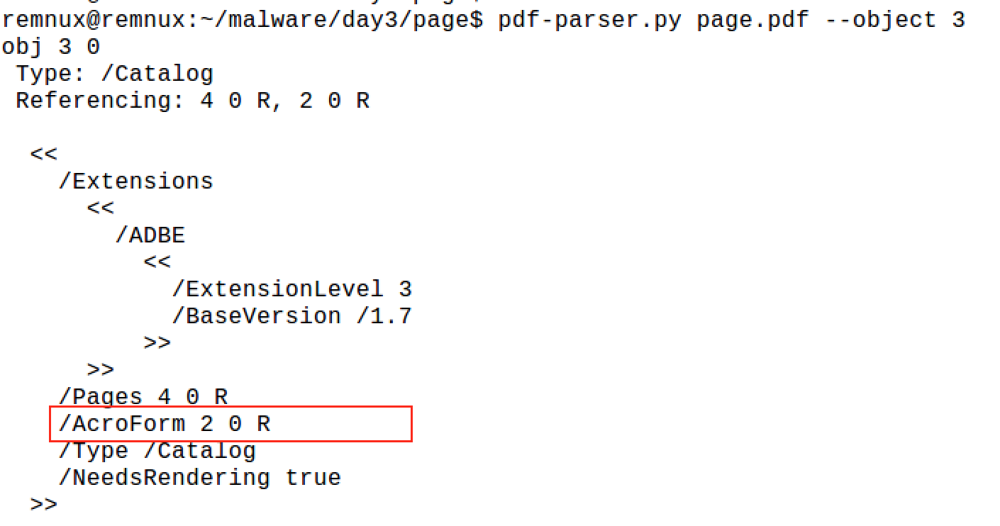
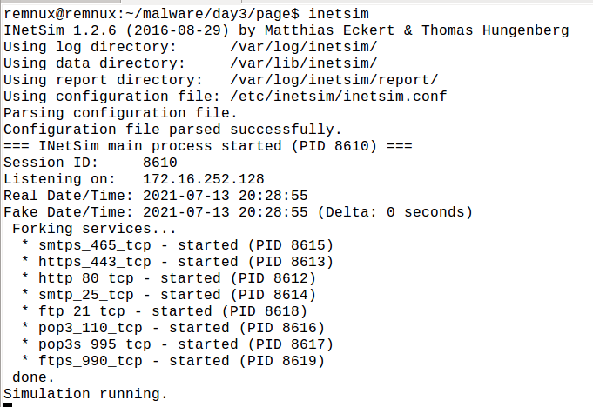
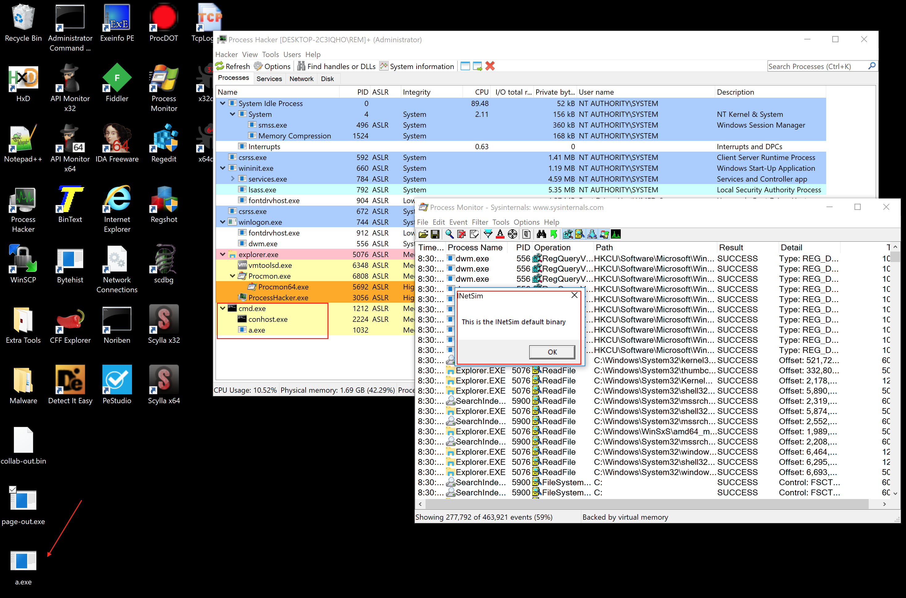
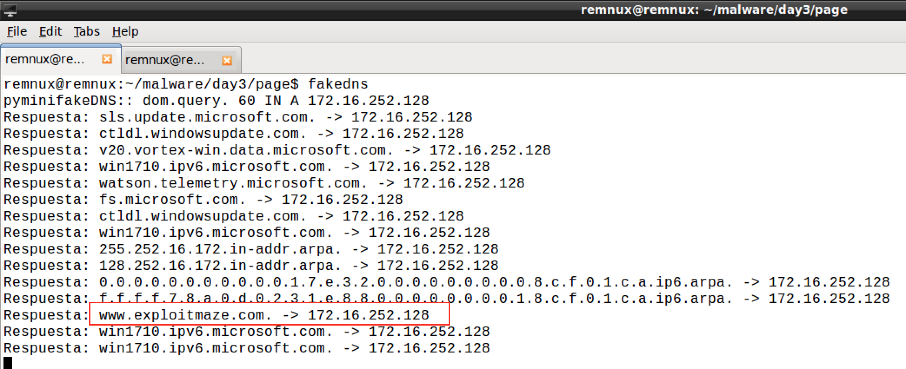

# Lab 3.7: Examining page.pdf Using pdf‐parser.py, shellcode2exe.py, and Other Tools

- [Lab 3.7: Examining page.pdf Using pdf‐parser.py, shellcode2exe.py, and Other Tools](#lab-37-examining-pagepdf-using-pdfparserpy-shellcode2exepy-and-other-tools)
  - [Objectives](#objectives)
  - [Steps](#steps)
  - [1 - Initial analysis of page.pdf](#1---initial-analysis-of-pagepdf)
  - [2 - Use pdf-parser.py to locate and examine the objects](#2---use-pdf-parserpy-to-locate-and-examine-the-objects)
  - [3 - Use pdf-parser.py to decode and extract content of object 1, saving it as page.txt](#3---use-pdf-parserpy-to-decode-and-extract-content-of-object-1-saving-it-as-pagetxt)
  - [4 - Use base64dump.py to extract and decode the shellcode from page.txt, and save as page-out.bin](#4---use-base64dumppy-to-extract-and-decode-the-shellcode-from-pagetxt-and-save-as-page-outbin)
  - [5 - Use shellcode2exe.py to generate a PE file page-out.exe](#5---use-shellcode2exepy-to-generate-a-pe-file-page-outexe)
  - [6,7 - Transfer the EXE to Windows and do a behavioral analysis using fakedns and iNetSim](#67---transfer-the-exe-to-windows-and-do-a-behavioral-analysis-using-fakedns-and-inetsim)
  - [8 - Emulate page-out.bin using scdbg](#8---emulate-page-outbin-using-scdbg)

---

## Objectives

- Reinforce the use of `pdf‐parser.py` and `base64dump.py` for analyzing PDF files.
- Gain familiarity with using `shellcode2exe.py` for generating PE files out of shellcode.
- Experiment with behavioral and code analysis techniques for examining shellcode.

<br/>

---

## Steps

1. Perform initial analysis of `page.pdf` using `pdfid.py` and `peepdf.py` to locate suspicious elements.
2. Use `pdf‐parser.py` to locate and examine the objects that incorporate forms.
3. Use `pdf‐parser.py` to decode and extract contents of object 1, saving the stream to the file named page.txt.
4. Use `base64dump.py` to extract and decode shellcode from `page.txt`, saving it as the binary file named `page‐out.bin`.
5. Use `shellcode2exe.py` to generate a PE file named `page‐out.exe` out of `page‐out.bin`.
6. Use SFTP to transfer `page‐out.bin` and `page‐out.exe` to the Windows REM Workstation.
7. Use behavioral analysis with the help of **fakedns** and **INetSim** to confirm that the shellcode exhibits characteristics of a downloader.
8. If there is time, emulate the execution of shellcode in the `page‐out.bin` file using scdbg on the Windows REM Workstation.

<br/>

---

## 1 - Initial analysis of page.pdf

First unzip the file:

```
unzip page.zip -d page
cd page
```

  

<br/>

Get the file hashes of `page.pdf`:

```
md5sum page.pdf; sha256sum page.pdf
```

- Result:

```
bc877c9531853afd9a065254c705b69d  page.pdf
7daa9ccc6e527a5df87fe8d921a51910ac2429669923d92652b36a9ba2e6780c  page.pdf
```

<br/>

First use `pdfid.py` to understand the objects in the PDF file:

```
pdfid.py page.pdf
```

  

- No JavaScript
- AcroForm = 1
- XFA = 1

<br/>

Then use `peepdf.py` to examine the PDF:

```
peepdf.py -fl page.pdf
```

  

- It marks the `/AcroForm` (Object 3) and `/XFA` (Object 2) elements suspicious

<br/>

---

## 2 - Use pdf-parser.py to locate and examine the objects 

Knowing the suspicious objects ID are `2` and `3` respectively, we can extract them using `pdf-parser.py`:

```
pdf-parser.py page.pdf --object 3
```

  

<br/>

```
pdf-parser.py page.pdf --object 2
```

  

<br/>

```
pdf-parser.py page.pdf --object 1
```

  

- We find an encoded stream in object 1

<br/>

---

## 3 - Use pdf-parser.py to decode and extract content of object 1, saving it as page.txt

Use the following command to decode and extract object 1:

```
pdf-parser.py page.pdf --object 1 --filter --raw -d page.txt
less page.txt
```

  

- Within the code, it is found that a variable is named `shellcode`, which is highly suspicious
- It is encoded using `\u`

<br/>

---

## 4 - Use base64dump.py to extract and decode the shellcode from page.txt, and save as page-out.bin

The `base64dump.py` to extract and decode the shellcode:

```
base64dump.py page.txt -e bu
```

  

- The object with ID 3 looks suspicious
  - \u9090 = NOP
  - Size is the largest

<br/>

Next:

```
base64dump.py page.txt -e bu -s 3 -S
```

- `-S` show ASCII strings
- `-bu` backslash unicode

  

- The shellcode contains:
  - A windows command `cmd.exe /c a.exe`
  - A url `http://www.exploitmaze.com/01akin.exe`

<br/>

To extract the whole object:

```
base64dump.py page.txt -e bu -s 3 -d > page-out.bin
```

<br/>

---

## 5 - Use shellcode2exe.py to generate a PE file page-out.exe

Use the following command:

```
shellcode2exe.py page-out.bin
```

  

<br/>

---

## 6,7 - Transfer the EXE to Windows and do a behavioral analysis using fakedns and iNetSim

On **REMnux**, setup a python SimpleHTTPServer:

```
sudo python -m SimpleHTTPServer 80
```

<br/>

Also, run `fakedns` and `inetsim` on **REMnux**:

```
fakedns
```

  

<br/>

```
inetsim
```

  


<br/>

Download the EXE on Windows.

Run **Process Hacker** and **Process Monitor** on Windows.

  

- As expected, it creates a file called `a.exe`
- It also runs `a.exe` - which is `iNetSim` default application in this case
- This malware is a Downloader

  

<br/>

---

## 8 - Emulate page-out.bin using scdbg

Load `page-out.exe` into scdbg:

  

- Use `URLDownloadToFileA` API to download file from `http://www.eploitmaze.com/01akin.exe` and save as `a.exe`
- Use `WinExec` to run `cmd.exe /c a.exe`

<br/>

---