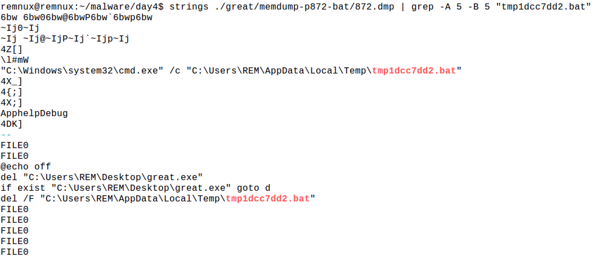
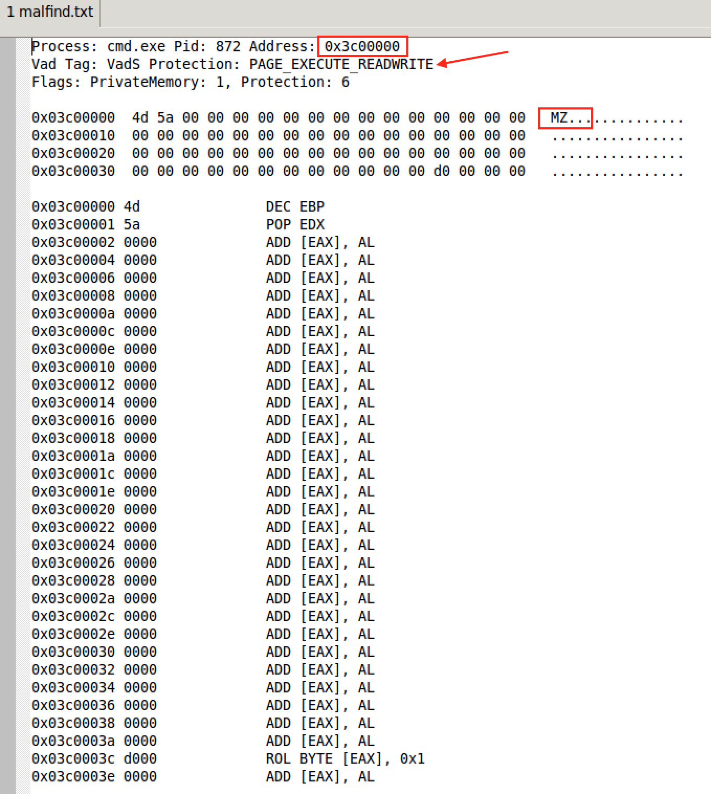
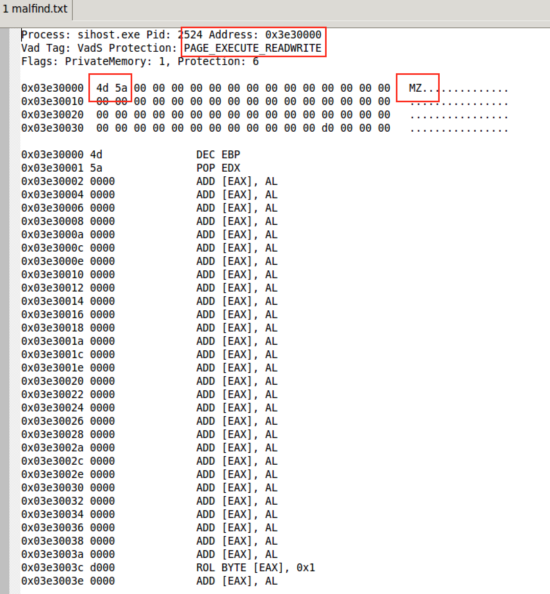
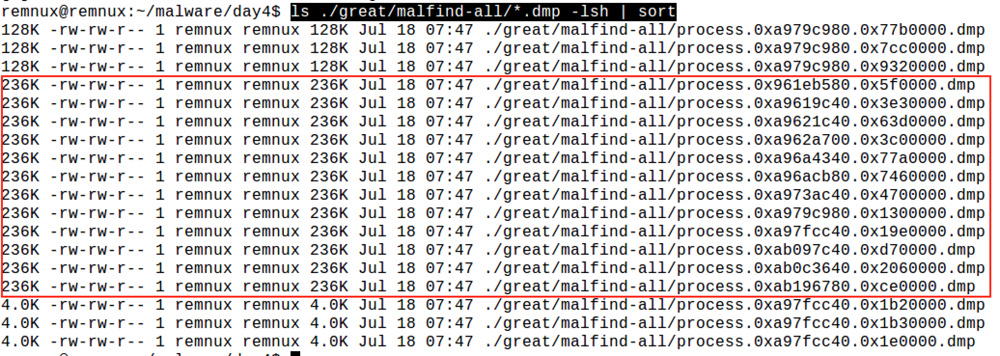
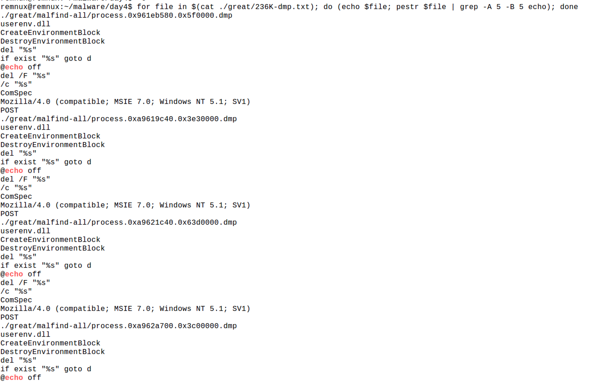

# Lab 4.10: Examining Code Injection Artifacts in great.vmem

- [Lab 4.10: Examining Code Injection Artifacts in great.vmem](#lab-410-examining-code-injection-artifacts-in-greatvmem)
  - [Objectives](#objectives)
  - [Steps](#steps)
  - [1 - Set the VOLATILITY_PROFILE environment variable on REMnux to match the Volatility profile appropriate for analyzing the great.vmem file](#1---set-the-volatility_profile-environment-variable-on-remnux-to-match-the-volatility-profile-appropriate-for-analyzing-the-greatvmem-file)
  - [2 - Use Volatility to extract contents of the suspicious batch file that was executed on the great.vmem system](#2---use-volatility-to-extract-contents-of-the-suspicious-batch-file-that-was-executed-on-the-greatvmem-system)
  - [3,4 - Use Volatility's malfind plugin to examine great.vmem to locate injected code](#34---use-volatilitys-malfind-plugin-to-examine-greatvmem-to-locate-injected-code)

---

## Objectives

- Learn essential aspects of using Volatility for memory forensics.
- Understand how to specify the right Volatility profile for a memory image file.
- Learn to examine processes represented in the memory image by using `pslist` and `cmdline` plugins.
- Learn the benefits of the dumping process's virtual memory using the `memdump` plugin.
- Learn to use the `malfind` plugin to discover injected code.
- Reinforce code injection concepts from the perspective of memory forensics.

<br/>

---

## Steps

1. Set the `VOLATILITY_PROFILE` environment variable on REMnux to match the Volatility profile appropriate for analyzing the `great.vmem` file.
2. Use Volatility to extract contents of the suspicious batch file that was executed on the `great.vmem` system.
3. Use Volatility's `malfind` plugin to examine `great.vmem` to locate injected code.
4. Compare the fuzzy hash of one of the 236K files that malfind extracted from `great.vmem` to that of `great.exe`, confirming that the files are very similar.

<br/>

---

## 1 - Set the VOLATILITY_PROFILE environment variable on REMnux to match the Volatility profile appropriate for analyzing the great.vmem file

On **REMnux**, first use `vol.py` with `kdbgscan` to scan the memory image file for the profile to be used:

```
vol.py -f great.vmem kdbgscan
```

  

- Possible profiles:
  - Win10x86_10586
  - Win10x86
  - Win81U1x86
  - Win8SP1x86
  - Win8SP0x86

<br/>

Then try them one by one with `--profile=<> pslist`

```
vol.py -f great.vmem --profile=Win10x86_10586 pslist
```

  

- Not working

<br/>

```
vol.py -f great.vmem --profile=Win10x86 pslist
```

  

- The command runs successfully

<br/>

Therefore the correct memory profile to be used is `Win10x86`.

To avoid typing the profile name repeatedtively, we can export it as an env:

```
export VOLATILITY_PROFILE=Win10x86
```

<br/>

Then we can avoid the `--profile` argument:

```
vol.py -f great.vmem pslist
```

  

<br/>

---

## 2 - Use Volatility to extract contents of the suspicious batch file that was executed on the great.vmem system

First try using `cmdline` plugin to look into the command line of the processes:

```
vol.py -f great.vmem cmdline
```

  

- There is a suspicious `BAT` file
  - PID = `872`
  - CMDLINE = `"C:\Windows\system32\cmd.exe" /c "C:\Users\REM\AppData\Local\Temp\tmp1dcc7dd2.bat"`

<br/>

Then we can use `memdump` plugin to dump the virtual memory of the process out:

```
mkdir -p ./great/memdump-p872-bat
vol.py -f great.vmem memdump -p 872 -D ./great/memdump-p872-bat/
```

  

<br/>

Then we can inspect the dump file using `strings`:

```
strings ./great/memdump-p872-bat/872.dmp | grep -A 5 -B 5 "tmp1dcc7dd2.bat"
```

  

- The following content is found:

```
@echo off
del "C:\Users\REM\Desktop\great.exe"
if exist "C:\Users\REM\Desktop\great.exe" goto d
del /F "C:\Users\REM\AppData\Local\Temp\tmp1dcc7dd2.bat"
```

<br/>

We can also use `strings --encoding=l` to reveal the UNICODE strings:

```
strings --encoding=l ./great/memdump-p872-bat/872.dmp | grep -A 5 -B 5 "tmp1dcc7dd2.bat"
```

  

<br/>

---

## 3,4 - Use Volatility's malfind plugin to examine great.vmem to locate injected code

`malfind` is a Volatility plugin to examin the Virtual Address Descriptor (VAD) tree, which tracks memory pages allocated to a process.

<br/>

```
mkdir -p ./great/malfind
vol.py -f great.vmem malfind -p 872 -D ./great/malfind/ > ./great/malfind/malfind.txt
scite ./great/malfind/malfind.txt &
```

  

  

- `MZ` indicates a Windows PE
- `PAGE_EXECUTE_READWRITE` is a property commonly seen in Code Injection
- The virtual address is `0x3c00000`

<br/>

We can also check all of the processes:

```
mkdir -p ./great/malfind-all
vol.py -f great.vmem malfind -D ./great/malfind-all/ > ./great/malfind-all/malfind.txt
scite ./great/malfind-all/malfind.txt &
```

  

- Similar result to that of `cmd.exe`
  - PID: 2524
  - ProcessName: sihost.exe
  - Virtual Address: 0x3e30000
- Similar result for many processes as well

<br/>

We can check the size of the `.DMP` files:

```
ls ./great/malfind-all/*.dmp -lsh | sort
```

  

- Many of them are of the same size
- This could be an indicator of a similar code getting injected into different processes

<br/>

To save the file path of the dmp of 236K, we can do:

```
ls ./great/malfind-all/*.dmp -lsh | grep 236K | cut -d ' ' -f 10 > ./great/236K-dmp.txt
```

<br/>

Then get the strings using `pestr`:

```
for file in $(cat ./great/236K-dmp.txt); do (echo $file; pestr $file | grep -A 5 -B 5 echo); done
```

  


<br/>

To further confirm they are nearly identical, we can use `ssdeep` to calculate the **fuzzhash** of the dump files:

```
ls ./great/malfind-all/*.dmp -lsh | grep 236K | cut -d ' ' -f 10 > ./great/236K-dmp.txt
for file in $(cat ./great/236K-dmp.txt); do ssdeep $file; done
```

  


---