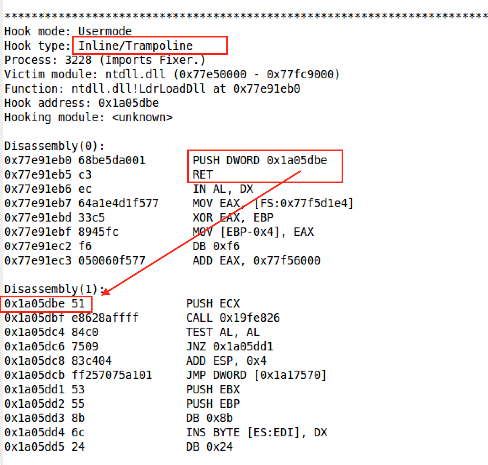
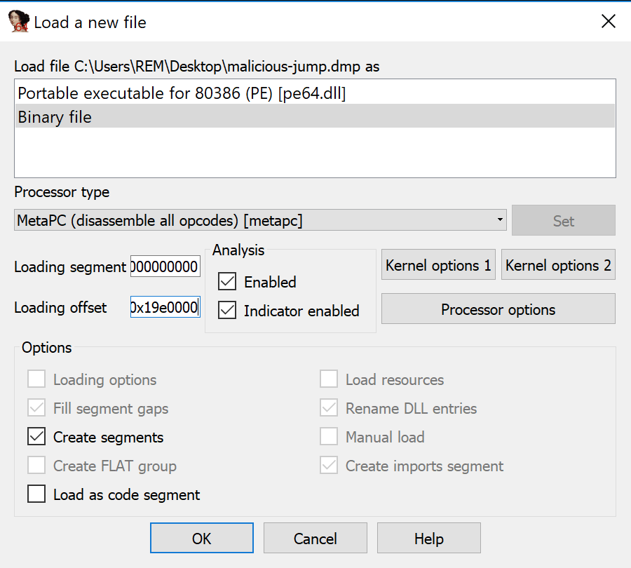
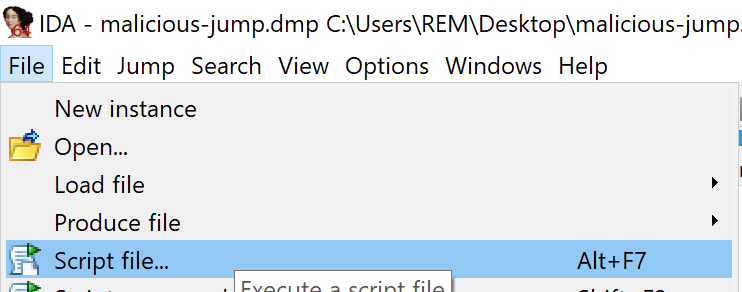
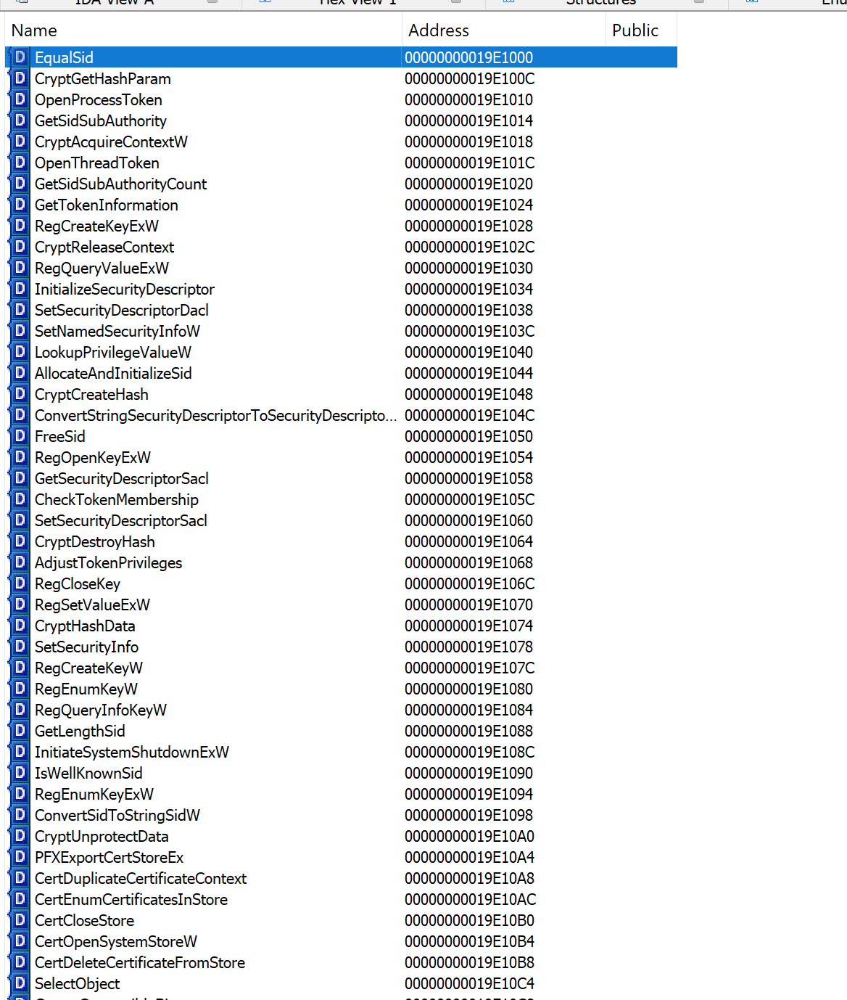

# Lab 4.11: Examining API Hooking Artifacts in great.vmem

- [Lab 4.11: Examining API Hooking Artifacts in great.vmem](#lab-411-examining-api-hooking-artifacts-in-greatvmem)
  - [Objectives](#objectives)
  - [Steps](#steps)
  - [1,2 - Use the Volatility plugin apihooks to locate hooks in process 3228, captured in the great.vmem file](#12---use-the-volatility-plugin-apihooks-to-locate-hooks-in-process-3228-captured-in-the-greatvmem-file)
  - [3 - Determine which of the files generated by malfind in the previous exercise corresponds to the code injected into process 3228](#3---determine-which-of-the-files-generated-by-malfind-in-the-previous-exercise-corresponds-to-the-code-injected-into-process-3228)

---

## Objectives

- Learn to use the Volatility plugin apihooks to examine API hooks.
- Reinforce API hooking concepts from the perspective of memory forensics.

<br/>

---

## Steps

1. Use the Volatility plugin `apihooks` to locate hooks in process 3228, captured in the `great.vmem` file.
2. Examine the Inline/Trampoline hook reported by apihooks to determine which function was hooked and where the corresponding malicious code might reside.
3. Determine which of the files generated by `malfind` in the previous exercise corresponds to the code injected into process 3228.

<br/>

---

## 1,2 - Use the Volatility plugin apihooks to locate hooks in process 3228, captured in the great.vmem file

Use the `apihooks` plugin to scan the process 3228. Focus on the inline hook:

```
vol.py -f great.vmem apihooks -p 3228 --skip-kernel > apihooks.txt
scite apihooks.txt
```

  

- `PUSH --> RET` pattern reveals a Tricky Jump
- This output determines `ntdll.dll` in memory of PID 3228 has been modified, and the DLL's function `LdrLoadDll` has been hooked
- The function will end up jumping to and execuing the probably malicious code at `0x1a05dbe` in the process 3228. This offset indicates the locaiton of the malicious code htat was injected in to this process

<br/>

There is also another similar hook:

  

- The function `NtCreateUserProcess` is hooked
- The malicious code looks starting at `0x1a05c93`

<br/>

- With these 2 information, the address range where the jump lead is relatively small and is around `0x1a00000:0x1a05c93`
- We may look at the memory region that encapsulates these addresses

<br/>

---

## 3 - Determine which of the files generated by malfind in the previous exercise corresponds to the code injected into process 3228

First use `pslist` to get the virtual offset of the process 3228:

```
vol.py -f great.vmem pslist -p 3228
```

  

- The offset is `0xa97fcc40`

<br/>

Then we can try to find the `DMP` file with offset `0xa97fcc40` in the `malfind` outputs:

```
ls -slh ./great/malfind-all/process.0xa97fcc40*
```

  

- We have 4 files match found
- In our `apihooks` result, the injected code is near `0x1a00000`
  - `process.0xa97fcc40.0x19e0000.dmp` begins with `0x19e0000` which falls into the potential malicious code range

<br/>

Make a copy of this file:

```
cp ./great/malfind-all/process.0xa97fcc40.0x19e0000.dmp ./great/malicious-jump.dmp
```

<br/>

Transfer this to the Windows machine and open it on IDA as a binary.

- Loading offset = `0x19e0000`

  

<br/>

  

- 32-bit mode

<br/>

Next we have to rebuild the import table so we can use it in IDA. First on REMnux, use `impscan` to identify API call names:

```
vol.py -f great.vmem impscan -p 3228 -b 0x19e0000 --output=idc > ./great/great.idc
scite ./great/great.idc &
```

<br/>

Add the following lines at the beginning of `great.idc`:

```
#include <idc.idc>
static main(void) {

```

<br/>

Add this at the end of `great.idc`:

```

}
```

<br/>

Then transfer this to Windows machine. On IDA, `File > Script file`:

  


<br/>

Then open the `Name` Subview:

  

  

<br/>

---