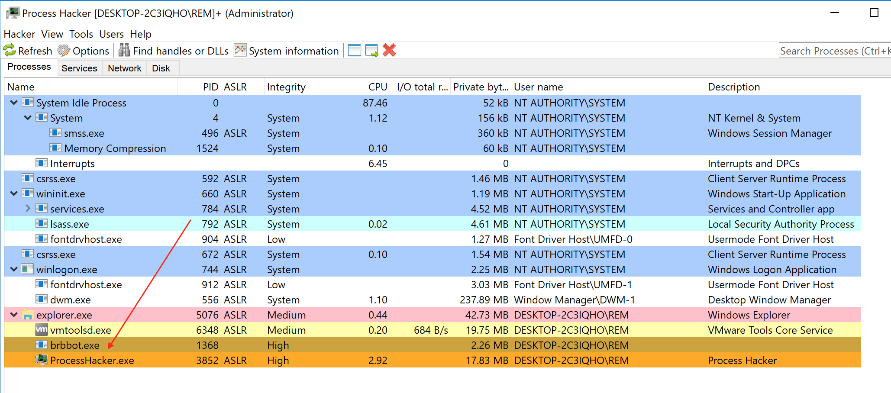
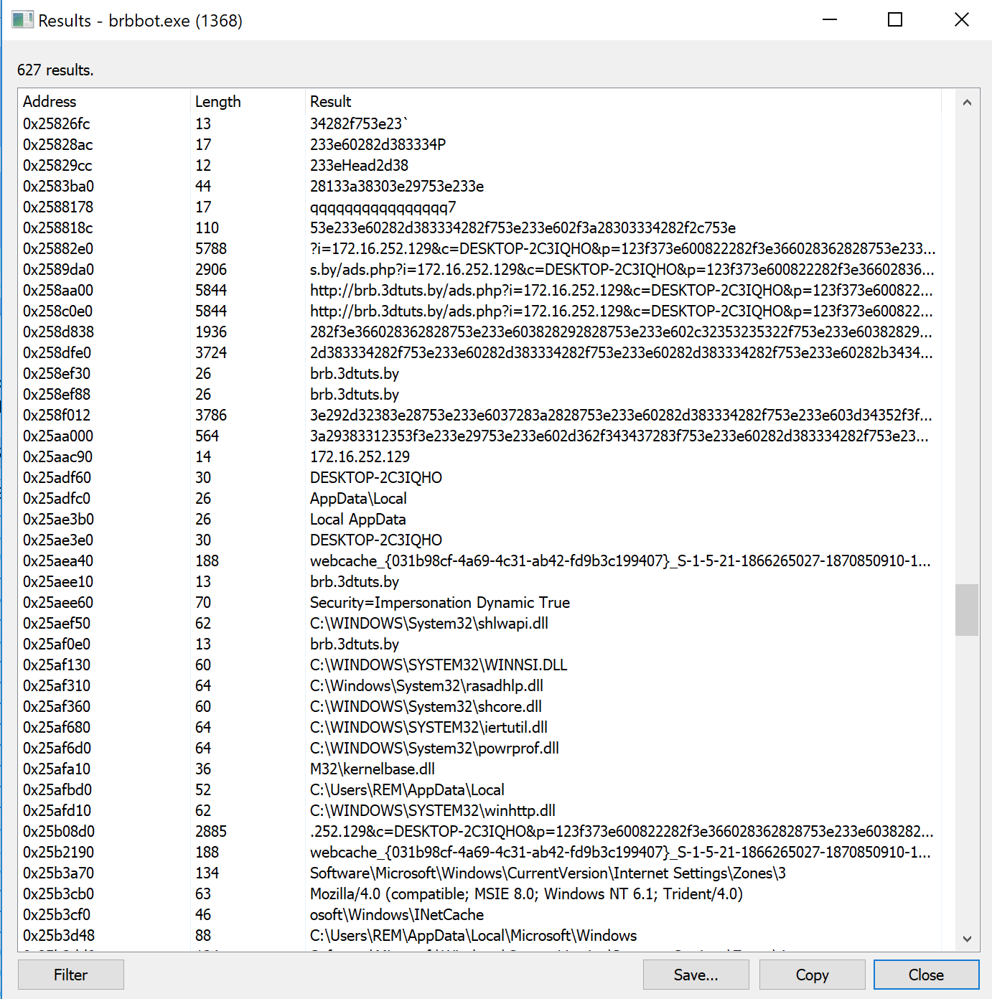
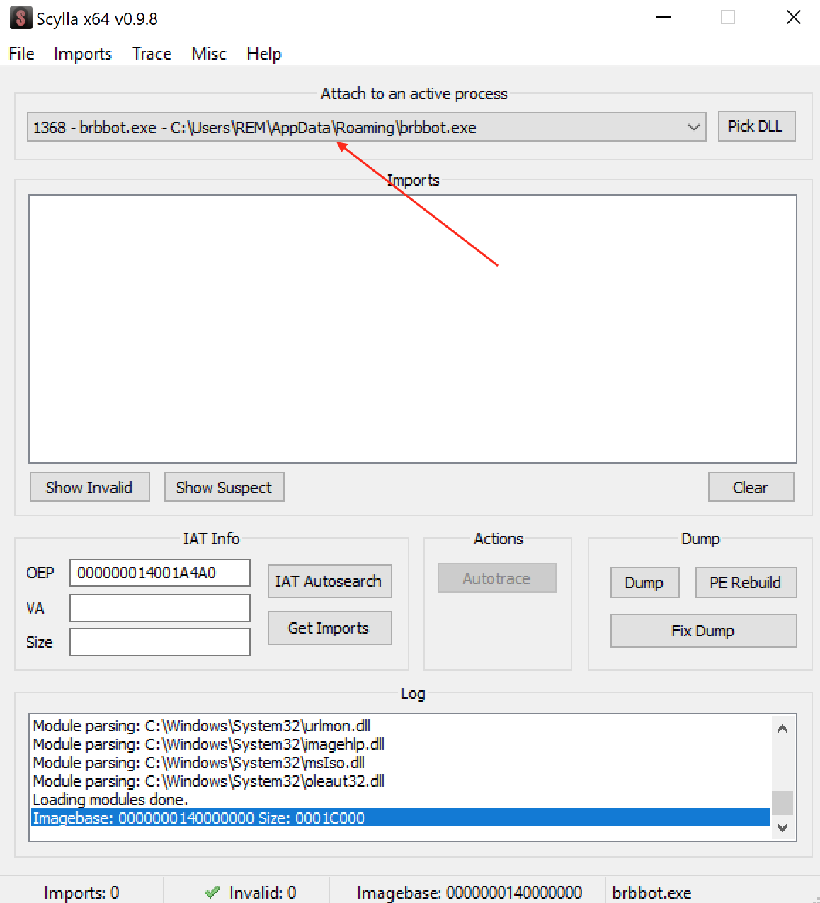
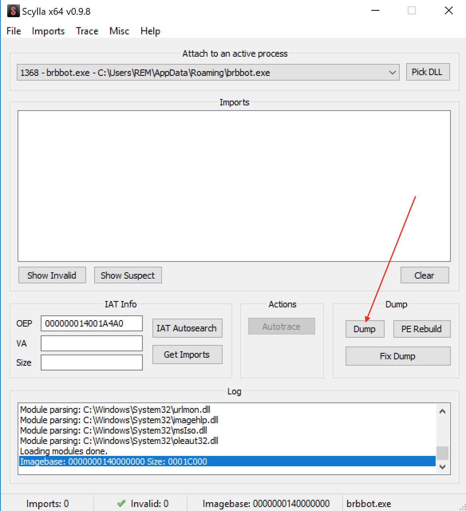
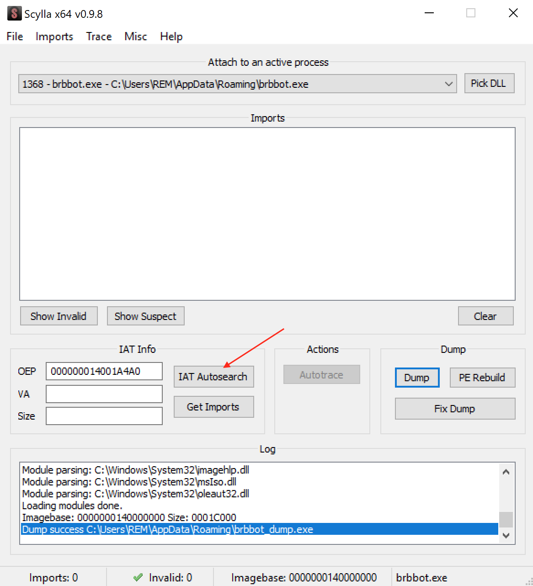
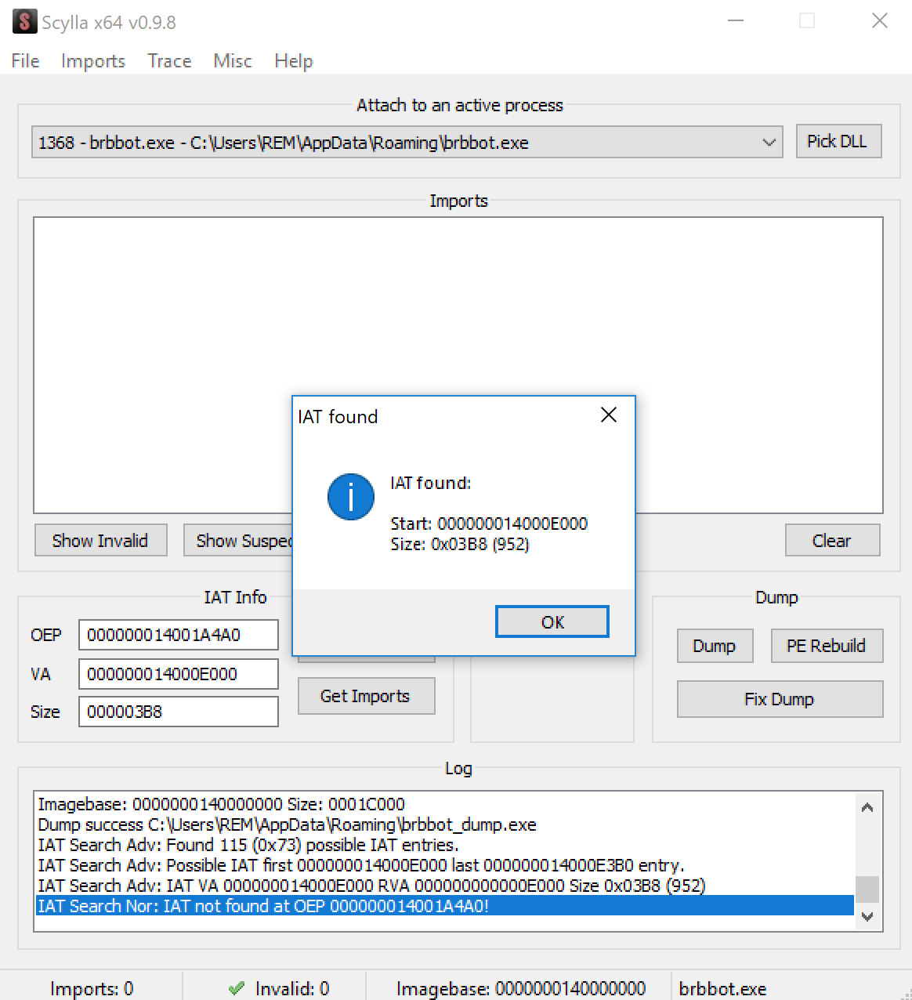
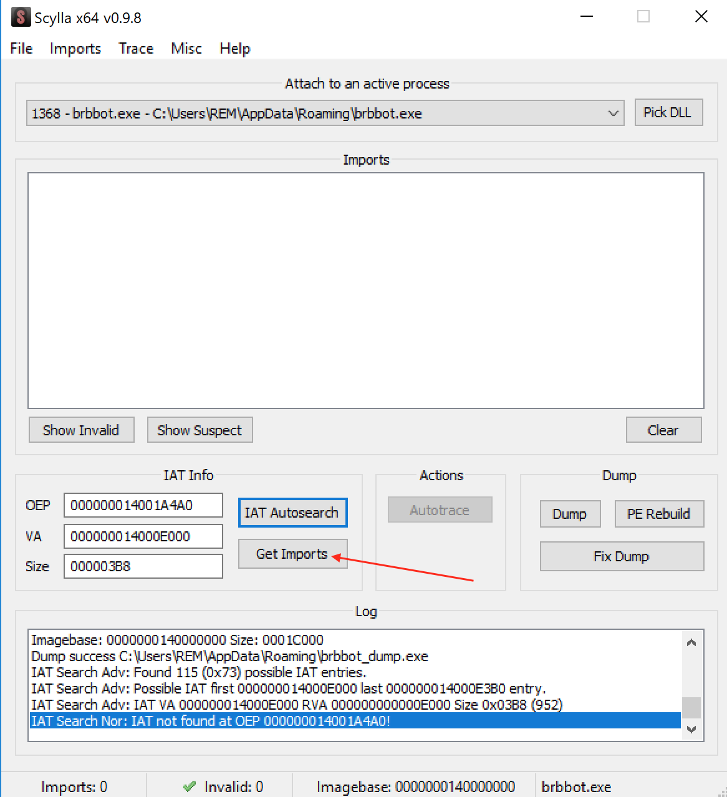
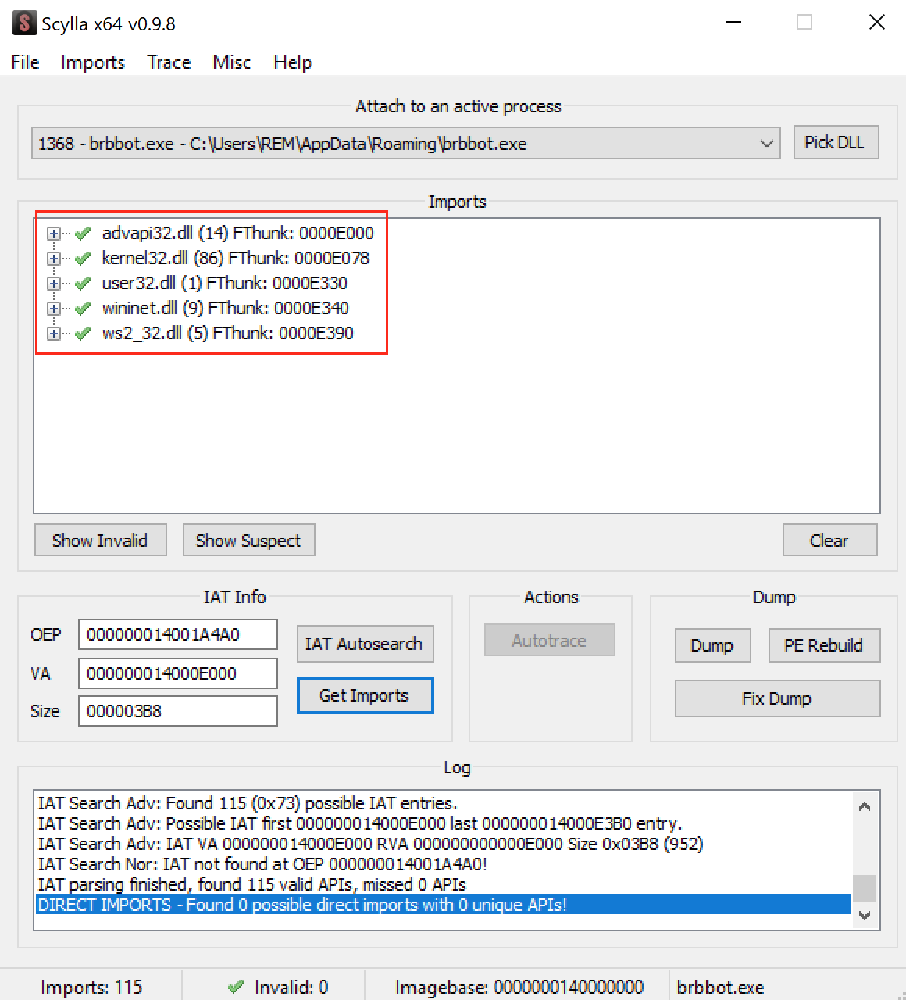
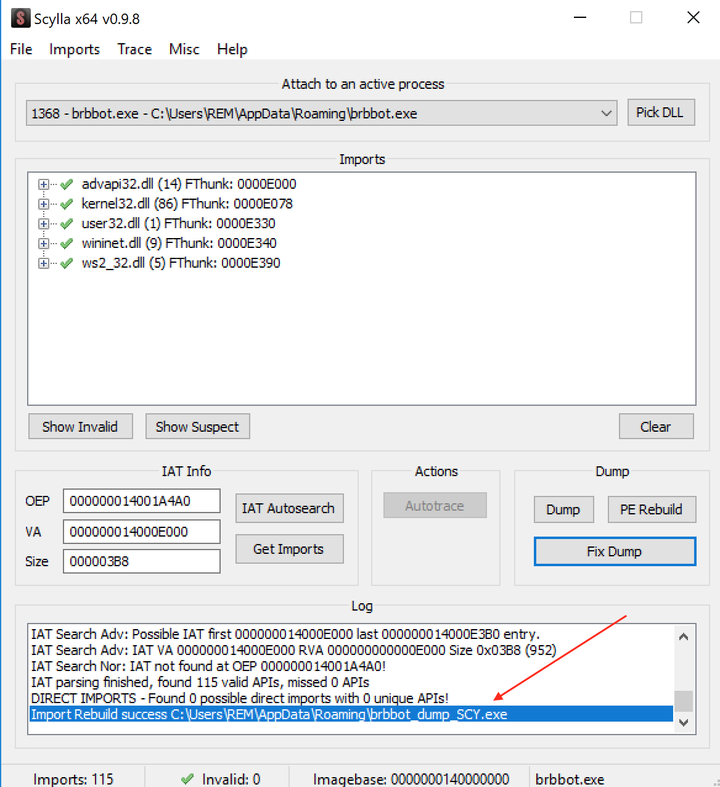
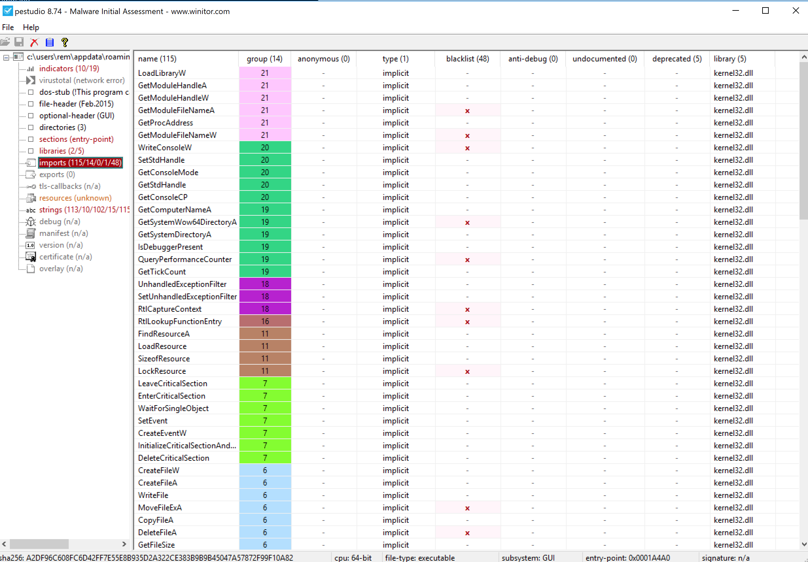

# Lab 4.2: Dumping and Fixing brbbot.exe Using Scylla

- [Lab 4.2: Dumping and Fixing brbbot.exe Using Scylla](#lab-42-dumping-and-fixing-brbbotexe-using-scylla)
  - [Objectives](#objectives)
  - [Steps](#steps)
  - [1 - Try to use UPX on Windows to unpack brbbot.exe](#1---try-to-use-upx-on-windows-to-unpack-brbbotexe)
  - [2 - Use setdllcharacteristics to disable Dynamic Base](#2---use-setdllcharacteristics-to-disable-dynamic-base)
  - [3 - Infect the Windows machine with brbbot.exe](#3---infect-the-windows-machine-with-brbbotexe)
  - [4 - Dump brbbot.exe using Scylla x64](#4---dump-brbbotexe-using-scylla-x64)
  - [5 - Use Scylla x64 to fix the IAT](#5---use-scylla-x64-to-fix-the-iat)
  - [6 - Examine the dumped and fixed file in PeStudio](#6---examine-the-dumped-and-fixed-file-in-pestudio)

---

## Objectives

- Learn to unpack malware by dumping it from memory using tools such as **Scylla**.

<br/>

---

## Steps

1. Attempt using UPX on the Windows REM Workstation to unpack `brbbot.exe`.
2. Use setdllcharacteristics to designate brbbot.exe as being incompatible with ASLR.
3. Infect the Windows REM Workstation with brbbot.exe.
4. Dump the brbbot.exe using Scylla x64.
5. Use Scylla x64 to fix the IAT of the dumped brbbot.exe file.
6. Examine the dumped and fixed file in PeStudio.

<br/>

---

## 1 - Try to use UPX on Windows to unpack brbbot.exe

Using `cmd.exe`, navigate to `%APPDATA%` and run:

```
upx -d brbbot.exe
```

  

- Unsuccessful - It is modified / hacked / protected

<br/>

---

## 2 - Use setdllcharacteristics to disable Dynamic Base

Continuing using the CMD in #1, run:

```
setdllcharacteristics -d brbbot.exe
```

  

- As shown, the `DYNAMIC_BASE` flag has changed from 1 to 0.

<br/>

---

## 3 - Infect the Windows machine with brbbot.exe

Double click the shortcut on the Desktop created in Lab 4.1.

Run **Process Hacker** to confirm it is running:

  

<br/>

Inspect the Memory String by navigating to `Memory > Strings`:

  

- Some artifacts and suspicious URL are found


<br/>

---

## 4 - Dump brbbot.exe using Scylla x64

Launch **Scylla x64** and pick the active process `brbbot.exe`:

  

<br/>

Dump it by clicking `Dump`:

  

<br/>

  

<br/>

---

## 5 - Use Scylla x64 to fix the IAT

Click `IAT Autosearch`:

  

  

<br/>

Then click `Get Imports`:

  

  

<br/>

Finally click `Fix Dump`:

  

  

<br/>

---

## 6 - Examine the dumped and fixed file in PeStudio

Open `brbbot_dump_SCY.exe` on **PeStudio**. Inspect the sections:

  

- Raw size of `NPX0` is not 0 now

<br/>

Inspect the imports:

  

- Many more imports compared with before

<br/>

---