# Lab 4.3: Unpacking brbbot.exe by Using x64dbg and OllyDumpEx

- [Lab 4.3: Unpacking brbbot.exe by Using x64dbg and OllyDumpEx](#lab-43-unpacking-brbbotexe-by-using-x64dbg-and-ollydumpex)
  - [Objectives](#objectives)
  - [Steps](#steps)
  - [1,2,3 - Load packed brbbot.exe into x64dbg and locate the end of the unpacker. Set a breakpoint and run. Then step into and arrive at the OEP.](#123---load-packed-brbbotexe-into-x64dbg-and-locate-the-end-of-the-unpacker-set-a-breakpoint-and-run-then-step-into-and-arrive-at-the-oep)
  - [4 - Confirm that you're looking at unpacked code by searching this region for referenced strings and intermodular calls.](#4---confirm-that-youre-looking-at-unpacked-code-by-searching-this-region-for-referenced-strings-and-intermodular-calls)
  - [5 - Use OllyDumpEx to dump the brbbot.exe process, which is paused at its OEP in x64dbg.](#5---use-ollydumpex-to-dump-the-brbbotexe-process-which-is-paused-at-its-oep-in-x64dbg)
  - [6 - Use the Scylla plugin in x64dbg to fix IAT in the dumped file.](#6---use-the-scylla-plugin-in-x64dbg-to-fix-iat-in-the-dumped-file)

---

## Objectives

- Learn to unpack malware by dumping it from x64dbg with the assistance of OllyDumpEx.

 

---

## Steps

1. Load the packed version of brbbot.exe from %AppData% in x64dbg and locate the likely end of the unpacker in the disassembler area of the tool.
2. Set a breakpoint at the end of the unpacker in brbbot.exe; then, run the specimen in x64dbg to reach this breakpoint.
3. Allow the specimen to execute the jump at the end of the unpacker so that it reaches and pauses at the OEP.
4. Confirm that you're looking at unpacked code by searching this region for referenced strings and intermodular calls.
5. Use **OllyDumpEx** to dump the `brbbot.exe` process, which is paused at its OEP in **x64dbg**.
6. Use the **Scylla** plugin in **x64dbg** to fix IAT in the dumped file.

 

---

## 1,2,3 - Load packed brbbot.exe into x64dbg and locate the end of the unpacker. Set a breakpoint and run. Then step into and arrive at the OEP.

Load `brbbot.exe` into `x64bdg`:

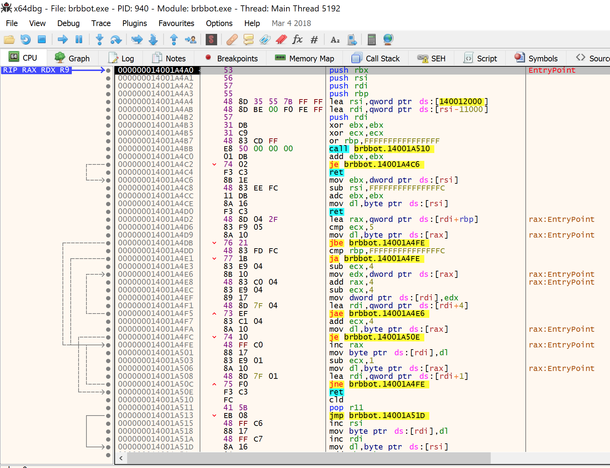  

 

Scroll down on the disassembled panel, until we find a bunch of `00 00` hex instruction:

  

 

Set a breakpoint at `14001A6EC` by hitting `F2`:

  

 

Then run the program by clicking the `Run` button:

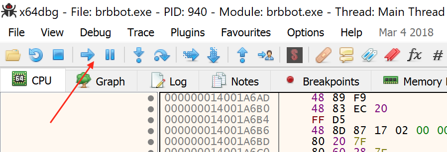  

 

  

- The RIP points at the end of the unpacker

 

To enter the unpacked code, single-step by hitting `F7`:

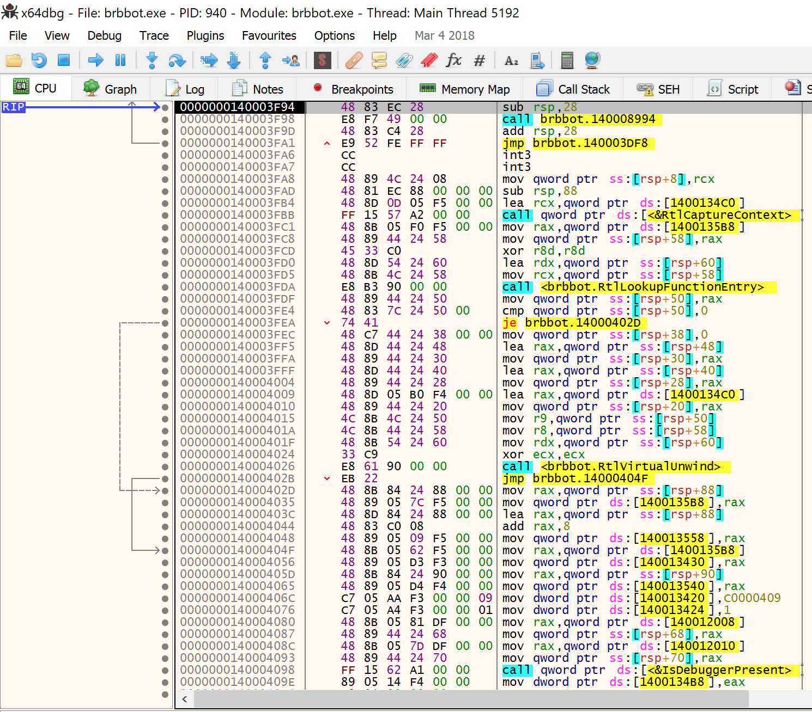  

- Now the `RIP` is at the OEP.

 

---

## 4 - Confirm that you're looking at unpacked code by searching this region for referenced strings and intermodular calls.

Right click on the disassembled panel and click `Search for > Current Region > String references`:

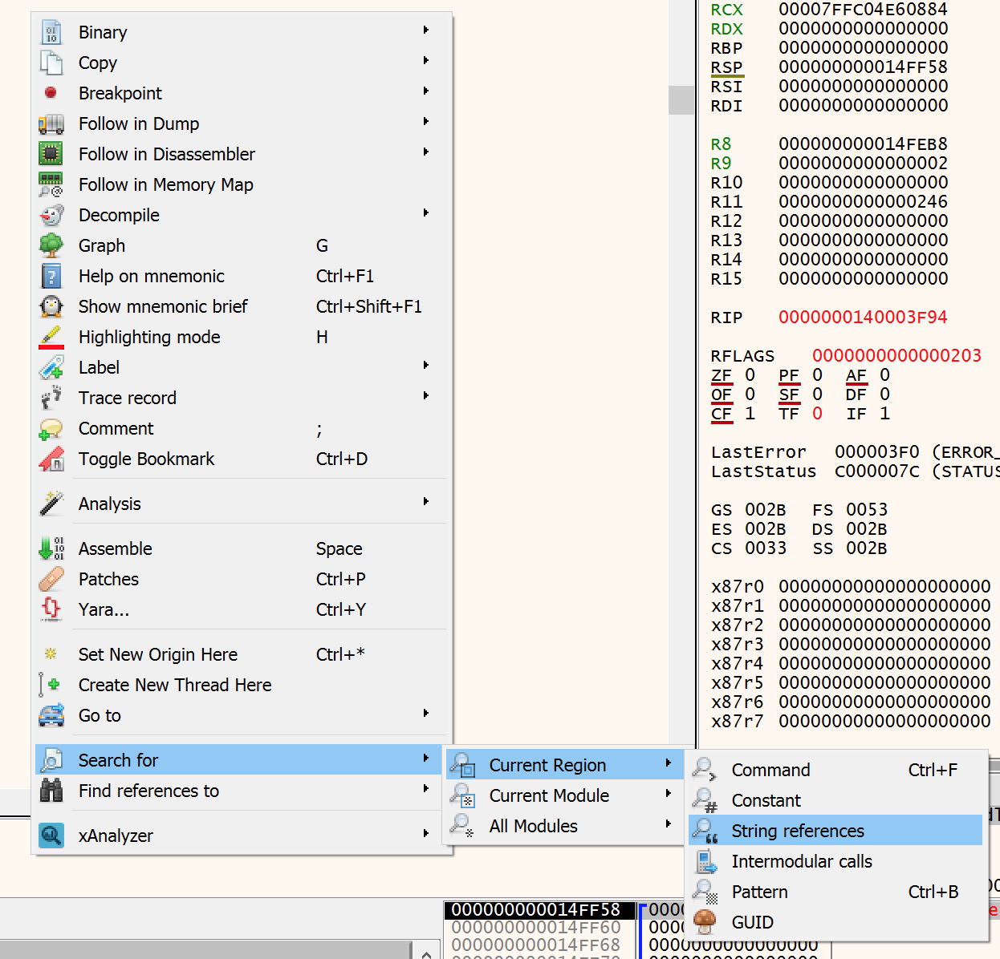  

 

Many more strings (probably artifacts) can be found as compared to before:

  

 

Go back to the CPU tab and again right click on the dissembled panel and click `Search for > Current Region > Intermodular calls`:

  

 

There are many more API calls as compared when unpacked:

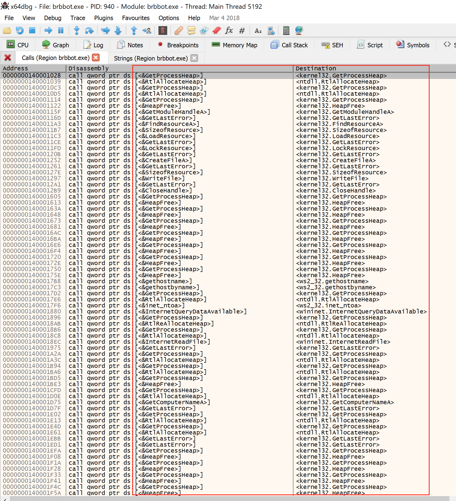  

 

These 2 signatures indicate that it is now unpacked.

 

---

## 5 - Use OllyDumpEx to dump the brbbot.exe process, which is paused at its OEP in x64dbg.

Click `Plugins > OllyDumpEx > Dump process`:

  

 

Click `Get EIP as OEP`:

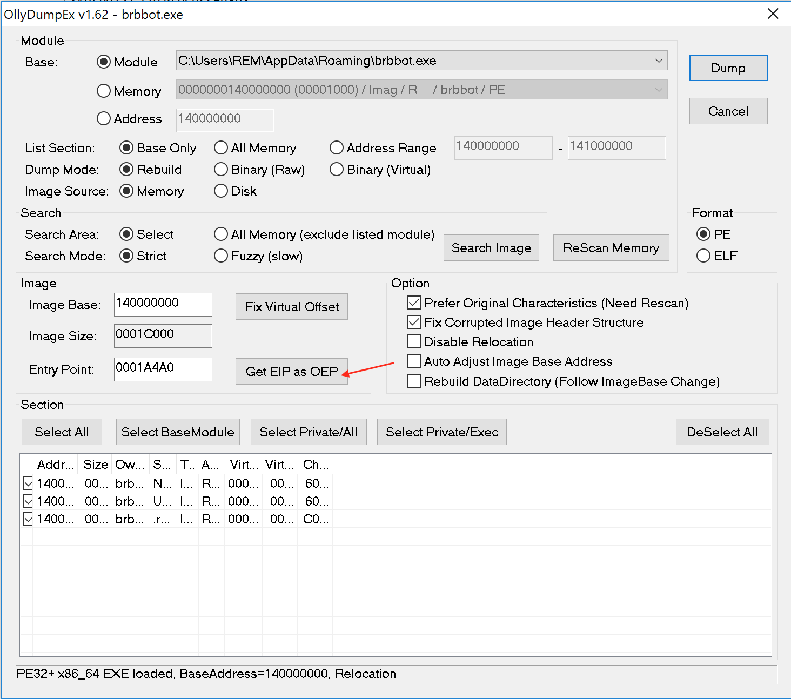  

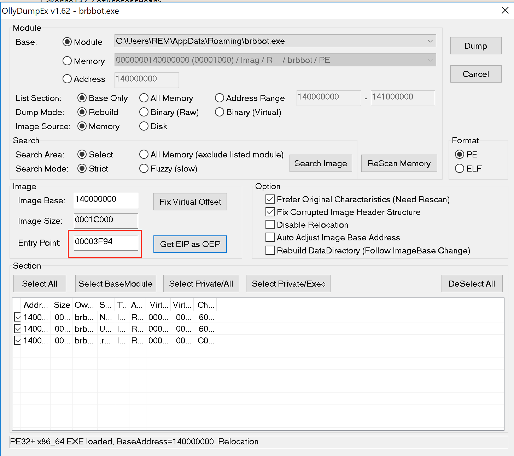  

 

Then to prevent memory access violation, double-click `UPX1` and enable the `MEM_WRITE` flag:

  

 

Start dumping the process by clicking `Dump` - save as `brbbot_dump_64.exe`:

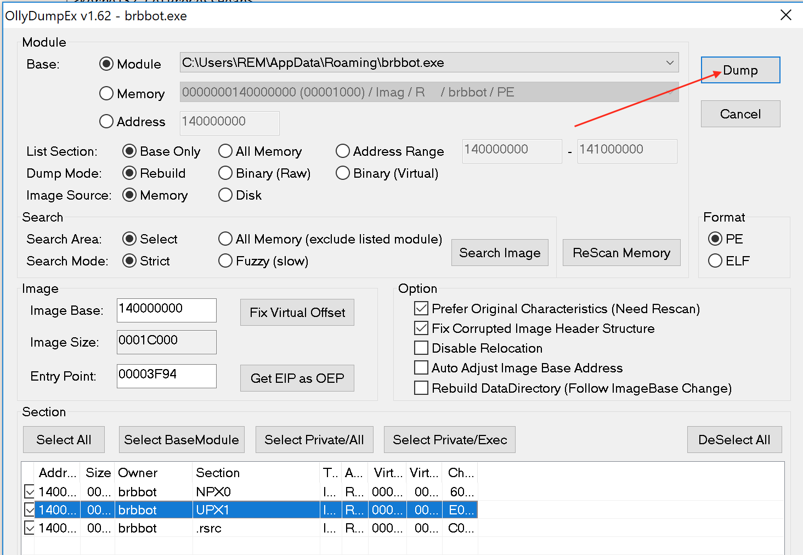  

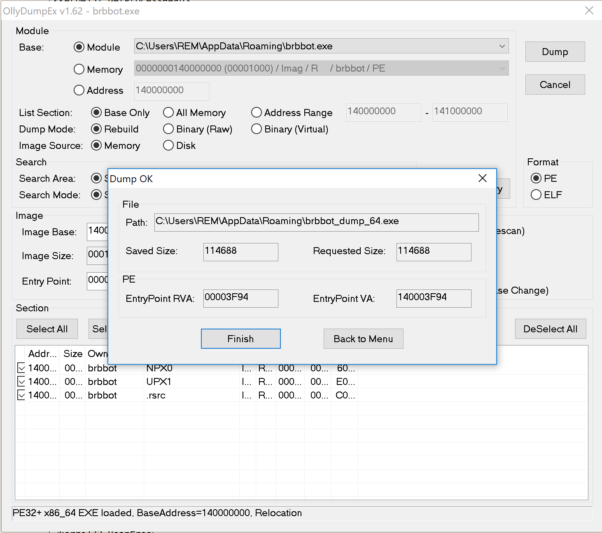  

 

---

## 6 - Use the Scylla plugin in x64dbg to fix IAT in the dumped file.

Click `Plugins > Scylla`:

  

 

Click `IAT Autosearch`, then `Get Imports`, and `Fix Dump` finally:

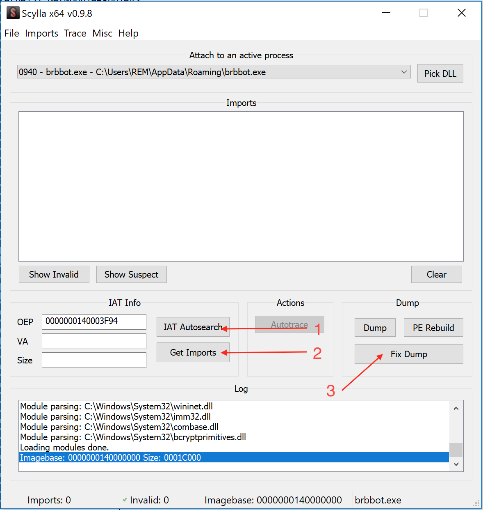  

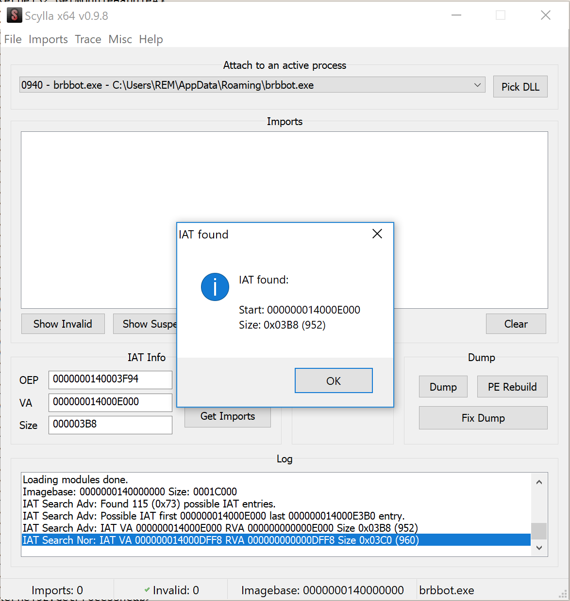  

  

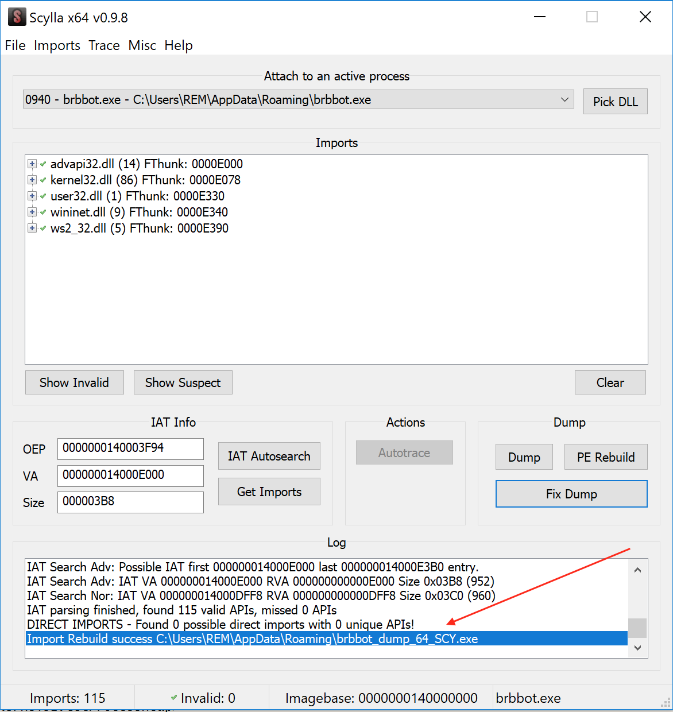  

 

---