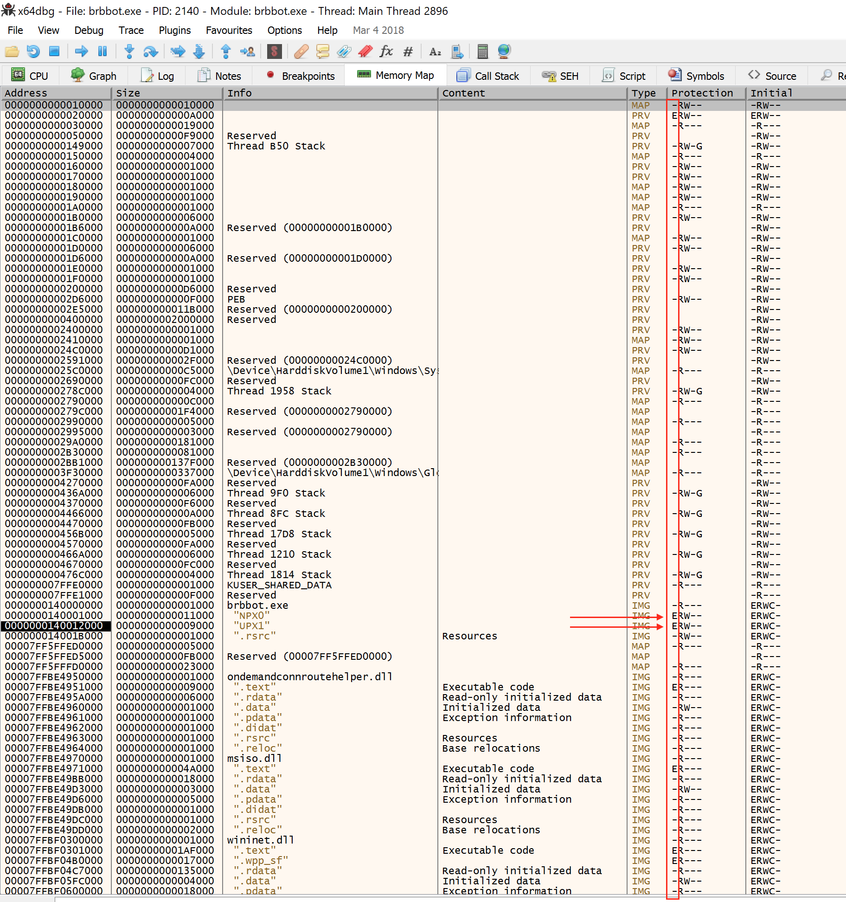
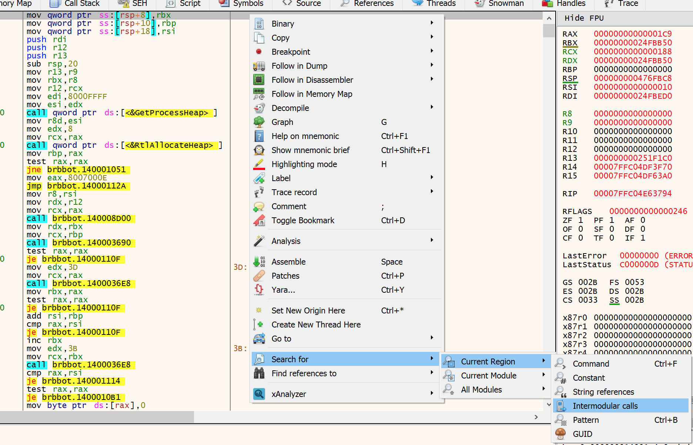
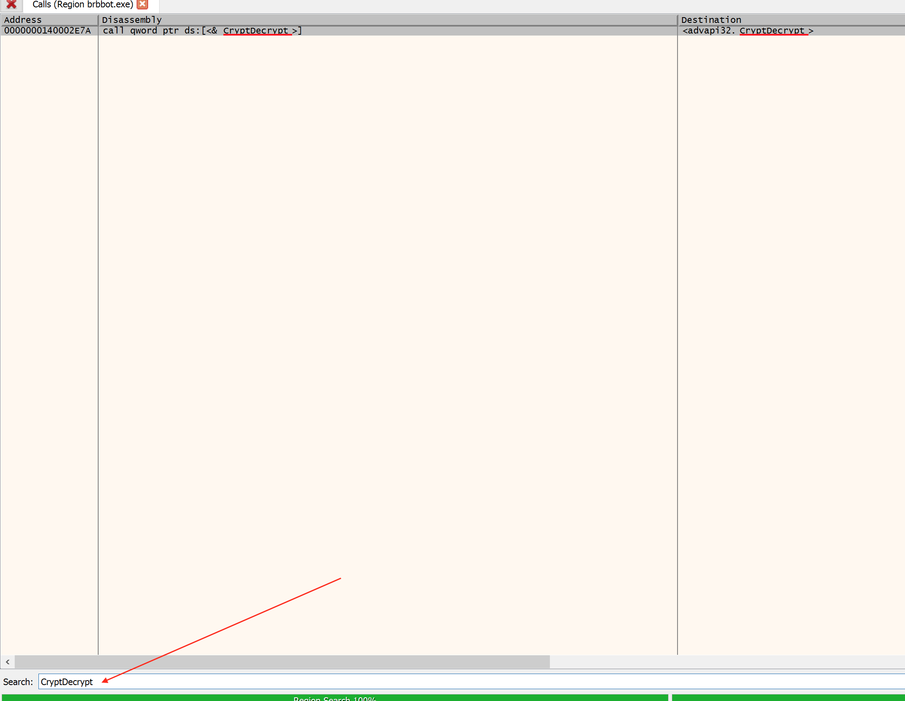
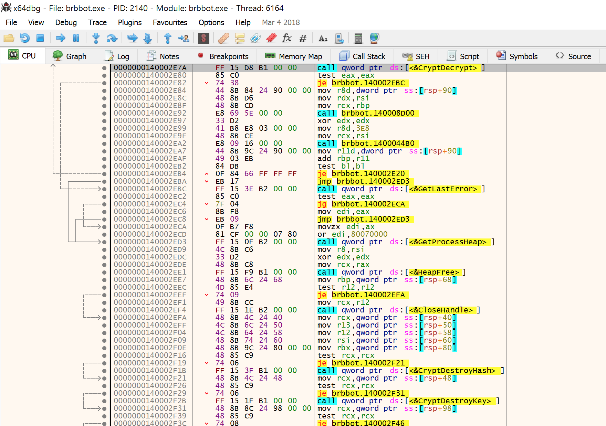
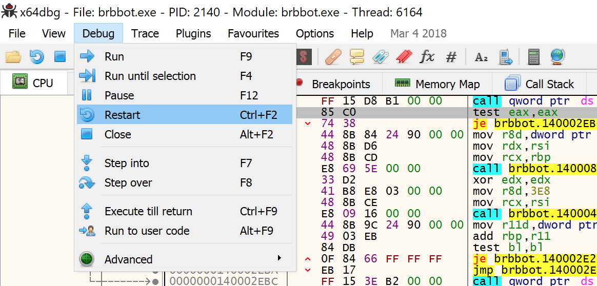
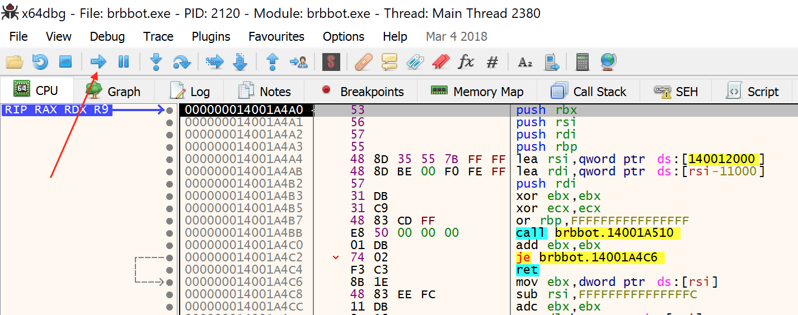
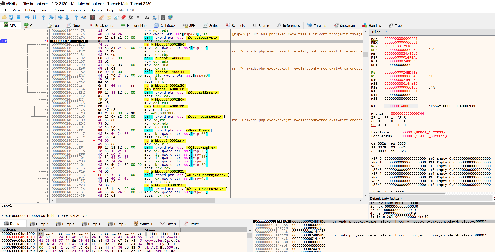

# Lab 4.4: Debugging the Packed Version of brbbot.exe

- [Lab 4.4: Debugging the Packed Version of brbbot.exe](#lab-44-debugging-the-packed-version-of-brbbotexe)
  - [Objectives](#objectives)
  - [Steps](#steps)
  - [1 - Run the packed brbbot.exe specimen in x64dbg](#1---run-the-packed-brbbotexe-specimen-in-x64dbg)
  - [2 - Examine the contents of brbbot.exe's NPX0 region by starting from the Memory Map tab, and then displaying its code in the disassembler of x64dbg.](#2---examine-the-contents-of-brbbotexes-npx0-region-by-starting-from-the-memory-map-tab-and-then-displaying-its-code-in-the-disassembler-of-x64dbg)
  - [3 - Using x64dbg, locate the code in brbbot.exe that calls CryptDecrypt.](#3---using-x64dbg-locate-the-code-in-brbbotexe-that-calls-cryptdecrypt)
  - [4 - Set a hardware breakpoint after the instruction after the call to CryptDecrypt, and then restart the process and run it to reach the breakpoint.](#4---set-a-hardware-breakpoint-after-the-instruction-after-the-call-to-cryptdecrypt-and-then-restart-the-process-and-run-it-to-reach-the-breakpoint)

---

## Objectives

- Learn to navigate through a packed executable using a debugger such as x64dbg.

 

---

## Steps

1. Run the packed `brbbot.exe` specimen in `x64dbg`.
2. Examine the contents of `brbbot.exe`'s `NPX0` region by starting from the **Memory Map tab**, and then displaying its code in the disassembler of **x64dbg**.
3. Using x64dbg, locate the code in `brbbot.exe` that calls `CryptDecrypt`.
4. Set a hardware breakpoint after the instruction after the call to `CryptDecrypt`, and then restart the process and run it to reach the breakpoint.

 

---

## 1 - Run the packed brbbot.exe specimen in x64dbg

Click the `Run` button after loading `brbbot.exe` on x64dbg:

  

 

---

## 2 - Examine the contents of brbbot.exe's NPX0 region by starting from the Memory Map tab, and then displaying its code in the disassembler of x64dbg.

Navigate to the `Memory Map` tab and check the **Protection** column - find the ones with **Execute (E)** flag:

  

- `NPX0` and `UPX1` has the `E` flag set

 

Right click `NPX0` and click `Follow in Disassembler`:

  

 

---

## 3 - Using x64dbg, locate the code in brbbot.exe that calls CryptDecrypt.

To examine the code, we can check some API calls. Right click on disassembled panel, and `Search for > Current Region > Intermodular calls`:

  

 

Search for `CryptDecrypt`:

  

 

Right click the found address and click `Follow in Disassembler`:

  

 

  

 

---

## 4 - Set a hardware breakpoint after the instruction after the call to CryptDecrypt, and then restart the process and run it to reach the breakpoint.

Click on `test eax,eax` and right click on it, click `Breakpoint > Set hardware on execution`:

  

 

  

- The "Red dot" indicates a hardware breakpoint

 

Then restart the program by clicking `Debug > Restart`:

  

 

After restarting, run the program again:

  

 

Now we stop right after the `CryptDecrypt` call:

  

- The Memory Panel shows the decrypted configuration file content

 

---