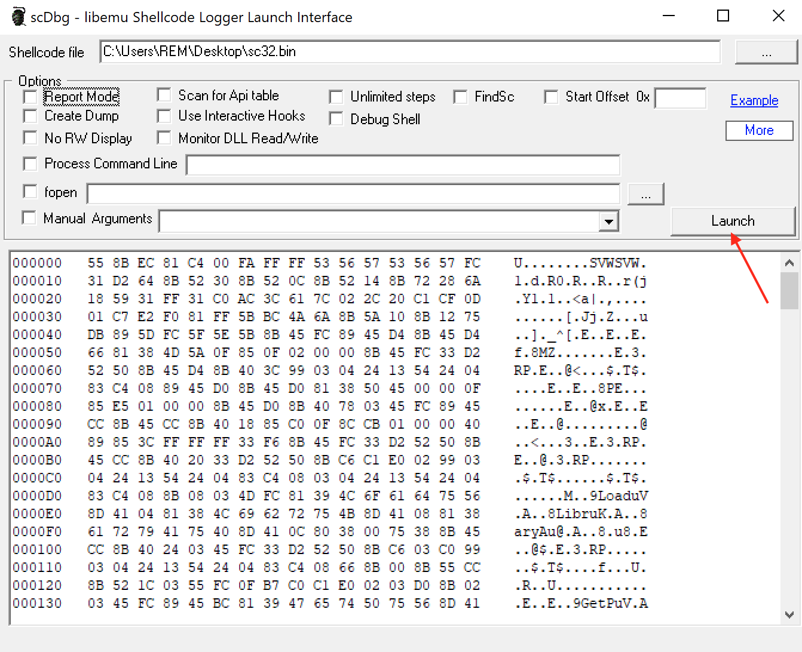
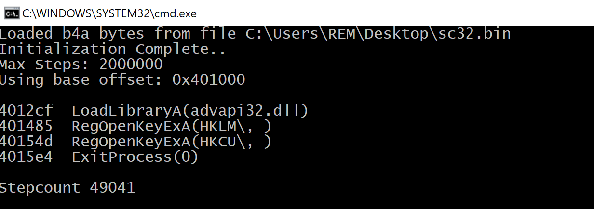
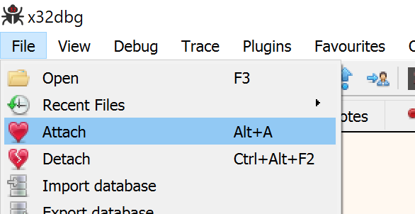
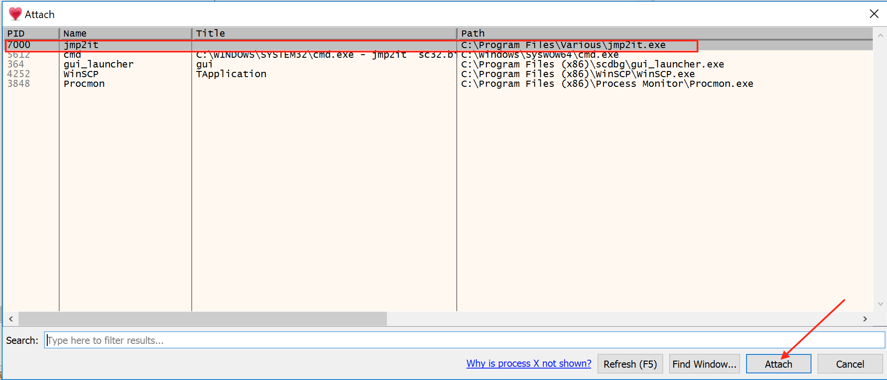
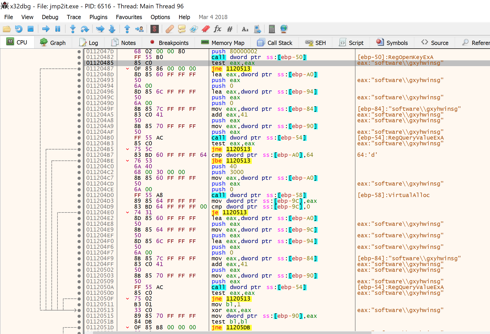
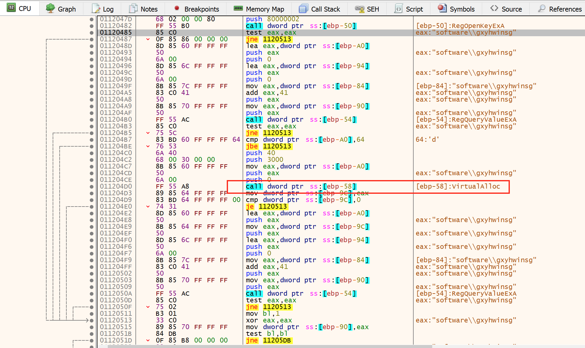

# Lab 4.6: Examining Capabilities of Shellcode Used by PDFXCview.exe

- [Lab 4.6: Examining Capabilities of Shellcode Used by PDFXCview.exe](#lab-46-examining-capabilities-of-shellcode-used-by-pdfxcviewexe)
  - [Objectives](#objectives)
  - [Steps](#steps)
  - [1 - Use scdbg to emulate the execution of shellcode stored in sc32.bin](#1---use-scdbg-to-emulate-the-execution-of-shellcode-stored-in-sc32bin)
  - [2 - Use jmp2it to execute shellcode stored in sc32.bin, supplying the pause argument to the tool.](#2---use-jmp2it-to-execute-shellcode-stored-in-sc32bin-supplying-the-pause-argument-to-the-tool)
  - [3 - Attach to the jmp2it process using x32dbg and patch the infinite loop in the beginning of shellcode, replacing it with the instruction push edi](#3---attach-to-the-jmp2it-process-using-x32dbg-and-patch-the-infinite-loop-in-the-beginning-of-shellcode-replacing-it-with-the-instruction-push-edi)
  - [4 - use x32dbg to locate the code in the shellcode that calls RegOpenKeyExA](#4---use-x32dbg-to-locate-the-code-in-the-shellcode-that-calls-regopenkeyexa)

---

## Objectives

- Reinforce the use of scdbg for analyzing shellcode.
- Learn how to use jmp2it with a debugger to perform dynamic code-level analysis of shellcode.
- Learn the basics of patching assembly code in a debugger.
- Experiment with using Call Stack in x64dbg/x32dbg when debugging code.

<br/>

---

## Steps

1. Use **scdbg** to emulate the execution of shellcode stored in `sc32.bin`.
2. Use `jmp2it` to execute shellcode stored in `sc32.bin`, supplying the pause argument to the tool.
3. Attach to the `jmp2it` process using **x32dbg** and patch the infinite loop in the beginning of shellcode, replacing it with the instruction push edi.
4. Use **x32dbg** to locate the code in the shellcode that calls `RegOpenKeyExA`.

<br/>

---

## 1 - Use scdbg to emulate the execution of shellcode stored in sc32.bin

Open `sc32.bin` on **scdbg** and click `Launch`:

  

<br/>

It shows the shellcode uses `LoadLibraryA` and opens registry keys of `HKLM` and `HKCU`:

  

<br/>

---

## 2 - Use jmp2it to execute shellcode stored in sc32.bin, supplying the pause argument to the tool.

Then use `jmp2it` to execute the shellcode in `sc32.bin` with the `pause` argument, which forces the execution pause once started:

```
jmp2it sc32.bin 0x0 pause
```

  

<br/>

---

## 3 - Attach to the jmp2it process using x32dbg and patch the infinite loop in the beginning of shellcode, replacing it with the instruction push edi

Open **x32dbg** and attach the `jmp2it` process:

  

  


<br/>

Run it and wait for some seconds, and then click the `Pause` button.

  

- Note we are now in the instruction `EB FE`, which the "self-jumping" function call is located

<br/>

In the next instruction, we can see `call edi`, which means the address of the shellcode is in the address stored in `EDI` register

<br/>

To do patching, click on the self-looping instruction and hit the `SPACE` bar. Then input `push edi`, check `Fill with NOP's`, and finally click `OK`:

  

<br/>

  

- As shown, the instruction has been modified

<br/>

---

## 4 - use x32dbg to locate the code in the shellcode that calls RegOpenKeyExA

We know that the shellcode will call `RegOpenKeyExA`. We can set a breakpoint on this API call by using this command:

```
SetBPX advapi32.RegOpenKeyExA
```

  

<br/>

Then, run by hitting `F9` to reach the breakpoint.

Note the function call `RegOpenKeyExA` spec:

- https://docs.microsoft.com/en-us/windows/win32/api/winreg/nf-winreg-regopenkeyexa

```
LSTATUS RegOpenKeyExA(
  HKEY   hKey,
  LPCSTR lpSubKey,
  DWORD  ulOptions,
  REGSAM samDesired,
  PHKEY  phkResult
);
```

- Parameters
  - `hKey` - Handle to an open registry
  - `lbSubKey` - Name of the registry subkey to be opened
  - `ulOptions` - Specify the option to apply when opening the key
  - `samDesired` - Specify the desired access rights to the key to be opened
  - `phkResult` - A pointer to a variable that receives a handle to the opened key

<br/>

Now we can inspect the stack:

  

- `hKey` = `80000002` = `HKLM`
  - http://www.jasinskionline.com/windowsapi/ref/r/regopenkeyex.html
- `lbSubKey` = `software\\gxyhwinsg`

<br/>

Now we can go to the `Call Stack`, right click the `RegOpenKeyExA` API call, and click `Follow To`. This is to access the code that invoked `RegOpenKeyExA`:

  

  


<br/>

Note after calling `RegOpenKeyExA`, there is another API call `VirtualAlloc`:

  

<br/>

---

