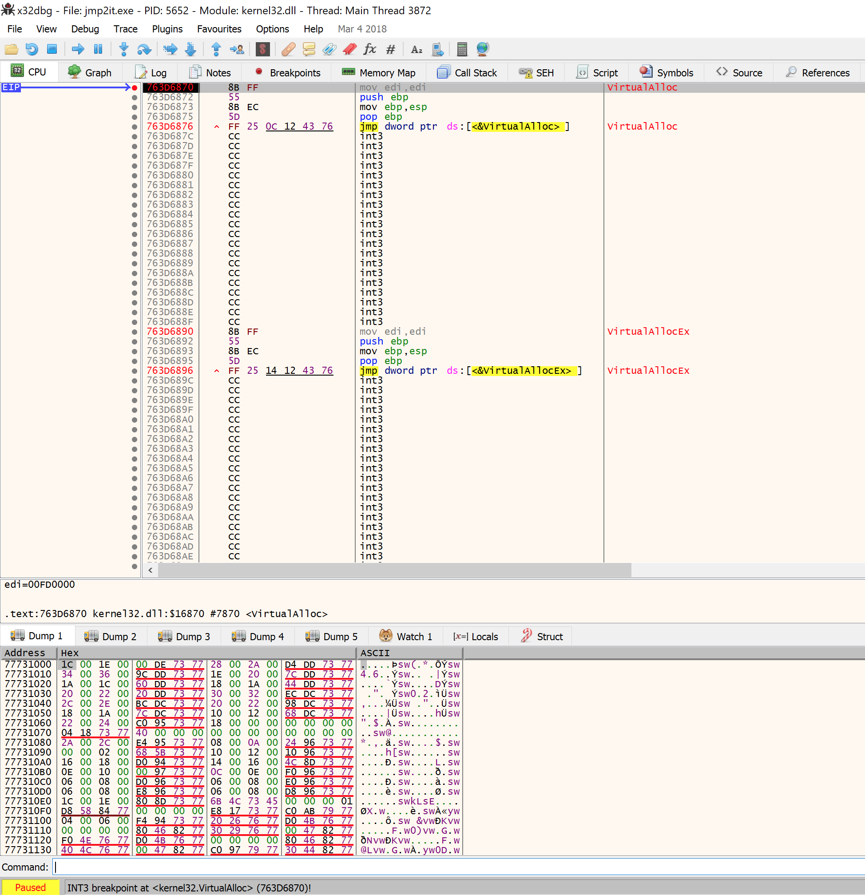
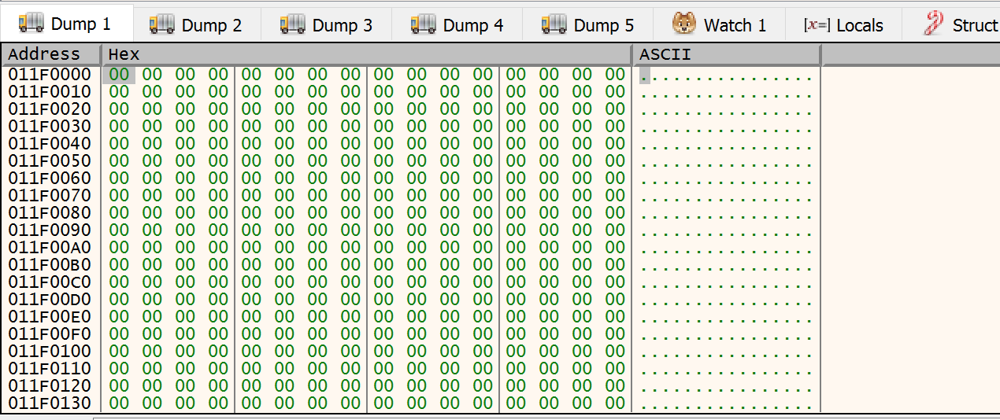
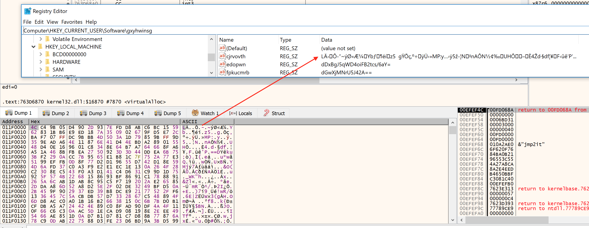
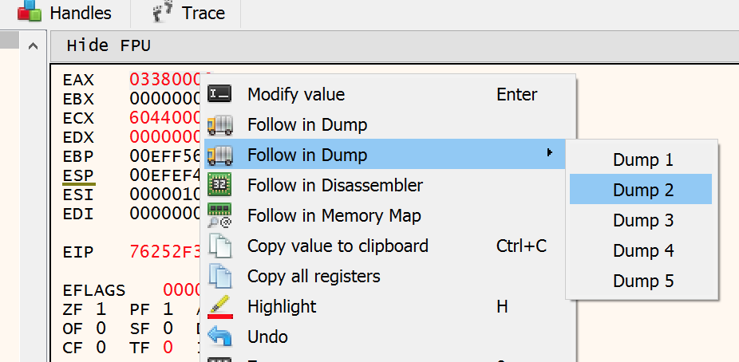
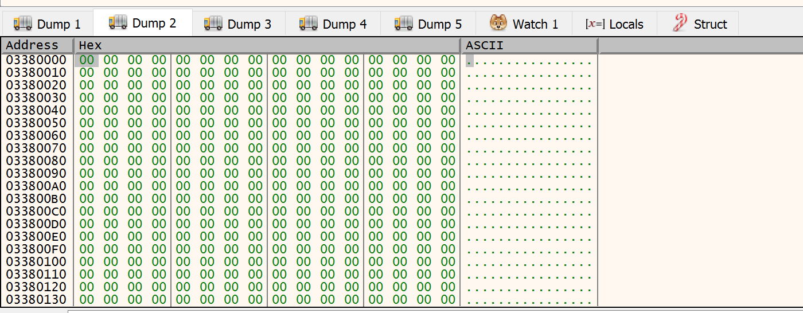
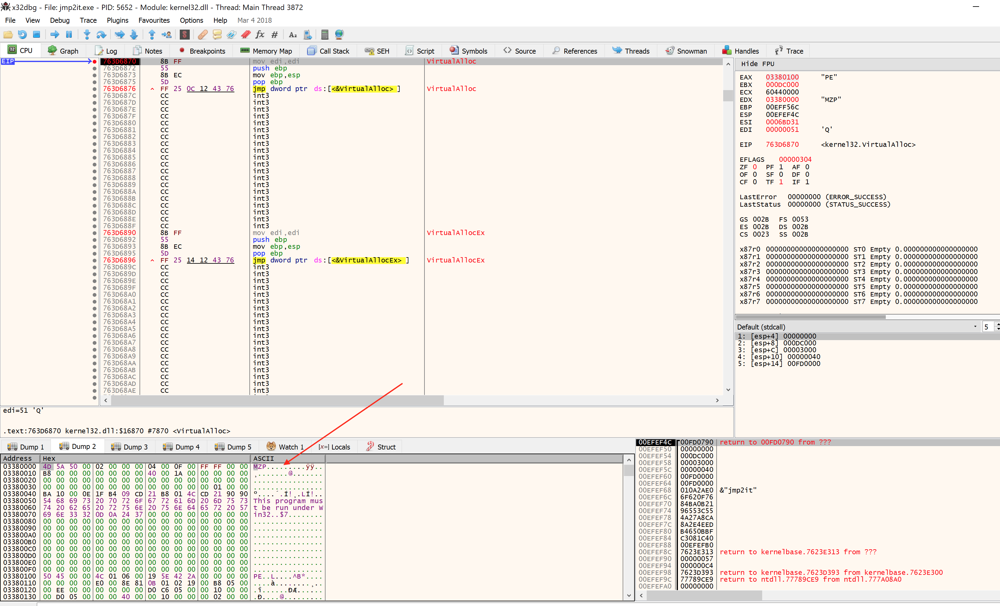
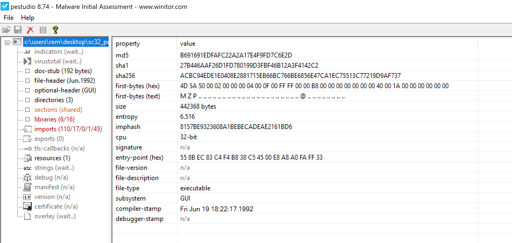

# Lab 4.7: Unpacking Shellcode That Was Used by PDFXCview.exe

- [Lab 4.7: Unpacking Shellcode That Was Used by PDFXCview.exe](#lab-47-unpacking-shellcode-that-was-used-by-pdfxcviewexe)
  - [Objectives](#objectives)
  - [Steps](#steps)
  - [1 - Use x32dbg to set a breakpoint on VirtualAlloc](#1---use-x32dbg-to-set-a-breakpoint-on-virtualalloc)
  - [2 - Allow VirtualAlloc to complete its execution, and then direct x32dbg to display contents of the allocated memory region in the Dump 1 pane of the CPU tab](#2---allow-virtualalloc-to-complete-its-execution-and-then-direct-x32dbg-to-display-contents-of-the-allocated-memory-region-in-the-dump-1-pane-of-the-cpu-tab)
  - [3,4,5 - Continue running the specimen in x32dbg, so that it reaches the VirtualAlloc breakpoint the second time. Direct the EAX to Dump 2](#345---continue-running-the-specimen-in-x32dbg-so-that-it-reaches-the-virtualalloc-breakpoint-the-second-time-direct-the-eax-to-dump-2)
  - [6 - Extract the program in Dump 2 by using x32dbg Memory Map](#6---extract-the-program-in-dump-2-by-using-x32dbg-memory-map)

---

## Objectives

- Learn to unpack malware by setting a breakpoint on VirtualAlloc.

 

---

## Steps

1. Use **x32dbg** to set a breakpoint on `VirtualAlloc` in the `jmp2it` process and allow the specimen to reach this breakpoint for the first time.
2. Allow `VirtualAlloc` to complete its execution, and then direct **x32dbg** to display contents of the allocated memory region in the Dump 1 pane of the CPU tab.
3. Continue running the specimen in **x32dbg**, so that it reaches the `VirtualAlloc` breakpoint the second time.
4. Allow the second instance of VirtualAlloc to complete its execution, and then direct x32dbg to display contents of the allocated memory region in the Dump 2 pane of the CPU tab.
5. Continue running the specimen in x32dbg, so that it reaches the VirtualAlloc breakpoint the third time.
6. Extract the program displayed in the Dump 2 area to disk by using x32dbg's Memory Map.

 

---

## 1 - Use x32dbg to set a breakpoint on VirtualAlloc

Continuing Lab 4.6, we found an API call `VirutalAlloc`. Set a breakpoint at the instruction by using the command `SetBPX VirutalAlloc`

  

 

Then run the process by hitting `F9`.

  

 

---

## 2 - Allow VirtualAlloc to complete its execution, and then direct x32dbg to display contents of the allocated memory region in the Dump 1 pane of the CPU tab

Now, use `Debug > Execute till return` (or hitting `Ctrl + F9`) to allow `VirtualAlloc` to execute its code and pause at the return.

  

 

Now, `EAX` contains the return value of the function call `VirtualAlloc`. To see the memory at that address, click the `EAX` register and right-click, and then `Floow in Dump > Dump 1`:

  

 

Since this is just a process of Virtual Memory space allocation, it is expected the data should be NULL:

  

 

---

## 3,4,5 - Continue running the specimen in x32dbg, so that it reaches the VirtualAlloc breakpoint the second time. Direct the EAX to Dump 2

Hit `F9` again to arrive at the next breakpoint (`VirtualAlloc` API call):

  

- Note **Dump 1** is no longer empty

 

Remember in the previous analysis, it reads content from `HKLM\\software\\gxyhwinsg`. Note the data in this registry matches the content in **Dump 1**:

  

 

Again, hit `Ctrl + F9` to execute till return.

  

- `EAX` should be pointing to the address allocated

 

Right click `EAX` and `Follow > Follow in Dump > Dump 2`:

  

  

 

Again, allow the program to run and hit the next `VirtualAlloc` by hitting `F9`:

  

- Note **Dump 2** contains a Windows PE

 

--- 

## 6 - Extract the program in Dump 2 by using x32dbg Memory Map

Right click the area in **Dump 2** and click `Follow in Memory Map`:

  

 

Right click the highlighted entry and click `Dump Memory to File`:

  

 

  

- md5,B691691EDFAFC22A2A17E4F9FD7C6E2D
- sha1,27B446AAF26D1FD780199D3FBF46B12A3F4142C2
- sha256,ACBC94EDE1E0408E2881715EB66BC766BE6856E47CA1EC75513C77219D9AF737

 

---