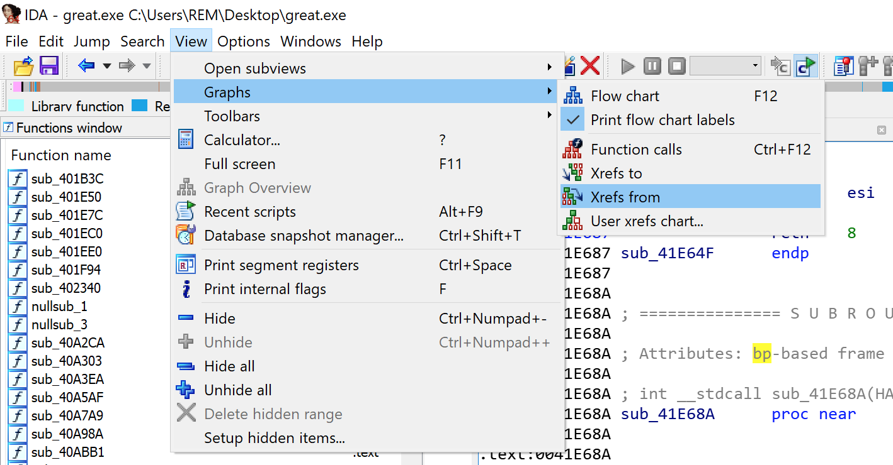
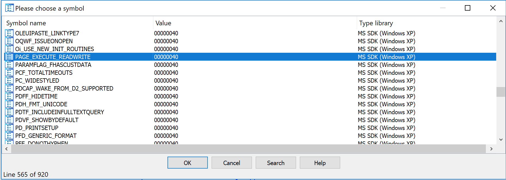
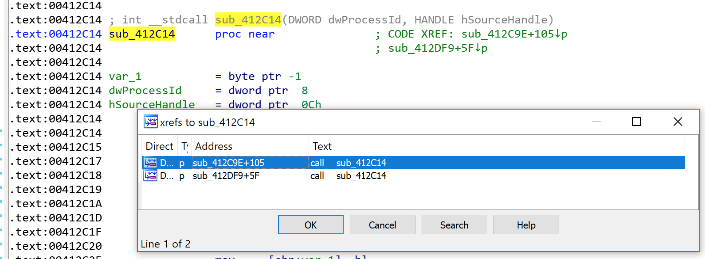

# Lab 4.8: Examining Code Injection Capabilities of great.exe

- [Lab 4.8: Examining Code Injection Capabilities of great.exe](#lab-48-examining-code-injection-capabilities-of-greatexe)
  - [Objectives](#objectives)
  - [Steps](#steps)
  - [1 - In IDA, locate the instruction in great.exe that calls CreateRemoteThread](#1---in-ida-locate-the-instruction-in-greatexe-that-calls-createremotethread)
  - [2 - Locate and go to the function in great.exe that probably performs code injection](#2---locate-and-go-to-the-function-in-greatexe-that-probably-performs-code-injection)
  - [3 - Locate the code in great.exe that allocates a memory region with PAGE_EXECUTE_READWRITE flags](#3---locate-the-code-in-greatexe-that-allocates-a-memory-region-with-page_execute_readwrite-flags)
  - [4 - Locate the code in great.exe that enumerates active processes as part of the codeinjection pattern](#4---locate-the-code-in-greatexe-that-enumerates-active-processes-as-part-of-the-codeinjection-pattern)

---

## Objectives

- Become familiar with the common approach to code injection, learning to recognize the corresponding API calls.
- Gain additional experience using IDA to perform static code analysis.

<br/>

---

## Steps

1. In IDA, locate the instruction in `great.exe` that calls `CreateRemoteThread`.
2. Locate and go to the function in `great.exe` that probably performs code injection.
3. Locate the code in `great.exe` that allocates a memory region with `PAGE_EXECUTE_READWRITE` flags.
4. Locate the code in `great.exe` that enumerates active processes as part of the code injection pattern.

<br/>

---

## 1 - In IDA, locate the instruction in great.exe that calls CreateRemoteThread

Load `great.exe` into **IDA**.

<br/>

Click `Imports`, and then type `CreateRemoteThread`:

  

<br/>

Double click on it. Click `CreateRemoteThread` and hit `X`. Go to the related instruction:

  

<br/>

---

## 2 - Locate and go to the function in great.exe that probably performs code injection

Check the documentation of `CreateRemoteThread`:

```
HANDLE CreateRemoteThread(
  HANDLE                 hProcess,
  LPSECURITY_ATTRIBUTES  lpThreadAttributes,
  SIZE_T                 dwStackSize,
  LPTHREAD_START_ROUTINE lpStartAddress,
  LPVOID                 lpParameter,
  DWORD                  dwCreationFlags,
  LPDWORD                lpThreadId
);
```

- `hProcess` - A handle to the process in which the thread is to be created.
- `lpThreadAttributes` - A pointer to a SECURITY_ATTRIBUTES structure that specifies a security descriptor for the new thread and determines whether child processes can inherit the returned handle.
- `dwStackSize` - The initial size of the stack, in bytes. 
- `lpStartAddress` - A pointer to the application-defined function of type LPTHREAD_START_ROUTINE to be executed by the thread and represents the starting address of the thread in the remote process.
- `lpParameter` - A pointer to a variable to be passed to the thread function.
- `dwCreationFlags` - The flags that control the creation of the thread.
- `lpThreadId` - A pointer to a variable that receives the thread identifier.

<br/>

The thread will execute code at address `lpStartAddress` within the process where the `hProcess` handle is pointing.

<br/>

The `hProcess` is determine by `push esi`, so we need to check how `ESI` is assigned in the first place. Click on `esi` so all the instruction related to `esi` are highlighted:

  

- `esi` is determined by `eax`
- `eax` is the return value of the API call `OpenProcess`
  - https://docs.microsoft.com/en-us/windows/win32/api/processthreadsapi/nf-processthreadsapi-openprocess
  - Parameters:
    - `dwDesiredAccess` 
    - `bInheritHandle`
    - `dwProcessId` - This takes a target process ID
  - `If the function succeeds, the return value is an open handle to the specified process.`
- Therefore, `eax` is the handle of the target process

<br/>

That is to say, this executable attempts to create a thread inside the targeted process, which indicates code injection capabilities.

<br/>

Also, at `412C3A`, `esi` is used as the `hTargetProcessHandle` for calling the function `sub_41E68A`. Inspect the function call by double clicking `sub_41E68A`. Scroll down and we can see some API calls `WriteProcessMemory`:

  

- At `41E781`, the instruction move the address of `WriteProcessMemory` to `esi`
- After that, at `41E7A4`, `call esi` is essentially calling `WriteProcessMemory`

<br/>

At this stage, there are 2/5 matches of the Code Injection pattern.

<br/>


---

## 3 - Locate the code in great.exe that allocates a memory region with PAGE_EXECUTE_READWRITE flags

Recalling the process of a Code injection:

1. EnumProcess
2. OpenProcess
3. VirtualAllocEx
4. WriteProcessMemory
5. CreateRemoteThread

- Now this is `CreateRemoteThread` and `WriteProcessMemory`. We need to find the previous steps.
- Next we will try to find the instructions related to `VirtualAllocEx`

<br/>

However, so far we haven't spotted any API call to `VirtualAllocEx`. We can try to inspect the **Xrefs from** graph to see if we can get any further information. 

<br/>

Go back to the space where we found `CreateRemoteThread`. Click `View > Graphs > Xrefs from`:

  

  

- We can actually see `sub_4326C6` calls `VirtualAllocEx`

<br/>

To inspect `sub_4326c6`, hit `g` and type `sub_4326c6` to jump to that location.

  

- The API call `VirtualAllocEx` is spotted at `432700`

<br/>

Let's look at MSDoc for the API `VirtualAllocEx`:

- https://docs.microsoft.com/en-us/windows/win32/api/memoryapi/nf-memoryapi-virtualallocex

- Syntax:

```
LPVOID VirtualAllocEx(
  HANDLE hProcess,
  LPVOID lpAddress,
  SIZE_T dwSize,
  DWORD  flAllocationType,
  DWORD  flProtect
);
```

- Parameters:
  - `hProcess` - The handle to a process.
  - `lpAddress` - The pointer that specifies a desired starting address for the region of pages that you want to allocate.
  - `dwSize` - The size of the region of memory to allocate, in bytes.
  - `flAllocationType` - The type of memory allocation.
    - 0x1000 = MEM_COMMIT
    - 0x2000 = MEM_RESERVE
    - 0x80000 = MEM_RESET
    - 0x1000000 = MEM_RESET_UNDO
  - `flProtect` - The memory protection for the region of pages to be allocated.
    - https://docs.microsoft.com/en-us/windows/win32/memory/memory-protection-constants
      - 0x10 = PAGE_EXECUTE
      - 0x20 = PAGE_EXECUTE_READ
      - 0x40 = PAGE_EXECUTE_READWRITE
      - ...

<br/>

Now in this case, we can see `push 40` for the parameter `flProtect`, which is to say the memory protection for the region of pages to be allocated is `PAGE_EXECUTE_READWRITE`.

<br/>

Right click the value `40h` and click `Use standard symbolic constant`, and choose `PAGE_EXECUTE_READWRITE`:

  

  

<br/>

`EXECUTE` + `WRITE` is a common pattern of code injection.

<br/>

---

## 4 - Locate the code in great.exe that enumerates active processes as part of the codeinjection pattern

Go back to the location where we see `CreateRemoteThread` (`412C57`). We can click the `Backward Arrow` mutiple times to achieve this.

<br/>

Scroll up and click `sub_412C14`. Hit `x` to bring out the Cross Reference Window:

  

- Choose the top one and click `OK`

<br/>

After that, scroll up from the new location. At `412CB9`, we can see `CreateToolhelp32Snapshot` API call:

  

  

- With `CreateToolhelp32Snapshot`, `Process32FirstW` and `Process32NextW`, the program can iterate through the listing of the currently running processes.

<br/>

Therefore, after the program identifies the process it wishes to infect, it call `sub_412C14` to perform the injection.

<br/>

---