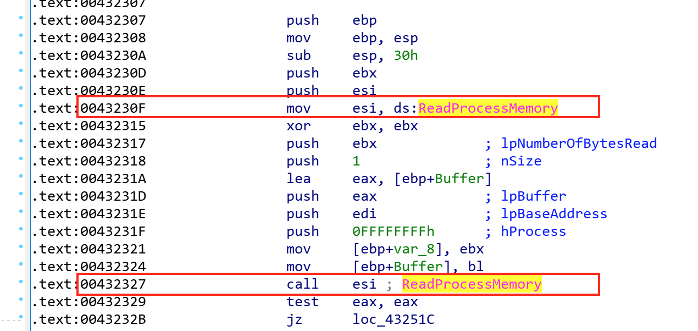
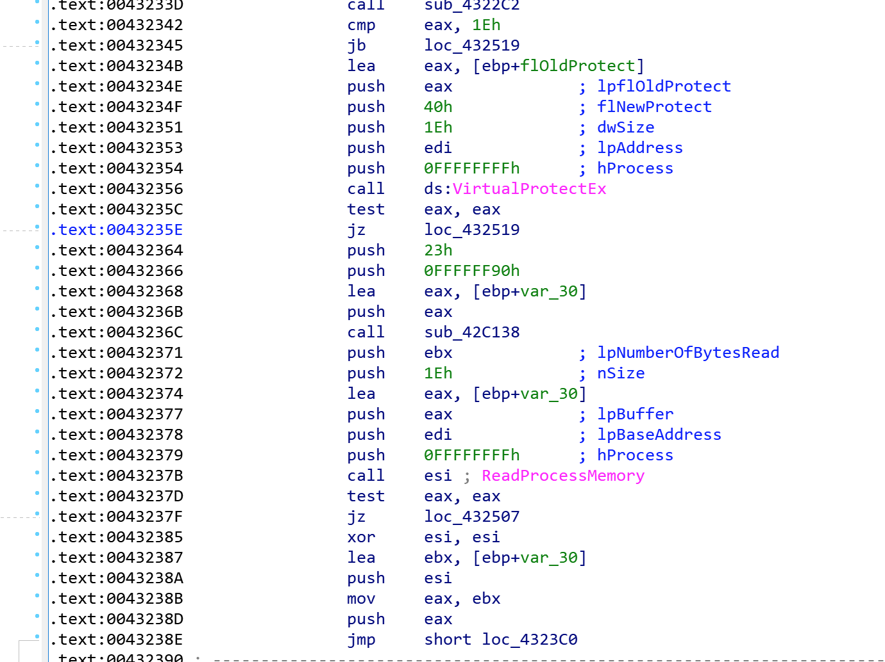
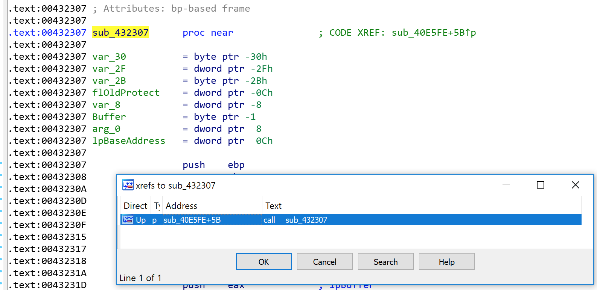
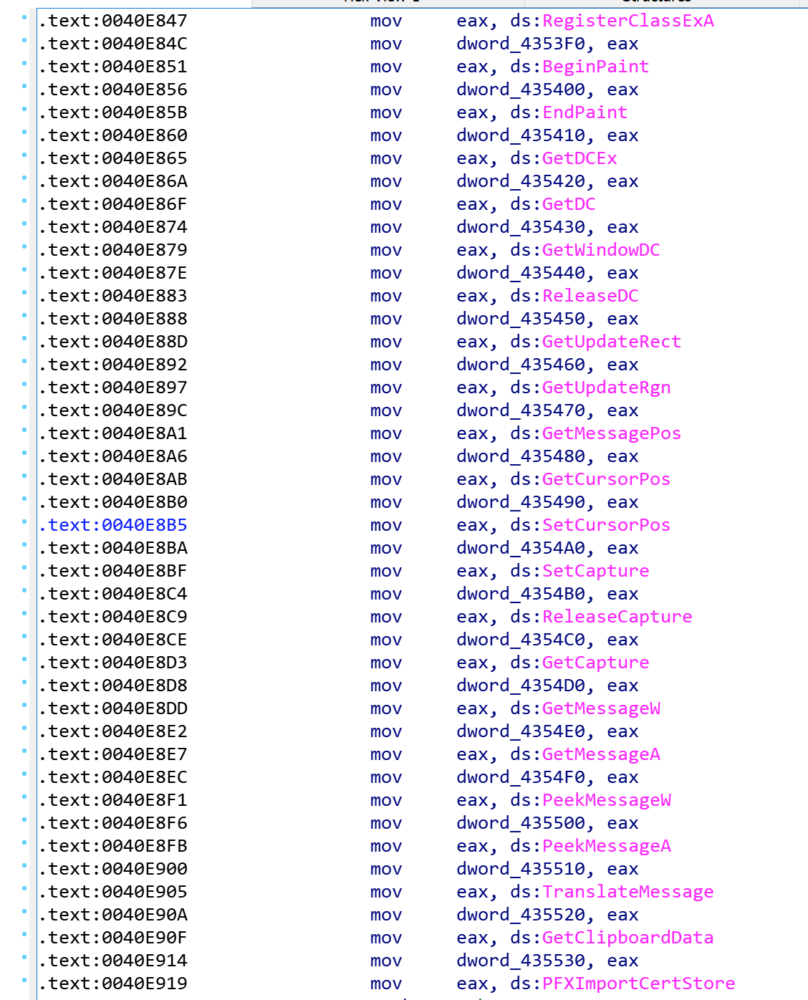
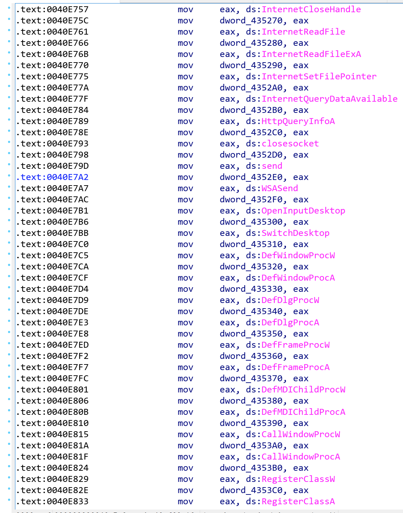

# Lab 4.9: Examining API Hooking Capabilities of great.exe

- [Lab 4.9: Examining API Hooking Capabilities of great.exe](#lab-49-examining-api-hooking-capabilities-of-greatexe)
  - [Objectives](#objectives)
  - [Steps](#steps)
  - [1 - Locate and examine the code in great.exe's function sub_432307 that calls ReadProcessMemory](#1---locate-and-examine-the-code-in-greatexes-function-sub_432307-that-calls-readprocessmemory)
  - [2 - Locate and examine the code in great.exe's function sub_432307 that calls WriteProcessMemory](#2---locate-and-examine-the-code-in-greatexes-function-sub_432307-that-calls-writeprocessmemory)
  - [3 - Locate and examine the code in great.exe that specifies which API calls the specimen attempts to hook](#3---locate-and-examine-the-code-in-greatexe-that-specifies-which-api-calls-the-specimen-attempts-to-hook)

---

## Objectives

- Become familiar with the common approach to API hooking, learning to recognize the corresponding API calls.
- Gain additional experience using IDA to perform static code analysis.

<br/>

---

## Steps

1. Locate and examine the code in `great.exe`'s function `sub_432307` that calls `ReadProcessMemory`.
2. Locate and examine the code in `great.exe`'s function `sub_432307` that calls `WriteProcessMemory`.
3. Locate and examine the code in `great.exe` that specifies which API calls the specimen attempts to hook.

<br/>

---

## 1 - Locate and examine the code in great.exe's function sub_432307 that calls ReadProcessMemory

Navigate to `Imports` tab an type `ReadProcessMemory`:

  

<br/>

Double click it. Then on the redirect page click on `ReadProcessMemory` and hit `x`:

  

- Choose the first one `sub_432307`

<br/>

  

- At `43230F`, the memory address of `ReadProcessMemory` is copied to `esi` register

<br/>

Lookup MSDoc for the API `ReadProcessMemory`:

- https://docs.microsoft.com/en-us/windows/win32/api/memoryapi/nf-memoryapi-readprocessmemory
- Syntax:

```
BOOL ReadProcessMemory(
  HANDLE  hProcess,
  LPCVOID lpBaseAddress,
  LPVOID  lpBuffer,
  SIZE_T  nSize,
  SIZE_T  *lpNumberOfBytesRead
);
```

- Parameters
  - `hProcess` - A handle to the process with memory that is being read
  - `lpBaseAddress` - A pointer to the base address in the specified process from which to read.
  - `lpBuffer` - A pointer to a buffer that receives the contents from the address space of the specified process.
  - `nSize` - The number of bytes to be read from the specified process.
  - `*lpNumberOfBytesRead` - A pointer to a variable that receives the number of bytes transferred into the specified buffer.

- Return
  - Succeed = non-zero
  - Fails = 0

<br/>

`hProcess` is set to be `0x0FFFFFFF`, which means this is a "self handle". 

<br/>


`nSize` is set to 1, which means read 1 byte.

<br/>

`lpBaseAddress` is set to be the value in `edi`. However, there is nothing assigned to `edi` when we scroll up - which indicates it is a fastcall.

<br/>

After the `ReadProcessMemory` call at `432327`, it runs `test eax, eax` to see if the function call is successful. If successful, at `4323331`, it compares `[ebp+Buffer]` with `0E9` (n.b. `0xE9` is the opcode of `JMP`). 

- Malware might use this to check for this instruction to avoid hooking the same function twice

<br/>

Scroll down and we can see another API call `ReadProcessMemory`:

  

- This is likely to backup the bytes that are about to be written

<br/>

---

## 2 - Locate and examine the code in great.exe's function sub_432307 that calls WriteProcessMemory

Scroll down further, we can see the `WriteProcessMemory` at `4323F3`:

  

<br/>

`hProcess` is `0FFFFFFF`, which means it writes to the memory of its own process.

<br/>

The content written to the targeted memory address specified by the `lpBaseAddress` is supplied to `WriteProcessMemory` using the `lpBuffer` parameter. The `lpBuffer` is set to be `eax` at `4323E2`, where `eax` is set by `[ebp+var_30]`.

<br/>

At `4323E6`, again we can see `0xE9`, which is the opcode of `JMP`. This is consistent with our hypothesis regarding the code:

- It appears to be hooking the target by inserting a jump instruction into it

<br/>

Scroll down further at `4324D5`, there is another APi call `WriteProcessMemory`.

Note that from `4324C2 - 4324C8`, 
- The buffer begins with the value `0x68`
- At `4324C8`, `0xC3` is being placed into `[eax+5]`. Note that `0xC3` is the opcode of `RET`
- With the `PUSH` followed by `RET`, this is a **Tricky Jump**

<br/>

---

## 3 - Locate and examine the code in great.exe that specifies which API calls the specimen attempts to hook

Scroll up to `sub_432307`. Click the name and hit `x`:

  

- Click OK to go to the reference section

<br/>

Scroll up to the start of this subroutine, click `sub_40E5FE` and hit `x`:

  

- Choose the 1st entry and click `OK`

<br/>

We get redirected to `40E92A`. Scroll up and we can see many references to various API calls:

  

  

  

- References to various API calls whose addresses are being saved in memory by first moving the functions address into `EAX`, and then save `EAX` content in memory
- This builds the table of functions it wants to hook, which is passed as a parameters to `sub_40E5FE`
- Many functions are related to browser-related functions, which suggests the function of the program includes the capability to observe / intercept the victim's web-browsing activities.

<br/>

---