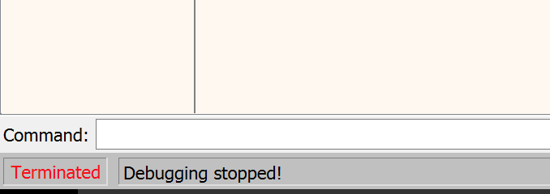
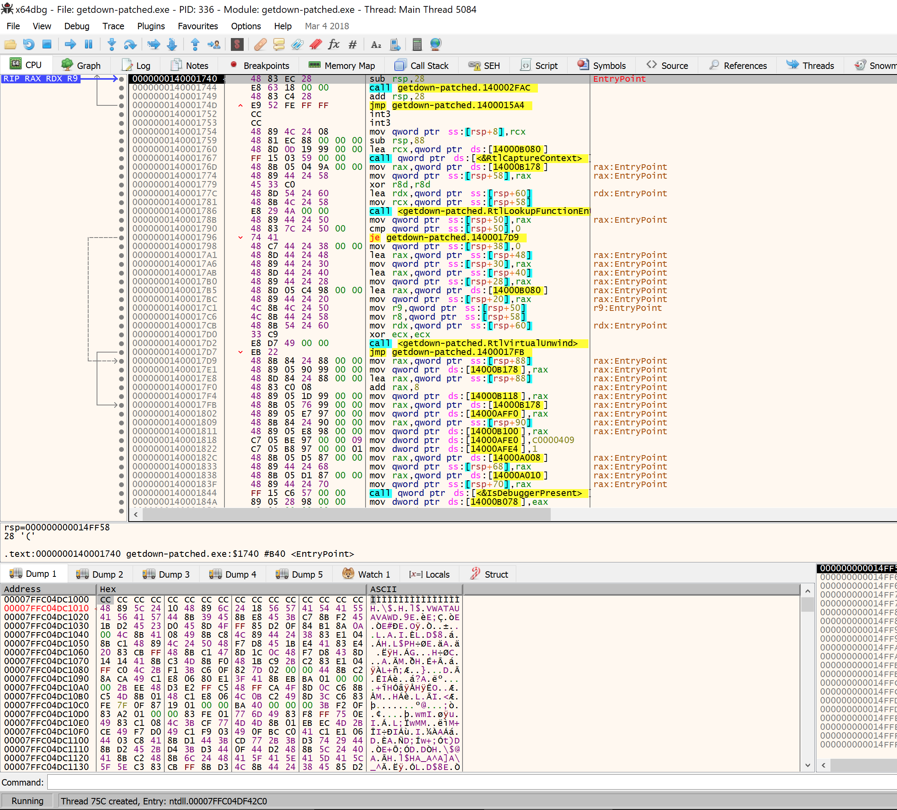

# Lab 5.1: Patching getdown.exe to Bypass Debugger Detection

- [Lab 5.1: Patching getdown.exe to Bypass Debugger Detection](#lab-51-patching-getdownexe-to-bypass-debugger-detection)
  - [Objectives](#objectives)
  - [Steps](#steps)
  - [1 - Infect the Windows REM Workstation with getdown.exe while monitoring the specimen's network traffic using Wireshark on REMnux](#1---infect-the-windows-rem-workstation-with-getdownexe-while-monitoring-the-specimens-network-traffic-using-wireshark-on-remnux)
  - [2 - Load getdown.exe in x64dbg and locate the API call that the specimen probably uses to detect the debugger](#2---load-getdownexe-in-x64dbg-and-locate-the-api-call-that-the-specimen-probably-uses-to-detect-the-debugger)
  - [3 - Use a breakpoint in x64dbg to observe how getdown.exe detects the debugger](#3---use-a-breakpoint-in-x64dbg-to-observe-how-getdownexe-detects-the-debugger)
  - [4 - Use x64dbg to patch getdown.exe (in memory), so that the specimen is no longer effective at detecting the debugger](#4---use-x64dbg-to-patch-getdownexe-in-memory-so-that-the-specimen-is-no-longer-effective-at-detecting-the-debugger)

---

## Objectives

- Learn how to use x64dbg to patch malware that attempts to detect analysis tools.
- Start learning about the approaches that malware can employ to detect the presence of a debugger.

<br/>

---

## Steps

1. Infect the Windows REM Workstation with `getdown.exe` while monitoring the specimen's network traffic using Wireshark on REMnux.
2. Load `getdown.exe` in **x64dbg** and locate the API call that the specimen probably uses to detect the debugger.
3. Use a breakpoint in **x64dbg** to observe how `getdown.exe` detects the debugger.
4. Use **x64dbg** to patch `getdown.exe` (in memory), so that the specimen is no longer effective at detecting the debugger.

<br/>

---

## 1 - Infect the Windows REM Workstation with getdown.exe while monitoring the specimen's network traffic using Wireshark on REMnux

First on REMnux, start `fakedns` and `wireshark`:

```
wireshark &
fakedns
```

  

<br/>

On Windows, run `getdown.exe` with admin privilege. Inspect **Wireshark**:

  

- A web traffic to `1.234.27.146:80` is observed.

<br/>

If we load it into **x64dbg** and run it, the web traffic is undetected by **Wireshark**:

  

  

<br/>

---

## 2 - Load getdown.exe in x64dbg and locate the API call that the specimen probably uses to detect the debugger

Drag and drop `getdown.exe` into x64dbg.

<br/>

Check the API calls by right-clicking the CPU region, `Search for > Current Region > Intermodular calls`:

  

  

- `IsDebuggerPresent` can be used to detect if the program is opened by a debugger

<br/>

Click on the row and right-click. Choose `Follow in Disassembler`:

  

  

- MSDOC for `IsDebuggerPresent`:
  - https://docs.microsoft.com/en-us/windows/win32/api/debugapi/nf-debugapi-isdebuggerpresent
  - Return value:
    - In the context of debuggers = `non-zero`
    - Not in the context of debuggers = `0`
- At `14000102A`, it does `test eax,eax`, where `eax` has the return value of `IsDebuggerPresent`
  - At `14000102C`, `jne getdown.140001216`, it jumps if `eax` is `non-zero`

<br/>

---

## 3 - Use a breakpoint in x64dbg to observe how getdown.exe detects the debugger

Add a breakpoint at the instruction `test eax,eax` by clicking this row, and hit `F2`:

  

<br/>

Then run the program:

  

<br/>

Note the value in the register `RAX` (which includes `EAX`) becomes `1`:

  

- Non-zero = In the context of a debugger

<br/>

This is how the program uses `IsDebuggerPresent` to detect debugger.

<br/>

---

## 4 - Use x64dbg to patch getdown.exe (in memory), so that the specimen is no longer effective at detecting the debugger

Since it jumps if it detects `EAX` is non-zero, we can modify the `jmp` instruction so the program will not jump after it.

<br/>

To do this, we can patch the program by replacing the `jne` instruction at `14000102C` by `NOP`.

Click on the line of `jne`, and hit `<SPACE>`:

  

- Input `NOP`
- Check `Fill with NOP's`
- Click `OK`

<br/>

  

- As shown, the `jne` instruction has been replaced by a series of `NOP`

<br/>

Then save the patched file by clicking `File > Patch file ... > Patch File`:

  

  

- Save as `getdown-patched.exe`

<br/>

Now load `getdown-patched.exe` into **x64dbg**, and try to run it again with Wireshark running in REMnux:

  

  

- We see the web traffic again!

<br/>

Remember we can fake a response by enabling `iptables` NAT redirection with a WebServer:

```
accept-all-ips start
sudo python -m SimpleHTTPServer 80
```

<br/>

Re-run the sample and inspect on **Wireshark**:

  

- The sample try to download `pcfix.exe` and supply a parameter `affid`, which is likely to be used to track the infection
- Lab 1.7

<br/>

---