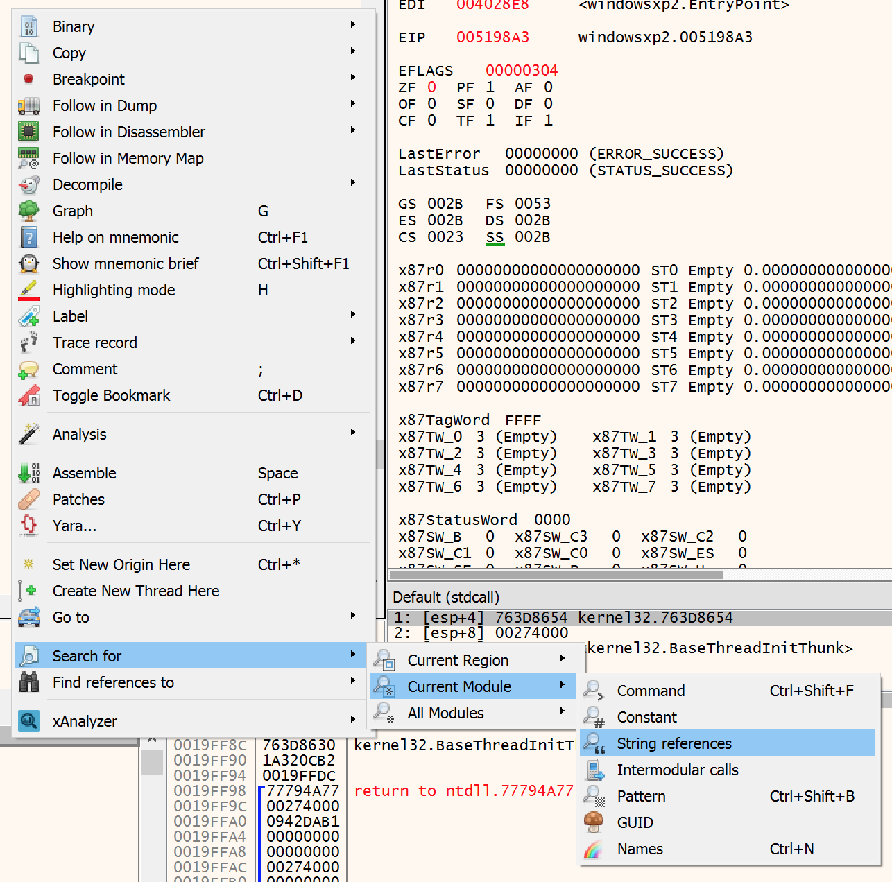
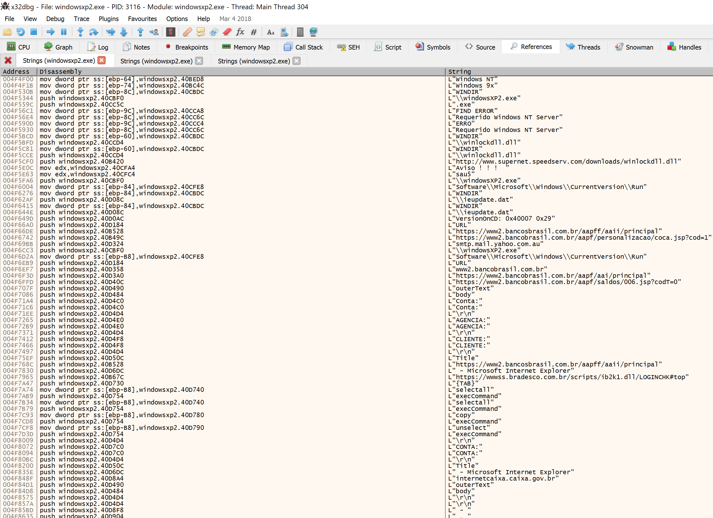
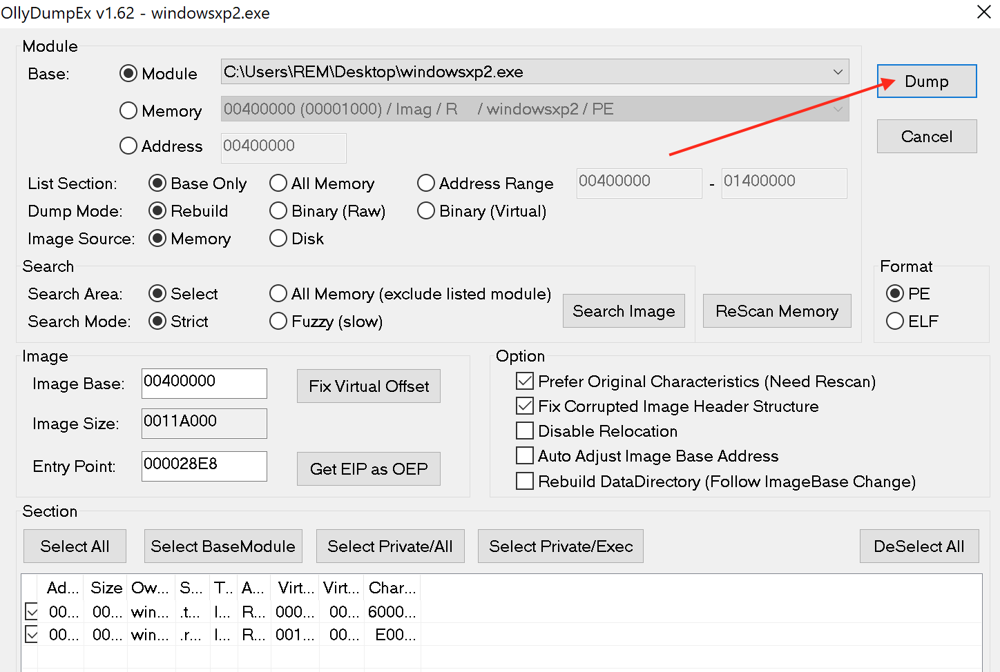
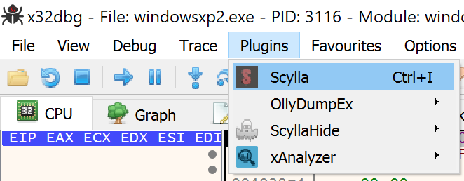
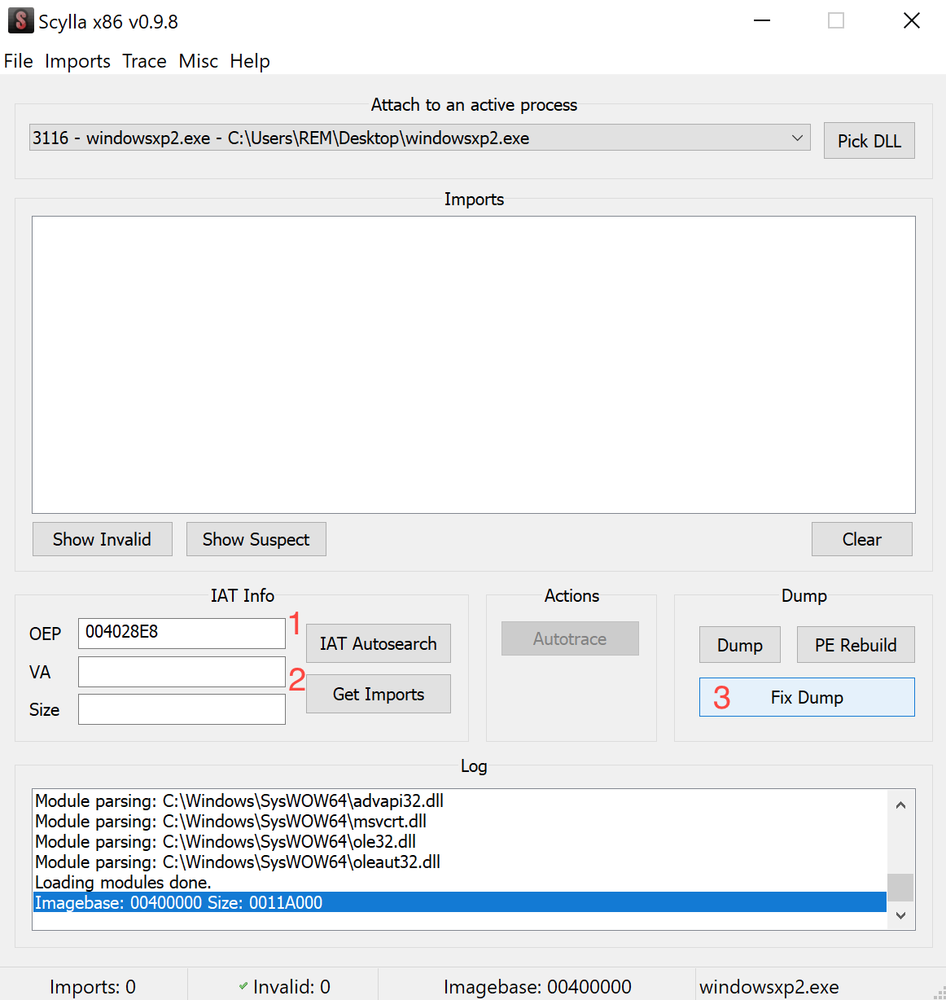
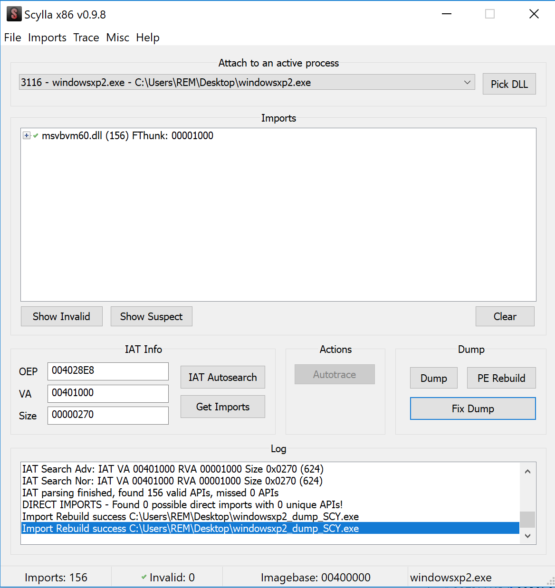
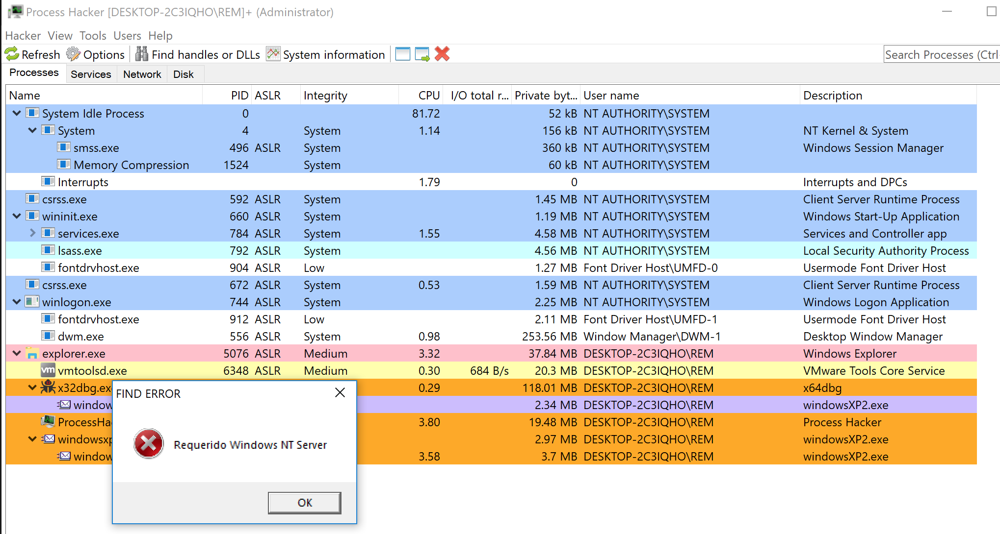
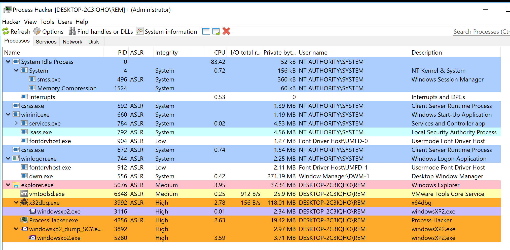
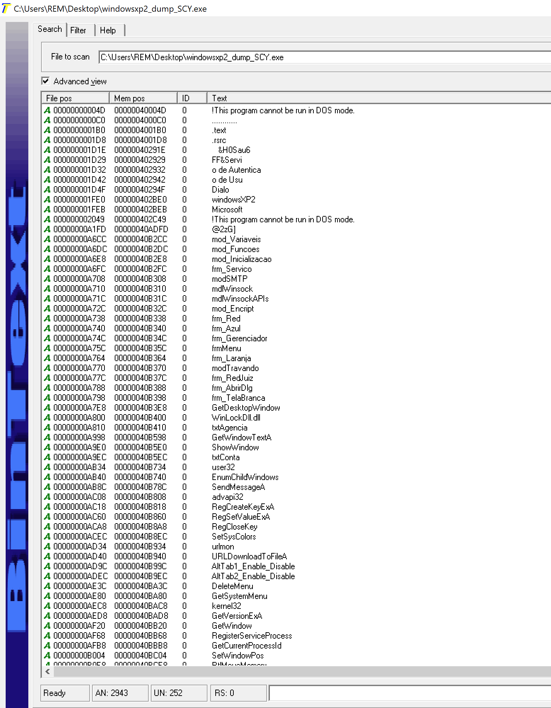

# Lab 5.10: Unpacking windowsxp2.exe Using a Stack Breakpoint

- [Lab 5.10: Unpacking windowsxp2.exe Using a Stack Breakpoint](#lab-510-unpacking-windowsxp2exe-using-a-stack-breakpoint)
  - [Objectives](#objectives)
  - [Steps](#steps)
  - [1 - Execute the first two instructions of windowsxp2.exe within x32dbg, allowing the specimen to write something to the stack](#1---execute-the-first-two-instructions-of-windowsxp2exe-within-x32dbg-allowing-the-specimen-to-write-something-to-the-stack)
  - [2 - Use x32dbg to set a breakpoint on the top of the stack in windowsxp32.exe after the specimen executes its first two instructions](#2---use-x32dbg-to-set-a-breakpoint-on-the-top-of-the-stack-in-windowsxp32exe-after-the-specimen-executes-its-first-two-instructions)
  - [3 - Run windowsxp32.exe in x32dbg until it reaches the stack breakpoint the fifth time](#3---run-windowsxp32exe-in-x32dbg-until-it-reaches-the-stack-breakpoint-the-fifth-time)
  - [4 - Check whether the specimen is unpacked by examining string references in x32dbg](#4---check-whether-the-specimen-is-unpacked-by-examining-string-references-in-x32dbg)
  - [5 - Allow windowsxp32.exe to jump to the OEP in x32dbg, and then dump the specimen using OllyDumpEx, saving the file as windowsxp2_dump.exe](#5---allow-windowsxp32exe-to-jump-to-the-oep-in-x32dbg-and-then-dump-the-specimen-using-ollydumpex-saving-the-file-as-windowsxp2_dumpexe)
  - [6 - Fix the IAT of the windowsxp2_dump.exe file by invoking Scylla from within x32dbg](#6---fix-the-iat-of-the-windowsxp2_dumpexe-file-by-invoking-scylla-from-within-x32dbg)
  - [7 - Execute the windowsxp2_dump_SCY.exe file to confirm that it runs and then, if time permits, load it in BinText to confirm that it's unpacked](#7---execute-the-windowsxp2_dump_scyexe-file-to-confirm-that-it-runs-and-then-if-time-permits-load-it-in-bintext-to-confirm-that-its-unpacked)

----

## Objectives

- Learn how to unpack malware by setting a stack breakpoint in anticipation of the unpacker cleaning up the stack close to the Original Entry Point (OEP).
- Reinforce the use of OllyDumpEx and Scylla as part of the unpacking process

 

---

## Steps

1. Execute the first two instructions of `windowsxp2.exe` within **x32dbg**, allowing the specimen to write something to the stack.
2. Use **x32dbg** to set a breakpoint on the top of the stack in `windowsxp32.exe` after the specimen executes its first two instructions.
3. Run `windowsxp32.exe` in **x32dbg** until it reaches the stack breakpoint the fifth time.
4. Check whether the specimen is unpacked by examining string references in **x32dbg**.
5. Allow `windowsxp32.exe` to jump to the `OEP` in **x32dbg**, and then dump the specimen using **OllyDumpEx**, saving the file as `windowsxp2_dump.exe`.
6. Fix the IAT of the `windowsxp2_dump.exe` file by invoking **Scylla** from within **x32dbg**.
7. Execute the `windowsxp2_dump_SCY.exe` file to confirm that it runs and then, if time permits, load it in **BinText** to confirm that it's unpacked.

 

---

## 1 - Execute the first two instructions of windowsxp2.exe within x32dbg, allowing the specimen to write something to the stack

Hit `F7` 2 times:

  

- `519870` is saved in `EAX`

 

---

## 2 - Use x32dbg to set a breakpoint on the top of the stack in windowsxp32.exe after the specimen executes its first two instructions

On the stack, right click the top one, `Breakpoint > Hardware,Access > Dword`:

  

 

---

## 3 - Run windowsxp32.exe in x32dbg until it reaches the stack breakpoint the fifth time

Click on the `Run` button:

  

 

  

- Note the module now is `ntdll.dll`

 

Hit `Run` again, till the module shows `windowsxp2.exe`:

  

 

---

## 4 - Check whether the specimen is unpacked by examining string references in x32dbg

Right click on the panel > `Search for > Current Module > String References`:

  

 

  

- There are only 2 string references.
- This shows the specimen is still not unpacked

 

---

## 5 - Allow windowsxp32.exe to jump to the OEP in x32dbg, and then dump the specimen using OllyDumpEx, saving the file as windowsxp2_dump.exe

Click Run once more, the program stops at `51993D`:

  

 

The first instruction is `jmp eax` - which is probably jumping to the `OEP`.

 

Hit `F8` to step over - which brings us to `4028E8`:

  

 

Right click on the panel > `Search for > Current Module > String References`:

  

  

- Many strings references
- This is likely unpacked

 

When the `EIP` at `4028E8`, click `Plugins > OllyDumpEx > Dump process`:

  

 

Dump:

  

 

---

## 6 - Fix the IAT of the windowsxp2_dump.exe file by invoking Scylla from within x32dbg

Click on `Plugins > Scylla`:

  

 

  

 

  

 

---

## 7 - Execute the windowsxp2_dump_SCY.exe file to confirm that it runs and then, if time permits, load it in BinText to confirm that it's unpacked

Launch **Process Hacker**. Then run `windowsxp2_dump_SCY.exe`:

  

 

  

 

Load the unpacked file into **BinText** and check if it is unpacked:

  

 

---