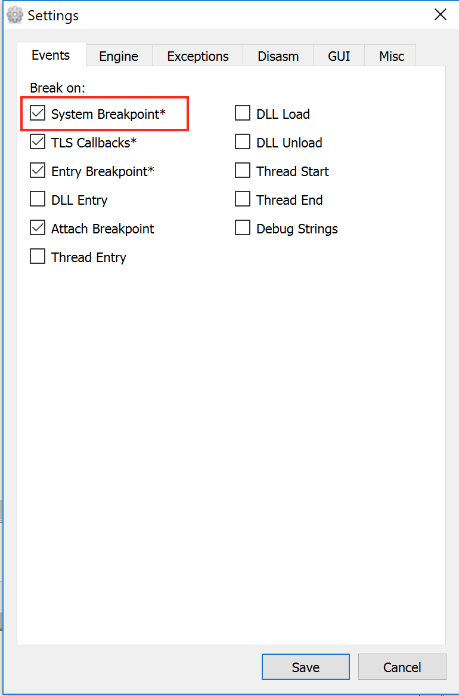
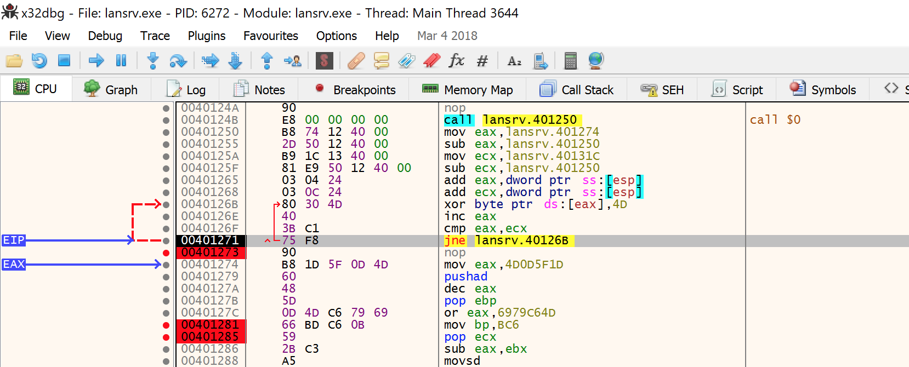
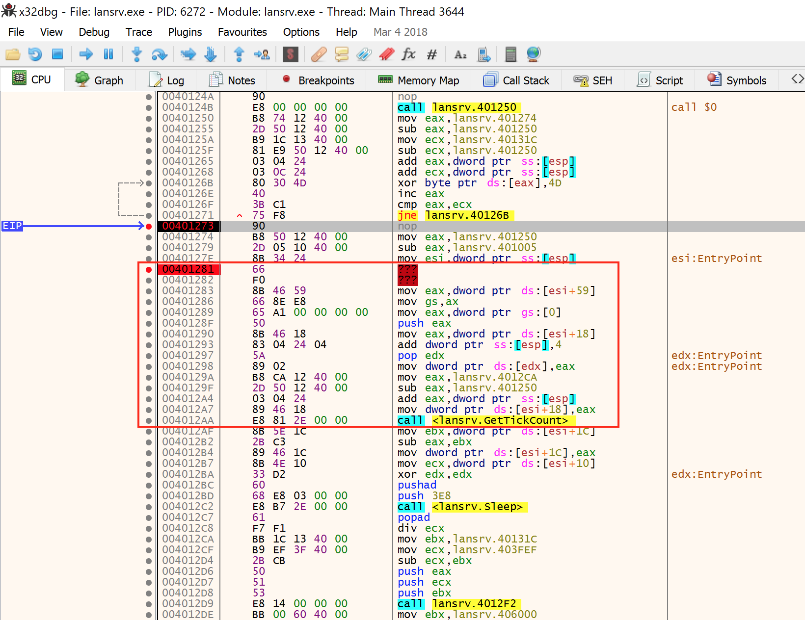
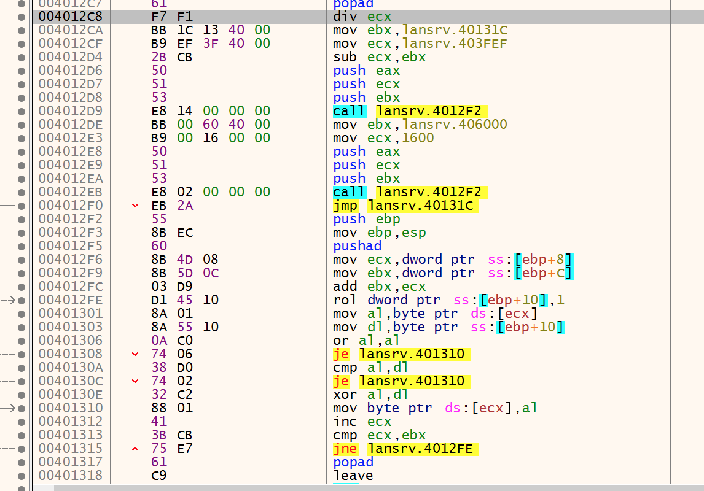
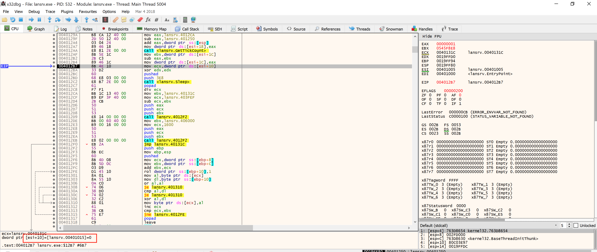
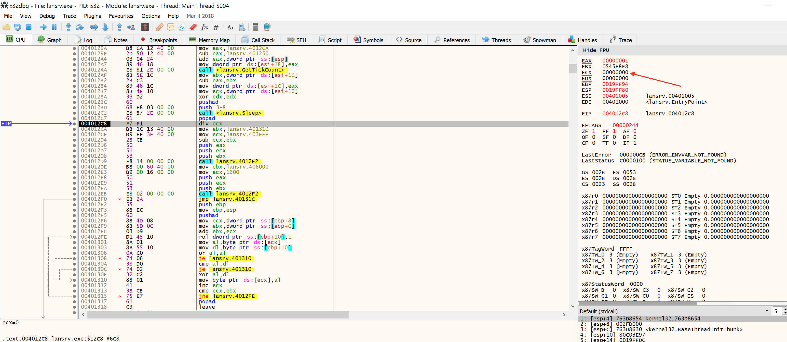

# Lab 5.11: Bypassing Self-Defensive Measures in lansrv.exe

- [Lab 5.11: Bypassing Self-Defensive Measures in lansrv.exe](#lab-511-bypassing-self-defensive-measures-in-lansrvexe)
  - [Objectives](#objectives)
  - [Steps](#steps)
  - [1 - Use pescanner.py on REMnux to determine the presence and address of the TLS callback function in lansrv.exe](#1---use-pescannerpy-on-remnux-to-determine-the-presence-and-address-of-the-tls-callback-function-in-lansrvexe)
  - [2 - Configure x32dbg to pause on System Breakpoint, load lansrv.exe into the debugger, set a breakpoint on the TLS callback function and run to reach it](#2---configure-x32dbg-to-pause-on-system-breakpoint-load-lansrvexe-into-the-debugger-set-a-breakpoint-on-the-tls-callback-function-and-run-to-reach-it)
  - [3 - Use a hardware breakpoint in x32dbg to execute lansrv.exe until offset 4011BA](#3---use-a-hardware-breakpoint-in-x32dbg-to-execute-lansrvexe-until-offset-4011ba)
  - [4 - Use x32dbg to examine the code starting from 4011BA that lansrv.exe uses to detect the debugger to understand how the specimen saves the results of its probe](#4---use-x32dbg-to-examine-the-code-starting-from-4011ba-that-lansrvexe-uses-to-detect-the-debugger-to-understand-how-the-specimen-saves-the-results-of-its-probe)
  - [5 - Execute lansrv.exe's code in x32dbg until the specimen's Entry Point.](#5---execute-lansrvexes-code-in-x32dbg-until-the-specimens-entry-point)
  - [6 - Allow lansrv.exe to execute in x32dbg until offset 401286, and then examine the code present there to determine its likely purpose](#6---allow-lansrvexe-to-execute-in-x32dbg-until-offset-401286-and-then-examine-the-code-present-there-to-determine-its-likely-purpose)
  - [7 - Use x32dbg to patch the instruction at 401289 in lansrv.exe, so that instead of moving into EAX contents of gs:[0], it moves contents of fs:[0]](#7---use-x32dbg-to-patch-the-instruction-at-401289-in-lansrvexe-so-that-instead-of-moving-into-eax-contents-of-gs0-it-moves-contents-of-fs0)
  - [8 - Continue stepping through lansrv.exe in x32dbg until offset 40129A, analyzing the instructions that replace the handler of the most recently defined SEH record](#8---continue-stepping-through-lansrvexe-in-x32dbg-until-offset-40129a-analyzing-the-instructions-that-replace-the-handler-of-the-most-recently-defined-seh-record)
  - [9 - Set a hardware breakpoint on the malicious SEH handler 403FEF](#9---set-a-hardware-breakpoint-on-the-malicious-seh-handler-403fef)
  - [10 - Use x32dbg to statically examine the code that precedes the instruction at offset 4012C8 in lansrv.exe, and then execute the code until that instruction](#10---use-x32dbg-to-statically-examine-the-code-that-precedes-the-instruction-at-offset-4012c8-in-lansrvexe-and-then-execute-the-code-until-that-instruction)
  - [11 - Use x32dbg to modify ECX so it contains 0, and then run lansrv.exe to reach the previously set breakpoint at 403FEF](#11---use-x32dbg-to-modify-ecx-so-it-contains-0-and-then-run-lansrvexe-to-reach-the-previously-set-breakpoint-at-403fef)
  - [12 - If time permits, execute lansrv.exe in x32dbg until offset 401323 and observe the specimen calling FindWindowA as it looks for its infection marker](#12---if-time-permits-execute-lansrvexe-in-x32dbg-until-offset-401323-and-observe-the-specimen-calling-findwindowa-as-it-looks-for-its-infection-marker)

---

## Objectives

- Understand how malware can use TLS callback functions to confuse and misdirect the analyst.
- Explore a debugger detection technique that's more sophisticated than some of the methods covered earlier in the course.
- Reinforce the use of x32dbg for performing dynamic code-level analysis of malware.

<br/>

---

## Steps

1. Use `pescanner.py` on REMnux to determine the presence and address of the TLS callback function in `lansrv.exe`.
2. Configure **x32dbg** to pause on System Breakpoint, load `lansrv.exe` into the debugger, set a breakpoint on the TLS callback function and run to reach it.
3. Use a hardware breakpoint in **x32dbg** to execute `lansrv.exe` until offset `4011BA`.
4. Use **x32dbg** to examine the code starting from `4011BA` that `lansrv.exe` uses to detect the debugger to understand how the specimen saves the results of its probe.
5. Execute `lansrv.exe`'s code in **x32dbg** until the specimen's Entry Point.
6. Allow `lansrv.exe` to execute in **x32dbg** until offset `401286`, and then examine the code present there to determine its likely purpose.
7. Use **x32dbg** to patch the instruction at `401289` in `lansrv.exe`, so that instead of moving into `EAX` contents of `gs:[0]`, it moves contents of `fs:[0]`.
8. Continue stepping through `lansrv.exe` in **x32dbg** until offset `40129A`, analyzing the instructions that replace the handler of the most recently defined SEH record.
9. Set a hardware breakpoint on the malicious SEH handler `403FEF`.
10. Use **x32dbg** to statically examine the code that precedes the instruction at offset `4012C8` in `lansrv.exe`, and then execute the code until that instruction.
11. Use **x32dbg** to modify `ECX` so it contains `0`, and then run `lansrv.exe` to reach the previously set breakpoint at `403FEF`.
12. If time permits, execute `lansrv.exe` in **x32dbg** until offset `401323` and observe the specimen calling `FindWindowA` as it looks for its infection marker.

<br/>

---

## 1 - Use pescanner.py on REMnux to determine the presence and address of the TLS callback function in lansrv.exe

Run `pescanner.py` against `lansrv.exe`:

```
pescanner.py lansrv.exe
```

  

- It shows `lansrv.exe` has a TLS callbacks at `0x401031`

<br/>

---

## 2 - Configure x32dbg to pause on System Breakpoint, load lansrv.exe into the debugger, set a breakpoint on the TLS callback function and run to reach it

First launch **x32dbg**. Click `Options > Preferences`:

  

<br/>

Click the **Events tab**, and check `System Breakpoint*`:

  

<br/>

Load `lansrv.exe` into **x32dbg**:

  

- It shows `System breakpoint reached`

<br/>

---

## 3 - Use a hardware breakpoint in x32dbg to execute lansrv.exe until offset 4011BA

`pescanner.py` shows the TLS callback is at `401031`. Hit `Ctrl+G` to get there:

  

<br/>

Set a breakpoint at `401031` by hitting `F2`:

  

<br/>

Then run the program by clicking the Run button.

  

<br/>

Run until it hits `4011BA` - we can see `call eax`, which is essentially calling `IsDebuggerPresent`.

<br/>

Set a hardware breakpoint:

  

<br/>


---

## 4 - Use x32dbg to examine the code starting from 4011BA that lansrv.exe uses to detect the debugger to understand how the specimen saves the results of its probe

At `4011BA`, it calls `IsDebuggerPresent`:

- https://docs.microsoft.com/en-us/windows/win32/api/debugapi/nf-debugapi-isdebuggerpresent
  - Purpose:
    - Determines whether the calling process is being debugged by a user-mode debugger.
  - Return:
    - If the current process is **running in the context of a debugger, the return value is nonzero**.
    - If the current process is not running in the context of a debugger, the return value is zero.

<br/>

At `4011BC`, the return value in `eax` is compared with `1`, which is essentially checking if the current process is running in the context of a debugger

- If Yes, `eax` will be `1`
- `jne lansrv.4011C4`
  - Jump to `4011C4` if `eax` is not equal to 1
  - This jump also skips the instruction `add eax, A`

<br/>

At `4011C9` - `mov dword ptr ds:[ecx],eax` - It saves the result of `eax` into `ecx`

- If debugger, `ecx` = `A+1` = `B`
- If not, `ecx` = `0`

<br/>

Run until `4011C9`:

  

- `ECX` = `401015`
- Therefore the value of `eax` will be saved as `401015`

<br/>

---

## 5 - Execute lansrv.exe's code in x32dbg until the specimen's Entry Point.

Click the **Run** button so it arrives at the EntryPoint:

  

<br/>

---

## 6 - Allow lansrv.exe to execute in x32dbg until offset 401286, and then examine the code present there to determine its likely purpose

Keep doing `F7` to inspect the behavior. After 12 steps, we arrive at `401271`:

  

- There is a loop which jumps back to `40126B`
- `40126B` shows XOR operation with the key `4D` - probably self-decrypting

<br/>

To skip the decryption loop, click on `401273` and hit `F4`:

  

- Note the instructions after are slightly different

<br/>

At `401286` we can see `mov gs, ax`. The destination of the `MOV` is the segment register `GS` - it's relatively uncommon to see code that directly write into the segment register and therefore it worths looking into.

<br/>

Click on `401286` and hit `F4`:

  

- This line move the content in `AX` to `GS`
- `AX` is contained within the `EAX` register, whose value is `0x53`
- At the moment of this instruction pause, the value of `GS` is `2B`
- Note that by placing `0x53` to `GS`, the value in `GS` and `FS` will be both `0x53`
- Therefore, the specimen is aiming at making `GS` acting as the `FS` register

<br/>

---

## 7 - Use x32dbg to patch the instruction at 401289 in lansrv.exe, so that instead of moving into EAX contents of gs:[0], it moves contents of fs:[0]

`mov gs,ax` actually fails at modifying content of `GS` for some reasons if stepping through the code in the debugger on a 64-bit OS.

<br/>

To patch, click on `401289` and hit `SPACE`, replace `gs` with `fs`:

  

<br/>

---

## 8 - Continue stepping through lansrv.exe in x32dbg until offset 40129A, analyzing the instructions that replace the handler of the most recently defined SEH record

`401289-40128F` - The previous instruction placed content of `fs[0]` in `EAX`. Since `fs:[0]` stores the address of the most recently added SEH structure `19FFCC`, that's the value now stroed in `EAX`.

<br/>

Hit `F7` twice. At `401290`, `mov eax,dword ptr ds:[esi+18]`, the value in `EAX` is modified to be `403FEF`.

<br/>

Hit `F7` once. At `401293`, `add dword ptr ss:[esp],4`, this adds 4 to the value stored on the top os the stack `ESP`. Therefore the value will be `19FFCC+4` = `19FFD0`.

By adding 4 to `19FFCC`, the specimen shifted the pointer that's presently stored on the top of the stack to match the address of the SEH handler, rather than the address of the next SEH structure.

<br/>

Hit `F7` once. At `401297`, `pop edx`, this places the value on the top of the stack `ESP (19FFD0)` into `EDX`.

<br/>

At `401298`, `mov dword ptr ds:[edx], eax`, this place content of `EAX` in a memory location tha stored inside `EDX`.

- This means `403FEF` is being written into memory location `19FFD0`
- `19FFD0` is where the most recently defined SEH handler stored the address of that SEH handler function. By modifying this pointer, the specimen changed the address of that SEH handler functio nfrom one that exists in ntdll.dll to one that the malware author created (`403FEF`).

  

<br/>

---

## 9 - Set a hardware breakpoint on the malicious SEH handler 403FEF

Hit `Ctrl+G` to jump to `403FEF`. Then add a hardware breakpoint:

  

<br/>

---

## 10 - Use x32dbg to statically examine the code that precedes the instruction at offset 4012C8 in lansrv.exe, and then execute the code until that instruction

  

- At `4012C8` - `div ecx` - this divides combined content of `EDX` and `EAX` registers with content of `ECX`.
- To determine where `ECX` gets its value for the purpose of the `DIV` instruction, look for the nearest instruction above `4012C8` that specifies `ECX` as its destination
  - `4012B7` - `mov ecx,dword ptr ds:[esi+10]`

<br/>

Click on `4012B7` and hit `F4`:

  


- `[esi+10]` = `[401015]`
  - `401015` is the memory address where the specimen saved a value as the result of checking for the debugger
  - This code, which executed as part of the TLS callback function, placed `B` in that location after detecting the debugger
  - If the debugger had not been found, `401015` will contain `0`

<br/>

Therefore the `MOV` instruction at `4012B7` places the value that the TLS callback function originally stored at `401015` into `ECX`.

- Debugger = `B`
- No Debugger = `0`

<br/>

Now at `4012C8` - `DIV ECX` - when divided by `0`, the program should generate an exception, leading Windows to execute the SEH handler function `403FEF`, where the true flow of the specimen's execution continues.

<br/>

To confirm, click on `4012C8` and hit `F4`:

  

- `ECX` contains `0` since we have setup ScyllaHide

<br/>

---

## 11 - Use x32dbg to modify ECX so it contains 0, and then run lansrv.exe to reach the previously set breakpoint at 403FEF

Skip

<br/>

---

## 12 - If time permits, execute lansrv.exe in x32dbg until offset 401323 and observe the specimen calling FindWindowA as it looks for its infection marker

Click the `Run` button, the program pause at `403FEF`:

  

<br/>

Use `F8` to walkthrough the instruction:

  

- The string `NanoLocker 1.29` is used as a parameter for `FindWindowA` API call
- The specimen is looking for a Window with this name
- This is used to avoid infecting the system twice

<br/>

---