# Lab 5.12: Unpacking yep.exe with the Help of x32dbg and pe_unmapper

- [Lab 5.12: Unpacking yep.exe with the Help of x32dbg and pe_unmapper](#lab-512-unpacking-yepexe-with-the-help-of-x32dbg-and-pe_unmapper)
  - [Objectives](#objectives)
  - [Steps](#steps)
  - [1 - Examine yep.exe in PeStudio to determine which DLLs are in the specimen's IAT](#1---examine-yepexe-in-pestudio-to-determine-which-dlls-are-in-the-specimens-iat)
  - [2 - Run yep.exe in x32dbg until the specimen attempts to load a DLL that's not listed in its IAT](#2---run-yepexe-in-x32dbg-until-the-specimen-attempts-to-load-a-dll-thats-not-listed-in-its-iat)
  - [3 - Allow yep.exe to execute in x32dbg until it returns from LoadLibraryA after loading msvcrt.dll](#3---allow-yepexe-to-execute-in-x32dbg-until-it-returns-from-loadlibrarya-after-loading-msvcrtdll)
  - [4 - Locate the call to VirtualProtect that yep.exe executes after returning from LoadLibrary, and then use x32dbg to pause the specimen before it calls VirtualProtect](#4---locate-the-call-to-virtualprotect-that-yepexe-executes-after-returning-from-loadlibrary-and-then-use-x32dbg-to-pause-the-specimen-before-it-calls-virtualprotect)
  - [5 - Examine yep.exe's memory region upon which VirtualProtect is operating by displaying it in the Dump area of x32dbg's CPU tab](#5---examine-yepexes-memory-region-upon-which-virtualprotect-is-operating-by-displaying-it-in-the-dump-area-of-x32dbgs-cpu-tab)
  - [6 - Allow yep.exe to execute until the second call to VirtualProtect in x32dbg, which is 35 instructions below the VirtualProtect call where the specimen is currently paused](#6---allow-yepexe-to-execute-until-the-second-call-to-virtualprotect-in-x32dbg-which-is-35-instructions-below-the-virtualprotect-call-where-the-specimen-is-currently-paused)
  - [7 - Use x32dbg to set a breakpoint in the newly allocated memory region to catch yep.exe when it attempts to execute code extracted into that part of memory](#7---use-x32dbg-to-set-a-breakpoint-in-the-newly-allocated-memory-region-to-catch-yepexe-when-it-attempts-to-execute-code-extracted-into-that-part-of-memory)
  - [8 - Use the Memory Map tab in x32dbg to save contents of the memory region that contain yep.exe's unpacked code as the file named yep-dumped.exe](#8---use-the-memory-map-tab-in-x32dbg-to-save-contents-of-the-memory-region-that-contain-yepexes-unpacked-code-as-the-file-named-yep-dumpedexe)
  - [9 - Use pe_unmapper on the Windows REM Workstation to fix up yep-dumped.exe, naming the new file yep-dumped-fixed.exe](#9---use-pe_unmapper-on-the-windows-rem-workstation-to-fix-up-yep-dumpedexe-naming-the-new-file-yep-dumped-fixedexe)
  - [10 - Invoke Scylla from within x32dbg and fix the IAT in the yep-dumped-fixed.exe file](#10---invoke-scylla-from-within-x32dbg-and-fix-the-iat-in-the-yep-dumped-fixedexe-file)

---

## Objectives

- Reinforce the method of unpacking malware by anticipating the specimen's need to invoke API calls such as LoadLibrary and VirtualProtect close to the OEP.
- Experiment with pe_unmapper for fixing up PE files extracted from memory.
- Gain additional experience performing dynamic code-level analysis in x32dbg.

<br/>

---

## Steps

1. Examine `yep.exe` in **PeStudio** to determine which DLLs are in the specimen's IAT.
2. Run `yep.exe` in `x32dbg` until the specimen attempts to load a DLL that's not listed in its IAT.
3. Allow `yep.exe` to execute in **x32dbg** until it returns from `LoadLibraryA` after loading `msvcrt.dll`.
4. Locate the call to `VirtualProtect` that `yep.exe` executes after returning from `LoadLibrary`, and then use **x32dbg** to pause the specimen before it calls `VirtualProtect`.
5. Examine `yep.exe`'s memory region upon which `VirtualProtect` is operating by displaying it in the Dump area of **x32dbg**'s CPU tab.
6. Allow `yep.exe` to execute until the second call to `VirtualProtect` in **x32dbg**, which is 35 instructions below the `VirtualProtect` call where the specimen is currently paused.
7. Use **x32dbg** to set a breakpoint in the newly allocated memory region to catch `yep.exe` when it attempts to execute code extracted into that part of memory.
8. Use the Memory Map tab in `x32dbg` to save contents of the memory region that contain `yep.exe`'s unpacked code as the file named `yep-dumped.exe`.
9. Use `pe_unmapper` on the Windows REM Workstation to fix up `yep-dumped.exe`, naming the new file `yep-dumped-fixed.exe`.
10. Invoke **Scylla** from within **x32dbg** and fix the IAT in the `yep-dumped-fixed.exe` file.

<br/>

---

## 1 - Examine yep.exe in PeStudio to determine which DLLs are in the specimen's IAT

Load `yep.exe` into **PeStudio** and check the libraries:

  

- By looking into the IAT, only the following DLLs present:
  - user32.dll
  - kernel32.dll
  - comctl32.dll
  - shell32.dll

<br/>

---

## 2 - Run yep.exe in x32dbg until the specimen attempts to load a DLL that's not listed in its IAT

Load `yep.exe` into **x32dbg**.

<br/>

When loading libraries, it is like that `LoadLibraryA` or `LoadLibraryW` will be used. Let's set breakpoints for those API calls:

```
SetBPX LoadLibraryA
```

```
SetBPX LoadLibraryW
```

<br/>

Click on the `Breakpoints tab` to review the breakpoints set:

  

- `763D5980`
- `763D59E0`

<br/>

Run the program:

  

- Loading `kernel32.dll`, which is in the IAT

<br/>

Run until something not in the IAT appears:

  

- ntdll.dll

<br/>

  

- msvcrt.dll

<br/>

Then the program exits.

<br/>

---

## 3 - Allow yep.exe to execute in x32dbg until it returns from LoadLibraryA after loading msvcrt.dll

Click `Run` 5 times and we see it loads `msvcrt.dll`:

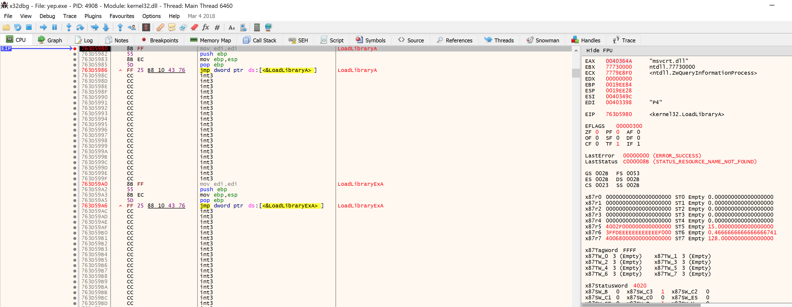  

<br/>

Removed the current breakpoint by hitting `F2`. Now we have to determine which part of `yep.exe` invoked `LoadLibraryA`.

<br/>

To do so, click on the top of the Stack area in the **CPU tab**. Right click and choose `Follow DWORD in Disassembler`:

  

<br/>

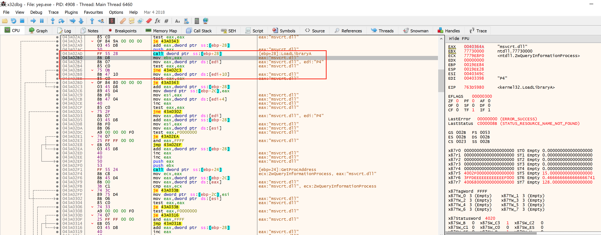  

- Click on `43A02B0` and hit `F4` to allow the program finish the execution of `LoadLibraryA`

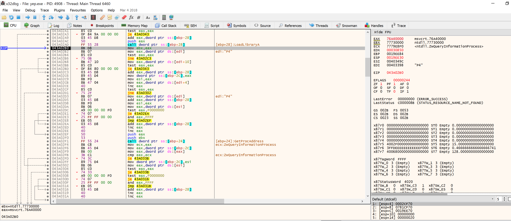  


<br/>

---

## 4 - Locate the call to VirtualProtect that yep.exe executes after returning from LoadLibrary, and then use x32dbg to pause the specimen before it calls VirtualProtect

At `43A02B0`, scroll down and we can see an API call to `VirtualProtect`:

  

- VA: `43A03B5`
- `VirtualProtect` worths checking since it is related to code injection and unpacking

<br/>

Click on the row of `43A03B5` and hit `F4`:

  

- https://docs.microsoft.com/en-us/windows/win32/api/memoryapi/nf-memoryapi-virtualprotect
- Purpose:
  - Changes the protection on a region of committed pages in the virtual address space of the calling process.
- Parameters:
  - `lpAddress`: The address of the starting page of the region of pages whose access protection attributes are to be changed.
    - `[ebp-28]` --> `00400000` --> The address of the starting page of the region will be `0x400000`
  - `dwSize`: The size of the region whose access protection attributes are to be changed, in bytes.
    - `1000` --> 1000 bytes
  - `flNewProtect`: The memory protection option.
    - https://docs.microsoft.com/en-us/windows/win32/memory/memory-protection-constants
    - `2` --> `PAGE_READONLY`
  - `lpflOldProtect`: A pointer to a variable that receives the previous access protection value of the first page in the specified region of pages. If this parameter is NULL or does not point to a valid variable, the function fails.
    - `esi` --> `0019EE70`

<br/>

---

## 5 - Examine yep.exe's memory region upon which VirtualProtect is operating by displaying it in the Dump area of x32dbg's CPU tab

On the top of the parameters, where the parameter `lpAddress` resides, right-click and `Follow [19EE20] in Dump`:

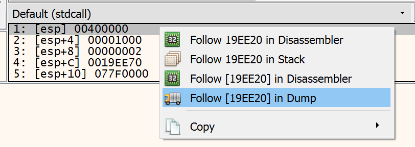  

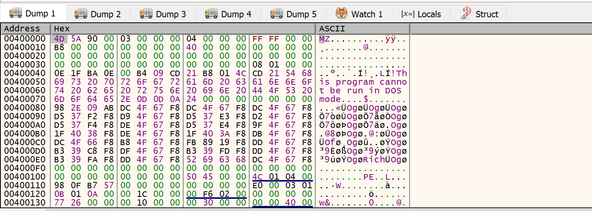  

- Start with `PE` --> Windows executable

<br/>

---

## 6 - Allow yep.exe to execute until the second call to VirtualProtect in x32dbg, which is 35 instructions below the VirtualProtect call where the specimen is currently paused

Scroll down further we can see another `VirtualProtect` call:

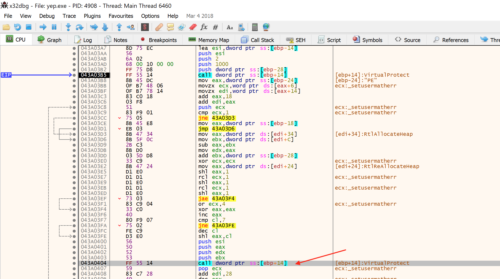  

- VA: `43A0404`

<br/>

Click on the call and hit `F2` to toggle a breakpoint. Then run the program:

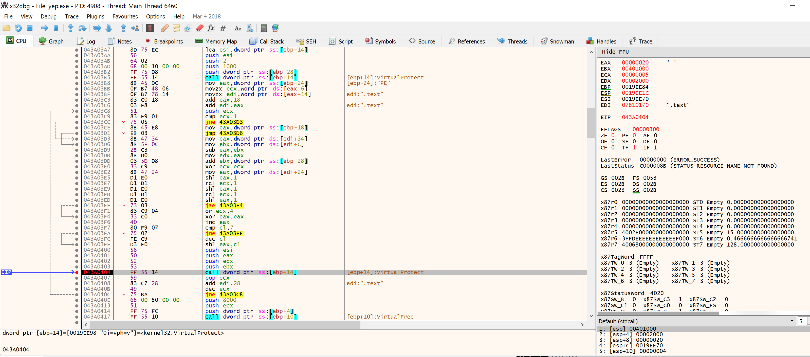  

- https://docs.microsoft.com/en-us/windows/win32/api/memoryapi/nf-memoryapi-virtualprotect
- Purpose:
  - Changes the protection on a region of committed pages in the virtual address space of the calling process.
- Parameters:
  - `lpAddress`: The address of the starting page of the region of pages whose access protection attributes are to be changed.
    - `401000` --> This is right after the previous `VirtualProtect` call
  - `dwSize`: The size of the region whose access protection attributes are to be changed, in bytes.
    - `2000` --> 2000 bytes
  - `flNewProtect`: The memory protection option.
    - https://docs.microsoft.com/en-us/windows/win32/memory/memory-protection-constants
    - `20` --> `PAGE_EXECUTE_READ`
  - `lpflOldProtect`: A pointer to a variable that receives the previous access protection value of the first page in the specified region of pages. If this parameter is NULL or does not point to a valid variable, the function fails.
    - `0019EE70`

<br/>

---

## 7 - Use x32dbg to set a breakpoint in the newly allocated memory region to catch yep.exe when it attempts to execute code extracted into that part of memory

First, on the stack, right-click the 1st parameter and choose `Follow [...] in Dump`:

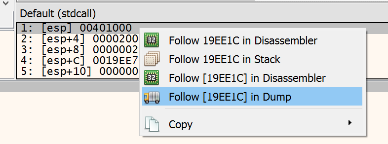  

<br/>

In the **Dump area**, right click and choose `Breakpoint > Hardware, Execute`:

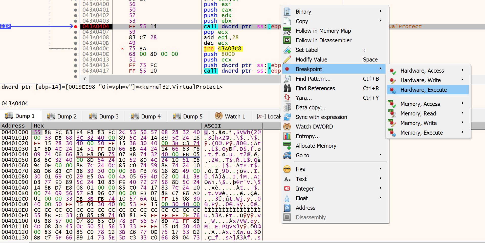  

<br/>

Remove the breakpoint set on the `VirtualProtect`  call. Run the program by hitting `F9`:

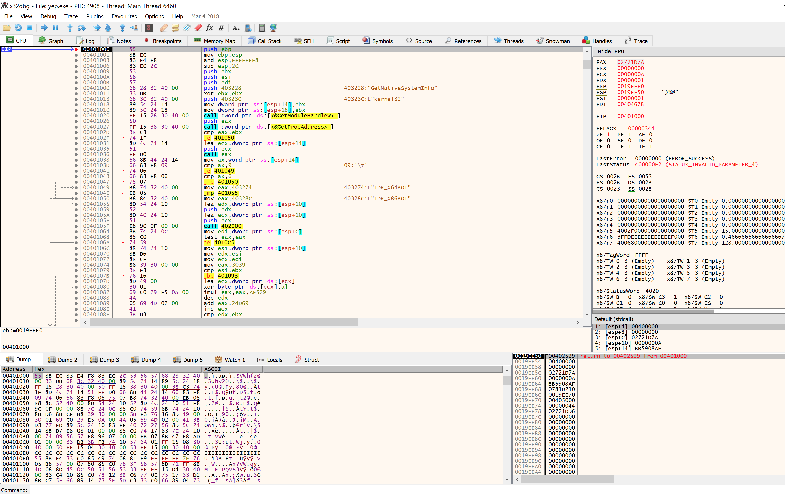  

<br/>

---

## 8 - Use the Memory Map tab in x32dbg to save contents of the memory region that contain yep.exe's unpacked code as the file named yep-dumped.exe

Right click on the Dump area, choose `Follow in Memory Map`:

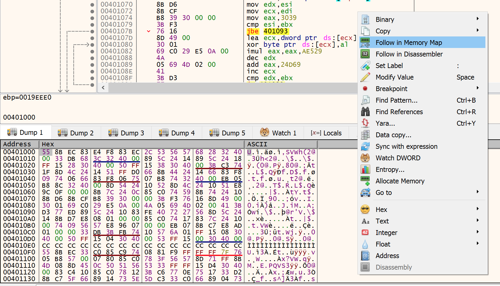  

<br/>

On that row, right click and select `Dump Memory to File`:

  

<br/>

Note in the **Memory Map** the region is showing `R` only.

However, if we inspect `Set Page Memory Right`, we can see `401000-402000` has execute `E` flag set:

  

<br/>

---

## 9 - Use pe_unmapper on the Windows REM Workstation to fix up yep-dumped.exe, naming the new file yep-dumped-fixed.exe

Sometimes the PE file dumped requires post-processing to make rebasing and other tweaks. We can use `pe_unmapper` to accomplish this:

```
pe_unmapper yep-dumped.exe 400000 yep-dumped-fixed.exe
```

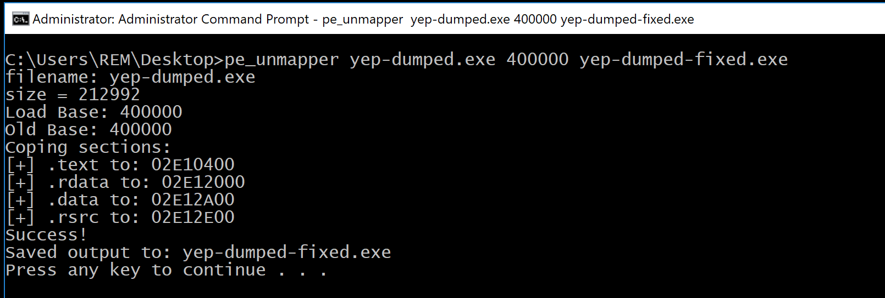  

<br/>

---

## 10 - Invoke Scylla from within x32dbg and fix the IAT in the yep-dumped-fixed.exe file

On `x32dbg`, click `Plugins > Scylla`:

  

<br/>

1. IAT Autosearch
2. Get Imports
3. Fix Dump

  

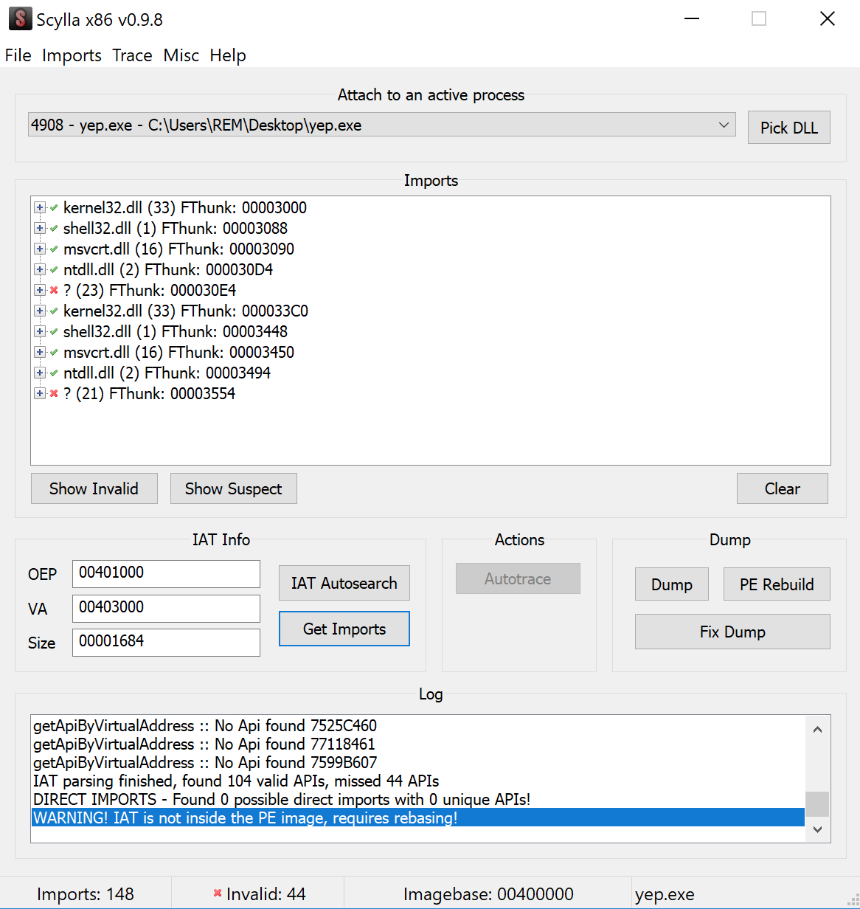  

<br/>

After clicking `Fix Dump`, choose `yep-dumped-fixed.exe`.

  

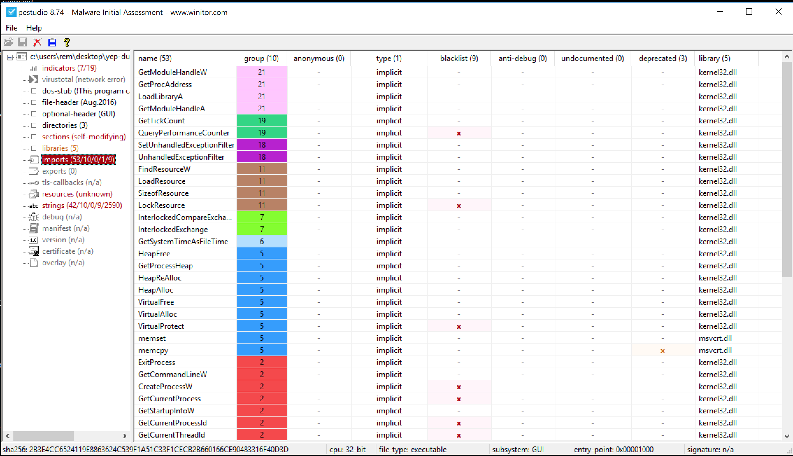  


<br/>

---