# Lab 5.13: Extracting the Code Injected by known.exe Using Process Hacker

- [Lab 5.13: Extracting the Code Injected by known.exe Using Process Hacker](#lab-513-extracting-the-code-injected-by-knownexe-using-process-hacker)
  - [Objectives](#objectives)
  - [Steps](#steps)
  - [1 - If time allows, examine known.vmem on REMnux by using Volatility to locate the code that known.exe might have injected into legitimate processes, such as explorer.exe](#1---if-time-allows-examine-knownvmem-on-remnux-by-using-volatility-to-locate-the-code-that-knownexe-might-have-injected-into-legitimate-processes-such-as-explorerexe)
  - [2 - Infect the Windows REM Workstation with known.exe, and locate the newly spawned explorer.exe process in the Process Hacker listing](#2---infect-the-windows-rem-workstation-with-knownexe-and-locate-the-newly-spawned-explorerexe-process-in-the-process-hacker-listing)
  - [3 - Use Process Hacker to extract injected code from the memory of the newly spawned explorer.exe process, naming the file explorer-dumped.exe](#3---use-process-hacker-to-extract-injected-code-from-the-memory-of-the-newly-spawned-explorerexe-process-naming-the-file-explorer-dumpedexe)
  - [4 - Use pe_unmapper to fix up the explorer-dumped.exe file, generating the file named explorer-dumped-fixed.exe](#4---use-pe_unmapper-to-fix-up-the-explorer-dumpedexe-file-generating-the-file-named-explorer-dumped-fixedexe)

---

## Objectives

- Use memory forensics to reinforce the key principles of code injection techniques.
- Learn know to use Process Hacker together with pe_unmapper to locate and extract code injected into legitimate processes.

<br/>

---

## Steps

1. If time allows, examine `known.vmem` on REMnux by using **Volatility** to locate the code that `known.exe` might have injected into legitimate processes, such as `explorer.exe`.
2. Infect the Windows REM Workstation with `known.exe`, and locate the newly spawned `explorer.exe` process in the **Process Hacker** listing.
3. Use **Process Hacker** to extract injected code from the memory of the newly spawned `explorer.exe` process, naming the file `explorer-dumped.exe`.
4. Use `pe_unmapper` to fix up the `explorer-dumped.exe` file, generating the file named `explorer-dumped-fixed.exe`.
   
<br/>

---

## 1 - If time allows, examine known.vmem on REMnux by using Volatility to locate the code that known.exe might have injected into legitimate processes, such as explorer.exe

First a suitable volatility profile to use:

```
vol.py -f known.vmem kdbgscan
```

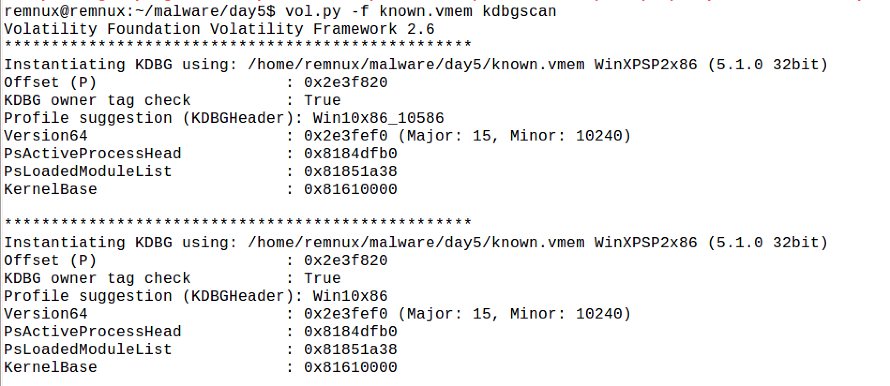  

<br/>

Export the name of the suitable profile:

```
export VOLATILITY_PROFILE=Win10x86
```

<br/>

To look for code injection, we can use the `malfind` plugin:

```
vol.py -f known.vmem malfind -D /tmp > known-malfind.txt
scite known-malfind.txt &
```

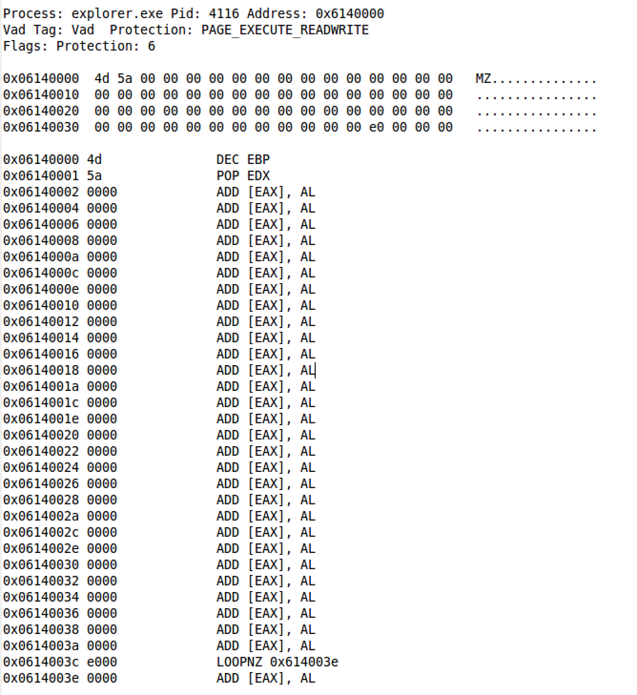  

- There is a PE file injected into the `explorer.exe` process starting at `0x614000`

<br/>

We can check the strings of the dump:

```
pestr /tmp/process*614000* | more
```

  

<br/>

Make a copy of the dump file:

```
cp /tmp/process*614000* 614000-explorer-dumped.bin
```

<br/>

Download this on Windows and use `pe_unmapper` to fix it:

```
sudo python -m SimpleHTTPServer 80
```

<br/>

```
certutil -urlcache -f http://172.16.252.128/614000-explorer-dumped.bin .\614000-explorer-dumped.bin
pe_unmapper 614000-explorer-dumped.bin 614000 614000-explorer-dumped-fixed.bin
```

  

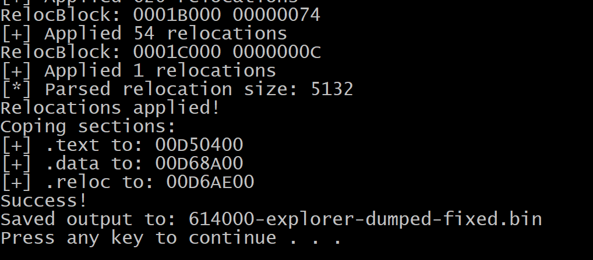  

<br/>

Inspect it on **PEStudio**:

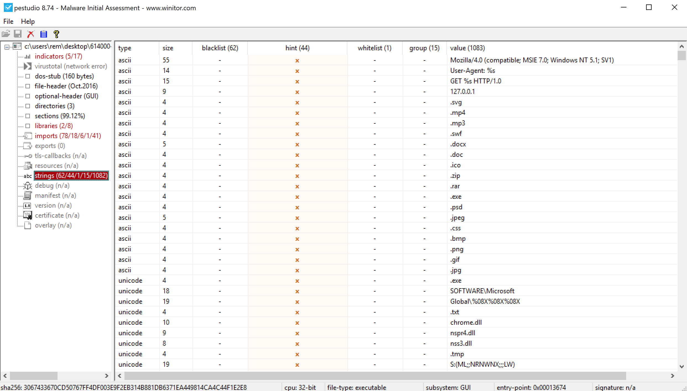  

<br/>

---

## 2 - Infect the Windows REM Workstation with known.exe, and locate the newly spawned explorer.exe process in the Process Hacker listing

Launch **Process Hacker**:

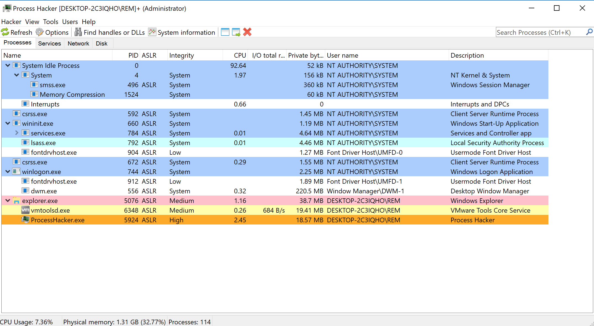  

<br/>

Then run `known.exe` as admin:

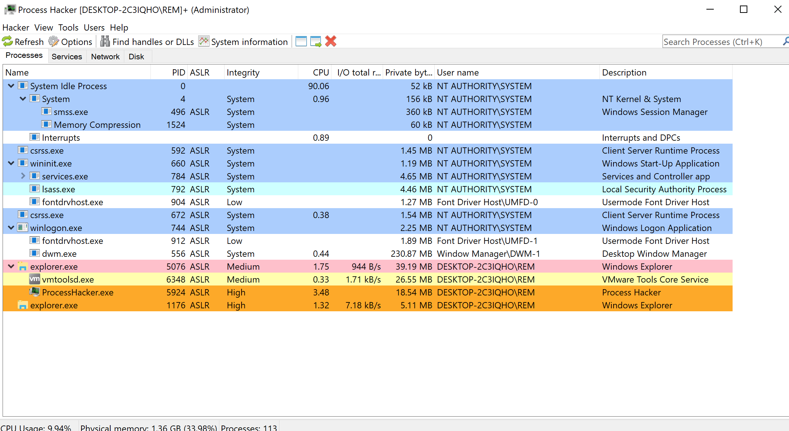  

- We can see a new `explorer.exe`
- `PID` = 1176 in this case

<br/>

---

## 3 - Use Process Hacker to extract injected code from the memory of the newly spawned explorer.exe process, naming the file explorer-dumped.exe

In **Process Hacker**, right click the spawned `explorer.exe` and select `Properties`.

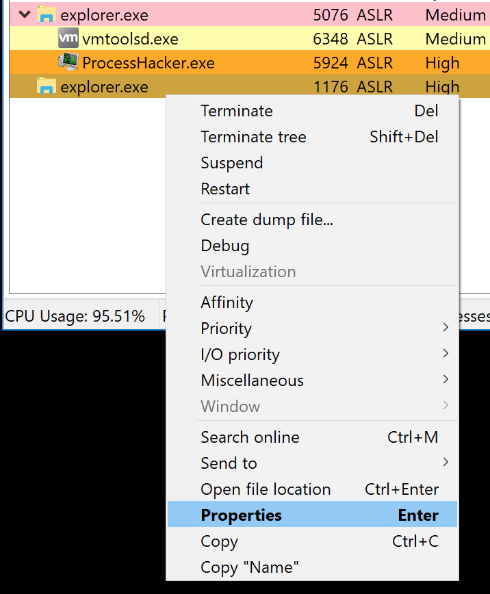  

<br/>

From the memory analysis, we know that the injected code is around 132K bytes. Locate a memory region with size of 132K bytes:

  

- Note the Execute flag `X`
- Base address: `2bb0000`

<br/>

Double click the region and we can see the Windows PE magic bytes `MZ`:

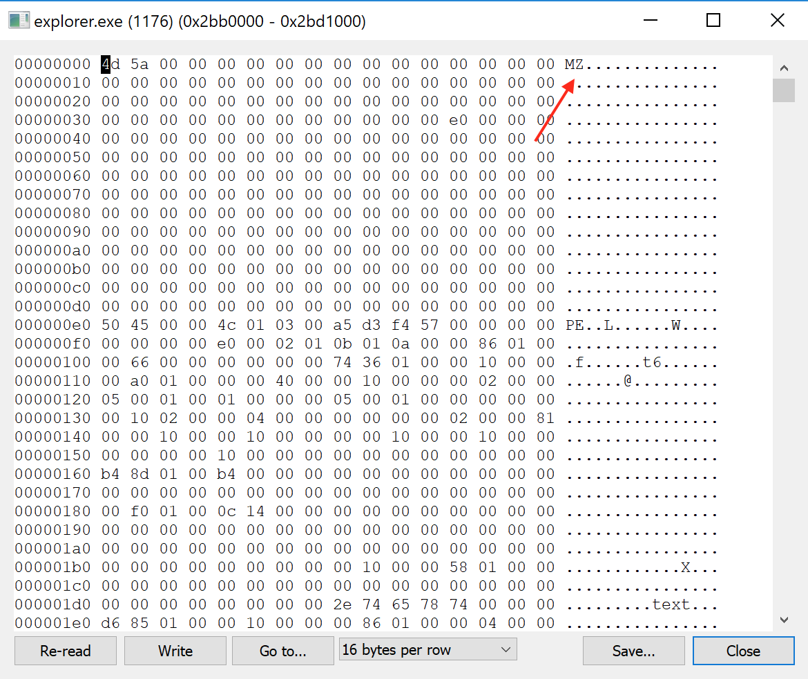  

<br/>

Click `Save ...` and name it `explorer-dumped.exe`:

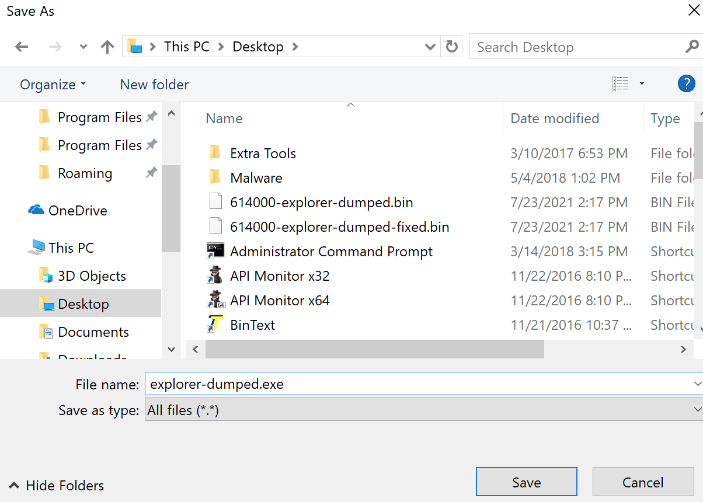  

<br/>

---

## 4 - Use pe_unmapper to fix up the explorer-dumped.exe file, generating the file named explorer-dumped-fixed.exe

Try to open the dump file in **PeStudio**:

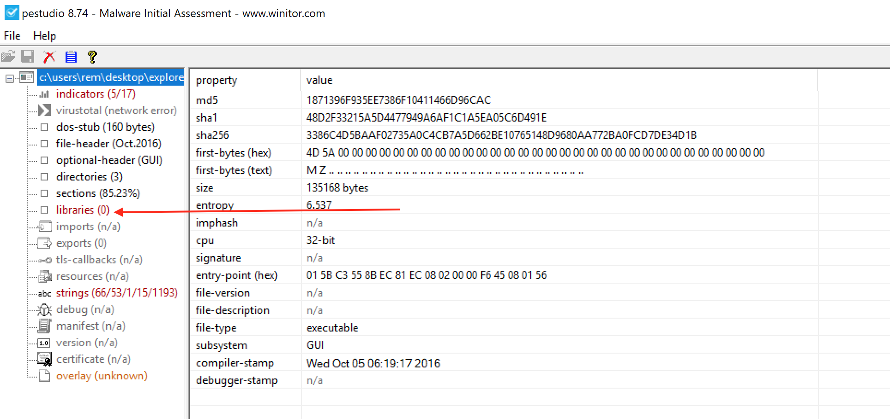  

- Null import table

<br/>

To fix, use `pe_unmapper`:

```
pe_unmapper explorer-dumped.exe 2bb0000 explorer-dumped-fixed.exe
```

  

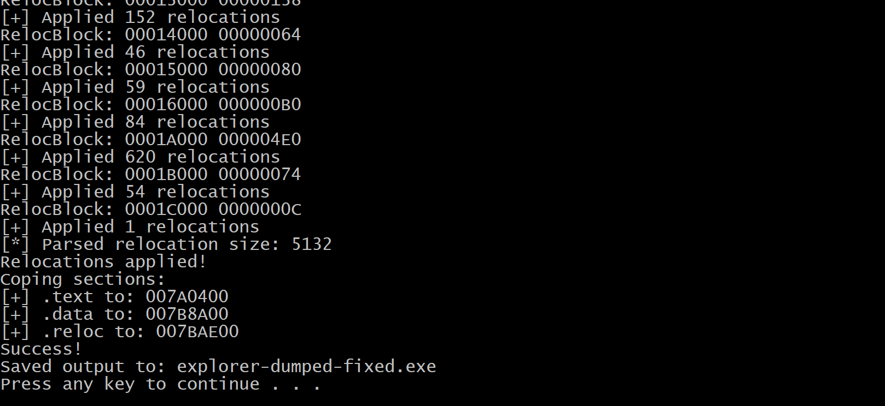  

<br/>

Check it on **PeStudio** again:

  

<br/>

---