# Lab 5.14: Locating Injected Code Inside explorer.exe with the Help of x32dbg

- [Lab 5.14: Locating Injected Code Inside explorer.exe with the Help of x32dbg](#lab-514-locating-injected-code-inside-explorerexe-with-the-help-of-x32dbg)
  - [Objectives](#objectives)
  - [Steps](#steps)
  - [1 - Load known.exe in x32dbg set breakpoints on CreateProcessA and CreateProcessW, and then run the specimen in the debugger to trigger one of them](#1---load-knownexe-in-x32dbg-set-breakpoints-on-createprocessa-and-createprocessw-and-then-run-the-specimen-in-the-debugger-to-trigger-one-of-them)
  - [2 - Use x32dbg to examine the code in known.exe that invoked CreateProcessW to see the value of the dwCreationFlags parameter that the specimen supplied to this API call](#2---use-x32dbg-to-examine-the-code-in-knownexe-that-invoked-createprocessw-to-see-the-value-of-the-dwcreationflags-parameter-that-the-specimen-supplied-to-this-api-call)
  - [3 - Allow known.exe to finish executing the CreateProcessW, pausing the specimen's execution in x32dbg at offset 4028AE](#3---allow-knownexe-to-finish-executing-the-createprocessw-pausing-the-specimens-execution-in-x32dbg-at-offset-4028ae)
  - [4 - Launch a new instance of x32dbg and use it to attach to the newly spawned (but still suspended) explorer.exe process](#4---launch-a-new-instance-of-x32dbg-and-use-it-to-attach-to-the-newly-spawned-but-still-suspended-explorerexe-process)
  - [5 - Modify options of x32dbg that are attached to explorer.exe so that the debugger will pause at Thread Entry](#5---modify-options-of-x32dbg-that-are-attached-to-explorerexe-so-that-the-debugger-will-pause-at-thread-entry)
  - [6 - Allow known.exe to continue running in its x32dbg instance, and then allow the infected explorer.exe process to run in its x32dbg instance until it tries to enter a thread](#6---allow-knownexe-to-continue-running-in-its-x32dbg-instance-and-then-allow-the-infected-explorerexe-process-to-run-in-its-x32dbg-instance-until-it-tries-to-enter-a-thread)
  - [7 - Allow explorer.exe to run in x32dbg again until it reaches the next thread entry, and then examine the strings in that memory region to assess whether you're looking at malicious code](#7---allow-explorerexe-to-run-in-x32dbg-again-until-it-reaches-the-next-thread-entry-and-then-examine-the-strings-in-that-memory-region-to-assess-whether-youre-looking-at-malicious-code)

---

## Objectives

- Learn how to use x32dbg to attach to a running process.
- Learn how to use x32dbg to catch injected code in the beginning of its execution, so you can examine it using code-level dynamic analysis techniques.

<br/>

---

## Steps

1. Load `known.exe` in **x32dbg** set breakpoints on `CreateProcessA` and `CreateProcessW`, and then run the specimen in the debugger to trigger one of them.
2. Use **x32dbg** to examine the code in `known.exe` that invoked `CreateProcessW` to see the value of the `dwCreationFlags` parameter that the specimen supplied to this API call.
3. Allow `known.exe` to finish executing the `CreateProcessW`, pausing the specimen's execution in **x32dbg** at offset `4028AE`.
4. Launch a new instance of **x32dbg** and use it to attach to the newly spawned (but still suspended) `explorer.exe` process.
5. Modify options of **x32dbg** that are attached to `explorer.exe` so that the debugger will pause at Thread Entry.
6. Allow `known.exe` to continue running in its **x32dbg** instance, and then allow the infected `explorer.exe` process to run in its **x32dbg** instance until it tries to enter a thread.
7. Allow explorer.exe to run in x32dbg again until it reaches the next thread entry, and then examine the strings in that memory region to assess whether you're looking at malicious code.

<br/>

---

## 1 - Load known.exe in x32dbg set breakpoints on CreateProcessA and CreateProcessW, and then run the specimen in the debugger to trigger one of them

First load `known.exe` into **x32dbg**.

<br/>

To set breakpoints on `CreateProcessA` and `CreateProcessW`, we can use the following commands:

```
SetBPX CreateProcessA
SetBPX CreateProcessW
```

<br/>

Then review in the `Breakpoints` tab:

  

<br/>

Run the program by hitting `F9`:

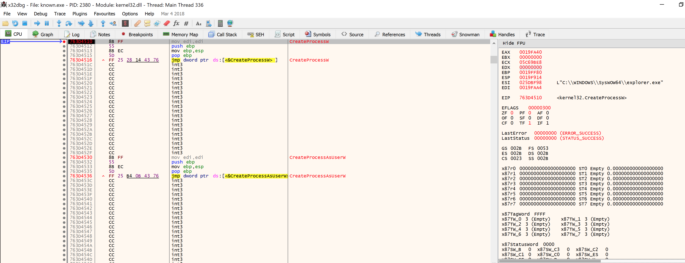  

<br/>

---

## 2 - Use x32dbg to examine the code in known.exe that invoked CreateProcessW to see the value of the dwCreationFlags parameter that the specimen supplied to this API call

Take a look at the MSDOC about `CreateProcessW`:

- https://docs.microsoft.com/en-us/windows/win32/api/processthreadsapi/nf-processthreadsapi-createprocessw
- Purpose:
  - Creates a new process and its primary thread. The new process runs in the security context of the calling process.
  - If the calling process is impersonating another user, the new process uses the token for the calling process, not the impersonation token. 
- Parameters:
  - `lpApplicationName`
    - The name of the module to be executed. This module can be a Windows-based application.
  - `lpCommandLine`
    - The command line to be executed.
  - `lpProcessAttributes`
    - A pointer to a SECURITY_ATTRIBUTES structure that determines whether the returned handle to the new process object can be inherited by child processes. If lpProcessAttributes is NULL, the handle cannot be inherited.
  - `lpThreadAttributes`
    - A pointer to a SECURITY_ATTRIBUTES structure that determines whether the returned handle to the new thread object can be inherited by child processes. If lpThreadAttributes is NULL, the handle cannot be inherited.
  - `bInheritHandles`
    - If this parameter is TRUE, each inheritable handle in the calling process is inherited by the new process. If the parameter is FALSE, the handles are not inherited. Note that inherited handles have the same value and access rights as the original handles. 
  - `dwCreationFlags`
    - The flags that control the priority class and the creation of the process.
    - Control flags: https://docs.microsoft.com/en-us/windows/desktop/ProcThread/process-creation-flags
  - `lpEnvironment`
    - A pointer to the environment block for the new process. If this parameter is NULL, the new process uses the environment of the calling process.
  - `lpCurrentDirectory`
    - The full path to the current directory for the process. The string can also specify a UNC path.
  - `lpStartupInfo`
    - A pointer to a STARTUPINFO or STARTUPINFOEX structure.
  - `lpProcessInformation`
    - A pointer to a PROCESS_INFORMATION structure that receives identification information about the new process.
- Return value
  - If the function succeeds, the return value is nonzero.
  - If the function fails, the return value is zero.

<br/>

  

- Note that `lpApplicationName` is `C:\\Windows\\SysWOW64\\explorer.exe`, the 32-bit version of `explorer.exe`

<br/>

To check what invoked `CreateProcessW`, on the top of the stack, right-click and select `Follow DWORD in Disassembler` (`Enter`):

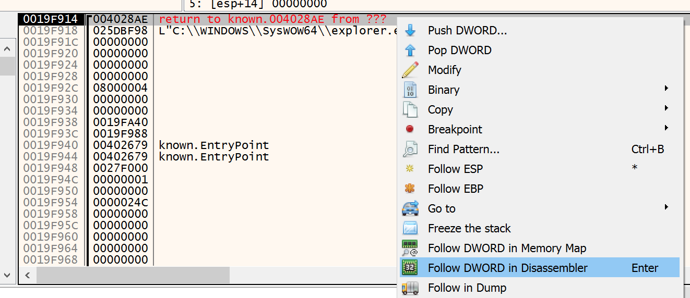  

<br/>

  

- The `dwCreationFlags` is the 6th parameter

<br/>

  

- `8000004` -> If the right-most value is `4`, it means `CREATE_SUSPENDED`

<br/>

---

## 3 - Allow known.exe to finish executing the CreateProcessW, pausing the specimen's execution in x32dbg at offset 4028AE

Click on `4028AE` and hit `F4`:

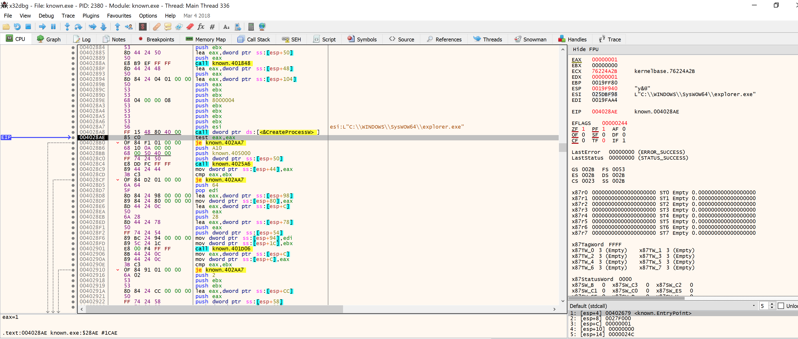  

<br/>

---

## 4 - Launch a new instance of x32dbg and use it to attach to the newly spawned (but still suspended) explorer.exe process

Now if we use **Process Hacker** to see the running process, we can see an instance of `explorer.exe` is spawned as a child process of `known.exe`, grandparent process being `x32dbg.exe`.

  

<br/>

Run another **x32dbg** and attach the `explorer.exe` spanwed (PID: 1804):

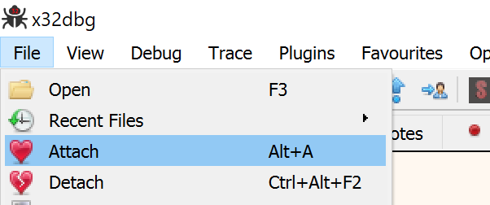  

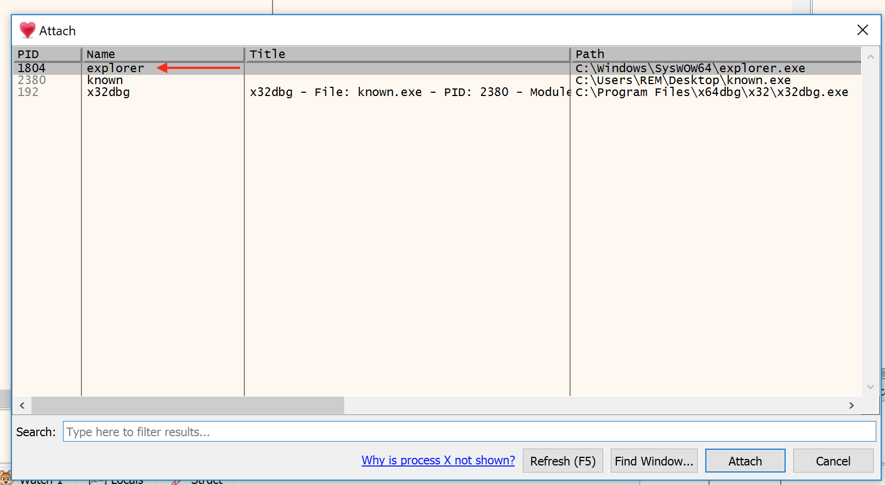  

<br/>

However it shows `Anti-Anti-Attach failed`:

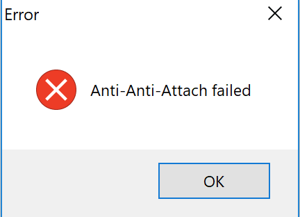  

<br/>

Still it is successfully loaded:

<br/>

---

## 5 - Modify options of x32dbg that are attached to explorer.exe so that the debugger will pause at Thread Entry

To make to debugger pause at **Thread Entry**, click `Options > Preferences`:

  

<br/>

`Event tab > Thread Entry`:

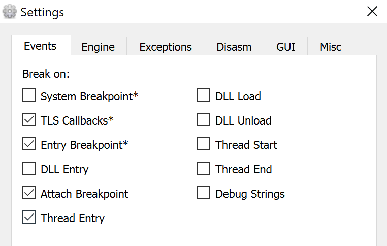  

<br/>

---

## 6 - Allow known.exe to continue running in its x32dbg instance, and then allow the infected explorer.exe process to run in its x32dbg instance until it tries to enter a thread

On `x32dbg` loaded with `known.exe`, hit `F9`:

  

<br/>

On `x32dbg` loaded with `explorer.exe`, hit `F9`:

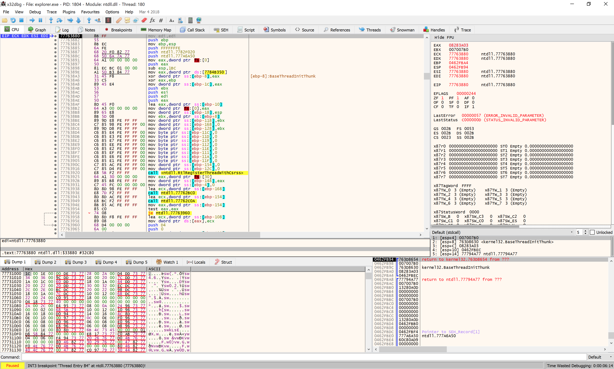  

- As shown, it pauses at the `Thread Entry` at `77763880`
- However, it is in the module `ntdll.dll`, which is not our concern in context

<br/>

---

## 7 - Allow explorer.exe to run in x32dbg again until it reaches the next thread entry, and then examine the strings in that memory region to assess whether you're looking at malicious code

Run until the Module is not Windows DLLs:

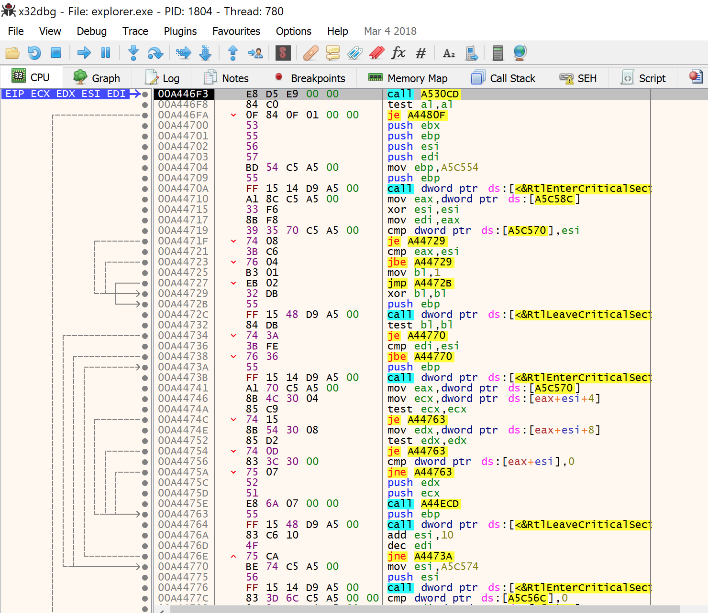  

<br/>

To see if it is unpacked, try to inspect the strings in the region:

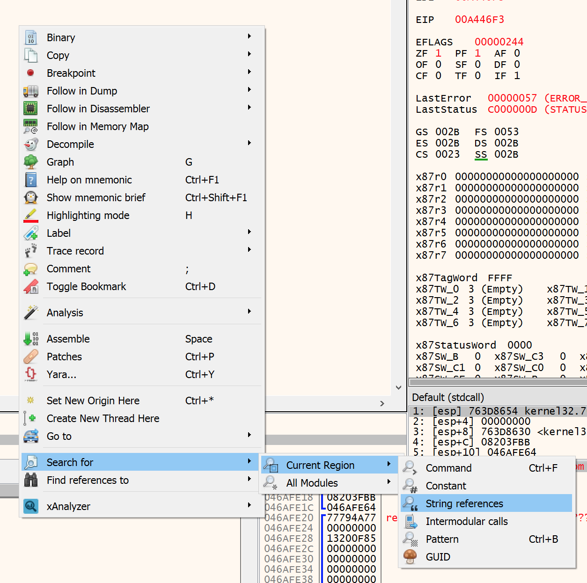  

<br/>

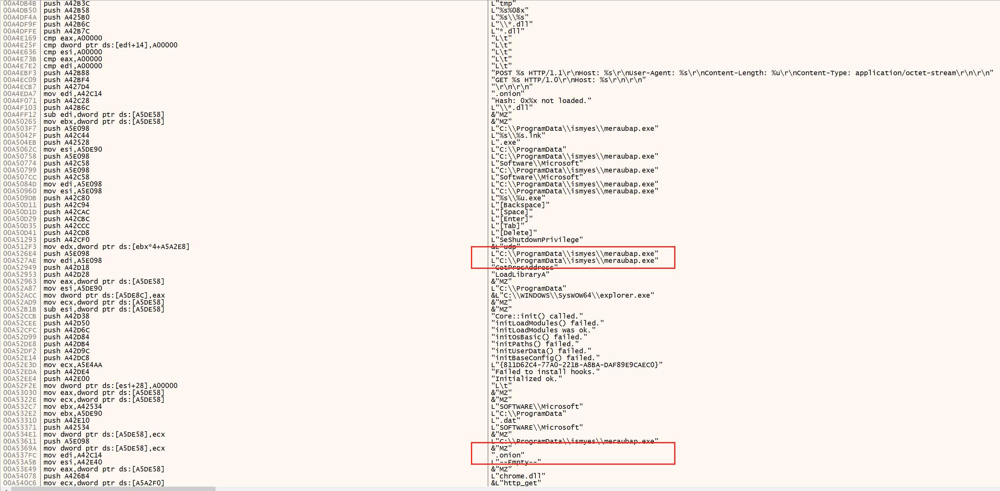  

- Some interesting strings are shown

<br/>

---