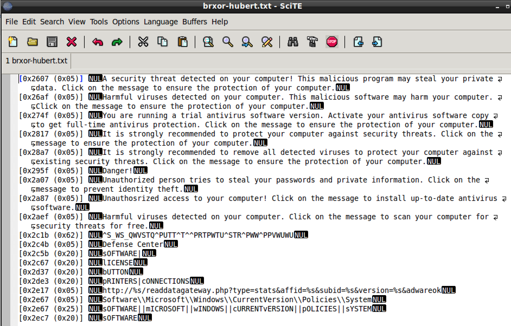
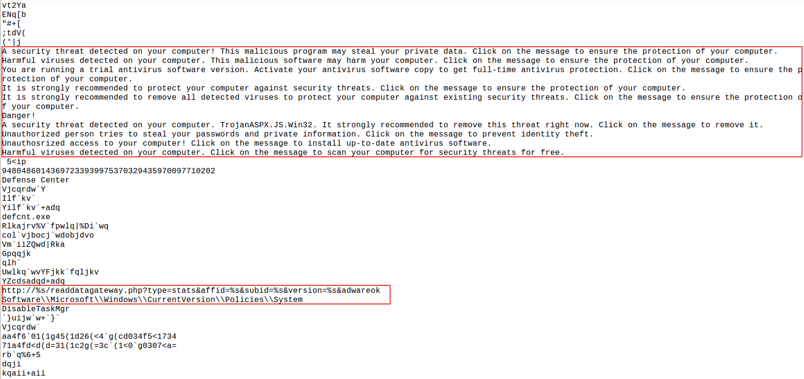
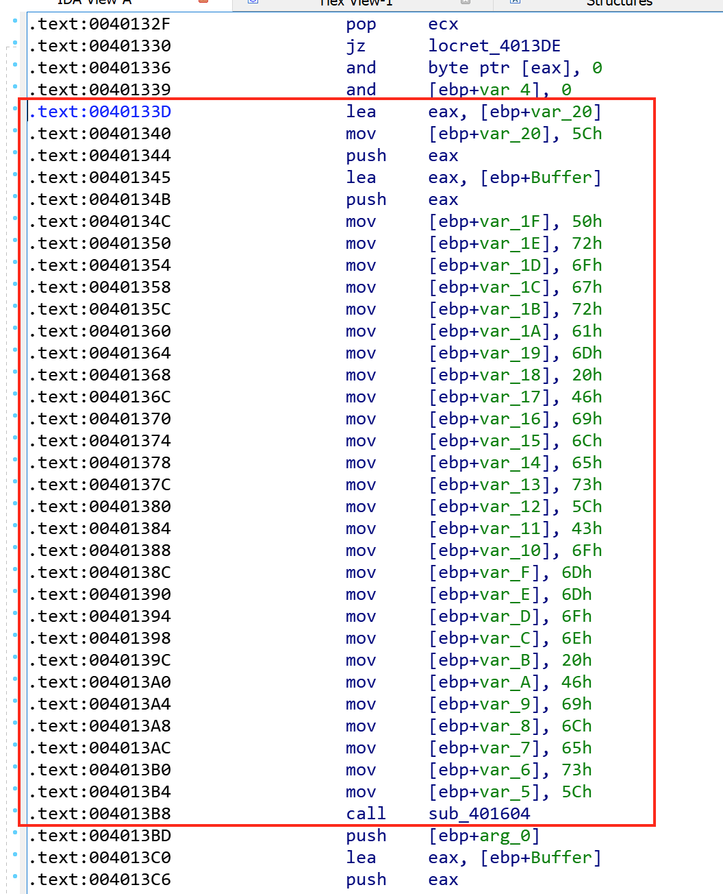
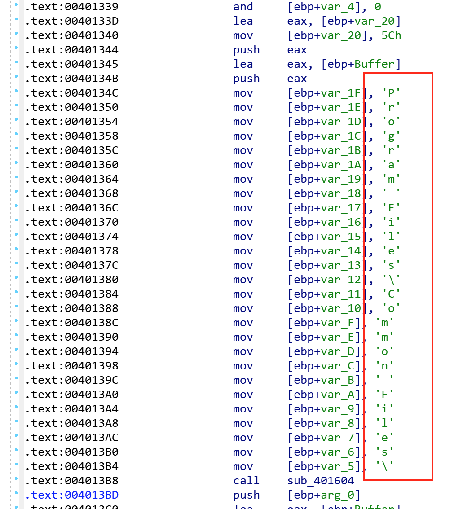
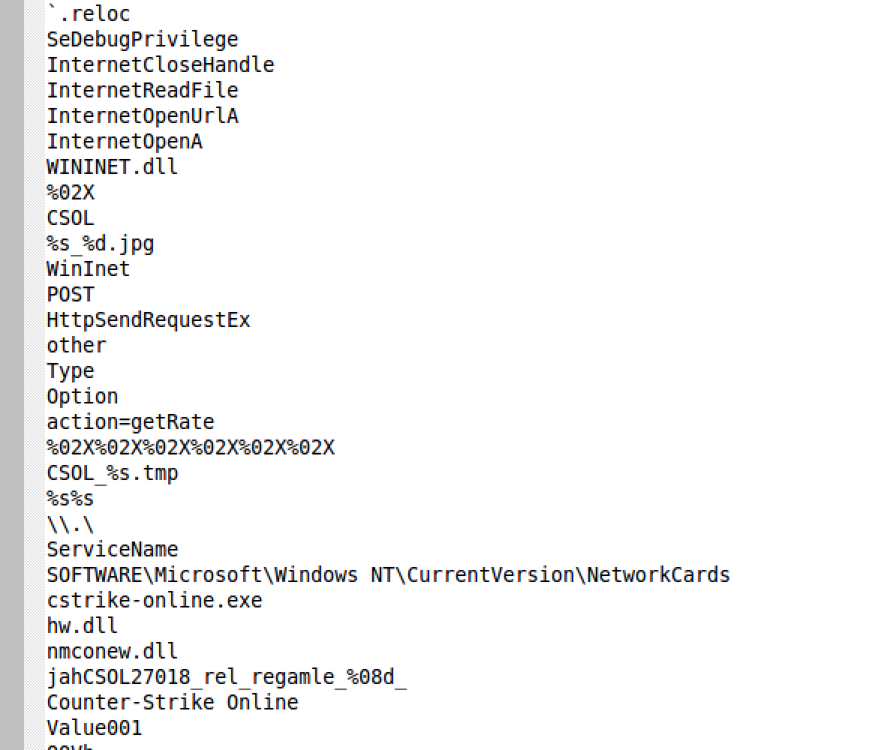
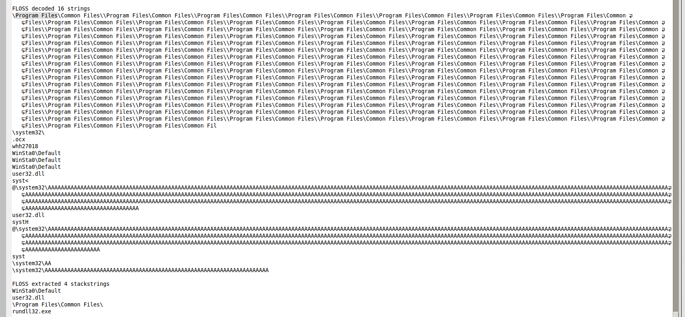

# Lab 5.2: Deobfuscating String Encoded Using Simple and Common Algorithms

- [Lab 5.2: Deobfuscating String Encoded Using Simple and Common Algorithms](#lab-52-deobfuscating-string-encoded-using-simple-and-common-algorithms)
  - [Objectives](#objectives)
  - [Steps](#steps)
  - [1 - Use XORSearch on REMnux to locate the malicious URL obfuscated inside getdown.exe](#1---use-xorsearch-on-remnux-to-locate-the-malicious-url-obfuscated-inside-getdownexe)
  - [2 - Use brxor.py and bbcrack.py on REMnux to deobfuscate strings concealed within hubert.dll](#2---use-brxorpy-and-bbcrackpy-on-remnux-to-deobfuscate-strings-concealed-within-hubertdll)
  - [3 - Load 9.exe into IDA on the Windows REM Workstation and examine the code between 40133D and 4013B8 to locate a concealed stack string](#3---load-9exe-into-ida-on-the-windows-rem-workstation-and-examine-the-code-between-40133d-and-4013b8-to-locate-a-concealed-stack-string)
  - [4 - Use strdeob.pl and FLOSS on REMnux to automatically decode stack strings from 9.exe](#4---use-strdeobpl-and-floss-on-remnux-to-automatically-decode-stack-strings-from-9exe)

---

## Objectives

- Learn common string obfuscation techniques employed by malware.
- Become familiar with using XORSearch, brxor.py, bbcrack.py, strdeon.pl, and FLOSS for decoding strings encoded using common simple techniques.

<br/>

---

## Steps

1. Use `XORSearch` on REMnux to locate the malicious URL obfuscated inside `getdown.exe`.
2. Use `brxor.py` and `bbcrack.py` on REMnux to deobfuscate strings concealed within `hubert.dll`.
3. Load `9.exe` into **IDA** on the Windows REM Workstation and examine the code between `40133D` and `4013B8` to locate a concealed stack string.
4. Use `strdeob.pl` and `FLOSS` on REMnux to automatically decode stack strings from `9.exe`.

<br/>

---

## 1 - Use XORSearch on REMnux to locate the malicious URL obfuscated inside getdown.exe

First try to use `strings` to obtain the IP address we know:

```
strings getdown.exe | grep "1."
strings --encoding=l getdown.exe | grep "1."
```

  

- As shown, the IP address `1.234.27.146` is not detected

<br/>

Try to use `xorsearch` to look for the pattern `1.`:

```
xorsearch -i -s getdown.exe 1.
```

- `-i` switch = case-insensitive

  

- As shown, we can see the URL `1.234.27.146/pcfix.exe`

<br/>

---

## 2 - Use brxor.py and bbcrack.py on REMnux to deobfuscate strings concealed within hubert.dll

`brxor.py` can be used to extract obfuscated English words. Try to use it to scan `hubert.dll`:

```
brxor.py hubert.dll > brxor-hubert.txt
scite brxor-hubert.txt &
```

  

<br/>

`bbcrack.py` can be used to identify patterns within the file that might need to be decoded using basic algorithms based on XOR, ROL and ADD, or even multi-level mixture of them.

To use it to scan `hubert.dll` (try only 1 level of transformation):

```
bbcrack.py -l 1 hubert.dll > bbcrack-hubert.txt
scite bbcrack-hubert.txt &
```

  

- `hubert_identity.dll` and `hubert_xor05.dll` are the highest score files

<br/>

Use `strings` command against them:

```
strings hubert_xor05.dll | more
```

  


<br/>

---

## 3 - Load 9.exe into IDA on the Windows REM Workstation and examine the code between 40133D and 4013B8 to locate a concealed stack string

Load `9.exe` into IDA. Hit `g` and type `40133D`:

  

  

- Many `mov [], xxx` instructions
- Could be a stack strings

<br/>

Click on the HEX value and hit `R` to get the ASCII representation:

  

- `Program Files\Common Files\` is revealed

<br/>

---

## 4 - Use strdeob.pl and FLOSS on REMnux to automatically decode stack strings from 9.exe

Also we can use `strdeob.pl` to decode stack strings on REMnux:

```
strdeob.pl 9.exe | more
```

  

<br/>

Additionally `floss` can also be used:

```
floss 9.exe > 9-floss.txt
scite 9-floss.txt &
```

  

  

<br/>

---