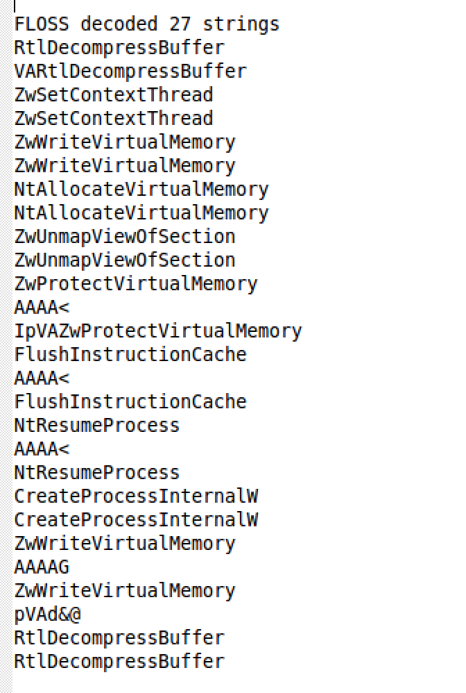
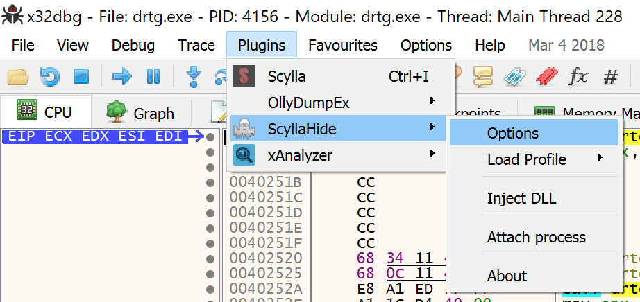
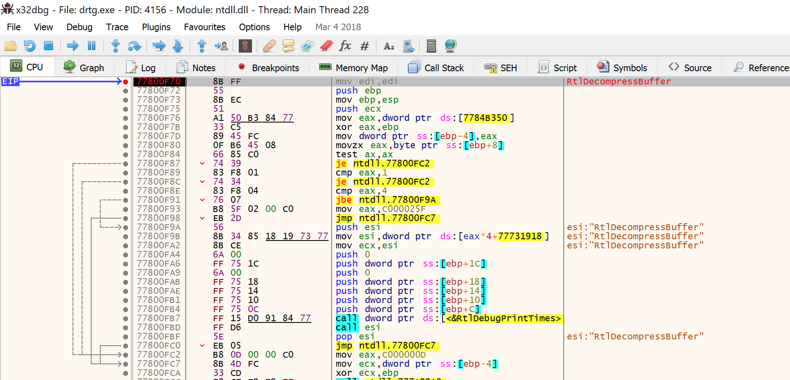
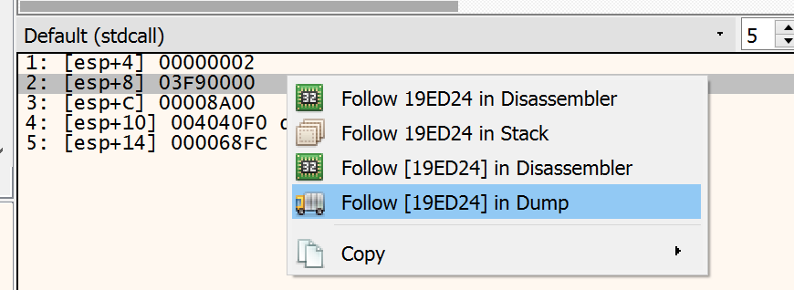
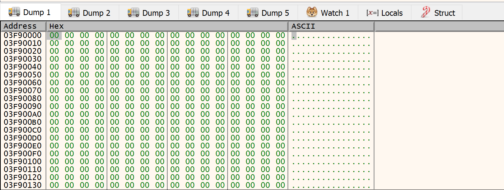
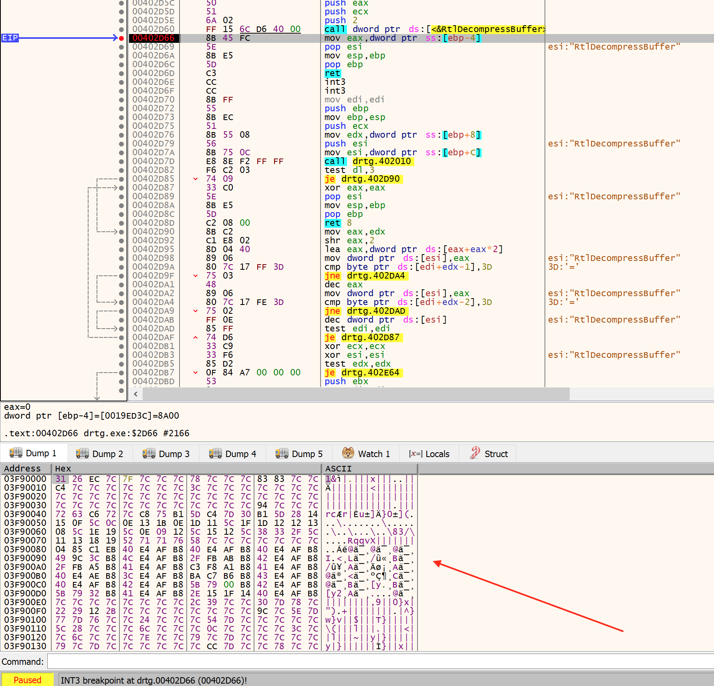
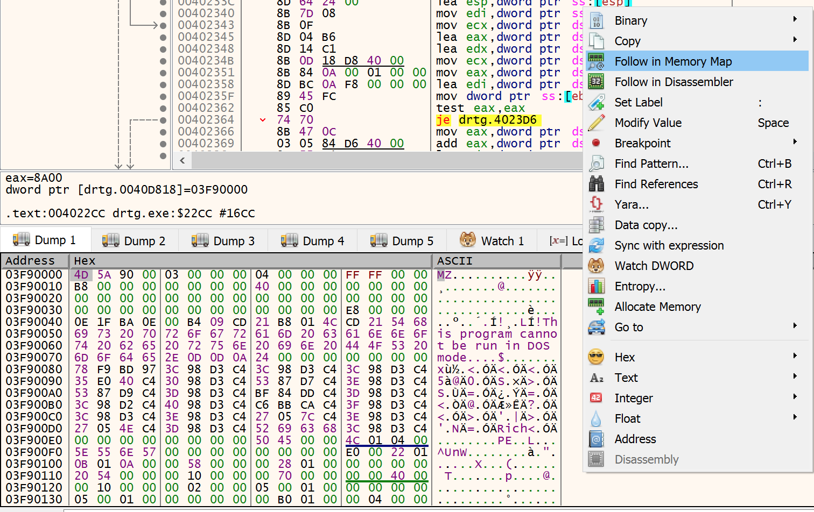
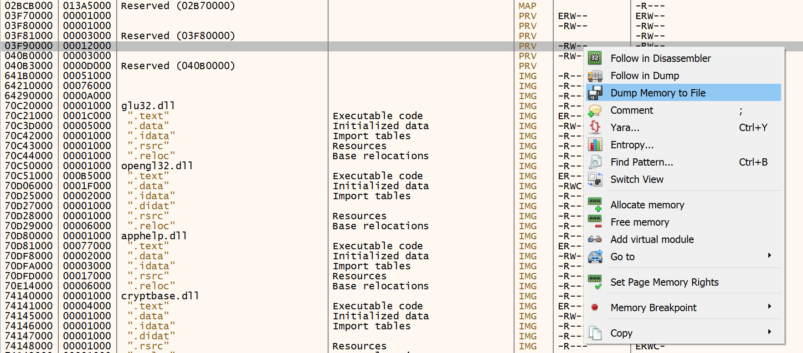
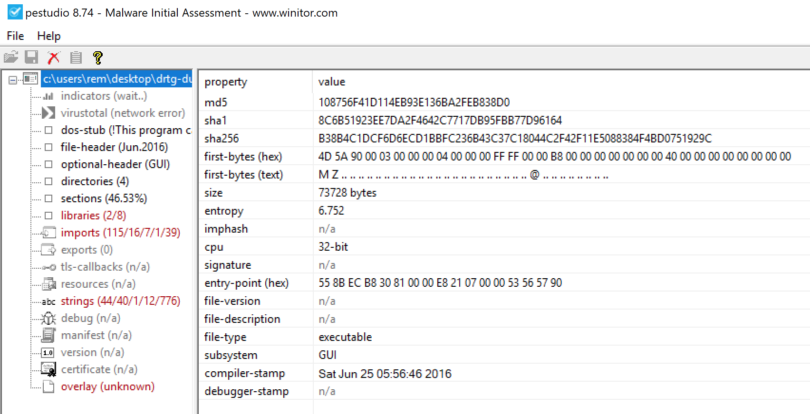
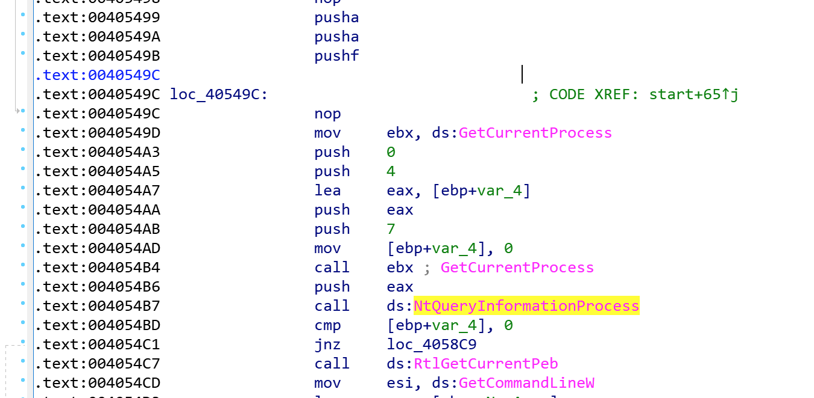

# Lab 5.3: Unpacking drtg.exe

- [Lab 5.3: Unpacking drtg.exe](#lab-53-unpacking-drtgexe)
  - [Objectives](#objectives)
  - [Steps](#steps)
  - [1 - Use FLOSS on REMnux to automatically deobfuscate strings embedded in drtg.exe](#1---use-floss-on-remnux-to-automatically-deobfuscate-strings-embedded-in-drtgexe)
  - [2 - Load drtg.exe into x32dbg on the Windows REM Workstation, and then activate ScyllaHide by enabling the checkboxes in the first column of the plugin's Options window](#2---load-drtgexe-into-x32dbg-on-the-windows-rem-workstation-and-then-activate-scyllahide-by-enabling-the-checkboxes-in-the-first-column-of-the-plugins-options-window)
  - [3 - Set a breakpoint on RtlDecompressBuffer, and then reach it by allowing drtg.exe to run inside x32dbg](#3---set-a-breakpoint-on-rtldecompressbuffer-and-then-reach-it-by-allowing-drtgexe-to-run-inside-x32dbg)
  - [4 - Direct x32dbg to display in the Dump area the contents of the memory address stored in the UncompressedBuffer parameter to RtlDecompressBuffer](#4---direct-x32dbg-to-display-in-the-dump-area-the-contents-of-the-memory-address-stored-in-the-uncompressedbuffer-parameter-to-rtldecompressbuffer)
  - [5 - Allow RtlDecompressBuffer to finish executing so that it pauses at the instruction after the one that called RtlDecompressBuffer](#5---allow-rtldecompressbuffer-to-finish-executing-so-that-it-pauses-at-the-instruction-after-the-one-that-called-rtldecompressbuffer)
  - [6 - Single-step through the code via Step over (F8) until the specimen populates the contents of the Dump area with contents that look like a PE file](#6---single-step-through-the-code-via-step-over-f8-until-the-specimen-populates-the-contents-of-the-dump-area-with-contents-that-look-like-a-pe-file)
  - [7 - Extract the decoded Windows executable from memory, saving it with the help of the Memory Map tab in x32dbg as the file named drtg-dumped.exe](#7---extract-the-decoded-windows-executable-from-memory-saving-it-with-the-help-of-the-memory-map-tab-in-x32dbg-as-the-file-named-drtg-dumpedexe)
  - [8 - Load drtg-dumped.exe in PeStudio to confirm that it's a valid PE file](#8---load-drtg-dumpedexe-in-pestudio-to-confirm-that-its-a-valid-pe-file)
  - [9,10 - Load drtg-dumped.exe in IDA and locate the code that calls NtQueryInformationProcess and examine the attempt of debuggger detection](#910---load-drtg-dumpedexe-in-ida-and-locate-the-code-that-calls-ntqueryinformationprocess-and-examine-the-attempt-of-debuggger-detection)

---

## Objectives

- Reinforce the use of FLOSS for automatically deobfuscating strings embedded in malicious programs.
- Become familiar with the API call RtlDecompressBuffer, which could be used as part of the unpacking process.
- Gain additional experience using x32dbg to unpack malware by dumping its decoded program from the memory of the malicious process.
- Understand how malware can use NtQueryInformationProcess to detect debuggers and how you can use patching to bypass this defensive measure.

<br/>

---

## Steps

1. Use `FLOSS` on REMnux to automatically deobfuscate strings embedded in `drtg.exe`.
2. Load `drtg.exe` into **x32dbg** on the Windows REM Workstation, and then activate `ScyllaHide` by enabling the checkboxes in the first column of the plugin's Options window.
3. Set a breakpoint on `RtlDecompressBuffer`, and then reach it by allowing `drtg.exe` to run inside **x32dbg**.
4. Direct **x32dbg** to display in the **Dump area** the contents of the memory address stored in the `UncompressedBuffer` parameter to `RtlDecompressBuffer`.
5. Allow `RtlDecompressBuffer` to finish executing so that it pauses at the instruction after the one that called `RtlDecompressBuffer`.
6. Single-step through the code via `Step over (F8)` until the specimen populates the contents of the Dump area with contents that look like a PE file.
7. Extract the decoded Windows executable from memory, saving it with the help of the Memory Map tab in **x32dbg** as the file named `drtg-dumped.exe`.
8. Load `drtg-dumped.exe` in **PeStudio** to confirm that it's a valid PE file.
9. Load `drtg-dumped.exe` in IDA and locate the code that calls `NtQueryInformationProcess`.
10. Examine how `drtg-dumped.exe` uses `NtQueryInformationProcess` near offset `4054B7` for
debugger detection and determine how you could bypass this defense.

<br/>

---

## 1 - Use FLOSS on REMnux to automatically deobfuscate strings embedded in drtg.exe

Use `floss` against `drtg.exe`:

```
floss drtg.exe > floss-drtg.txt
scite floss-drtg.txt &
```

  

- These are the functions commonly used for Code Injection

<br/>

---

## 2 - Load drtg.exe into x32dbg on the Windows REM Workstation, and then activate ScyllaHide by enabling the checkboxes in the first column of the plugin's Options window

Load `drtg.exe` into **x32dbg**. Click `Plugins > ScyllaHide > Optinos` and enable all checkboxes for **Debugger Hiding**:

  

  

<br/>

---

## 3 - Set a breakpoint on RtlDecompressBuffer, and then reach it by allowing drtg.exe to run inside x32dbg

In the FLOSS output, we know the program may call `RtlDecompressBuffer`. Set a breakpoint at this API call:

```
SetBPX RtlDecompressBuffer
```

  

<br/>

Then run the program by clicking the `Run` button on the top bar.

  


<br/>

---

## 4 - Direct x32dbg to display in the Dump area the contents of the memory address stored in the UncompressedBuffer parameter to RtlDecompressBuffer

First look the MSDOC of `RtlDecompressBuffer` up:

- https://docs.microsoft.com/en-us/windows-hardware/drivers/ddi/ntifs/nf-ntifs-rtldecompressbuffer
- Function:
  - The RtlDecompressBuffer function decompresses an entire compressed buffer.
- Syntax:

```
NT_RTL_COMPRESS_API NTSTATUS RtlDecompressBuffer(
  USHORT CompressionFormat,
  PUCHAR UncompressedBuffer,
  ULONG  UncompressedBufferSize,
  PUCHAR CompressedBuffer,
  ULONG  CompressedBufferSize,
  PULONG FinalUncompressedSize
);
```

- Parameters:
  - `CompressionFormat`
  - `UncompressedBuffer` - A pointer to a caller-allocated buffer (allocated from paged or non-paged pool) that **receives the decompressed data from** `CompressedBuffer`. This parameter is required and cannot be NULL.
  - `UncompressedBufferSize`
  - `CompressedBuffer` - A pointer to the buffer that contains the data to decompress. This parameter is required and cannot be NULL.
  - `CompressedBufferSize`
  - `FinalUncompressedSize`
- Return
  - RtlDecompressBuffer returns an appropriate error status value, such as one of the following.
    - STATUS_SUCCESS
    - STATUS_INVALID_PARAMETER
    - STATUS_UNSUPPORTED_COMPRESSION
    - STATUS_BAD_COMPRESSON_BUFFER

<br/>

In this case, the parameter `UncompressedBuffer` looks interesting.

<br/>

Select the 2nd parameter (`UncompressBuffer`) on the stack and `Follow in Dump`:

  

  

- Since the uncompress process has not yet started, the dump area is full of NULL

<br/>

---

## 5 - Allow RtlDecompressBuffer to finish executing so that it pauses at the instruction after the one that called RtlDecompressBuffer

To interrupt the process of the API call `RtlDecompressBuffer`, first switch to the **Call Stack tab**:

  

<br/>

Right-click the first one and select `Follow To` to see where this API was invoked:

  

- We can see it is invoked at `402D60`

<br/>

Let set a breakpoint at `402D66` by clicking this row and hit `F2`:

  

<br/>

Then run it:

  

- Now the Dump area contains something

<br/>

---

## 6 - Single-step through the code via Step over (F8) until the specimen populates the contents of the Dump area with contents that look like a PE file

Now click `F8` to single-step the code, until the Dump area shows something interesting:

  

- Now we can see in the Dump area, content starts with `MZ` appears, which is a Windows PE in memory

<br/>

---

## 7 - Extract the decoded Windows executable from memory, saving it with the help of the Memory Map tab in x32dbg as the file named drtg-dumped.exe

Now right-click on the Dump area and select `Follow in Memory Map`:

  

<br/>

Right-click on the highlighted row and select `Dump Memory to file` (save as `drtg-dumped.exe`):

  

<br/>

---

## 8 - Load drtg-dumped.exe in PeStudio to confirm that it's a valid PE file

  

```
md5,108756F41D114EB93E136BA2FEB838D0
sha1,8C6B51923EE7DA2F4642C7717DB95FBB77D96164
sha256,B38B4C1DCF6D6ECD1BBFC236B43C37C18044C2F42F11E5088384F4BD0751929C
```

<br/>

  

- Note `NtQueryInformationProcess` is used 
  - This could be used for detecting debuggers

<br/>

---

## 9,10 - Load drtg-dumped.exe in IDA and locate the code that calls NtQueryInformationProcess and examine the attempt of debuggger detection

Look the API up on MSDOC:

- https://docs.microsoft.com/en-us/windows/win32/api/winternl/nf-winternl-ntqueryinformationprocess

<br/>

- Usage:
  - Retrieves information about the specified process.
- Syntax:

```
__kernel_entry NTSTATUS NtQueryInformationProcess(
  HANDLE           ProcessHandle,
  PROCESSINFOCLASS ProcessInformationClass,
  PVOID            ProcessInformation,
  ULONG            ProcessInformationLength,
  PULONG           ReturnLength
);
```

<br/>

- Parameters:
  - `ProcessHandle` - A handle to the process for which information is to be retrieved.
  - `ProcessInformationClass` - The type of process information to be retrieved.
    - 0 = ProcessBasicInformation
    - 7 = ProcessDebugPort
    - 26 = ProcessWow64Information
    - 27 = ProcessImageFileName
    - ...
  - `ProcessInformation` - A pointer to a buffer supplied by the calling application into which the function writes the requested information.

<br/>

Load `drtg-dumped.exe` in IDA. Navigate to the `Imports tab` and type `NtQueryInformationProcess`:

  

<br/>

Double click it, and click `NtQueryInformationProcess` on the disassembler pane, and hit `x`:

  

- Choose the 2nd row and click `OK`

<br/>

  

- `4054B4-4054B6` sets up `ProcessHandle`, which is the return of `GetCurrentProcess` API call. That means the `ProcessHandle` is "SELF" - check the current process
- `4054AB` shows `push 7` - this sets up `ProcessInformationClass`. `7` means `ProcessDebugPort`
  - Retrieves a **DWORD_PTR** value that is the port number of the debugger for the process. 
  - A nonzero value indicates that the process is being run under the control of a ring 3 debugger.
- The result of the query will be written to the memory where `ProcessInformation` parameter is pointing to `[ebp+var_4]`

<br/>

At `4054BD`, the program compare `[ebp+var_4]` with 0, which is actually comparing the result of `NtQueryInformationProcess` with `0`

- `non-zero` = In debugger context
- `zero` = Not in debugger context
- Therefore, this instruction is checking if the program is run by a debugger

<br/>

If `non-zero`, it jumps to `4058C9`:

  

- Then it jumps to `405A69`

<br/>

  

- Then the program exits

<br/>

In short, in case of being in debugger context, the program exits.

<br/>

---