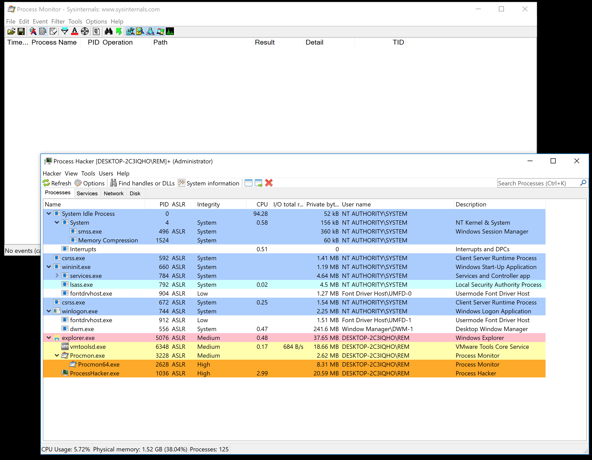
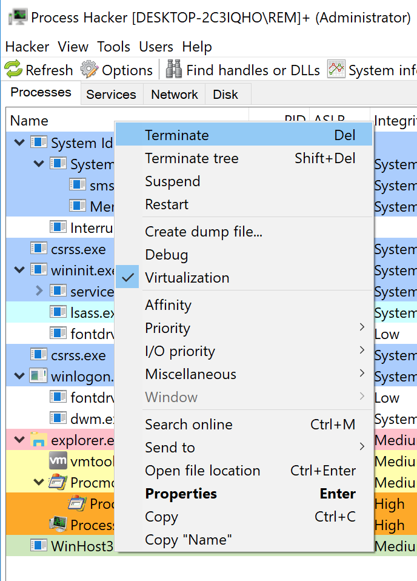
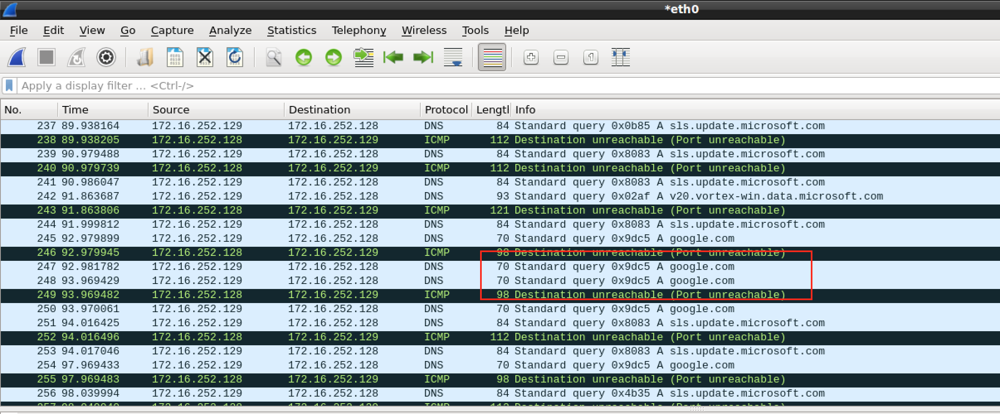
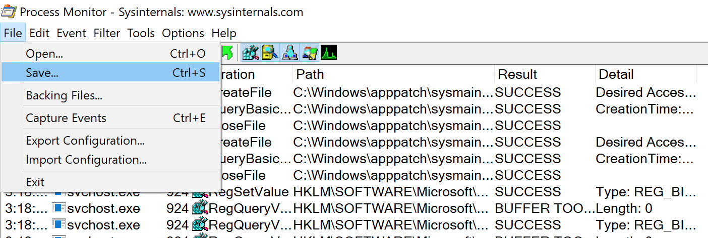
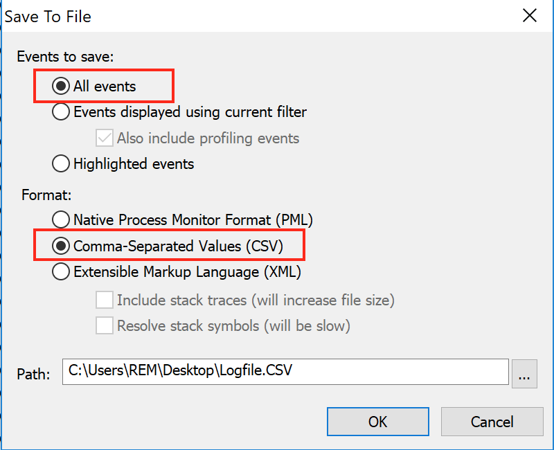
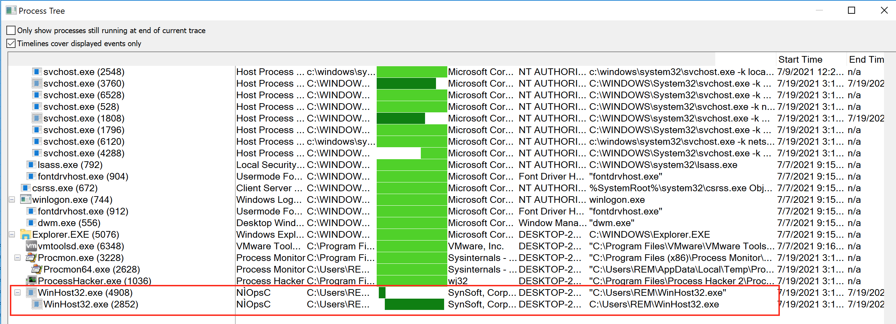
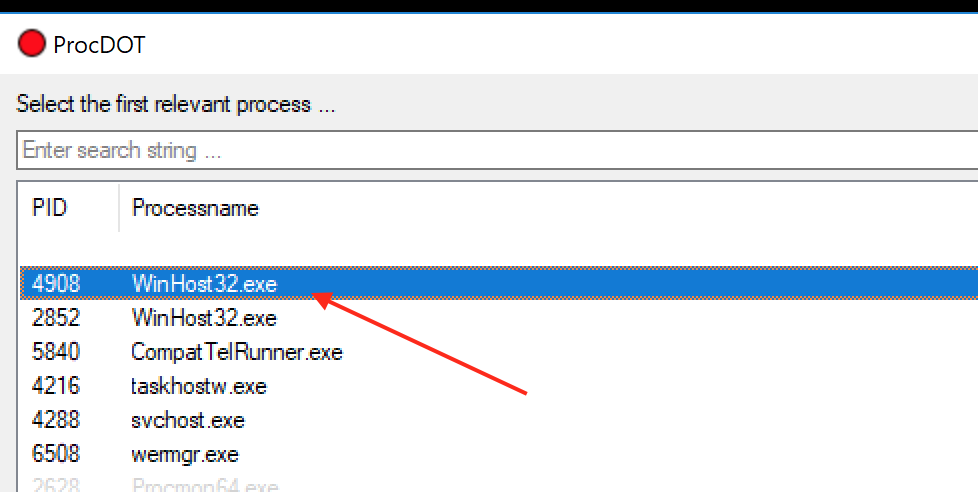

# Lab 5.4: Performing Behavioral Analysis of the WinHost32.exe Infection

- [Lab 5.4: Performing Behavioral Analysis of the WinHost32.exe Infection](#lab-54-performing-behavioral-analysis-of-the-winhost32exe-infection)
  - [Objectives](#objectives)
  - [Steps](#steps)
  - [1,2 - Activate Wireshark on REMnux, and activate Process Hacker and Process Monitor on the Windows REM Workstation. Infect Windows with WinHost32.exe for half a minute and terminate.](#12---activate-wireshark-on-remnux-and-activate-process-hacker-and-process-monitor-on-the-windows-rem-workstation-infect-windows-with-winhost32exe-for-half-a-minute-and-terminate)
  - [3,4 - Pause capture in Process Monitor and Wireshark. Examine the Wireshark log.](#34---pause-capture-in-process-monitor-and-wireshark-examine-the-wireshark-log)
  - [5 - Export the Process Monitor log in CSV format, load the log file in ProcDOT, and generate the ProcDOT graph to examine the infection activities](#5---export-the-process-monitor-log-in-csv-format-load-the-log-file-in-procdot-and-generate-the-procdot-graph-to-examine-the-infection-activities)

---

## Objectives

- Reinforce behavioral analysis skills.
- Set the groundwork for subsequent experimentation with WinHost32.exe.

<br/>

---

## Steps

1. Activate **Wireshark** on REMnux, and activate **Process Hacker** and **Process Monitor** on the Windows REM Workstation.
2. Infect the Windows REM Workstation with `WinHost32.exe`, allowing it to run for half a minute and then terminating the malicious process.
3. Pause capture in Process Monitor and Wireshark.
4. Examine the Wireshark log, looking for anomalous traffic.
5. Export the Process Monitor log in CSV format, load the log file in ProcDOT, and generate the ProcDOT graph to examine the infection activities.

<br/>

---

## 1,2 - Activate Wireshark on REMnux, and activate Process Hacker and Process Monitor on the Windows REM Workstation. Infect Windows with WinHost32.exe for half a minute and terminate.

On REMnux, run **Wireshark**:

```
wireshark &
```

<br/>

On Windowsm run **Process Hacker** and **Process Monitor**:

  

<br/>

Start capturing on both **Wireshark** and **Process Monitor**. After that, put `WinHost32.exe` in `C:\Users\REM` and start `WinHost32.exe`:

  

<br/>

Kill the `WinHost32.exe` process after 30 seconds.

  

<br/>

---

## 3,4 - Pause capture in Process Monitor and Wireshark. Examine the Wireshark log.

Stop capturing on **Process Monitor** by clicking the `capture` button:

  

<br/>

Inspecting the **Wireshark** logs, apart from the Windows default DNS traffic to `xxx.microsoft.com`, there are some DNS queries trying to resolve `google.com`.

  

- This would be suspicious since we haven't done anything to resolve `google.com`

<br/>

---

## 5 - Export the Process Monitor log in CSV format, load the log file in ProcDOT, and generate the ProcDOT graph to examine the infection activities

On **Process Monitor**, click `File > Save ...`:

  

<br/>

Choose `All events` and use `CSV` format:

  

<br/>

Also we can click `Tools > Process Tree` to inspect the process tree:

  

- It looks like the `WinHost32.exe` run by us spawns another `WinHost32.exe` process

<br/>

Load the `LogFile.CSV` into **ProcDOT**:

  

<br/>

Choose the `Win32Host.exe` process run by ourselves (PID `4908` in this case):

  

<br/>

Then click `Refresh`:

  

- Same result when checking the process tree.
- No convincing malicious artifact so far.

<br/>


---