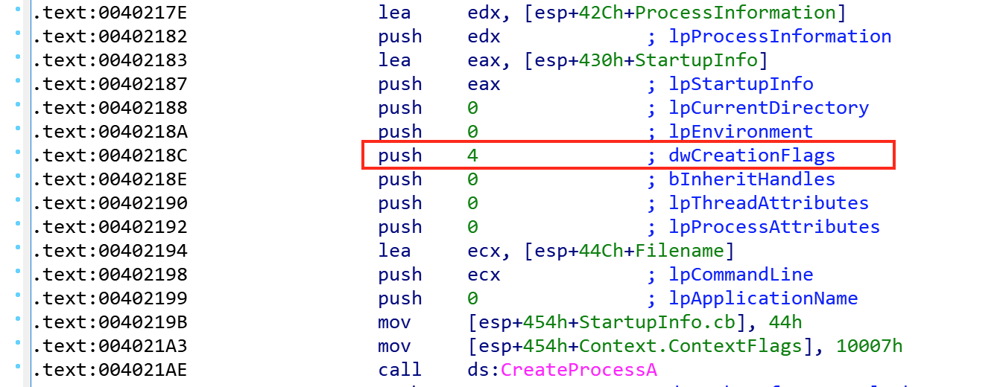
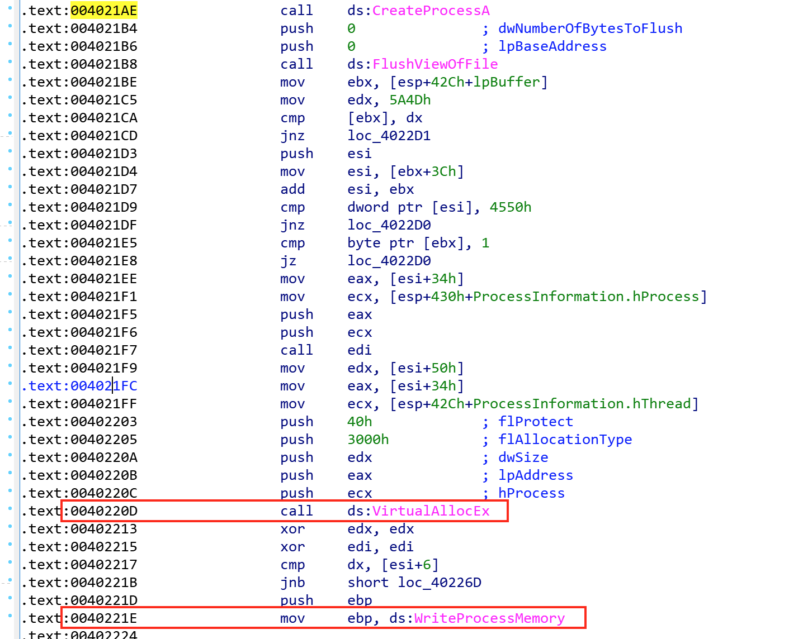
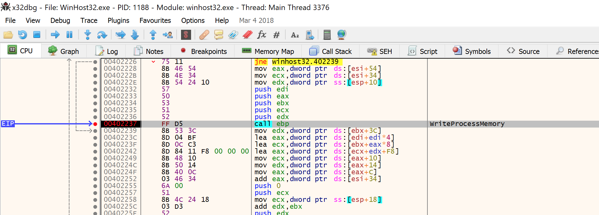
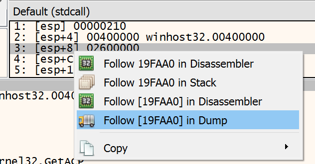
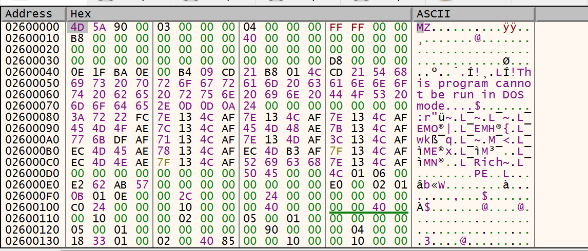
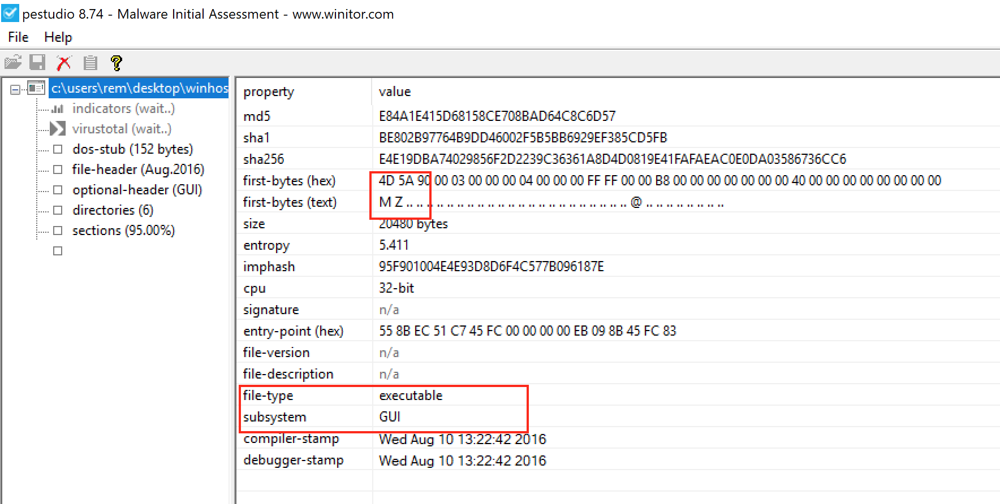

# Lab 5.5: Unpacking WinHost32.exe

- [Lab 5.5: Unpacking WinHost32.exe](#lab-55-unpacking-winhost32exe)
  - [Objectives](#objectives)
  - [Steps](#steps)
  - [1 - Use IDA to examine how WinHost32.exe calls CreateProcessA](#1---use-ida-to-examine-how-winhost32exe-calls-createprocessa)
  - [2 - Locate in IDA the code in WinHost32.exe that calls VirtualAllocEx and WriteProcessMemory](#2---locate-in-ida-the-code-in-winhost32exe-that-calls-virtualallocex-and-writeprocessmemory)
  - [3 - Determine which function WinHost32.exe calls at offset 4021F7](#3---determine-which-function-winhost32exe-calls-at-offset-4021f7)
  - [4 - With the help of a breakpoint, run WinHost32.exe in x32dbg until the specimen attempts to call WriteProcessMemory at offset 402237](#4---with-the-help-of-a-breakpoint-run-winhost32exe-in-x32dbg-until-the-specimen-attempts-to-call-writeprocessmemory-at-offset-402237)
  - [5,6 - Direct x32dbg to display in the Dump area of the CPU tab contents of the memory region whose address is stored in the lpBuffer parameter to WriteProcessMemory. Then extract the decoded Windows executable from memory, saving it with the help of the Memory Map tab in x32dbg as the file named winhost32-dumped.exe](#56---direct-x32dbg-to-display-in-the-dump-area-of-the-cpu-tab-contents-of-the-memory-region-whose-address-is-stored-in-the-lpbuffer-parameter-to-writeprocessmemory-then-extract-the-decoded-windows-executable-from-memory-saving-it-with-the-help-of-the-memory-map-tab-in-x32dbg-as-the-file-named-winhost32-dumpedexe)
  - [7 - Load winhost32-dumped.exe in PeStudio to confirm that it's a valid PE file](#7---load-winhost32-dumpedexe-in-pestudio-to-confirm-that-its-a-valid-pe-file)

---

## Objectives

- Understand the essential aspects of process hollowing.
- Reinforce static code analysis techniques facilitated by IDA.
- Reinforce unpacking techniques that involve API breakpoints and the Memory Map facilitated by x32dbg.

 

---

## Steps

1. Use **IDA** to examine how `WinHost32.exe` calls `CreateProcessA`.
2. Locate in IDA the code in `WinHost32.exe` that calls `VirtualAllocEx` and `WriteProcessMemory`.
3. Determine which function `WinHost32.exe` calls at offset `4021F7`.
4. With the help of a breakpoint, run `WinHost32.exe` in **x32dbg** until the specimen attempts to call `WriteProcessMemory` at offset **402237**.
5. Direct **x32dbg** to display in the Dump area of the CPU tab contents of the memory region whose address is stored in the `lpBuffer` parameter to `WriteProcessMemory`.
6. Extract the decoded Windows executable from memory, saving it with the help of the **Memory Map** tab in **x32dbg** as the file named `winhost32-dumped.exe`.
7. Load `winhost32-dumped.exe` in **PeStudio** to confirm that it's a valid PE file.

 

---

## 1 - Use IDA to examine how WinHost32.exe calls CreateProcessA

First load `WinHost32.exe` into **IDA**. Then go to `Imports` and type `CreateProcessA`:

  

 

Double click on it, and then click `CreateProcessA` on the disassembler and hit `x`:

  

- Click `OK` to jump to the location (`4021AE`)

 

  

- Note that `dwCreationFlags` is set to be `4`
- https://docs.microsoft.com/en-us/windows/win32/api/processthreadsapi/nf-processthreadsapi-createprocessa
  - https://docs.microsoft.com/en-us/windows/win32/procthread/process-creation-flags
  - `CREATE_SUSPENDED 0x00000004`
- This is setting the process in `CREATE_SUSPENDED` state

 

---

## 2 - Locate in IDA the code in WinHost32.exe that calls VirtualAllocEx and WriteProcessMemory

Scroll down a little bit and we can see `VirtualAllocEx` and `WriteProcessMemory`:

  

- `VirtualAllocEx` = `40220D`
- `WriteProcessMemory` = `40221E`

 

---

## 3 - Determine which function WinHost32.exe calls at offset 4021F7

`4021F7` is a `call edi` instruction. To see what's the value in `edi`, click on it and see how it has been assigned:

  

- The closest assignment is at `40214F` - `mov edi, eax`
  - `eax` is the result of `GetProcAddress` at `402149`

 

- `GetProcAddress`
  - https://docs.microsoft.com/en-us/windows/win32/api/libloaderapi/nf-libloaderapi-getprocaddress
  - Retrieves the address of an exported function or variable from the specified dynamic-link library (DLL).
  - At `40213D`, we can see it is loading `ntdll.dll`
  - `lpProcName` is "The function or variable name, or the function's ordinal value". 
    - As shown on **IDA**, the function name is `NtUnmapViewOfSection` (`402138`)

 

---

## 4 - With the help of a breakpoint, run WinHost32.exe in x32dbg until the specimen attempts to call WriteProcessMemory at offset 402237

Load `WinHost32.exe` into **x32dbg**. On **IDA**, we know the VA of `WriteProcessMemory` is at `40221E` / `402237`.

 

On **x32dbg**, navigate to `402237` by using `Ctrl+G` and typing `402237`:

  

 

Set a breakpoint at `402237` by hitting `F2`:

  

Note we can hit `;` to write comment.

 

Then `Debug > Run`:

  

- It stops at `402237`

 

---

## 5,6 - Direct x32dbg to display in the Dump area of the CPU tab contents of the memory region whose address is stored in the lpBuffer parameter to WriteProcessMemory. Then extract the decoded Windows executable from memory, saving it with the help of the Memory Map tab in x32dbg as the file named winhost32-dumped.exe

WriteProcessMemory:

- https://docs.microsoft.com/en-us/windows/win32/api/memoryapi/nf-memoryapi-writeprocessmemory
- `lpBuffer` = A pointer to the buffer that contains data to be written in the address space of the specified process. This is the 3rd argument.

 

On the stack, the 3rd argument is `0x2600000`:

  

 

Right click it and click `Follow in Dump`:

  

 

As shown in the memory area, the starting HEX value is `MZ`:

  

- This indicate a Windows PE residing in memory

 

Right click on the memory region and choose `Follow in Memory Map`:

  

 

Right clicking the highlighted row and choose `Dump Memory to File`:

  

- Save it as `winhost32-dumped.exe`

 

---

## 7 - Load winhost32-dumped.exe in PeStudio to confirm that it's a valid PE file

  

- This shows a valid PE

 

  

- Suspicious URL strings are found

 

---