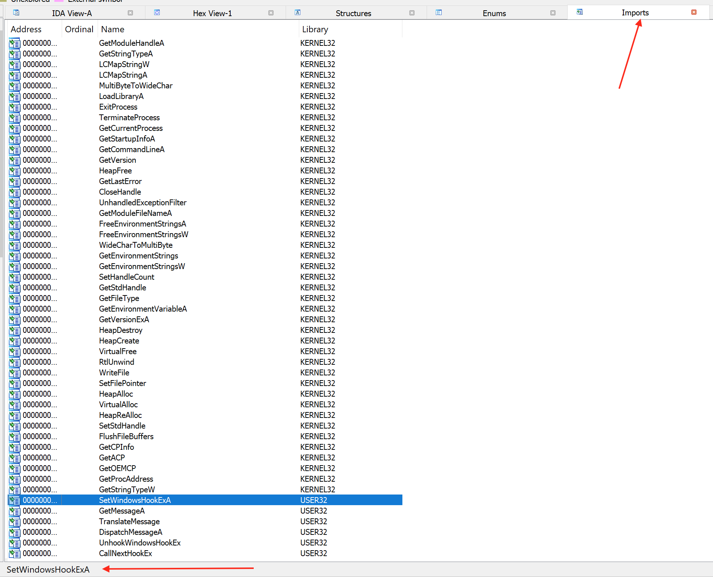
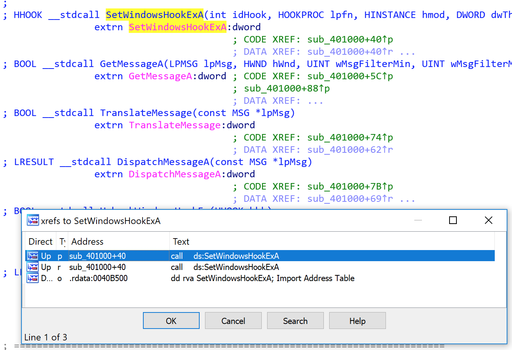
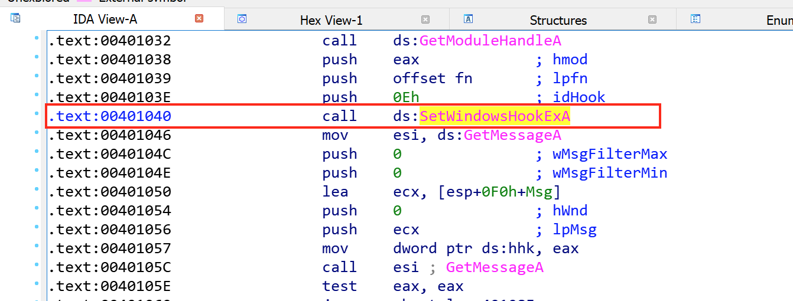
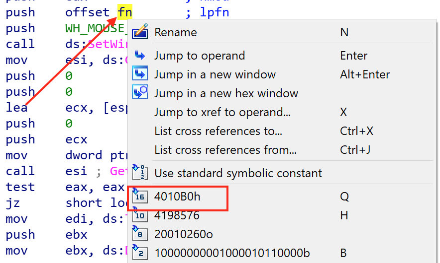
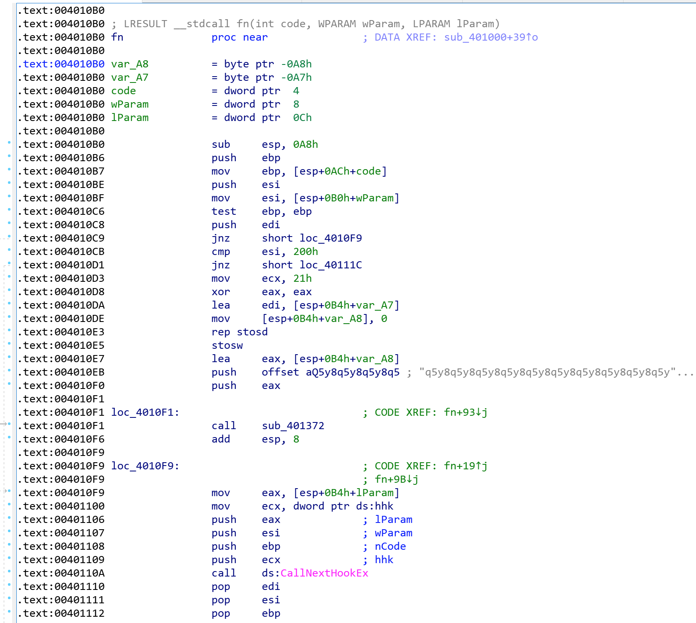
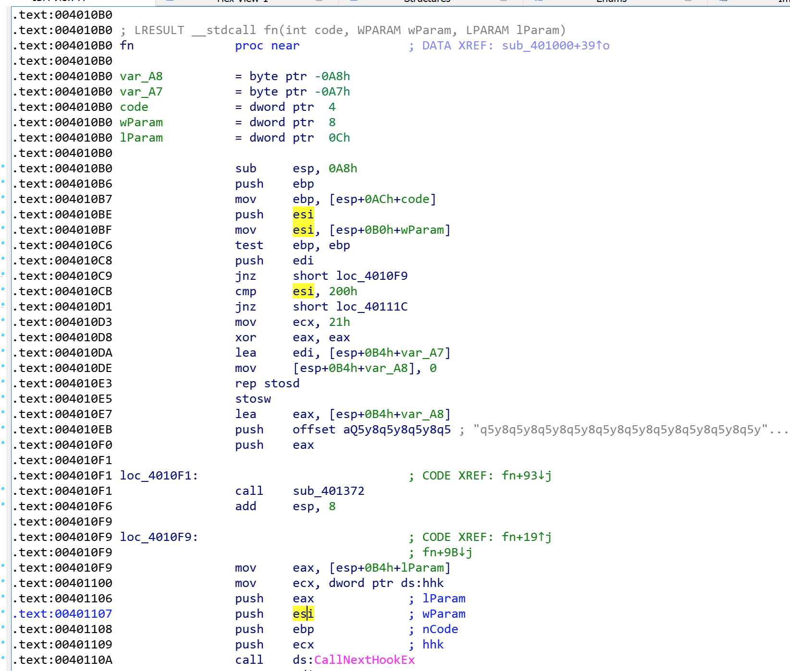

# Lab 5.6: Examining the Anti-Sandbox Defensive Capability of vbprop.exe

- [Lab 5.6: Examining the Anti-Sandbox Defensive Capability of vbprop.exe](#lab-56-examining-the-anti-sandbox-defensive-capability-of-vbpropexe)
  - [Objectives](#objectives)
  - [Steps](#steps)
  - [1 - Use IDA to locate the instruction inside vbprop.exe that calls SetWindowsHookExA](#1---use-ida-to-locate-the-instruction-inside-vbpropexe-that-calls-setwindowshookexa)
  - [2 - Examine in IDA the purpose of the parameters that vbprop.exe passes to SetWindowsHookExA](#2---examine-in-ida-the-purpose-of-the-parameters-that-vbpropexe-passes-to-setwindowshookexa)
  - [3 - Use IDA to examine the code that starts at offset 4010B0 in vbprop.exe to understand the purpose of this function](#3---use-ida-to-examine-the-code-that-starts-at-offset-4010b0-in-vbpropexe-to-understand-the-purpose-of-this-function)

---

## Objectives

- Gain familiarity with the use of SetWindowsHookExA to intercept mouse events.
- Understand how malware can safeguard itself from analysis by avoiding the execution of malicious code until specific GUI events occur.

 

---

## Steps

1. Use **IDA** to locate the instruction inside `vbprop.exe` that calls `SetWindowsHookExA`.
2. Examine in **IDA** the purpose of the parameters that `vbprop.exe` passes to `SetWindowsHookExA`.
3. Use **IDA** to examine the code that starts at offset `4010B0` in `vbprop.exe` to understand the purpose of this function.

 

---

## 1 - Use IDA to locate the instruction inside vbprop.exe that calls SetWindowsHookExA

First load `vbprop.exe` into **IDA**. Click the **Imports tab** and type `SetWindowsHookExA`:

  

 

Double click `SetWindowsHookExA`. Click on `SetWindowsHookExA` again on the new view and hit `X`:

  

- Click `OK`

 

  

- The instruction calling `SetWindowsHookExA` is at `0x401040`.

 

---

## 2 - Examine in IDA the purpose of the parameters that vbprop.exe passes to SetWindowsHookExA

The first parameter is `idHook`, which is set to `0x0E` (`14`).

- https://docs.microsoft.com/en-us/windows/win32/api/winuser/nf-winuser-setwindowshookexa
- `14` = `WH_MOUSE_LL`
  - Installs a hook procedure that monitors low-level mouse input events.
- This call hook the mouse input events

 

The second parameter is `lpfn`, which is `offset fn`. Right click `fn` and we can see the HEX value is `0x4010B0`:

  

- `lpfn` is a pointer to the hook procedure.
- `lpfn` can point to a hook procedure in the code associated with the current process.

 

The 3rd parameter is `hmod` (A handle to the DLL containing the hook procedure pointed to by the `lpfn` parameter), which is set to be `eax`. `eax` is the return value of the function call `GetModuleHandA`.

- https://docs.microsoft.com/en-us/windows/win32/api/libloaderapi/nf-libloaderapi-getmodulehandlea
- Purpose: Retrieves a module handle for the specified module.
- We can see both of the input to this call is `0` (`NULL`)
  - If this parameter is `NULL`, `GetModuleHandle` returns a handle to the file used to create the calling process (.exe file)
  - This is itself!

 

The 4th parameter is `dwThreadId`, which is set to be `0`

- The identifier of the thread with which the hook procedure is to be associated. 
- For desktop apps, if this parameter is `0`, the hook procedure is associated with all existing threads running in the **same desktop as the calling thread**. 

 

Therefore, the program defines a hook so that when a mouse event occurs, the process will execute function `4010B0` from its own process `vbprop.exe`. It won't do anything until it gets `WH_MOUSE` event.

 

---

## 3 - Use IDA to examine the code that starts at offset 4010B0 in vbprop.exe to understand the purpose of this function

Hit `g` and type `4010B0`.

  

 

We can see `CallNextHookEx` at `40110A`. 

- https://docs.microsoft.com/en-us/windows/win32/api/winuser/nf-winuser-callnexthookex
- Purpose:
  - Passes the hook information to the next hook procedure in the current hook chain. 
  - A hook procedure can call this function either before or after processing the hook information.
- Parameters:
  - `hhk`: Ignored
  - `nCode`: 
    - The hook code passed to the current hook procedure. 
    - The next hook procedure uses this code to determine how to process the hook information.
  - `wParam`:
    - The `wParam` value passed to the current hook procedure. 
    - The meaning of this parameter **depends on the type of hook associated with the current hook chain**.
  - `lParam`:
    - The `lParam` value passed to the current hook procedure. 
    - The meaning of this parameter **depends on the type of hook associated with the current hook chain**.

 

In short, `wParam` specifies the type of message that triggered the execution of the hook function. The value passed to `wParam` is `esi`. Click on `esi` to see how it is set:

  

- At `4010BF`, `esi` is assigned with `[esp+0xB0+wParam]`
- Then at `4010CB`, there is a `cmp` instruction to compare `esi` with `200h`
  - https://docs.microsoft.com/en-us/windows/win32/inputdev/wm-mousemove
  - `0x200` = `WM_MOUSEMOVE`
  - If the mouse event is not a `MOUSEMOVE` event, it jumps to `40111C`
  - If the mouse event is `MOUSEMOVE` (user moves the mouse), it continue the code and eventually call `CallNextHookEx`

 

Continue examine the code after the `CallNextHookEx` call.

At `40111C`, it compares `esi` with `201h` (`WM_LBUTTONDOWN`)

  

- Jump to `401145` if the mouse event is not `WM_LBUTTONDOWN` (Mouse Left button pressed)
- If the mouse event is `WM_LBUTTONDOWN`, keep running the code follows
- Eventually jumps to `4010F1`, which is the part calling `CallNextHookEx`

 

At `401145`, it compares `esi` with `202h` (`WM_LBUTTONUP`):

  

- Jump to `4010F9` if the mouse event is not `WM_LBUTTONUP`
- If the mouse event is `WM_LBUTTONUP`, continue

 

Then at `401154`, it calls `UnhookWindowsHookEx` to remove its hook, and call `sub_401170` after that.

 

In short, when it detects a user "Mouse Click" event, it stops the hook and call the function at `401170`.

 

---