# Lab 5.7: Getting Around the Sandbox Detection Capabilities of winhost32-dumped.exe

- [Lab 5.7: Getting Around the Sandbox Detection Capabilities of winhost32-dumped.exe](#lab-57-getting-around-the-sandbox-detection-capabilities-of-winhost32-dumpedexe)
  - [Objectives](#objectives)
  - [Steps](#steps)
  - [1 - Use IDA to locate the code in winhost32-dumped.exe that references the string http://google.com](#1---use-ida-to-locate-the-code-in-winhost32-dumpedexe-that-references-the-string-httpgooglecom)
  - [2 - Use IDA to examine sub_401550 in winhost32-dumped.exe to understand the purpose of this function](#2---use-ida-to-examine-sub_401550-in-winhost32-dumpedexe-to-understand-the-purpose-of-this-function)
  - [3 - Use IDA to examine sub_401A90 in winhost32-dumped.exe to understand the purpose of this function](#3---use-ida-to-examine-sub_401a90-in-winhost32-dumpedexe-to-understand-the-purpose-of-this-function)
  - [4 - Determine how winhost32-dumped.exe reacts to a failed or successful google.com connection by examining the code that calls function sub_401A90 in IDA](#4---determine-how-winhost32-dumpedexe-reacts-to-a-failed-or-successful-googlecom-connection-by-examining-the-code-that-calls-function-sub_401a90-in-ida)
  - [5 - Rename winhost32-dumped.exe to WinHost32.exe, move the file from the Desktop to the C:\Users\REM folder, and then disable DynamicBase of the file](#5---rename-winhost32-dumpedexe-to-winhost32exe-move-the-file-from-the-desktop-to-the-cusersrem-folder-and-then-disable-dynamicbase-of-the-file)
  - [6 - Patch WinHost32.exe in x32dbg so that it infects the system, even when the specimen is unable to connect to http://google.com](#6---patch-winhost32exe-in-x32dbg-so-that-it-infects-the-system-even-when-the-specimen-is-unable-to-connect-to-httpgooglecom)
  - [7 - If there is time, save the patched file from within x32dbg to the file system](#7---if-there-is-time-save-the-patched-file-from-within-x32dbg-to-the-file-system)

---

## Objectives

- Understand how malware can detect the presence of a sandbox by checking the state of network connectivity.
- Reinforce static code analysis techniques that employ IDA.
- Reinforce the code patching capabilities of x32dbg.

 

---

## Steps

1. Use **IDA** to locate the code in `winhost32-dumped.exe` that references the string `http://google.com`.
2. Use **IDA** to examine `sub_401550` in `winhost32-dumped.exe` to understand the purpose of this function.
3. Use **IDA** to examine `sub_401A90` in `winhost32-dumped.exe` to understand the purpose of this function.
4. Determine how `winhost32-dumped.exe` reacts to a failed or successful `google.com` connection by examining the code that calls function `sub_401A90` in IDA.
5. Rename `winhost32-dumped.exe` to `WinHost32.exe`, move the file from the Desktop to the `C:\Users\REM` folder, and then disable DynamicBase of the file.
6. Patch `WinHost32.exe` in `x32dbg` so that it infects the system, even when the specimen is unable to connect to `http://google.com`.
7. If there is time, save the patched file from within **x32dbg** to the file system.

 

---

## 1 - Use IDA to locate the code in winhost32-dumped.exe that references the string http://google.com

First load `winhost32-dumped.exe` into **IDA**. Click `View > Open subviews > Strings`:

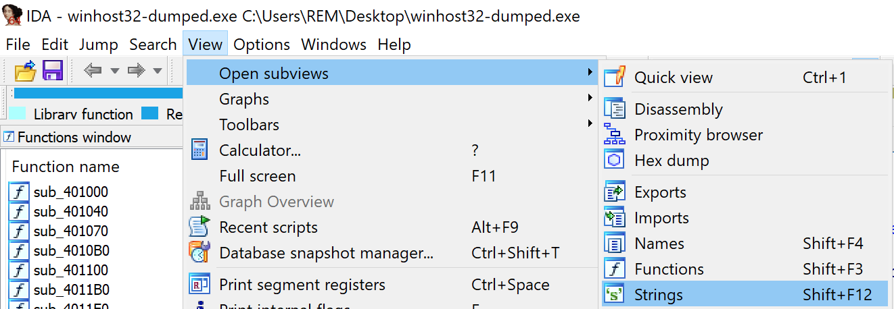  

 

  

- `http://google.com` is referenced at `004041F8` in `.rdata`

 

Double click and we can find **IDA** calls this as `aHttpGoogleCom`. Click on it and hit `x`:

  

- Click `OK` to jump to the referencing location

 

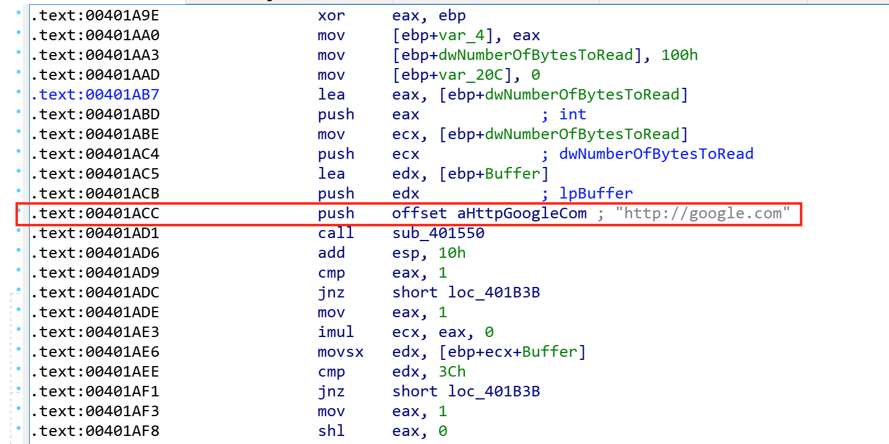  

- `aHttpGoogleCom` is referenced at `401ACC`

 

---

## 2 - Use IDA to examine sub_401550 in winhost32-dumped.exe to understand the purpose of this function

  

- At `401AD1`, there is a function call `sub_401550`, which used the value `http://google.com`

 

Double click on `sub_401550` to inspect.

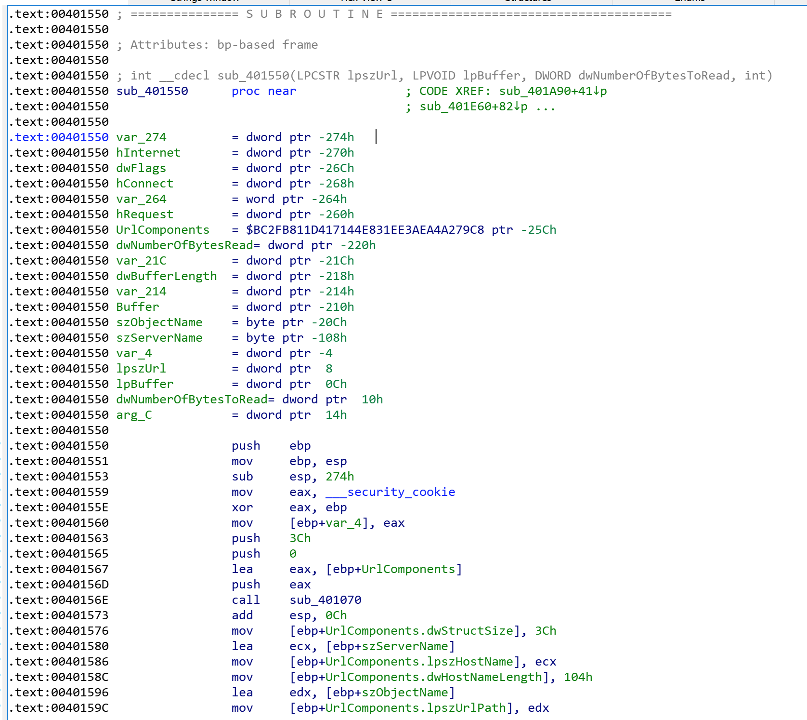  

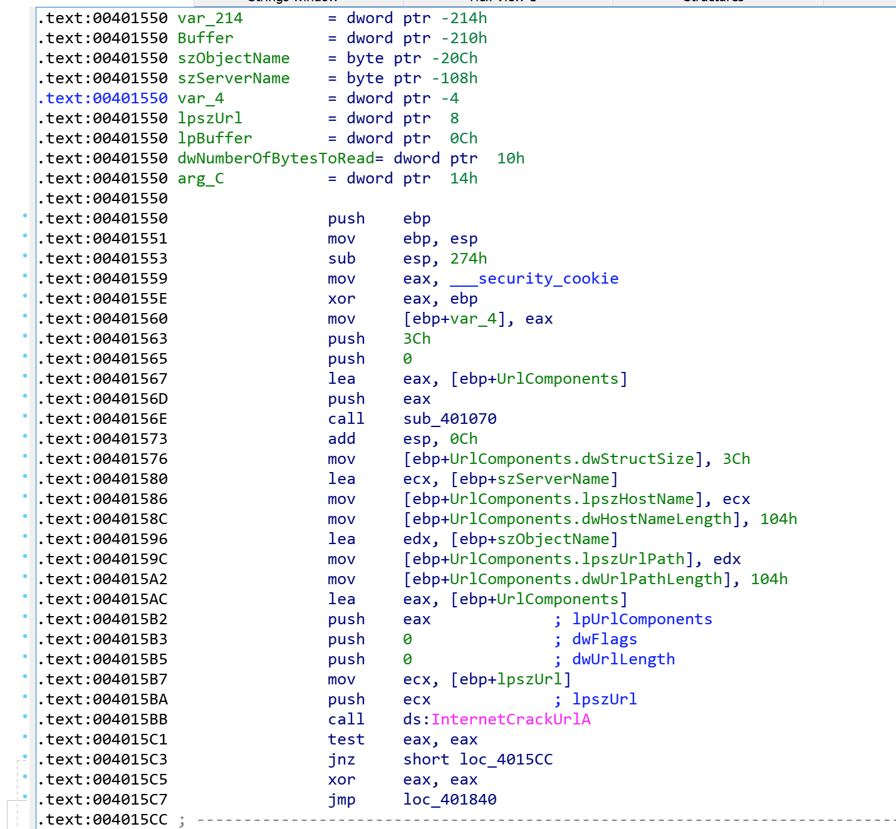  

- There is a function call `InternetCrackUrlA`
- The 1st parameter is `lpszUrl`, which is `http://google.com`

 

Look up MSDOC to understand the API call `InternetCrackUrlA`:

- https://docs.microsoft.com/en-us/windows/win32/api/wininet/nf-wininet-internetcrackurla
- Purpose:
  - Cracks a URL into its component parts.
- Parameters:
  - `lpszUrl`:
    - Pointer to a string that contains the canonical URL to be cracked.
  - `dwUrlLength`:
    - Size of the lpszUrl string, in TCHARs, or `zero` if `lpszUrl` is an ASCIIZ string.
  - `dwFlags`:
    - Controls the operation. This parameter can be one of the following values.
      - ICU_DECODE
      - ICU_ESCAPE
  - `lpUrlComponents`:
    - Pointer to a `URL_COMPONENTS` structure that receives the URL components.
- Return value:
  - `TRUE` if the function succeeds
  - `FALSE` otherwise

 

The `InternetCrackUrlA` call at `4015BB` will break the URL into its components and save it to the pointer location of `lpUrlComponents`.

 

Examine the function call parameter assignements:

- `lpszUrl`: Will be the pointer go `http://google.com`
- `dwUrlLength`: 
  - `0` = ASCII string
- `dwFlags`:   
  - `0` = ?
- `lpUrlComponents`
  - `eax`, which is pointing to `[ebp+UrlComponent]`

 

For the instructions here, we can see how the URL will be broken:

  

- `UrlComponents.dwStructSize`
- `UrlComponents.lpszHostName` - this points to the local variable `szServerName`
- `UrlComponents.dwHostNameLength`
- `UrlComponents..lpszUrlPath`
- `UrlComponents.dwUrlPathLength`

 

It is expected that `google.com` will be placed in `szServerName`

 

Scroll down and we can see a function call `InternetConnectA` at `401670`:

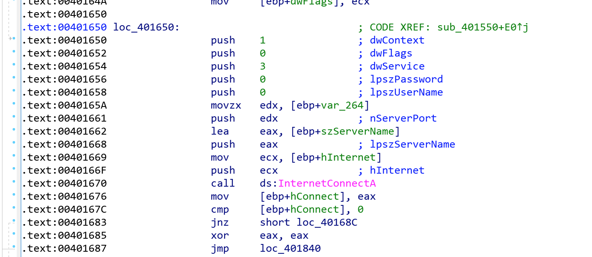  

- https://docs.microsoft.com/en-us/windows/win32/api/wininet/nf-wininet-internetconnecta
- Purpose:
  - Opens an File Transfer Protocol (FTP) or HTTP session for a given site.
- Return:
  - Returns a valid handle to the session if the connection is successful, or NULL otherwise. 

 

This program tries to connect to `lpszServerName`, and save the return value to `hConnect`. If the connection succeed, it jumps to `40168C`.

 

  

- Then it call `HttpOpenRequestA` at `4016B1`
- Then some other Internet / HTTP related API calls

 

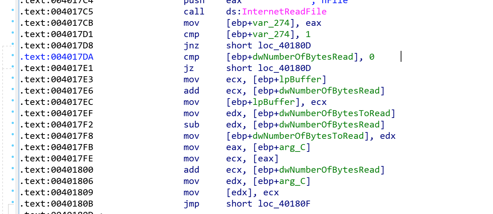  

- At `4017C5`, there is an API call `InternetReadFile`
- https://docs.microsoft.com/en-us/windows/win32/api/wininet/nf-wininet-internetreadfile
  - Purpose:
    - Reads data from a handle opened by the InternetOpenUrl, FtpOpenFile, or HttpOpenRequest function.
  - Parameters:
    - `hFile`: Handle returned from a previous call to InternetOpenUrl, FtpOpenFile, or HttpOpenRequest.
    - `lpBuffer`: Pointer to a buffer that receives the data.
    - ...
- That's to say, the HTTP response from `google.com` will be save to the location specified in `lpBuffer`

 

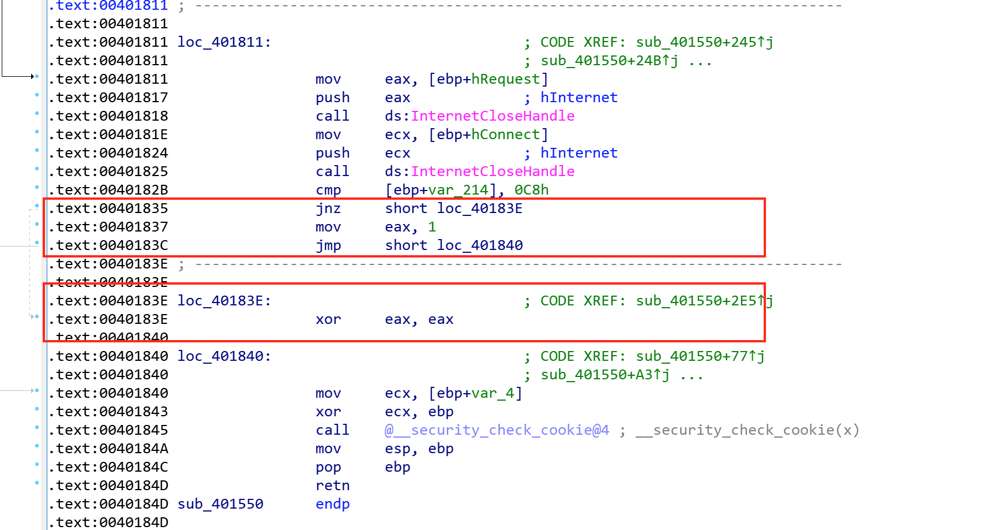  

- If the request is successful, `eax` will be set to `1` and jump to `401840`
- Otherwise, `eax` will be set to `0`

 

Overall, this subroutine is used to check the Internet connectivity by trying to resolve `google.com`

 

---

## 3 - Use IDA to examine sub_401A90 in winhost32-dumped.exe to understand the purpose of this function

Continue to examine the instruction in the subroutine `401A90`, which calls `401550` to try resolving `google.com`.

 

In #2, if `google.com` is resolved successfully, `eax` will be `1`.

 

  

- At `401AD9`, it compares `1` with `eax`, which is essentially checking if there is an internet connectivity
- It jumps away if the request to `google.com` fails

 

Then we can see a series of `cmp` instructions:

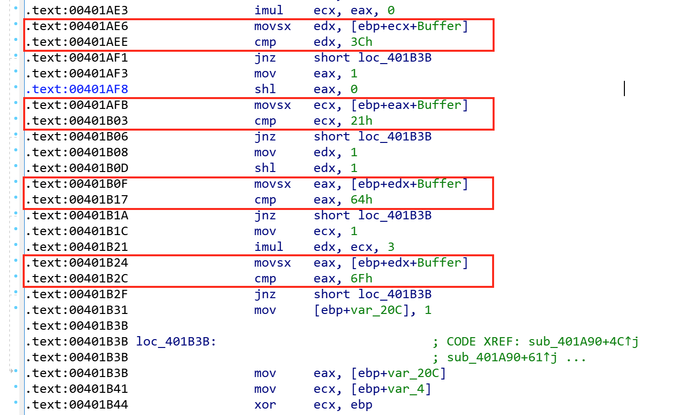  

- `Buffer` contains the response content of `google.com`

 

Convert the hex value to ASCII by right-clicking each of them:

  

- Basically this check the first 4 bytes of the buffer and compare with the strings `<!do`

 

In fact if we inspect `https://google.com`, the source code will be starting with `<!doctype html>`:

  

 

In summary, this subroutine is checking if the web page it downloaded from `http://google.com` begines with the string `<!do`.

 

---

## 4 - Determine how winhost32-dumped.exe reacts to a failed or successful google.com connection by examining the code that calls function sub_401A90 in IDA

If any character is unmatched, it jumps to `loc_401B3B`. If the checking is successful, `var_20C` will be assigned with `1`.

  

- At `401B3B`, `eax` will be assinged with the value set in `var_20C`
- The function return will be `1` if it successfully requests `google.com` and gets the content starting with `<!do`

 

Examine the function calling `sub_401A90`. Click on `sub_401A90` and hit `x`:

  

 

  

- `test eax, eax` - Check if it is `1`
  - `jnz`: If `1` (request to Google successfully), jump to `loc_4023C6`
  - Otherwise, sleep `60000 ms` before jumping to `loc_4023A3`

 

---

## 5 - Rename winhost32-dumped.exe to WinHost32.exe, move the file from the Desktop to the C:\Users\REM folder, and then disable DynamicBase of the file

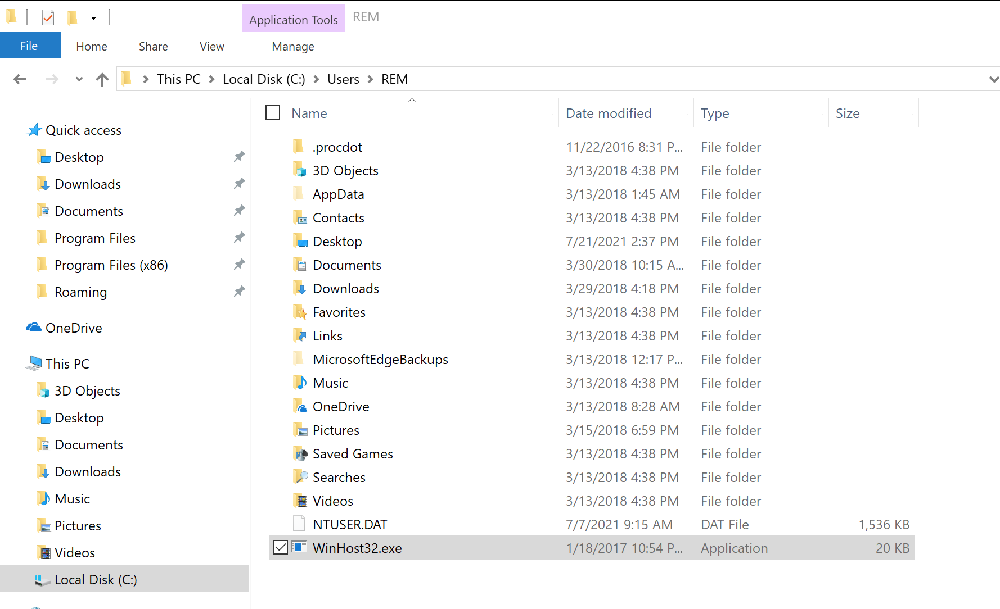  

 

To disable DynamicBase, open `WinHost32.exe` in **CFF Explorer**:

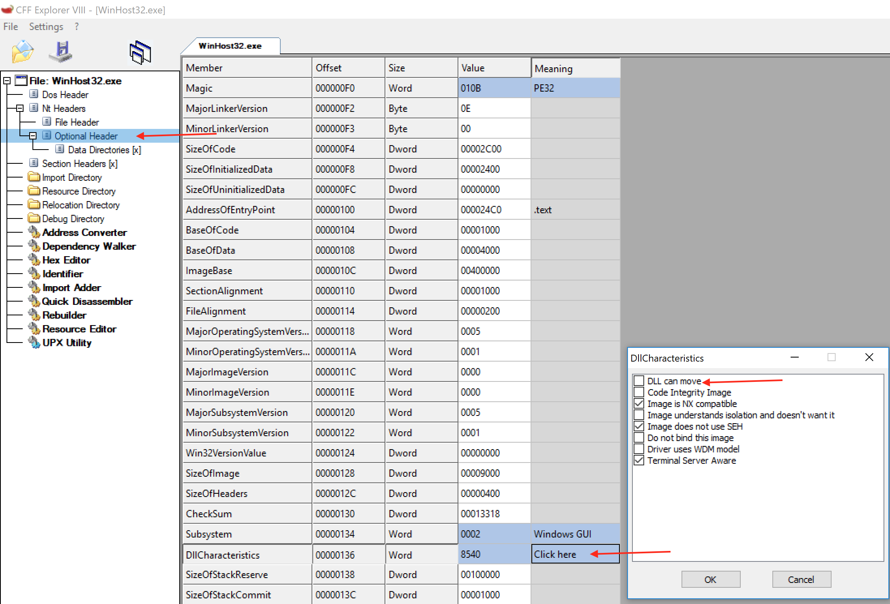  

- Uncheck `DLL can move` here in the `DllCharacteristics`

 

---

## 6 - Patch WinHost32.exe in x32dbg so that it infects the system, even when the specimen is unable to connect to http://google.com

Open `WinHost32.exe` in **x32dbg**. Click `Ctrl+G` and jump to `4023B6`:

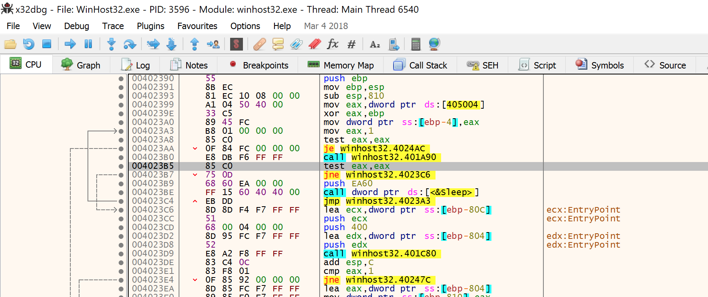  

 

To patch, we can modify the jump instruction at `004023B7` from `jne` to be `jmp`. Double click it and change `jne` to `jmp`:

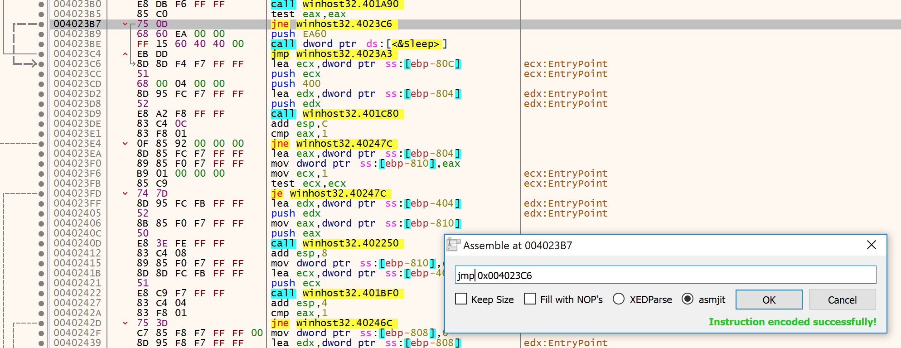  

  

 

---

## 7 - If there is time, save the patched file from within x32dbg to the file system

`File > Patch file ...`:

  

 

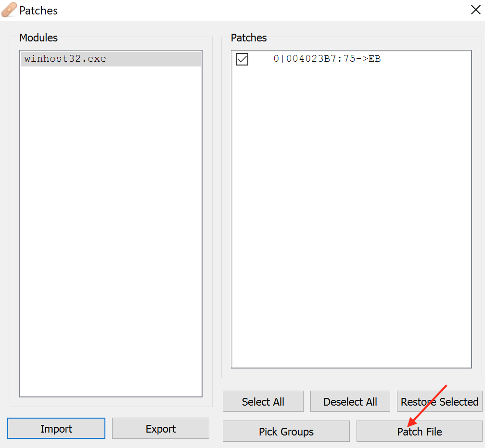  

- Click `Patch File` and save as `winhost32-dumped-patched.exe`

 

Now compare the result of patched and unpatched.

 

First run `fakedns` on **REMnux**. Then run the unpatched `winhost32-dumped.exe`:

  

- We can only see the request to `google.com`

 

Then run the patched `winhost32-dumped-patched.exe`:

  

- We can see some more DNS queries to `api.ipify.org`, `callereb.com`, `supketwron.ru` and `witjono.ru`

 

---