# Lab 5.8: Examining the Toolkit Detection Capabilities of raas.exe

- [Lab 5.8: Examining the Toolkit Detection Capabilities of raas.exe](#lab-58-examining-the-toolkit-detection-capabilities-of-raasexe)
  - [Objectives](#objectives)
  - [Steps](#steps)
  - [1 - Load raas.exe into x32dbg on the Windows REM Workstation, and then activate ScyllaHide by enabling the checkboxes in the first column of the plugin's Options window](#1---load-raasexe-into-x32dbg-on-the-windows-rem-workstation-and-then-activate-scyllahide-by-enabling-the-checkboxes-in-the-first-column-of-the-plugins-options-window)
  - [2 - Use x32dbg to statically examine the instructions within raas.exe starting at offset 401263 to determine which function's results can cause the malicious process to exit](#2---use-x32dbg-to-statically-examine-the-instructions-within-raasexe-starting-at-offset-401263-to-determine-which-functions-results-can-cause-the-malicious-process-to-exit)
  - [3 - Run rass.exe within x32dbg until offset 40125E, which calls BlockInput, and then patch the code to disable this defensive measure](#3---run-rassexe-within-x32dbg-until-offset-40125e-which-calls-blockinput-and-then-patch-the-code-to-disable-this-defensive-measure)
  - [4 - Run raas.exe within x32dbg until offset 402C3B and examine the code to determine how the specimen attempts to detect AVG security software](#4---run-raasexe-within-x32dbg-until-offset-402c3b-and-examine-the-code-to-determine-how-the-specimen-attempts-to-detect-avg-security-software)
  - [5 - Run raas.exe within x32dbg until offset 402C6B and examine the code to determine how the specimen attempts to detect OllyDbg](#5---run-raasexe-within-x32dbg-until-offset-402c6b-and-examine-the-code-to-determine-how-the-specimen-attempts-to-detect-ollydbg)
  - [6 - Run raas.exe within x32dbg until offset 402D03 and examine the code to determine how the specimen attempts to detect a kernel-level debugger](#6---run-raasexe-within-x32dbg-until-offset-402d03-and-examine-the-code-to-determine-how-the-specimen-attempts-to-detect-a-kernel-level-debugger)
  - [7 - Use x32dbg to step into function 402BD6, which is invoked from offset 40125E, within raas.exe](#7---use-x32dbg-to-step-into-function-402bd6-which-is-invoked-from-offset-40125e-within-raasexe)
  - [8 - Step through function 4019AC in raas.exe using x32dbg, examining the way in which it detects security tools and pausing at its RET instruction at offset 401A60](#8---step-through-function-4019ac-in-raasexe-using-x32dbg-examining-the-way-in-which-it-detects-security-tools-and-pausing-at-its-ret-instruction-at-offset-401a60)
  - [9 - Use x32dbg to step into function 401A61, which is invoked from offset 402D2C, within raas.exe](#9---use-x32dbg-to-step-into-function-401a61-which-is-invoked-from-offset-402d2c-within-raasexe)
  - [10 - Allow raas.exe to execute in x32dbg until offset 401C8E, and then use x32dbg to statically examine function 401C8E to understand its capabilities](#10---allow-raasexe-to-execute-in-x32dbg-until-offset-401c8e-and-then-use-x32dbg-to-statically-examine-function-401c8e-to-understand-its-capabilities)
  - [11 - Allow raas.exe to execute in x32dbg until the beginning of function 401D4C](#11---allow-raasexe-to-execute-in-x32dbg-until-the-beginning-of-function-401d4c)
  - [12 - Step through function 401D4C in raas.exe using x32dbg, examining the way in which it might detect VMware, and pausing at its RET instruction at offset 40204E](#12---step-through-function-401d4c-in-raasexe-using-x32dbg-examining-the-way-in-which-it-might-detect-vmware-and-pausing-at-its-ret-instruction-at-offset-40204e)
  - [13 - Use x32dbg to execute instructions in raas.exe until offset 401263, which is the first instruction that the specimen executes after returning from function 402BD6](#13---use-x32dbg-to-execute-instructions-in-raasexe-until-offset-401263-which-is-the-first-instruction-that-the-specimen-executes-after-returning-from-function-402bd6)

---

## Objectives

- Learn additional techniques that malware might use to detect the presence of the analyst's toolkit.
- Reinforce dynamic code analysis methods that utilize x32dbg, stepping through malicious code to understand its capabilities.

 

---

## Steps

1. Load `raas.exe` into **x32dbg** on the Windows REM Workstation, and then activate `ScyllaHide` by enabling the checkboxes in the first column of the plugin's Options window.
2. Use **x32dbg** to statically examine the instructions within `raas.exe` starting at offset `401263` to determine which function's results can cause the malicious process to exit.
3. Run `rass.exe` within **x32dbg** until offset `40125E`, which calls `BlockInput`, and then patch the code to disable this defensive measure.
4. Run `raas.exe` within **x32dbg** until offset `402C3B` and examine the code to determine how the specimen attempts to detect **AVG security software**.
5. Run `raas.exe` within **x32dbg** until offset `402C6B` and examine the code to determine how the specimen attempts to detect **OllyDbg**.
6. Run `raas.exe` within **x32dbg** until offset `402D03` and examine the code to determine how the specimen attempts to detect a **kernel-level debugger**.
7. Use **x32dbg** to step into function `402BD6`, which is invoked from offset `40125E`, within `raas.exe`.
8. Step through function `4019AC` in `raas.exe` using **x32dbg**, examining the way in which it detects security tools and pausing at its `RET` instruction at offset `401A60`.
9. Use **x32dbg** to step into function `401A61`, which is invoked from offset `402D2C`, within `raas.exe`.
10. Allow `raas.exe` to execute in **x32dbg** until offset `401C8E`, and then use **x32dbg** to statically examine function `401C8E` to understand its capabilities.
11. Allow `raas.exe` to execute in **x32dbg** until the beginning of function `401D4C`.
12. Step through function `401D4C` in `raas.exe` using **x32dbg**, examining the way in which it might detect **VMware**, and pausing at its `RET` instruction at offset `40204E`.
13. Use **x32dbg** to execute instructions in `raas.exe` until offset `401263`, which is the first instruction that the specimen executes after returning from function `402BD6`.

 

---

## 1 - Load raas.exe into x32dbg on the Windows REM Workstation, and then activate ScyllaHide by enabling the checkboxes in the first column of the plugin's Options window

Load `raas.exe` in **x32dbg**. Navigate to `Plugins > ScyllaHide > Options`:

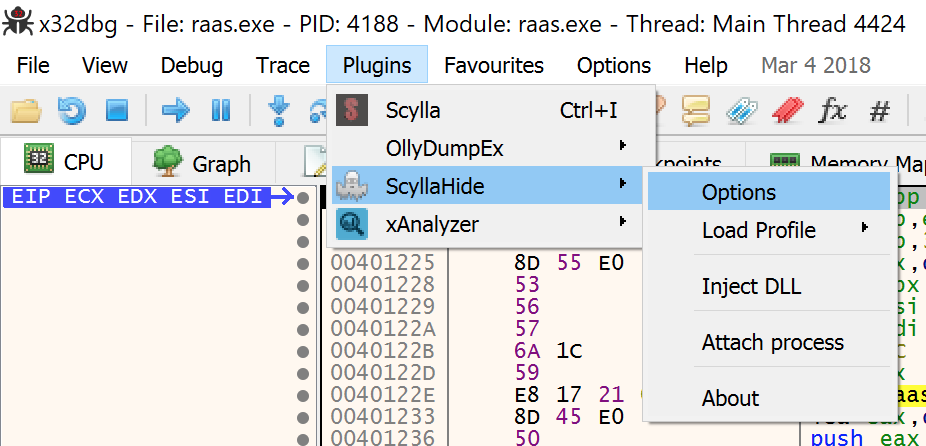  

 

Check all items in the 1st column:

  

- Click `OK`

 

---

## 2 - Use x32dbg to statically examine the instructions within raas.exe starting at offset 401263 to determine which function's results can cause the malicious process to exit

Use `Ctrl+G` to go to `401263`:

  

 

  

- At `40125E`, it calls `402BD6`, which returns a value in `eax`
- At `401263`, `test eax, eax`, and this check if `eax` is `0` (set `ZF`).
  - If `ZF` is not set - EAX contains a non-zero value, it jumps to `4013BE`.

 

  

- `4013BE` - `push 0` 
- `4013C0` - the program calls the `ExitProcess` API with code `0`

 

---

## 3 - Run rass.exe within x32dbg until offset 40125E, which calls BlockInput, and then patch the code to disable this defensive measure

First click on the offset `40125E` and hit `F4` (`Debug > Run until selection`):

  

 

Then use `Step over` (`F8`) to explore the function `402BD6`:

  

- At `402C16` we arrive at the instruction `call eax`, and `eax` has the value `BlockInput`.
- https://docs.microsoft.com/en-us/windows/win32/api/winuser/nf-winuser-blockinput
  - Purpose:
    - Blocks keyboard and mouse input events from reaching applications.
  - Parameters:
    - `fBlockIt`: 
      - The function's purpose. If this parameter is `TRUE`, keyboard and mouse input events are blocked. 
      - If this parameter is `FALSE`, keyboard and mouse events are unblocked.
  - Return value:
    - If the function succeeds, the return value is non-zero.
    - If input is already blocked, the return value is zero.

 

To patch, we can set the parameter `fBlockIt` to be `0`. Double click the top of the stack:

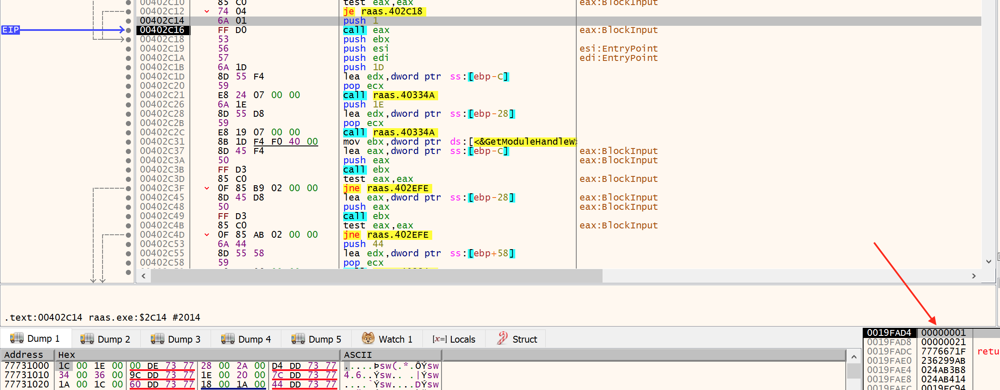  

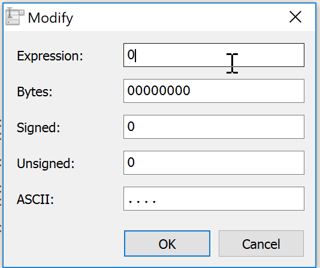  

- Change the expression to be `0`

  

 

Then use `Step Over (F8)` to continue debugging the program.

 

---

## 4 - Run raas.exe within x32dbg until offset 402C3B and examine the code to determine how the specimen attempts to detect AVG security software

At `402C3B`, there is a function call `GetModuleHandleW`:

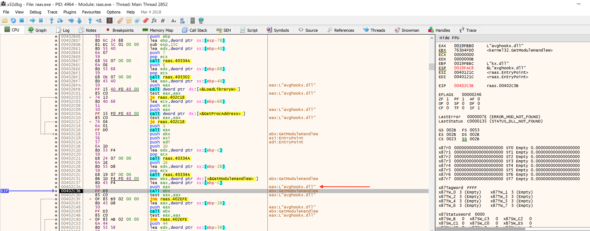  

- https://docs.microsoft.com/en-us/windows/win32/api/libloaderapi/nf-libloaderapi-getmodulehandlew
- Purpose:
  - Retrieves a module handle for the specified module. The module must have been loaded by the calling process.
- Parameters:
  - `lpModuleName`: The name of the loaded module (either a .dll or .exe file).
- Return value:
  - If the function succeeds, the return value is a **handle** to the specified module.
  - If the function fails, the return value is `NULL`. 

 

At `402C3A`, the `lpModuleName` supplied is `avghookx.dll`. That is to say, the specimen is trying to check whether `avghookx.dll` has been loaded into the process.

 

With reference to https://www.file.net/process/avghookx.dll.html, `avghookx.dll` is the AVG Hook Library for tracking malicious activities from programs.

 

At `402C3F` - `jne raas.402EFE` - if the return value of `GetModuleHandleW` is not zero (non-zero means `avghookx.dll` is found), it jumps to `402EFE`.

 

---

## 5 - Run raas.exe within x32dbg until offset 402C6B and examine the code to determine how the specimen attempts to detect OllyDbg

At `402C6B`, the instruction is `call edi`:

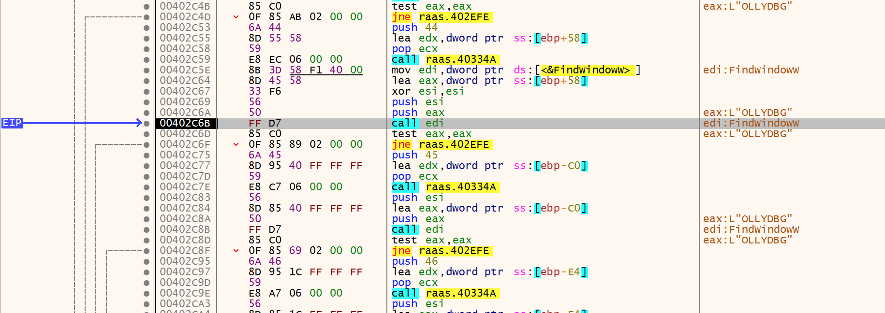  

- On `x32dbg` we can see `FindWindowW`
- https://docs.microsoft.com/en-us/windows/win32/api/winuser/nf-winuser-findwindoww
  - Purpose:
    - Retrieves a handle to the top-level window whose class name and window name match the specified strings. 
    - This function does not search child windows. 
    - This function does not perform a case-sensitive search.
  - Parameters:
    - `lpClassName`:
      - The class name or a class atom created by a previous call to the `RegisterClass` or `RegisterClassEx` function.
      - If `lpClassName` points to a string, it specifies the window class name.
      - If `lpClassName` is `NULL`, it finds any window whose title matches the `lpWindowName` parameter.
    - `lpWindowName`:
      - The window name (the window's title). If this parameter is NULL, all window names match.
  - Return value:
    - If the function succeeds, the return value is a **handle** to the window that has the specified class name and window name.
    - If the function fails, the return value is `NULL`.

 

The supplied parameter value is `OLLYDBG` - this part is essentially finding a window with the name matching `OLLYDBG`.

 

At `402C6F` - `jne raas.402EFE`, if the return value of `FindWindowW` is non-zero, that means it found a windows matching `OLLYDBG` (potental OllyDbg Debugger presents), it jumps away to `402EFE`.

 

Other than `OLLYDBG`, it also looks for `WinDbgFrameClass`, `Immunity Debugger`, `Zeta Debugger`, `Rock Debugger`, and `ObsidianGUI`.

---

## 6 - Run raas.exe within x32dbg until offset 402D03 and examine the code to determine how the specimen attempts to detect a kernel-level debugger

At `402D03`, we can see it moves the byte value stored at the memory address `7EFE02D4` into `cl` register.

**CL Register** is called the **Counter register**.

 

According to https://www.anti-reversing.com/detecting-kmds-with-a-single-instruction/:

- Since at offset `0x2D4` contains a field named `KdDebuggerEnabled` which is set to `0x03` if a kernel-mode debugger is active or `0x00` if not.

 

We can see at `402D09` - `test cl,3` - it compares `402D03` with `0x03` to check if it is a kernel-mode debugger is active. 

- If yes, it jumps to `402EFE`

 

---

## 7 - Use x32dbg to step into function 402BD6, which is invoked from offset 40125E, within raas.exe

Restart debugging and click the location `40125E`, and then hit `F4`:

  

 

Hit `F7` to step into the function:

  

 

Keep stepping into the instructions until we find something interesting:

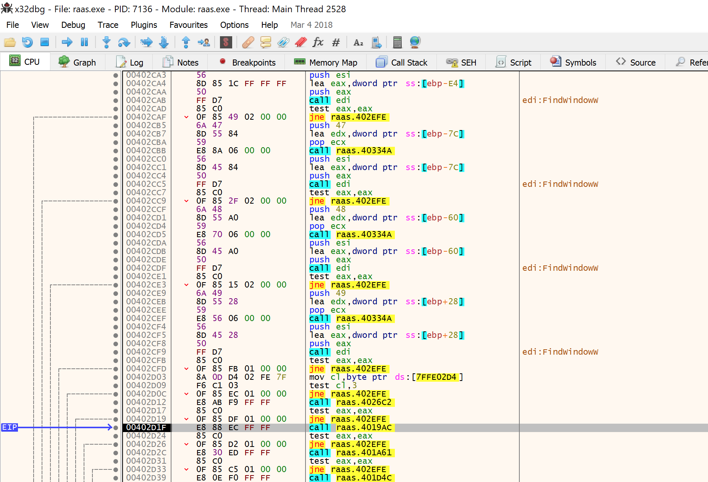  

 

---

## 8 - Step through function 4019AC in raas.exe using x32dbg, examining the way in which it detects security tools and pausing at its RET instruction at offset 401A60

At `402D1F`, it calls `4019AC` and let's step into the function by hitting `F7`:

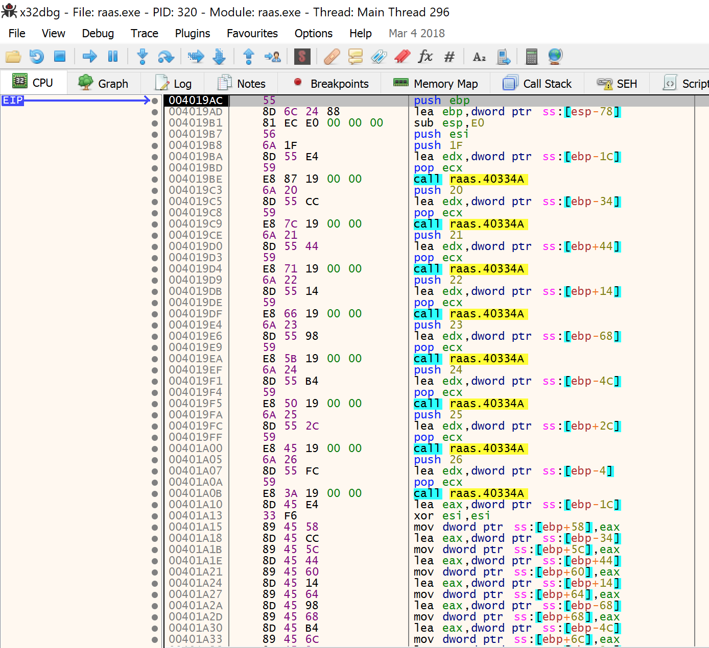  

 

At `4019C5`, we can see `IsDebuggerPresent`.

 

Keep hitting `F8` and then stop at `401A46`:

  

- There are many references to DLL
  - Reference: https://securitykitten.github.io/2014/12/03/vm-checking-and-detecting.html
    - SbieDll.dll - Sandboxie related
    - dbghelp.dll - Windows Image Helper / VM Checking
    - snxhk.dll - Used by AVAST
    - api_log.dll - SunBelt Sandbox
    - dir_watch.dll - SunBelt Sandbox
    - vmcheck.dll - Virtual PC
    - wpespy.dll - WPE Pro
    - pstorec.dll - SunBelt Sandbox
    - SbieDll.dll - Sandboxie related

 

For each of the DLL name, it will be used to call `GetModuleHandleW` to see if there is any handle to the DLL.

  

- `jne 401A58` - If there is a handle, jump away to `401A58`
  - `401A58` - `xor eax,eax` - resetting eax
  - `401A5A` - `inc eax` - set `eax` to 1
  - `401A60` - return

 

---

## 9 - Use x32dbg to step into function 401A61, which is invoked from offset 402D2C, within raas.exe

Allow the function to complete executing its code by hitting `Ctrl+F9`. The program will stop at `401A60`.

 

Continue examining by stepping into the instruction `F7`:

  

- It then call `401A61` at `402D2C`

 

Stepping into the function `401A61`:

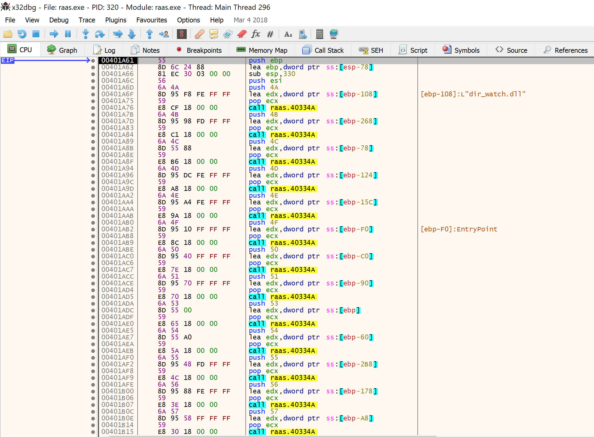  

 

---

## 10 - Allow raas.exe to execute in x32dbg until offset 401C8E, and then use x32dbg to statically examine function 401C8E to understand its capabilities

Hit `Ctrl+G` and go to `401C8E`. Then hit `F4`:

  

- We can see many note references to various malware analysis and security tools.

 

Inspect the function `401724` by right-clicking, then choose `Follow in Disassembler > 401724`:

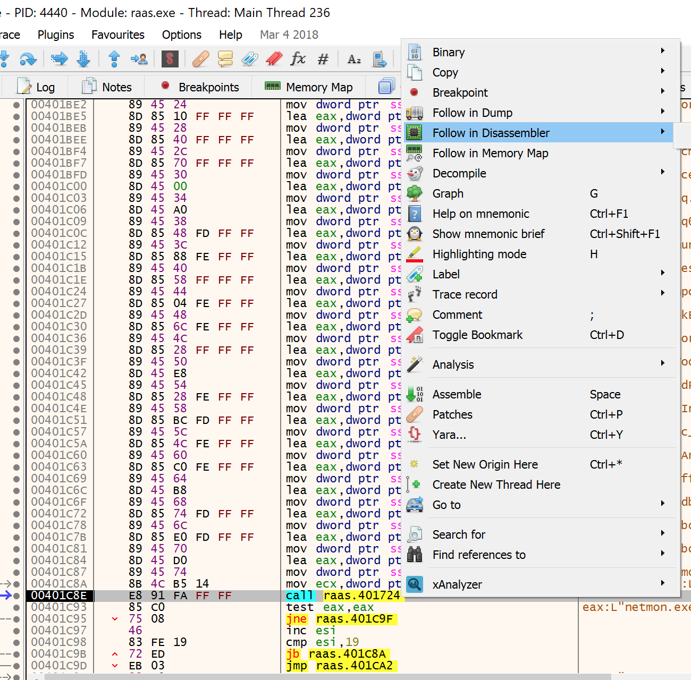  

 

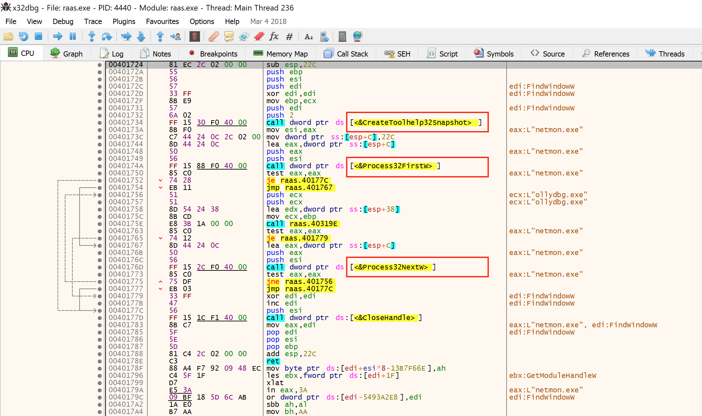  

- There are API reference to `CreateToolhelp32Snapshot`, `Process32FirstW` and `Process32NextW`.
  - `CreateToolhelp32Snapshot`
    - https://docs.microsoft.com/en-us/windows/win32/api/tlhelp32/nf-tlhelp32-createtoolhelp32snapshot
    - Purpose:
      - Takes a snapshot of the specified processes, as well as the heaps, modules, and threads used by these processes.
  - `Process32FirstW`
    - https://docs.microsoft.com/en-us/windows/win32/api/tlhelp32/nf-tlhelp32-process32firstw
    - Purpose:
      - Retrieves information about the first process encountered in a system snapshot.
  - `Process32NextW`
    - https://docs.microsoft.com/en-us/windows/win32/api/tlhelp32/nf-tlhelp32-process32next
    - Purpose:
      - Retrieves information about the next process recorded in a system snapshot.

 

The `dwFlags` parameter of the API call `CreateToolhelp32Snapshot` is `0x2` (`TH32CS_SNAPPROCESS`), which means `Includes all processes in the system in the snapshot`.

 

To go back to the `EIP` location, hit `*` key:

  

 

A process name is supplied at `401C8A` via `ecx` register and call `401724` again, and then increment the counter `esi`, and loop back to `401C8A` if `esi` is not equal to `19`. By this token, it enumerates all the process name the program wants to check in the current running process list in the Snapshot.

 

---

## 11 - Allow raas.exe to execute in x32dbg until the beginning of function 401D4C

Scroll down to `401D4C` and then click it. Hit `F4` to run until this line:

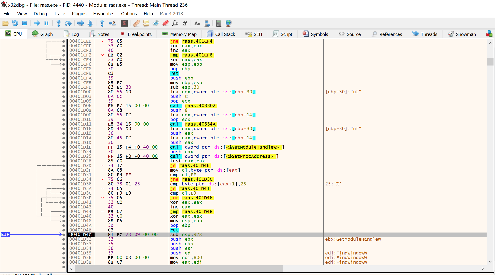  

 

---

## 12 - Step through function 401D4C in raas.exe using x32dbg, examining the way in which it might detect VMware, and pausing at its RET instruction at offset 40204E

In this function, we can see it references `RegOpenKeyExW`. The program move the pointer to `RegOpenKeyExW` into `ebx` and this may be called by `call ebx` later.

 

We can see `call ebx` at `401DA6`:

  

 

Click on `401DA6` and hit `F4`:

  

- The supplied parameter value is `HARDWARE\\DEVICEMAP\\Scsi\\Scsi Port 0\\Scsi Bus 0\\Target Id 0\\Logical Unit Id 0`.

 

If we Google this, we can see this is one of the register used by VMWare (in `vmware.c`):

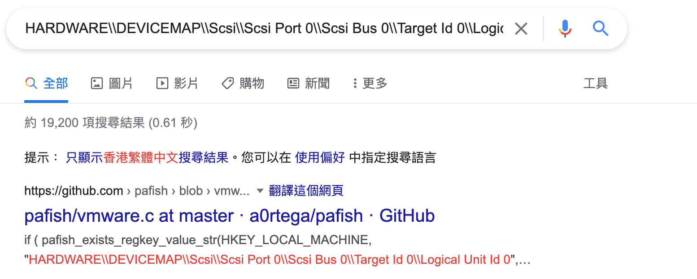  

 

Therefore, by checking if the above register presents, the program can determine whether VMWare is used in the context.

 

Click at `40204E` and hit `F4`:

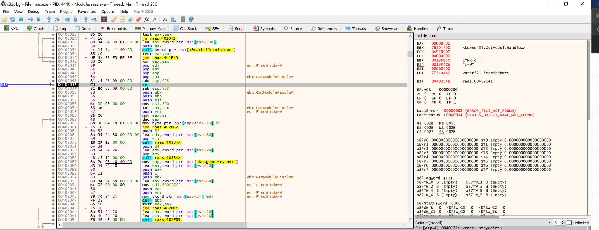  

 

---

## 13 - Use x32dbg to execute instructions in raas.exe until offset 401263, which is the first instruction that the specimen executes after returning from function 402BD6

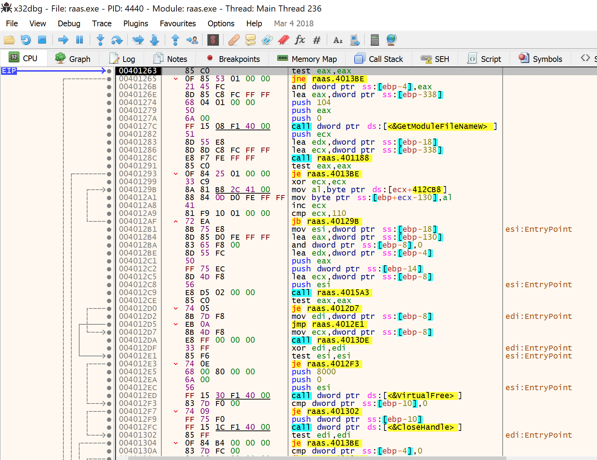  

 

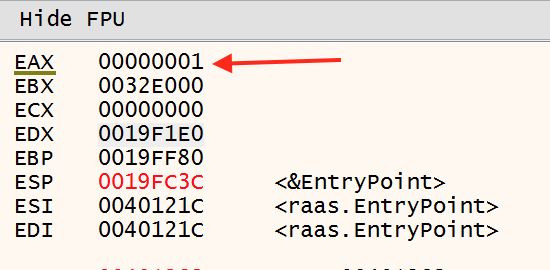  

- Note the value in `EAX` is `1`

 

At `401265`, it jumps away to `4013BE` if `EAX` is not zero.

- `4013BE` will call `ExitProcess`

 

It is likely that `eax` is determining whether some sorts of conditions is hit. To bypass this, we can patch the instruction in the offset `401265` with `NOPs`.

 

Double click the link of offset `401265` and do:

  

  

 

Then we can save the patched file:

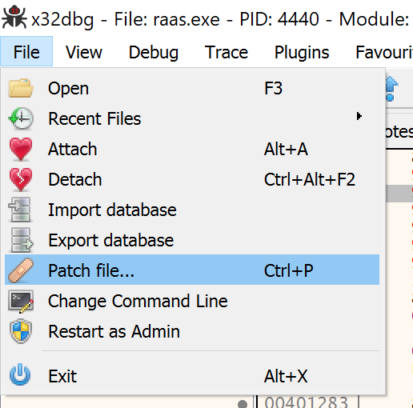  

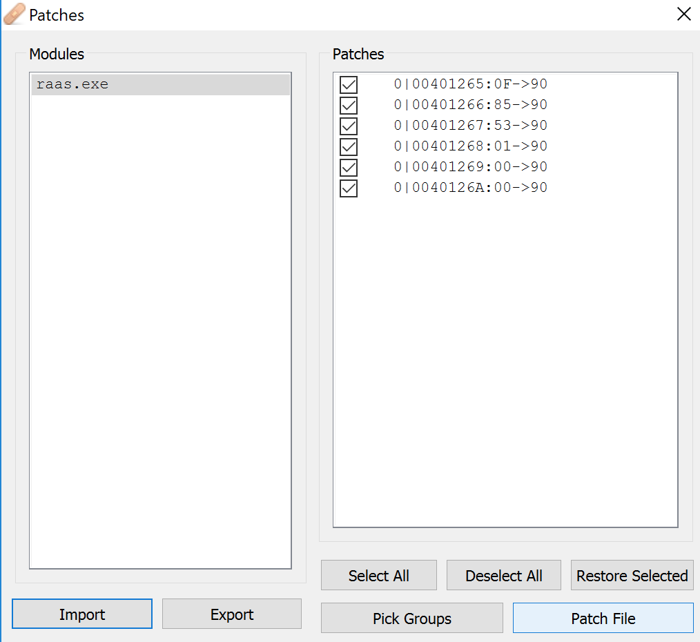  

 

---