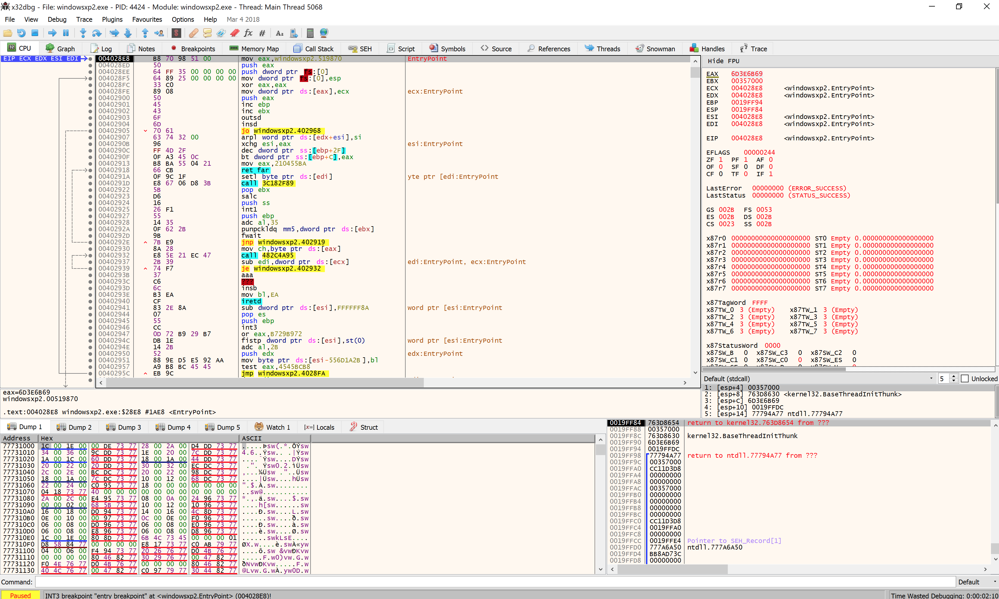
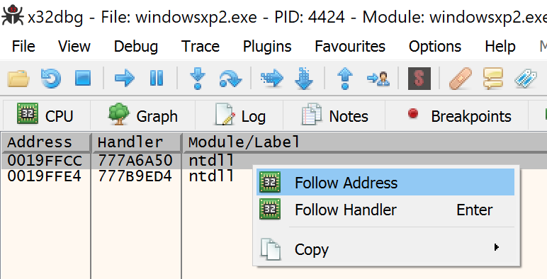
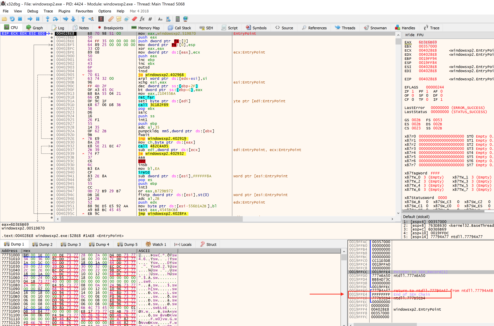
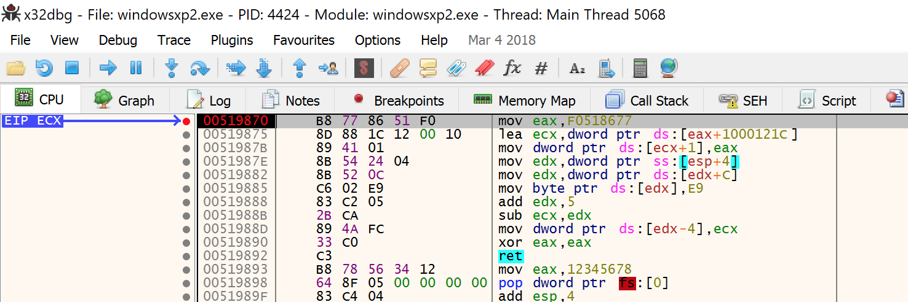

# Lab 5.9: Understanding the SEH Defense in windowsxp2.exe

- [Lab 5.9: Understanding the SEH Defense in windowsxp2.exe](#lab-59-understanding-the-seh-defense-in-windowsxp2exe)
  - [Objectives](#objectives)
  - [Steps](#steps)
  - [1 - Load windowsxp2.exe in x32dbg, and then detach the SEH tab so that it floats as its own window in x32dbg](#1---load-windowsxp2exe-in-x32dbg-and-then-detach-the-seh-tab-so-that-it-floats-as-its-own-window-in-x32dbg)
  - [2 - Observe how windowsxp2.exe defines the SEH handler by single-stepping through the first four instructions of the specimen in x32dbg](#2---observe-how-windowsxp2exe-defines-the-seh-handler-by-single-stepping-through-the-first-four-instructions-of-the-specimen-in-x32dbg)
  - [3 - Use x32dbg to set a breakpoint in the beginning of the malicious SEH handler function 519870 in windowsxp2.exe](#3---use-x32dbg-to-set-a-breakpoint-in-the-beginning-of-the-malicious-seh-handler-function-519870-in-windowsxp2exe)
  - [4 - Run windowsxp2.exe in x32dbg to reach the breakpoint at the beginning of the malicious SEH handler function 519870](#4---run-windowsxp2exe-in-x32dbg-to-reach-the-breakpoint-at-the-beginning-of-the-malicious-seh-handler-function-519870)

---

## Objectives

- Understand how malware can use Structured Exception Handling (SEH) to misdirect the analyst.
- Understand how to use x32dbg to examine the suspicious use of SEH by malware.

 

---

## Steps

1. Load `windowsxp2.exe` in **x32dbg**, and then detach the **SEH tab** so that it floats as its own window in **x32dbg**.
2. Observe how `windowsxp2.exe` defines the **SEH handler** by single-stepping through the first four instructions of the specimen in **x32dbg**.
3. Use **x32dbg** to set a breakpoint in the beginning of the malicious SEH handler function `519870` in windowsxp2.exe.
4. Run `windowsxp2.exe` in **x32dbg** to reach the breakpoint at the beginning of the malicious **SEH handler** function `519870`.

 

---

## 1 - Load windowsxp2.exe in x32dbg, and then detach the SEH tab so that it floats as its own window in x32dbg

Before doing so, inspect `windowsxp2.exe` on **Exeinfo PE**:

  

- It looks like packed by `PECompact`

 

Load it into **x32dbg**:

  

 

Navigate to the **SEH tab**:

  

 

Right-click the 1st row and choose `Follow Address`:

  

 

Note on the stack we can see `End of SEH Chain` with the value `FFFFFFFF` at `0019FFE4`:

  

 

Also we can click on the `Watch` tab and right click in it, choose `Add ...`:

  

  

 

Then we can see it has a value of `0019FFCC`, which is a pointer to `SEH_Record[1]`:

  

 

---

## 2 - Observe how windowsxp2.exe defines the SEH handler by single-stepping through the first four instructions of the specimen in x32dbg

1st instruction: `mov eax,windowsxp2.519870`

- Save `519870` into `EAX`
- This is the address of the function that will be defined as the new SEH handler

 

2nd instruction: `push eax`

- Push the value in `EAX` to the top of the stack
- This constitutes one of the 2 elements of the SEH structure that the code is defining

 

3rd instruction: `push dword ptr fs:[0]`

- Save the address of the current start of the SEH chain to the stack, which is stored in `fs:[0]`
- Combined with the 2nd instruction, this value completes the new SEH structure

 

4th instruction: `mov dwaord ptr fs:[0],esp`

- Set the start of the chain `fs:[0]` to point to the new SEH structure

 

---

## 3 - Use x32dbg to set a breakpoint in the beginning of the malicious SEH handler function 519870 in windowsxp2.exe

At `4028FE`, `mov dword ptr ds:[eax],ecx` - this represents a common way of defining any SEH record.

 

Press `CTRL-G` to jump to `519870`:

  

 

Set a breakpoint at `519870`:

  

 

---

## 4 - Run windowsxp2.exe in x32dbg to reach the breakpoint at the beginning of the malicious SEH handler function 519870

  

Remove the breakpoint at `519870`.

 

The specimen will cause an exception by attempting to write to the part of memory that's write-protectede. This will cause Windows to execute the SEH handler that the malicious program defined, bringing you to the beginning of the function `519870`.

 

---